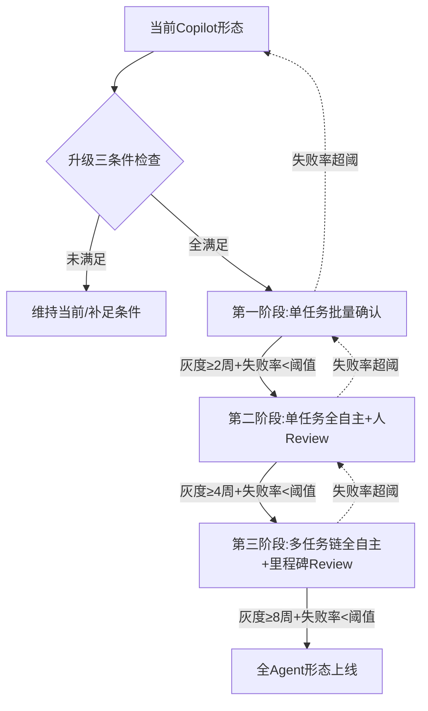

---
AIGC:
  ContentProducer: '001191110102MAD55U9H0F10002'
  ContentPropagator: '001191110102MAD55U9H0F10002'
  Label: '1'
  ProduceID: '3b9c7681-9221-4b4c-b695-1b84fa5830f3'
  PropagateID: '3b9c7681-9221-4b4c-b695-1b84fa5830f3'
  ReservedCode1: 'f611ea14-0081-4d4c-bda9-acd3a30cd865'
  ReservedCode2: 'f611ea14-0081-4d4c-bda9-acd3a30cd865'
---

> 叶子：D-19_AI大模型PM专项/D-19.01_AI产品形态 ｜ 模块：4_可落地流程 ｜ 碎片：4.2
> 桩：[模块路由](0_模块路由.md) ｜ 上级：[L2路由](../../0_本目录路由.md) ｜ 规范：[2_内容填充.md](../../../../../../2_内容填充.md)

# 4.2 形态设计SOP与模板

## SOP 1：新AI产品立项形态选型 SOP

**适用**：从0做新AI产品，需锁定形态。
**前置输入**：核心任务描述、用户画像、商业模式预期、团队能力盘点

| 步骤 | 动作 | 产出 | 关键校验 |
|---|---|---|---|
| 1 | 任务性质访谈：抽取频率/风险/批量度/AI能力依赖度 | 任务属性表 | 4维齐全 |
| 2 | 套3.3形态决策矩阵（任务×风险×频率） | 形态等级候选(L1-L4) | 候选≤3个 |
| 3 | AI能力边界POC：用当前模型做最小验证 | 能力够用度判定 | 实测而非估算 |
| 4 | AI-enabled vs AI-native金标准判定 | 判定+改造路径 | "去掉AI产品还成立吗"必答 |
| 5 | 形态×商业模式校验（3.2矩阵） | 商业模式推荐+错配预警 | 错配项须显式标注 |
| 6 | 形态×团队能力诊断 | 能力缺口清单+补足建议 | 缺口闭环（补人/降级/外采） |
| 7 | 风险护栏方案 | 护栏清单 | L4必出Agent护栏 |
| 8 | 形态适配检查表打分 | 检查表得分+是否通过 | < 70分需重选形态 |
| 9 | 产出形态选型方案文档 | 选型方案1页纸 | 决策可追溯 |

## SOP 2：Copilot→Agent升级 SOP

**适用**：既有Copilot产品想升Agent形态。
**前置输入**：当前Copilot使用数据（采纳率/活跃/痛点反馈）、Agent护栏团队能力

| 步骤 | 动作 | 关键校验 |
|---|---|---|
| 1 | 升级三条件检查：① AI能力边界到顶？ ② 用户反馈要求更高自主性？ ③ 护栏机制成熟？ | 三条全满足才推进 |
| 2 | 任务级自主性分配：把当前任务按"高频低风险→高自主；低频高风险→低自主"重新切分 | 输出任务自主性分配表 |
| 3 | Agent护栏清单设计（必含）：工具白名单/敏感操作二次确认/自动回滚/操作日志可追溯/token预算上限/步数上限/异常中断 | 7项护栏齐全 |
| 4 | 灰度策略：从"单任务批量确认"→"单任务全自主+Review"→"多任务链全自主+里程碑Review"逐级放开 | 每级灰度≥2周+失败率<阈值才开放下一级 |
| 5 | 监控与回滚机制：Agent行为监控仪表盘+异常自动回滚+人工接管入口 | 仪表盘上线+接管路径通畅 |
| 6 | 失败模式预案：幻觉/工具调用错/上下文衰减/目标漂移的应对方案 | 每种失败模式都有兜底 |

## SOP 3：AI-enabled渐进改造 SOP

**适用**：既有产品做AI增强（非重生）。
**前置输入**：现有产品功能清单、用户主路径、AI功能候选点

| 步骤 | 动作 | 关键校验 |
|---|---|---|
| 1 | AI-enabled三判据筛功能点：① 非AI不可？ ② 入口在主路径上？ ③ AI反馈有数据飞轮？ | 3项全满足才入选 |
| 2 | 主路径入口设计：AI入口必须在用户主流程上，而非隐藏按钮 | 入口可见性测试 |
| 3 | 即时反馈+采纳机制：内联建议+一键采纳+采纳后即时保留/编辑 | 采纳路径≤2步 |
| 4 | 数据飞轮设计：隐式反馈（采纳/编辑/重试）→模型微调/SFT | 反馈采集埋点齐全 |
| 5 | 避免"花架子"自检：1个月后看采纳率/活跃率，<阈值则砍掉AI功能 | 阈值根据场景定（一般采纳率>30%） |

## SOP 4：AI-native重构决策 SOP

**适用**：既有产品评估是否推倒重来做AI-native。
**前置输入**：现有产品技术债、用户迁移成本、AI能力评估

| 步骤 | 动作 | 关键校验 |
|---|---|---|
| 1 | 金标准判定："去掉AI产品还成立吗" → 是→可继续AI-enabled；否→进入重构评估 | 判定清晰 |
| 2 | 成本评估：重构工作量、技术债、用户迁移成本、切换期收入影响 | 成本可量化 |
| 3 | 收益评估：AI-native带来的差异化护城河、商业模式升级、用户体验跃迁 | 收益可预期 |
| 4 | ROI计算：收益/成本比，回收期<18个月才推进（高风险项目） | ROI>3 |
| 5 | 渐进vs一刀切决策：能渐进就渐进（双轨并行、用户可选）；必须一刀切时配迁移激励 | 渐进优先 |
| 6 | 风险预案：AI能力不足时退化为AI-enabled的兜底方案 | 必有退路 |

## 模板1：AI产品形态决策表

| 字段 | 内容 |
|---|---|
| 产品名称 | |
| 核心任务 | （一句话） |
| 任务频率 | 高频 / 低频 |
| 任务风险 | 低 / 中 / 高 |
| 任务批量度 | 批量 / 非批量 |
| AI能力够用度 | 够用 / 需垂类+RAG / 需边缘小模型 |
| 形态等级（推荐） | L1 / L2 / L3 / L4 |
| 形态十型归属 | ①-⑩ |
| AI-enabled / AI-native | enabled / native |
| 金标准判定 | "去掉AI产品还能用吗" → 是/否 |
| 推荐商业模式 | |
| 错配预警商业模式 | |
| 北极星指标 | |
| 团队能力缺口 | |
| 关键风险 | |
| 必备护栏 | |
| 决策结论 | 通过 / 重选 / 暂缓 |
| 决策日期 / 决策人 | |

## 模板2：Agent护栏清单（L4 Agent必填）

| 护栏项 | 是否实现 | 实现方式 | 验收标准 |
|---|---|---|---|
| 工具白名单 | 是/否 | | Agent可调工具仅限白名单 |
| 敏感操作二次确认 | 是/否 | | 涉及删除/转账/发送必须二次确认 |
| 自动回滚机制 | 是/否 | | 误操作可一键回滚至操作前状态 |
| 操作日志可追溯 | 是/否 | | 所有Agent动作可追溯（含思考链） |
| Token预算上限 | 是/否 | | 单任务token上限硬限制 |
| 步数上限 | 是/否 | | 单任务执行步数硬限制 |
| 异常中断机制 | 是/否 | | 异常自动中断+通知+保留断点 |
| 人工接管入口 | 是/否 | | 用户可随时接管Agent控制权 |
| 失败模式预案 | 是/否 | | 幻觉/工具调用错/上下文衰减/目标漂移各有兜底 |
| 灰度放量策略 | 是/否 | | 从单任务批量确认→全自主逐级放开 |

## 模板3：AI硬件五约束检查表

| 约束 | 评估内容 | 通过标准 |
|---|---|---|
| 续航/算力 | 单次充电使用时长 / 边缘模型能力够用度 | ≥8小时日常使用 / 能力够用或云端协同路径清晰 |
| 隐私感知 | 物理静音键 / 指示灯 / 本地处理优先 | 3项全满足 |
| 价值主张 | "硬件能做手机不能做的事"是否说得清 | 1句话讲清且用户认可 |
| 使用习惯绑定 | 是否绑定既有习惯（眼镜/学习机/玩具等） | 绑定而非颠覆既有习惯 |
| 双收入流 | 硬件买断 + 服务订阅 | 两条收入流都有方案 |
| 合规（红线） | 监听/录像法规合规 | 详见 D-16.04 AI合规专项 |

## 模板4：形态升级路径图（Copilot→Agent）

> AI生成