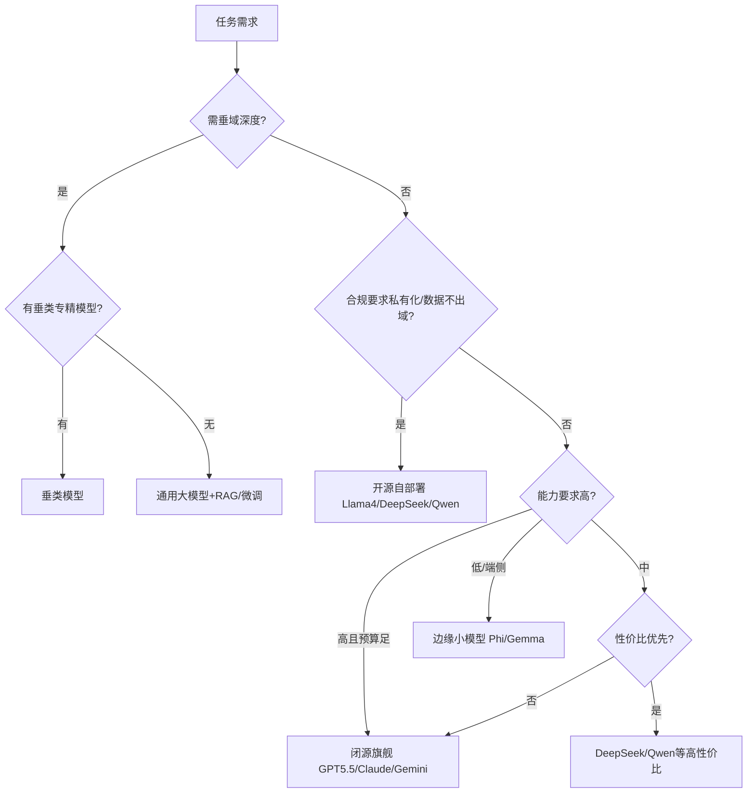

---
AIGC:
  ContentProducer: '001191110102MAD55U9H0F10002'
  ContentPropagator: '001191110102MAD55U9H0F10002'
  Label: '1'
  ProduceID: 'b589852f-3569-4fdc-bd8c-752fe3558c07'
  PropagateID: 'b589852f-3569-4fdc-bd8c-752fe3558c07'
  ReservedCode1: '65fbe61b-4afc-4c64-b6c2-49e055e9c23a'
  ReservedCode2: '65fbe61b-4afc-4c64-b6c2-49e055e9c23a'
---

> 叶子：D-19_AI大模型PM专项/D-19.03_模型选型与评估 ｜ 模块：3_AI精炼版 ｜ 碎片：3.1
> 桩：[模块路由](0_模块路由.md) ｜ 上级：[L2路由](../../0_本目录路由.md) ｜ 规范：[2_内容填充.md](../../../../../../2_内容填充.md)

# 3.1 模型分类与选型决策

## 一、模型分类体系

### 1.1 按能力范围分

| 类型 | 定位 | 典型模型 | 适用场景 | 局限 |
|---|---|---|---|---|
| **通用大模型** | 全能型，覆盖知识/推理/代码/对话 | GPT-5.5、Claude Opus 4.8、Gemini 3 Pro、DeepSeek V4、Qwen 3.7 | 通用问答/写作/多任务产品 | 垂域深度不如专精模型；成本高 |
| **垂类模型** | 专精某领域，深度>广度 | 代码：Claude/Codex/MiniMax M3；医疗：Med-PaLM；法律：Harvey | 垂域深度任务 | 跨域弱；需评估垂域真实表现 |
| **边缘小模型** | 端侧/本地部署，低延迟低成本 | Phi系列、Gemma、Qwen小参数、MiniCPM | 端侧AI/隐私敏感/离线/低延迟 | 能力弱，需配合云模型 |

### 1.2 按开放度分

| 类型 | 特点 | 典型 | 优势 | 劣势 |
|---|---|---|---|---|
| **闭源API** | 厂商托管，按量付费 | GPT-5.5、Claude Opus、Gemini 3 | 开箱即用/能力最强/无运维 | 数据出境/依赖厂商/不可微调底层/成本随用量 |
| **开源可自部署** | 权重开放，可私有化 | Llama 4、DeepSeek、Qwen、GLM、Mistral | 数据不出域/可微调/无地域限制/可控 | 需GPU+运维/能力略逊旗舰/安全自查责任 |

### 1.3 按推理范式分（2026新增）

| 类型 | 特点 | 典型 | 适用 | 注意 |
|---|---|---|---|---|
| **标准模型** | 直接生成答案 | GPT-4o/Claude Sonnet/Gemini Flash | 通用/快/便宜 | 复杂推理靠CoT提示词 |
| **推理模型** | 内化CoT，先推理再答 | OpenAI o系列、DeepSeek-R1、Claude Reasoning | 数学/科学/多步推理 | 时延长/成本高；传统CoT反而冗余 |

## 二、2026模型格局三梯队

基于SuperCLUE/SWE-bench Pro/GPQA Diamond权威测评 [来源:OSCHINA/51CTO/CSDN | 🔍高 | 2026-06/07]：

| 梯队 | 代表模型 | 核心标签 |
|---|---|---|
| **第一梯队（海外闭源领跑）** | GPT-5.5（全能均衡）、Claude Opus 4.8（推理封王+编程强）、Gemini 3 Pro（多模态碾压+超长上下文） | 综合能力断层领跑，总分破62 |
| **国产追平梯队** | DeepSeek V4/R2（极致性价比）、Qwen 3.7、GLM 5.2、Kimi 2.6、豆包2.1 Pro（字节Benchmark对标国际旗舰）、MiniMax M3（编程登顶SWE-Bench Pro 59%） | 性价比逼近/部分超越，差距快速缩小 |
| **开源阵营** | Llama 4（MoE 1.2万亿参数，MMLU/HumanEval/GSM8K均89.7%）、DeepSeek开源、Qwen开源、Mistral | 可私有化部署，能力逼近闭源旗舰 |

**对标要点**：Claude Fable 5 全面超越GPT-5.5；国产DeepSeek以极致性价比搅动市场格局；开源Llama 4逼近闭源 [来源:什么值得买 | 🔍高 | 2026-06]。模型数据快速变化，选型前须查最新leaderboard。

## 三、选型决策矩阵（五维）

| 决策维度 | 关键问题 | 影响选型 |
|---|---|---|
| **场景×能力** | 任务需什么能力？（知识/推理/代码/Agent/多模态/中文） | 能力不够直接淘汰 |
| **成本** | 单位请求成本？月预算？ | 性价比评估，质量达标下选成本最低 |
| **合规** | 数据出境？内容审核？地域可用？备案？ | 不合规模型直接淘汰 |
| **可控性** | 需微调？需私有化？需无地域限制？ | 可控性需求高→开源自部署 |
| **延迟** | 实时交互还是异步？推理模型时延可接受？ | 实时场景排除推理模型 |

### 选型决策树

## 四、闭源 vs 开源权衡

| 维度 | 闭源API | 开源自部署 |
|---|---|---|
| 上手成本 | 极低（调API） | 高（需GPU+部署+运维） |
| 能力上限 | 旗舰最强 | 略逊旗舰但逼近（Llama 4） |
| 成本结构 | 按量付费（量大时贵） | 固定GPU成本（量大时便宜） |
| 数据隐私 | 数据出境风险 | 数据不出域 |
| 可定制 | 仅可微调/Fine-tune接口 | 全权重可微调 |
| 可控性 | 受厂商限流/下线/调价影响 | 完全自主可控 |
| 合规 | 需评估厂商合规 | 自部署合规自主 |
| 运维 | 零运维 | 需GPU运维+安全+升级 |

**决策原则**：[来源:模型选型实践 | 📚中]
- 量小+求快+能力优先 → 闭源API
- 量大+成本敏感+数据敏感 → 开源自部署
- 折中：闭源旗舰打样 + 开源/国产替代降本（模型路由）

## 五、模型分类速查（PM选型用）

| 场景 | 首选 | 备选 | 理由 |
|---|---|---|---|
| 通用对话/写作 | GPT-5.5/Claude Opus | DeepSeek/Qwen | 全能均衡 |
| 编程/Coding Agent | Claude Opus/Codex/MiniMax M3 | DeepSeek-Coder | 编程专精 |
| 数学/科学推理 | 推理模型(o系列/R1) | Claude Opus | 推理封王 |
| 多模态（图文/视频） | Gemini 3 Pro | GPT-5.5多模态 | 多模态碾压 |
| 中文场景 | DeepSeek/Qwen/GLM | GPT-5.5 | 中文优化+性价比 |
| 高性价比/批量 | DeepSeek/Qwen | GPT-4o-mini | 性价比无敌 |
| 端侧/离线/隐私 | Phi/Gemma/MiniCPM | Qwen小参数 | 边缘小模型 |
| 合规私有化 | Llama 4/DeepSeek开源 | Qwen开源 | 开源可自部署 |

> AI生成