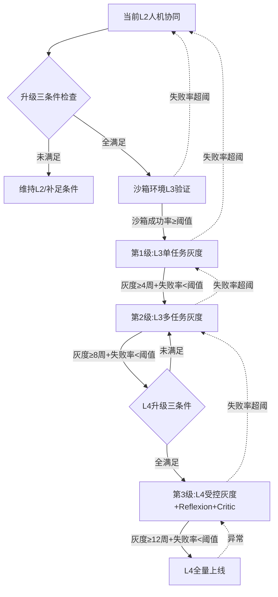

---
AIGC:
  ContentProducer: '001191110102MAD55U9H0F10002'
  ContentPropagator: '001191110102MAD55U9H0F10002'
  Label: '1'
  ProduceID: '2fdbcdab-de7b-43e3-a347-bcc4acaccb84'
  PropagateID: '2fdbcdab-de7b-43e3-a347-bcc4acaccb84'
  ReservedCode1: 'f4f6ebad-7b1b-4803-b2dd-0eddf3523e89'
  ReservedCode2: 'f4f6ebad-7b1b-4803-b2dd-0eddf3523e89'
---

> 叶子：D-24_AIAgent产品专项/D-24.01_Agent产品形态 ｜ 模块：4_可落地流程 ｜ 碎片：4.2
> 桩：[模块路由](0_模块路由.md) ｜ 上级：[L2路由](../../0_本目录路由.md) ｜ 规范：[2_内容填充.md](../../../../../../2_内容填充.md)

# 4.2 Agent形态设计SOP与模板

## SOP 1：新Agent产品立项形态选型 SOP

**适用**：从0做新Agent产品，需锁定形态与自主性等级。
**前置输入**：核心任务描述、用户画像、商业模式预期、团队能力盘点、合规要求

| 步骤 | 动作 | 产出 | 关键校验 |
|---|---|---|---|
| 1 | 任务性质访谈：抽取链路长度/跨域度/任务类型/风险等级/可逆性/成本敏感度 | 任务属性表 | 6维齐全 |
| 2 | 套3.3三维决策矩阵（复杂度×风险×成本） | 形态候选1-2个 | 候选≤2个 |
| 3 | 自主性上限判定：风险×可逆性矩阵 → 不可逆+高风险必L2以下 | 自主性等级上限 | 红线不可破 |
| 4 | 架构范式选择：套3.2范式决策树（链路长度+可试错性） | 范式推荐 | >10步禁纯ReAct |
| 5 | 协议层选型：单Agent跳过；多Agent→MCP+A2A；能力复用→Skills；实时交互→AG-UI | 协议清单 | 不超配 |
| 6 | 三层护栏方案设计：输入层+执行层+权限层 | 护栏清单 | L3以上必三层齐全 |
| 7 | 形态×商业模式校验（3.1矩阵） | 商业模式推荐+错配预警 | 自主Agent禁纯订阅 |
| 8 | 团队能力诊断（架构/harness/护栏/评测归因4维） | 能力缺口清单 | 缺口闭环 |
| 9 | 形态决策表打分 | 决策表 | < 70分需重选形态 |
| 10 | 产出形态选型方案1页纸 | 选型方案 | 决策可追溯 |

**红线 5 条**：
1. 不可逆+高风险→必 L2 以下，无论任务多复杂
2. >10步链路→必 Plan-Execute 或多Agent，禁纯ReAct
3. L3以上Agent→必三层护栏齐全
4. 多Agent无Critic→必加Critic Agent
5. 自主Agent→禁纯订阅，必按成果或按节省人力

## SOP 2：单Agent → 多Agent升级 SOP

**适用**：既有单Agent产品撞到三大结构性缺陷（上下文压力/单点故障/能力天花板），评估升级多Agent。
**前置输入**：当前单Agent使用数据（链路长度分布、失败模式分布、上下文溢出率）、多Agent工程团队能力

| 步骤 | 动作 | 关键校验 |
|---|---|---|
| 1 | 升级三条件检查：① 是否撞到三大结构性缺陷 ② 团队是否有harness工程能力 ③ 是否有Critic设计能力 | 三条全满足才推进 |
| 2 | 任务拆解：按"专业分工"切子任务，每个子任务对应一个专业Agent | 拆解粒度合理（≤5 Agent为甜点） |
| 3 | 角色定义：LeadAgent（拆任务+整合）+ Executor×N（专业）+ Critic（校验）+ optional Researcher | 角色齐全且无冗余 |
| 4 | 拓扑选型：层级式（可控强）/扁平式（灵活）/蜂群式（高扩展）——按组织级任务复杂度选 | 不盲目选蜂群 |
| 5 | 通信协议选型：MCP（Agent↔工具）+ A2A（Agent↔Agent）+ 消息签名防注入 | 协议分层清晰 |
| 6 | 状态同步机制：共享黑板/事件总线/消息队列——按一致性需求选 | 状态可追溯 |
| 7 | 灰度策略：从"单任务双Agent+人审"→"多任务多Agent+Critic"→"端到端多Agent+人里程碑审"逐级放开 | 每级灰度≥2周 |
| 8 | 监控与回滚：多Agent行为追踪仪表盘+异常自动回滚+人工接管入口 | 仪表盘上线+接管通畅 |
| 9 | 失败模式预案：Agent间幻觉传播/重复执行/目标冲突/死锁/编排引擎单点 各有兜底 | 每种失败都有兜底 |

**关键避坑**：Anthropic 5-Agent是"甜点"但前提是5个**专业**Agent+Lead+Critic；生搬硬套5个同质Agent不如单Agent。

## SOP 3：自主性等级升级规划 SOP（L2→L3→L4）

**适用**：已有人机协同Agent（L2）想升级到条件自主（L3）或高度自主（L4）。
**前置输入**：当前L2使用数据（人审通过率、人审节点分布、异常率）、护栏机制成熟度

| 步骤 | 动作 | 关键校验 |
|---|---|---|
| 1 | 升级三条件检查：① 任务复杂度到顶（L2人审成瓶颈）② 风险可控（有可回滚机制）③ 护栏机制成熟（执行层有白名单） | 三条全满足才推进 |
| 2 | 沙箱/隔离环境验证：L3必须先在沙箱内全自主跑通，无副作用验证 | 沙箱内成功率≥阈值 |
| 3 | 强schema校验：所有工具输入输出schema严格校验，参数幻觉零容忍 | schema校验覆盖率100% |
| 4 | 可回滚机制：所有副作用操作必须有回滚路径，无回滚不升级 | 回滚演练通过 |
| 5 | 任务级自主性分配：把任务按"高频低风险→L3全自主；低频高风险→维持L2人审"重新切分 | 输出任务自主性分配表 |
| 6 | 灰度策略：L2→L3单任务灰度（≥4周）→L3多任务灰度（≥8周）→L4受控灰度 | 每级失败率<阈值才推进 |
| 7 | 自我反思机制：L4必引入Reflexion——失败后生成教训注入下次 | 反思日志可追溯 |
| 8 | 多Agent冗余：L4必引入Critic Agent二次校验，Executor-Critic分离 | Critic机制生效 |
| 9 | 长期价值约束：运行数千步仍不偏航——周期性目标校准 | 校准机制上线 |
| 10 | 异常自恢复：错误识别+自动回退+求助人机制 | 异常恢复率≥阈值 |

**关键避坑**：L5 全自主在 2026 仍是前沿无成熟产品，**不要承诺 L5**；主流是"自主+人机协同"混合——自主执行+关键节点人审+强权限边界。

## SOP 4：多Agent协作架构设计 SOP

**适用**：从0设计多Agent协作系统，或既有单Agent系统重构为多Agent。
**前置输入**：任务拆解草案、Agent角色清单、性能与一致性需求

| 步骤 | 动作 | 关键校验 |
|---|---|---|
| 1 | 任务拆解到角色映射：每个子任务→一个专业Agent，定义输入/输出/工具集 | 角色与子任务一一对应 |
| 2 | 拓扑选型：层级/扁平/蜂群——按可控性需求与扩展性需求选 | 不盲目选蜂群 |
| 3 | LeadAgent设计：任务拆解+子任务分配+结果整合+冲突仲裁 | Lead职责清晰 |
| 4 | Critic Agent设计：每步或每阶段校验Executor输出，错误反馈Executor重做 | Critic不与Executor重合 |
| 5 | 通信协议分层：A2A（Agent间）+ MCP（工具调用）+ Skills（能力复用）+ AG-UI（用户交互） | 协议不混用 |
| 6 | 状态同步机制选型：共享黑板（强一致）/事件总线（最终一致）/消息队列（异步） | 一致性需求匹配 |
| 7 | 编排引擎选型：LangGraph（图编排）/CrewAI（角色编排）/AutoGen（对话编排）/自研 | 编排可观测可调试 |
| 8 | 失败模式设计：幻觉传播/重复执行/目标冲突/死锁/编排单点 各有对应机制 | 每种失败可恢复 |
| 9 | 评测分离归因：模型能力评测 vs 框架能力评测 分离，分别基线 | 不混淆归因 |
| 10 | 多Agent协作架构图产出（用模板4） | 架构图可实施 |

## 模板1：Agent产品形态决策表

| 字段 | 内容 |
|---|---|
| 产品名称 | |
| 核心任务 | （一句话） |
| 链路长度 | ≤3步 / 4-10步 / >10步 |
| 跨域度 | 单域 / 跨域 / 组织级 |
| 任务类型 | 信息检索/规划执行/创意生成/组织协作 |
| 风险等级 | 低 / 中 / 高 |
| 可逆性 | 可逆 / 部分可逆 / 不可逆 |
| 成本敏感度 | C端低价 / B端标准 / B端高价值 |
| 推荐形态 | 单Agent/多Agent协作/Agent团队/人机协同/自主Agent |
| 自主性等级 | L1 / L2 / L3 / L4（L5不承诺） |
| 自主性上限原因 | 风险×可逆性约束 |
| 架构范式 | ReAct/Plan-Execute/Reflexion/ToT/混合 |
| 协议层 | MCP / A2A / Skills / AG-UI（按需勾选） |
| 推荐商业模式 | |
| 错配预警商业模式 | |
| 北极星指标 | |
| 团队能力缺口 | |
| 三层护栏完整性 | 输入层□ 执行层□ 权限层□ |
| 关键风险（四类） | 目标偏移 / 越狱 / 自主行为失控 / 权限滥用 |
| 决策结论 | 通过 / 重选 / 暂缓 |
| 决策日期 / 决策人 | |

## 模板2：三层护栏清单（L3以上Agent必填）

| 层 | 护栏项 | 是否实现 | 实现方式 | 验收标准 |
|---|---|---|---|---|
| **输入层** | 指令与用户数据分层 | 是/否 | 系统prompt与用户输入分层处理 | 用户输入无法覆盖系统指令 |
| 输入层 | 工具返回值脱敏 | 是/否 | 工具返回内容过滤后入上下文 | 注入指令无法触发越权 |
| 输入层 | 多Agent消息签名校验 | 是/否 | A2A消息带签名防伪造 | 伪造消息可识别 |
| **执行层** | 工具白名单 | 是/否 | Agent可调工具仅限白名单 | 越权工具调用被拒 |
| 执行层 | 副作用二次确认 | 是/否 | 删除/转账/发送必须确认 | 副作用操作100%确认 |
| 执行层 | 沙箱隔离 | 是/否 | 优先在无副作用环境执行 | 沙箱内可全自主 |
| 执行层 | 自动回滚机制 | 是/否 | 误操作可一键回滚 | 回滚演练通过 |
| 执行层 | 操作日志可追溯 | 是/否 | 所有动作含思考链可追溯 | 审计可还原 |
| 执行层 | Token预算+步数上限 | 是/否 | 单任务硬限制 | 超限自动中断 |
| 执行层 | Critic Agent（多Agent必填） | 是/否 | Executor-Critic分离校验 | 错误可被Critic识别 |
| **权限层** | 最小权限原则 | 是/否 | 按任务动态分配权限 | 权限不超任务所需 |
| 权限层 | 权限审计日志 | 是/否 | 所有权限调用可审计 | 高敏操作可追溯 |
| 权限层 | 高敏操作二次授权 | 是/否 | 金融交易/数据删除二次授权 | 高敏操作100%二次授权 |
| 权限层 | 异常中断+人工接管 | 是/否 | 异常自动中断+通知+保留断点 | 接管路径通畅 |
| 权限层 | 失败模式预案 | 是/否 | 每种失败有兜底 | 4类风险各有应对 |

## 模板3：自主性升级路径图（L2→L3→L4）



**L4 必备四件套**：Reflexion自反思 + Critic Agent + 周期性目标校准 + 异常自恢复

## 模板4：多Agent协作架构图

```mermaid
graph TD
  U[用户/上层系统] -->|AG-UI| L[LeadAgent<br/>任务拆解+整合+仲裁]
  L -->|A2A| R[Researcher<br/>信息检索]
  L -->|A2A| E1[Executor1<br/>专业执行-领域A]
  L -->|A2A| E2[Executor2<br/>专业执行-领域B]
  L -->|A2A| E3[Executor3<br/>专业执行-领域C]
  E1 -->|产出| C[CriticAgent<br/>校验+反馈]
  E2 -->|产出| C
  E3 -->|产出| C
  C -->|错误反馈| E1
  C -->|错误反馈| E2
  C -->|错误反馈| E3
  C -->|校验通过| L
  R -->|信息供给| L
  L -->|整合结果| U
  R -.工具调用.> MCP1[MCP Server<br/>搜索/数据库]
  E1 -.工具调用.> MCP2[MCP Server<br/>代码沙箱]
  E2 -.工具调用.> MCP3[MCP Server<br/>文件系统]
  E3 -.工具调用.> MCP4[MCP Server<br/>外部API]
  subgraph 拓扑选型
    T1[层级式:Lead+Worker+Critic]
    T2[扁平式:对等协商共识]
    T3[蜂群式:同构规则涌现]
  end
  subgraph 状态同步
    S1[共享黑板:强一致]
    S2[事件总线:最终一致]
    S3[消息队列:异步]
  end
```

**填写指引**：
1. 拓扑选型按 SOP 4 步骤 2 选定一种，删其余
2. 状态同步按 SOP 4 步骤 6 选定一种，删其余
3. Executor 数量按任务拆解决定，≤5 为甜点
4. Critic 必填，多Agent无Critic=放大错误
5. MCP Server 按工具集分布填写，可合并

> AI生成