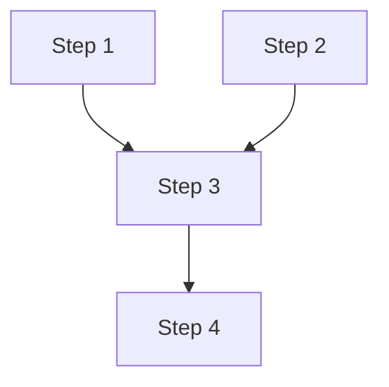

# Implementation Plan for <功能名>

> Phase 2 产出。Phase 3 逐步勾选执行。只含伪代码，不含真代码。
> 来源规格：[../specs/PRD.md](../specs/PRD.md)
> 安全策略：[../specs/security_strategy.md](../specs/security_strategy.md)（若无，见 PRD 非功能需求）
> 性能目标：[../specs/performance_goals.md](../specs/performance_goals.md)（若无，见 PRD 非功能需求）
> **文档规模**：本文件不得超过 5000 tokens。步骤过多时，拆分子 plan 文件（如按模块/迭代拆分），并在本文件保留索引。

## 背景与目标
- 这个功能要解决什么（引用 PRD 的功能编号 FR-xxx，及对应验收标准 AC-xxx）

## 技术实现坑点预判与规避措施
| 技术点/功能块 | 可能的坑 | 规避措施 | 验证方式 |
|---|---|---|---|
| 例：用 Redis 做会话存储 | 会话过期时没有清理事件 | 用 TTL + 定期清理，或换用支持过期回调的方案 | 故意创建快过期的会话，验证不会泄漏 |
| （性能坑示例）列表查询 | N+1 查询问题 | 用 JOIN/Eager Loading / 批查询 | 检查查询日志，确认查询数量可控 |
| | | | |

## 安全检查清单
- [ ] **鉴权/授权**：本功能涉及的接口是否正确校验用户身份和权限？
- [ ] **输入校验**：所有外部输入是否有类型/长度/格式校验，防止注入？
- [ ] **数据加密**：敏感数据（密码/令牌/个人信息）是否加密存储/传输？
- [ ] **审计日志**：关键操作（登录/修改权限/删除数据）是否留审计记录？
- [ ] **错误处理**：错误信息是否不泄漏内部实现细节？
- [ ] **CORS/CSRF**：如涉及 Web，是否正确配置跨域防护？
- [ ] **依赖安全**：新增的第三方依赖是否有已知漏洞（npm audit / cargo audit）？
- [ ] **其他**：（根据项目安全策略补充）

## 性能考虑与验证计划
- [ ] **查询效率**：本功能是否涉及数据库查询？是否有 N+1 问题？是否需要索引？
- [ ] **缓存策略**：本功能的数据是否需要缓存？缓存更新/失效策略是什么？
- [ ] **并发处理**：本功能在高并发下是否有竞争条件？是否需要锁/队列？
- [ ] **资源使用**：本功能是否处理大文件/大数据集？是否需要分页/流式处理？
- [ ] **性能验证**：Phase 4 评测时需要测量哪些指标？（响应时间/吞吐量/资源使用率）

## 依赖与并行化地图

> 目的：把线性步骤变成「能看出哪些可同时做、哪些有先后」的图。单人开发时它帮你排执行顺序；一旦上多 agent / 多 worktree 并行（铁律 #5/#7），它是**安全分工的唯一依据**——没有依赖图就并行 = 必然踩彼此的文件、合出冲突。
> 标注规则：每步二选一——`依赖: Step n`（必须在 n 之后做）/ `[P] 可并行`（与同批 [P] 步骤无文件交集，可同时开 worktree 跑）。

### 执行顺序与并行批

| 批次 | Step | 依赖 | 并行性 | 说明 |
|---|---|---|---|---|
| B1 | Step 1 | —— | `[P]` 与 Step 2 无交集可并行 | 例：后端建表 + 前端骨架 |
| B1 | Step 2 | —— | `[P]` | |
| B2 | Step 3 | Step 1 | 等 B1 完成 | 例：接口实现依赖表结构 |
| | | | | |

> 同一批次（Bn）内的 `[P]` 步骤互不依赖、文件不重叠，可分给不同 worktree / agent 同时跑；跨批次必须等上一批全绿。

### 依赖图（mermaid）

> 图里每个节点回链下面的 Step 标题；能并行的 `[P]` 步骤画在同一层。步骤多时按模块拆子图（`subgraph`）。

## 实现步骤

- [ ] **Step 1：<简要标题>**
  - **对应需求**：FR-xxx（本步实现的需求编号，追溯用）
  - **目标**：这一步要达成什么
  - **动作**：具体怎么做
  - **文件**（≤20）：
    - `path/to/file1.ts`：改什么 / 伪代码
    - `path/to/file2.ts`：改什么 / 伪代码
  - **依赖/并行**：`依赖 Step n` 或 `[P] 可并行`（与哪些 Step 同批，文件不重叠）；**并行分配 worktree 时以此为准**
  - **需人工介入**：是否有需要人确认/填密钥等环节
  - **安全检查**：这步是否覆盖了上面清单里的某项？
  - **验证**：怎么确认这步做对了（测试/手动检查）

- [ ] **Step 2：<简要标题>**
  - ...

## 整体验证（功能级）
- [ ] 所有单测通过（用例带 AC 编号，可追溯）
- [ ] 关键路径手动/E2E 验证
- [ ] 安全检查清单全部完成并验证
- [ ] 与 PRD 对齐复核（每个 FR 有 Step 实现、每个 AC 有测试/人工验收覆盖）
- [ ] **依赖与并行化地图与 Step 的「依赖/并行」字段一致**；同批 `[P]` 步骤文件无交集（并行前必须确认，否则合出冲突）

## 术语表（专业术语 · 大白话 · 案例）
> 保持主文专业度不变，术语在正文首次出现时也行内括注一句大白话。
| 术语 | 大白话 | 简单案例 |
|---|---|---|
| | | |

## 备注
- 偏离计划的地方在此注明原因
