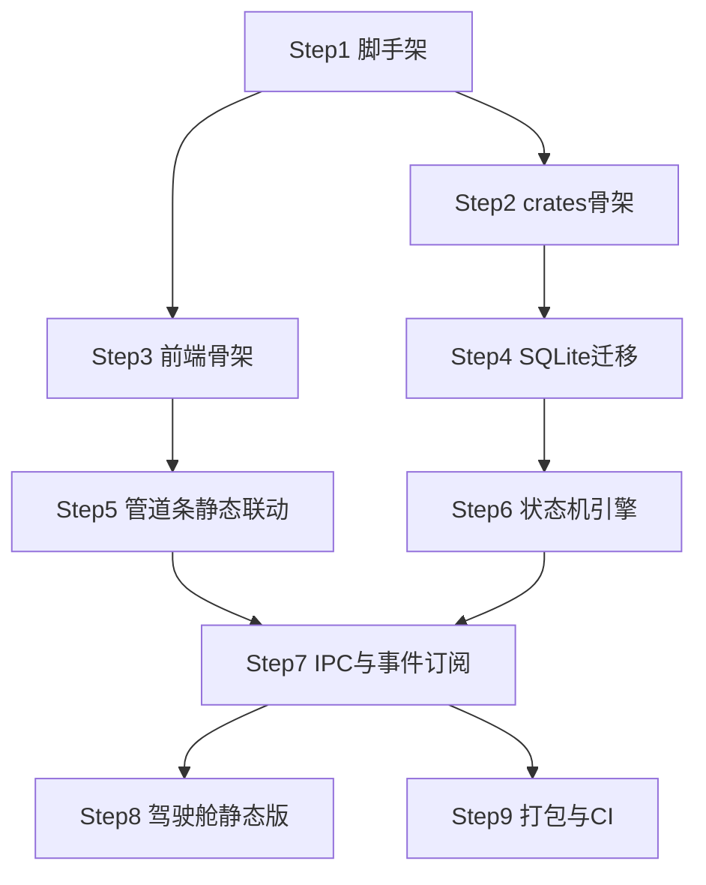

# Implementation Plan for P01 · 客户端骨架与状态机引擎

> Phase 2 产出。Phase 3 逐步勾选执行。只含伪代码，不含真代码。
> 来源规格：[../specs/PRD.md](../specs/PRD.md) ｜ 安全：[../specs/security_strategy.md](../specs/security_strategy.md) ｜ 性能：[../specs/performance_goals.md](../specs/performance_goals.md)
> 索引：[00_MVP实现计划总索引.md](00_MVP实现计划总索引.md)
> 测试方案：[../测试方案/P01客户端骨架与状态机引擎测试方案.md](../测试方案/P01客户端骨架与状态机引擎测试方案.md)（Phase 3 A 段已产，联动用例 LI1~LI4 与本计划联动点清单一一对应）

## 背景与目标

一切功能的地基：Tauri 2 桌面客户端骨架（Win/Mac 双端可出包）+ Rust 内核 workspace + 本地 SQLite + **YAML 驱动的阶段状态机引擎** + 前端三栏骨架与驾驶舱静态版。

- **覆盖需求**：FR-018（桌面客户端·骨架部分：安装运行/双端出包/自动更新）、FR-029（阶段管道引擎核心）、FR-039（驾驶舱·数据静态版）、FR-048（断点续开·持久化部分）
- **对应验收**：AC-020（双端走通）、AC-032（状态机拒绝越阶段操作）、AC-043（驾驶舱四指标展示·静态数据源）、AC-052（重开恢复·状态机层面）

## 技术实现坑点预判与规避措施

| 技术点 | 可能的坑 | 规避措施 | 验证方式 |
|---|---|---|---|
| Tauri 2 + 系统 Webview | Win 机器缺/旧版 WebView2 导致白屏 | 安装器内置检测+引导安装；启动时版本探测出友好提示 | 干净 Win10 虚拟机安装验证 |
| 前端与 Rust 双份状态 | Zustand store 与内核状态漂移，UI 显示过期数据 | **单一真相源在 Rust**：前端不存业务状态，只订阅内核事件流（event emit） | 内核改状态→UI 100ms 内一致（PERF-05） |
| SQLite 并发写 | 任务事件高频写入与 UI 读取互相阻塞 | 开 WAL 模式；写操作串行队列化 | 压测 1000 事件/秒无 lock 错误 |
| YAML 状态机定义 | 工作流 YAML 写错导致状态机启动崩溃 | 加载时 schema 校验，非法则回退内置默认版本并告警 | 故意喂坏 YAML 验证降级 |
| Mac 公证 | 公证耗时不可控阻塞出包 | CI 异步公证 + 公证失败重试；证书/密钥用 GitHub Secrets | CI matrix 双端出包绿 |
| 冷启动 ≤3s（PERF-01） | 视图全量加载拖慢启动 | 视图懒加载；内核初始化与首屏渲染并行 | 启动探针计时 |
| 长列表（PERF-03） | 存档点/任务多了卡顿 | 骨架期即引入虚拟列表组件，不留债 | 1000 条 mock 数据滚动测帧率 |

## 安全检查清单

- [ ] **输入校验**：YAML 工作流定义、项目路径、SQLite 全部参数化查询（防注入）
- [ ] **路径安全**：项目目录创建/读取拒绝路径穿越（`../../` 规范化后必须落在用户选定根目录内）——为 P03 沙箱白名单打底
- [ ] **依赖安全**：cargo audit + npm audit 进 check_all
- [ ] **更新安全**：Tauri Updater 强制签名校验，签名私钥只存 GitHub Secrets
- [ ] **错误处理**：内核错误码分类上抛，前端只显示大白话，不暴露路径/堆栈
- [ ] 本 plan 无网络接口、无密钥处理（云端在 P02）

## 性能考虑与验证计划

- [x] 冷启动 ≤3s / 操作响应 ≤100ms / 空闲内存 ≤300MB：Step 8 出包后即测首版基线
- [x] SQLite：WAL + 写队列；迁移幂等
- [x] 无大数据集查询；列表一律虚拟滚动组件
- [ ] Phase 4 复测：PERF-01/02/03/04/08 全项

## 功能联动点清单

| 触发动作 | 联动对象 | 预期变化 | 反向/边界 |
|---|---|---|---|
| 状态机阶段推进 | 管道条 / 左栏导航 / 中栏视图 / 右栏 Tab | 四处同步切换 | 回退阶段（如验收打回建造）同样四处同步；不允许越级跳（需经状态机合法转移） |
| 创建项目时选规模 | 工作流 YAML 变体加载 | L0/L1 跳过对应阶段节点 | 升级规模（L1→L2）补节点不删数据；降级不删已产文档 |
| 项目切换（顶栏） | 驾驶舱全部数据 / 状态机上下文 | 整体切换并重订阅事件 | 切换到不存在的项目目录（被搬走）→ 提示重新定位而非报错崩溃 |
| 内核事件推送 | 前端订阅 | UI 实时更新 | 客户端断连重连（如休眠唤醒）→ 全量拉一次快照再续订阅 |

## 运维考量清单

| 项 | 决定 |
|---|---|
| 可观测性 | **做**：内核结构化日志（本地文件，30 天轮转）；前端错误边界上报本地日志 |
| 配置开关 | **做**：工作流 YAML 路径、日志级别、密度模式（舒适/紧凑）走设置文件 |
| 可回滚 | **做**：状态机每次转移写历史表，可回放排查 |
| 限流熔断 | 不做（本 plan 无外部调用） |
| 运维入口 | **做**：设置页「诊断信息一键导出」（日志+版本+状态机快照） |
| 告警 | 不做（本地应用）；崩溃收集后续再说（遥测默认关，security_strategy §6） |
| 容量 | **做**：SQLite >2GB 触发归档提醒（联动 FR-047，P08 完整实现） |

## 依赖与并行化地图

| 批次 | Step | 依赖 | 并行性 | 说明 |
|---|---|---|---|---|
| B1 | Step 1 仓库与 Tauri+React 脚手架 | —— | —— | 一切之母 |
| B2 | Step 2 Rust workspace crates 骨架 | Step 1 | `[P]` 与 Step 3 文件不重叠 | crates 空壳 |
| B2 | Step 3 前端设计令牌与三栏骨架 | Step 1 | `[P]` 与 Step 2 不重叠（src-ui/ vs src-tauri/） | UI 骨架先行 |
| B3 | Step 4 SQLite + 迁移（L1 六表） | Step 2 | `[P]` 与 Step 5 不重叠 | core-state 的存储层 |
| B3 | Step 5 管道条+导航+视图切换静态联动 | Step 3 | `[P]` 与 Step 4 不重叠 | 纯前端 |
| B4 | Step 6 core-state 状态机引擎 | Step 4 | 串行 | YAML 驱动+门禁+持久化 |
| B5 | Step 7 IPC 层与前端事件订阅、项目创建向导 | Step 5, 6 | 串行 | 前后端接通 |
| B6 | Step 8 驾驶舱静态版（HUD 四指标） | Step 7 | `[P]` 与 Step 9 不重叠 | 读状态机数据 |
| B6 | Step 9 双端打包 + 自动更新 + CI matrix | Step 7 | `[P]` 与 Step 8 不重叠（ci/conf 文件） | 出包 |

### 依赖图（mermaid）



## 实现步骤

- [x] **Step 1：仓库与 Tauri+React 脚手架** ✅ 2026-08-14（commit 27da741，check_all 全绿）
  - **对应需求**：FR-018（骨架）
  - **目标**：`PROJECT/desktop` 可 `dev` 起窗、`build` 出双端包；质量门就位
  - **动作**：建 monorepo 骨架（desktop/cloud/cli 空目录）→ Tauri 2 + React 19 + Vite + TS 初始化 → Tailwind/Radix 接入 → scripts/check_all（fmt+clippy+test+vitest+check_docs）→ git 初始提交
  - **文件**：`PROJECT/desktop/package.json`、`vite.config.ts`、`src-tauri/tauri.conf.json`、`src-tauri/Cargo.toml`、`src-tauri/src/main.rs`、`src-ui/main.tsx`、`scripts/check_all.bat`、`scripts/check_all.sh`、`.gitignore`
  - **依赖/并行**：——
  - **需人工介入**：无
  - **安全检查**：依赖审计入 check_all
  - **验证**：`check_all` 全绿；`npm run tauri dev` 起窗显示占位页

- [x] **Step 2：Rust workspace crates 骨架** ✅ 2026-08-14（8 crates + 互引冒烟测试，cargo test --workspace 9/9 过）
  - **对应需求**：FR-029（底座）
  - **目标**：8 个 crate 空壳按 architecture §3 划分就位，可编译互引
  - **动作**：workspace Cargo.toml 声明 core-state/orchestrator/sandbox/exec/meter/skills/mcp/cli；每 crate 一个 lib.rs 占位 + 一个冒烟单测
  - **文件**：`src-tauri/Cargo.toml` + 8 个 `crates/*/Cargo.toml`、`crates/*/src/lib.rs`（≤18 个）
  - **依赖/并行**：依赖 Step 1；`[P]` 与 Step 3 同批（src-tauri vs src-ui 不重叠）
  - **需人工介入**：无
  - **验证**：`cargo test` 8 个冒烟测试全过

- [x] **Step 3：前端设计令牌与三栏骨架** ✅ 2026-08-14（tokens.css@theme 令牌化 + 三栏 + 右栏五 Tab + 密度切换，vitest 3/3 过）
  - **对应需求**：FR-018（UI 骨架）
  - **目标**：三栏布局 + 暗色设计令牌（对齐 prototypes/shared.css）落地为组件库基座
  - **动作**：CSS 变量/Tailwind token 化（深空底/网格纹/辉光）→ Topbar/Sidebar/Rightbar/Center 布局组件 → 舒适/紧凑密度切换开关
  - **文件**：`src-ui/styles/tokens.css`、`src-ui/App.tsx`、`src-ui/components/layout/*.tsx`（4）、`src-ui/stores/ui.ts`
  - **依赖/并行**：依赖 Step 1；`[P]` 与 Step 2 同批
  - **需人工介入**：无
  - **验证**：窗口呈现三栏静态框架；密度切换生效

- [x] **Step 4：SQLite 本地库与迁移机制** ✅ 2026-08-14（core-state::db 四件套；7 测试过：迁移幂等/六表/800 并发写无锁错/唯一约束/外键/WAL）
  - **对应需求**：FR-048（持久化底座）
  - **目标**：L1 六表（projects/workflow_states/rounds/tasks/checkpoints/artifacts）建好，迁移可重复执行
  - **动作**：rusqlite 连接池 + WAL → 迁移器（L 版本号，幂等）→ 六表 DDL → 写操作串行队列封装
  - **文件**：`crates/core-state/src/db/mod.rs`、`migrations/L1__init.sql`、`crates/core-state/src/db/migrate.rs`、`crates/core-state/src/db/queue.rs`
  - **依赖/并行**：依赖 Step 2；`[P]` 与 Step 5 同批
  - **需人工介入**：无
  - **安全检查**：参数化查询；路径穿越拒绝
  - **验证**：迁移单测（建库→重复迁移→表结构断言）；并发写压测无锁错

- [x] **Step 5：管道条 + 导航 + 视图切换（静态联动）** ✅ 2026-08-14（视图注册表 + 管道条呼吸/流光 + 联动点 1 正/反向测试，vitest 累计 6/6 过）
  - **对应需求**：FR-029（UI 呈现）
  - **目标**：七视图占位 + 管道条/左栏/中栏联动切换（数据先 mock）
  - **动作**：管道条组件（呼吸/流光效对齐原型）→ 视图注册表 → 切换动效
  - **文件**：`src-ui/components/pipeline/*.tsx`（2）、`src-ui/views/*.tsx`（7 个占位）、`src-ui/lib/viewRegistry.ts`
  - **依赖/并行**：依赖 Step 3；`[P]` 与 Step 4 同批
  - **需人工介入**：无
  - **验证**：点击管道条/导航，中栏视图与右栏 Tab 同步切换（联动点 1 静态版）

- [x] **Step 6：core-state 状态机引擎** ✅ 2026-08-14（YAML schema+校验+坏文件回退+规模桥接+持久化恢复，12 集成测试过含 AC-032/052）
  - **对应需求**：FR-029（核心）
  - **目标**：YAML 定义阶段/关卡/动作 → 引擎加载校验 → 转移合法性裁决 → 历史落库
  - **动作**：工作流 YAML schema（phases/gates/actions）→ 加载器（schema 校验+坏文件回退默认）→ 转移 API（`can_transition`/`transition`）→ 转移历史表 → 单测覆盖每个门禁（AC-032）
  - **文件**：`crates/core-state/src/machine/{mod,loader,validator,history}.rs`、`assets/workflow/default.yaml`、`crates/core-state/tests/machine.rs`
  - **依赖/并行**：依赖 Step 4
  - **需人工介入**：无
  - **安全检查**：YAML 反序列化白名单类型
  - **验证**：单测：合法转移通过/越阶段拒绝（AC-032）/坏 YAML 降级默认

- [ ] **Step 7：IPC 层与事件订阅 + 项目创建向导**
  - **对应需求**：FR-029/048、FR-042 基础
  - **目标**：前端通过 Tauri commands 操作状态机；内核事件流推送；创建项目（选规模→建目录→初始化状态机）
  - **动作**：command 封装（create_project/get_state/transition）→ event emit + 前端订阅 hook（断连重拉快照）→ 创建向导 UI（规模四选）→ 项目目录初始化 workflow_output/
  - **文件**：`src-tauri/src/commands.rs`、`src-tauri/src/events.rs`、`src-ui/lib/ipc.ts`、`src-ui/stores/project.ts`、`src-ui/views/onboarding/CreateProject.tsx`
  - **依赖/并行**：依赖 Step 5、6
  - **需人工介入**：无
  - **安全检查**：项目路径规范化校验
  - **验证**：创建 L2 项目→目录+数据库记录+管道条停「想法」；杀掉进程重开，状态恢复（AC-052 状态机层）

- [ ] **Step 8：驾驶舱静态版**
  - **对应需求**：FR-039（基础）
  - **目标**：HUD 四指标（进度/缺陷/覆盖率/消耗先读状态机与占位）+ 轮次时间线骨架
  - **动作**：HUD tile 组件（发光数字）→ 轮次卡片 + chunk 光点格 → 从状态机读真实进度，缺陷/消耗显示「待 P02/P05 接通」
  - **文件**：`src-ui/views/dashboard/*.tsx`（3）、`src-ui/components/hud/*.tsx`（2）
  - **依赖/并行**：依赖 Step 7；`[P]` 与 Step 9 同批
  - **需人工介入**：无
  - **验证**：1000 条 mock 任务滚动流畅（PERF-03）；打开项目默认落驾驶舱（AC-043 数据源部分待后续 plan）

- [ ] **Step 9：双端打包 + 自动更新 + CI**
  - **对应需求**：FR-018（交付部分）
  - **目标**：GitHub Actions matrix 出 Win/Mac 包；Updater 签名校验通
  - **动作**：tauri.conf 配 bundler/updater → 生成更新签名密钥对（私钥进 Secrets）→ ci.yml（check_all + 双端构建 + 公证）→ WebView2 检测引导
  - **文件**：`.github/workflows/ci.yml`、`src-tauri/tauri.conf.json`、`scripts/notarize.sh`、安装器配置
  - **依赖/并行**：依赖 Step 7；`[P]` 与 Step 8 同批
  - **需人工介入**：Apple 开发者证书、更新签名私钥、（可选）Win EV 证书——需你提供/购买
  - **验证**：CI 双端出包；干净虚拟机安装运行；Updater 喂测试更新包验签通过

## 整体验证（功能级）

- [ ] 所有单测通过（用例带 AC 编号）
- [ ] AC-032/052（状态机层）单测覆盖；AC-020 双端真机走查建项目→切视图
- [ ] 安全检查清单全部完成
- [ ] 与 PRD 对齐复核：FR-018/029/039/048 的 P01 范围内部分有 Step 覆盖
- [ ] 依赖图与 Step「依赖/并行」字段一致；B2/B3/B6 同批文件无交集

## 术语表

| 术语 | 大白话 | 简单案例 |
|---|---|---|
| WAL 模式 | SQLite 的快照读写模式，读不阻塞写 | UI 读列表时任务还能写日志 |
| workspace / crate | Rust 的多模块工程结构 / 单个模块 | core-state 只管状态机 |
| IPC | 前端网页与 Rust 内核的通话管道 | 点「创建项目」触发内核建目录 |
| Tauri Updater | 客户端自动更新机制，更新包带签名防伪 | 启动时提示「有新版本」 |
| 公证 | 苹果对 Mac 软件的安全盖章 | 不公证用户打不开安装包 |
| 状态机门禁 | 阶段转移的合法性检查 | 需求没确认完不许开工 |
| 虚拟列表 | 只渲染看得见的行 | 1000 个存档点不卡 |

## 备注

- 驾驶舱的缺陷/消耗指标数据源在 P02（计量）与 P05（任务）落地后接通，P01 先静态占位。
- Apple 证书与 Win 签名证书需要用户采购/提供（Step 9 人工介入点）。

## ⏭️ 本 plan 交付后（新会话从这里接着走）

1. 打开 [00_MVP实现计划总索引.md](00_MVP实现计划总索引.md)，把 P01 状态改为「✅ 已交付」。
2. **下一张 plan = P02 云端骨架：账号计费与模型网关**（覆盖 FR-041/050）。新会话输入：
   ```
   /phase2 P02_云端骨架：账号计费与模型网关
   ```
   AI 会读取 specs + 本索引 + AGENTS.md，产出 P02 详细计划供你审。
3. 若 P01 实现中偏离了计划，先把偏差记进上方「备注」，再开 P02——下一张 plan 以真实实现状态为准。
