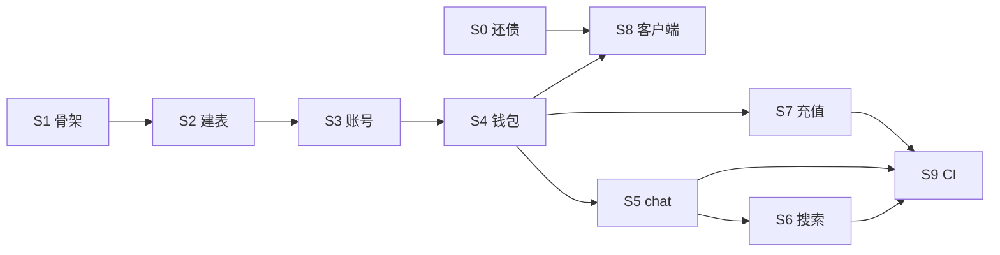

# P02 · 云端骨架：账号计费与模型网关 — 实现计划

> last_updated: 2026-08-15 ｜ 上游：PRD（FR-041/050）、architecture §4.1/§6、db_schema §1、security_strategy §3、testing_strategy §6
> 定位：NestJS 薄云端跑起来——账号/钱包/账本/充值 + 模型网关（chat/estimate/search），本地零算力（ADR-002），服务端权威计量（ADR-003）。
> 范围内含 P01 交叉审查遗留 3 修（toast 大白话 / applySnapshot 归位 / transition 事务化）。

## Step 清单（10 步）

### Step 0 · P01 遗留 3 修（P02 之前置还债）✅
- **目标**：清掉交叉审查「P02 期间修」批次，避免新旧债混流。
- **动作**：① init/IPC 错误 catch 后映射大白话文案表（BUG-P01-01）+ toast 8s 自动消失（BUG-P01-02）；② applySnapshot 仅当 `phase 真变` 才 setView，用户手动切驾驶舱不被拽回；③ PersistentMachine::transition/pass_gate 包进单事务（BEGIN…COMMIT）。
- **文件**：`src-ui/lib/ipc.ts`、`src-ui/App.tsx`、`src-ui/stores/project.ts`、`src-tauri/crates/core-state/src/machine/mod.rs`
- **依赖**：无 ｜ **验证**：vitest（toast 文案/归位策略）+ cargo test（并发 transition 不互相覆盖）。

### Step 1 · NestJS 骨架 + Postgres/Redis 接线（FR-041 地基）✅（compose 运行时验证待 CI）
- **目标**：`PROJECT/cloud/` 可 `docker compose up` 起 PG+Redis，Nest 可起、健康检查可探。
- **动作**：Nest 模块骨架（auth/billing/gateway 三模块占位）；全局 `R<T>` 拦截器与异常过滤器；ConfigModule 环境变量（`.env.example`）；`/healthz`；Docker Compose（pg+redis+api）；Flyway 接入。
- **文件（≤12）**：`cloud/src/{main,app}.ts`、`cloud/src/common/{R,filter,interceptor}`、`cloud/docker-compose.yml`、`cloud/.env.example`、`cloud/flyway/`、`cloud/package.json` 等。
- **依赖**：无 ｜ **FR-041**（支撑）｜ **验证**：`curl /healthz` 返 `{code:200}`；compose 起 PG 后 Flyway 自动迁移。

### Step 2 · 云端建表 V1/V3 + 本地开发种子（FR-041/050 地基）✅（本地迁移器改用 PGlite，compose/Flyway 运行时验证待 CI）
- **目标**：db_schema §1 的 users/wallets/token_ledger/recharge_orders/api_identities 落地。
- **动作**：`V1__init.sql`（含 wallets.version 乐观锁、ledger.idempotency_key UNIQUE）、`V3__api_identities.sql`（api_key AES-GCM 加密存储，密钥走环境变量）；种子脚本插一行假供应商。**已执行脚本不可改**；执行后回写 `specs/db_schema.md` 状态列。
- **文件**：`cloud/flyway/V1__init.sql`、`V3__api_identities.sql`、`cloud/scripts/seed.ts`、`specs/db_schema.md`
- **依赖**：Step 1 ｜ **验证**：迁移幂等重跑；UNIQUE 拦重复幂等键（测试插入两次同 key 第二次报错）。

### Step 3 · 账号模块：注册/登录/JWT（FR-041 支撑，security §3.5）✅
- **目标**：`/auth/register` `/auth/login` 可用，JWT access 15min + refresh 7d。
- **动作**：验证码接口**本期 mock**（返回固定码，标注 TODO 接短信商）；BCrypt 密码；验证码限频（Redis 计数，5 次/时）；注册即建钱包+发体验金（ledger kind=3，防薅：同设备/同手机号只发一次——设备指纹先取简化指纹）；JWT 签发/刷新/黑名单（Redis）。
- **文件（≤12）**：`cloud/src/auth/{auth.controller,auth.service,jwt.strategy}`、`auth/dto/*`、`common/decorators/` 等。
- **依赖**：Step 2 ｜ **验证**：e2e——注册→重复注册 409→登录→错码 401→限频 429；体验金只发一次。

### Step 4 · 钱包与账本：余额/明细/预估（FR-041，AC-045 服务端半边）✅
- **目标**：`/balance`、`/balance/transactions`、`/gateway/estimate` 可用；扣账走「乐观锁+事务+幂等键」。
- **动作**：LedgerService.append（只增不改）+ WalletService.apply（version 乐观锁事务内更新 balance/gift，先扣 gift 再扣充值）；扣费入口统一 `charge(user, {amount, model, tokens, nonce})`，重复 nonce 返回首次结果不重扣；estimate 按 token 单价表算 `cost_cents_est`（单价表配置文件，不进库）。
- **文件（≤10）**：`cloud/src/billing/{wallet,ledger,pricing}.service.ts`、`billing/billing.controller.ts`、`gateway/estimate.controller.ts`
- **依赖**：Step 3 ｜ **验证**：单测——并发 100 线程同扣不超扣（乐观锁重试）；同 nonce 双扣只生效一次；账本余额推导=钱包余额（对账测试）。

### Step 5 · 模型网关 chat：SSE 转发 + 权威计量（FR-041/003 支撑，AC-053 主链）✅（anthropic 供应商真上游联调待运营配 key）
- **目标**：`/gateway/chat` 接上游 LLM（Anthropic 优先，api_identities 取 key），SSE 透传，末帧 `usage` 权威入账。
- **动作**：供应商适配层（Provider 接口 + anthropic 实现，OpenAI 预留）；调用前余额预估检查（不足 402）；流式转发（SSE chunk 透传）；结束后按上游 usage 实扣（nonce=client_nonce+chunk 序号）；404/402/429/502 错误码映射（对齐 architecture §4.1）；熔断：单任务消费超配置上限→中断+通知。
- **文件（≤12）**：`cloud/src/gateway/{chat.controller,provider.interface,anthropic.provider,meter.service}.ts` 等。
- **依赖**：Step 4 ｜ **验证**：mock 上游 e2e——正常流→末帧入账；余额不足 402；重复 nonce 不重扣；上游挂→502。**测试用 mock 上游，不烧真钱**。

### Step 6 · 搜索网关：降级链 + 计次计费（FR-050，AC-053/054）✅（博查/SearXNG/Jina 真上游联调待运营配 env；「模型原生搜索」待 P04 任务链接入）
- **目标**：`/gateway/search` 支持 `intent: web|deep_read`，主备降级透明，按次入账。
- **动作**：SearchService 策略链——模型原生搜索（走 Step5 网关）→ 博查/智谱（环境变量配了才启用）→ SearXNG 兜底；deep_read 走 Jina/Firecrawl 转 Markdown；结果缓存（Redis，query 归一化 hash，防重复计费）；每次调用 ledger 单列 kind=1 且 model='web_search'；主备全挂→502。
- **文件（≤10）**：`cloud/src/gateway/search/{search.controller,search.service,providers/*}.ts`
- **依赖**：Step 5 ｜ **验证**：mock 三家——主家挂自动降级且响应带降级标记；缓存命中不二次扣费；全挂 502；明细里单列「联网搜索」。

### Step 7 · 充值：订单 + 回调验签（FR-041；MVP 渠道 mock）✅
- **目标**：`/payments/recharge` 下单 + `/payments/webhook` 回调入账，全链幂等。
- **动作**：订单创建（pack P50/P200/P500，status=0）；回调验签（MVP 用 HMAC 假渠道签名，真渠道等商户资质后接）；已支付订单重复回调不重复入账（status 机+ledger 幂等双保险）；入账 kind=2。
- **文件（≤8）**：`cloud/src/billing/payment/{payment.controller,payment.service,webhook.controller}.ts`
- **依赖**：Step 4 ｜ **[P] 可与 Step 5/6 并行**（文件不相交）｜ **验证**：e2e——下单→回调→余额增；重放回调无变化；验签失败 400。

### Step 8 · 客户端 core-meter 镜像 + 顶栏余额环（FR-041，AC-045 客户端半边）
- **目标**：客户端能登录、显示余额环、任务预估前置、余额不足自动暂停并引导充值。
- **动作**：Rust `core-meter`（新表 usage_mirror 只增、定时与云端对账告警）；登录态存安全位置（OS keyring，先 Windows 凭据管理器）；src-ui 顶栏余额环组件 + 余额不足 toast→「去充值」按钮（跳浏览器门户）；402 全局拦截。
- **文件（≤14）**：`src-tauri/crates/core-meter/src/*`、`src-tauri/migrations/L3__usage_mirror.sql`、`src-ui/components/topbar/BalanceRing.tsx`、`src-ui/stores/billing.ts`、`src-ui/lib/cloudApi.ts`
- **依赖**：Step 4（API 契约）｜ **验证**：vitest 组件测（余额环渲染/402 toast）；cargo test（镜像对账）。

### Step 9 · 云端 CI + 收尾（FR-041/050 交付面）
- **目标**：云端质量门与桌面同级；Phase 3 C 段产物齐。
- **动作**：`.github/workflows/devpilot-cloud-ci.yml`（根仓库，`paths: DevPilot/PROJECT/cloud/**`；lint+test+cargo audit 对应 npm audit 硬拦截）；check_all 增云端段；功能 README + Feature Map（表注解+Flyway 回写）+ User-Ops；冷启动/接口延迟简单基准记录。
- **依赖**：全部 ｜ **验证**：CI 本地 act 或首推观察；check_docs FAIL=0。

## 技术坑点预判
1. **SSE 经 Nest 代理被缓冲**：需禁用压缩/设 flush 立即写，否则用户侧逐字变憋一屏——Step5 验证步骤加「首 token 延迟 <2s（mock 上游）」。
2. **并发超扣**：乐观锁重试风暴——重试上限 3 + 小退避，超限直接失败入挂起队列人工处理（security §3.2）。
3. **幂等键碰撞设计错**：nonce 必须服务端 UNIQUE 兜底而非仅业务判断；测试锁死。
4. **N+1**：transactions 分页必须分页 SQL 直查，禁止先查钱包再循环查账本。
5. **上游 key 泄漏**：api_key 落库前 AES-GCM 加密、日志全链路脱敏、客户端永远拿不到（铁律）。
6. **体验金薅羊毛**：MVP 无真支付，体验金即「钱」——设备指纹简化也要做唯一性拦截。
7. **时区/月份边界**：`month_spent_cents` 按自然月聚合，统一 UTC，前端展示再转本地。

## 安全检查清单（对照 security_strategy §3）
- [ ] BCrypt 密码 + 验证码限频（Redis）
- [ ] JWT 15min/7d + 黑名单登出
- [ ] 全部写接口幂等（idempotency_key UNIQUE 兜底）
- [ ] 钱包乐观锁 + 事务；账本只增不改
- [ ] 回调验签（HMAC）；金额全 `*_cents` 整数
- [ ] 上游 Key AES-GCM 加密 + 日志脱敏 + 客户端不可见
- [ ] 体验金双因子防薅；单任务消费上限熔断
- [ ] 审计：账本即审计（只增）+ 管理端人工调整走 kind=4（本期只留接口）

## 功能联动点清单
| 触发动作 | 联动对象 | 预期变化 | 边界 |
|---|---|---|---|
| 任务开始（未来 P04 调 chat） | 顶栏余额环 | 预估冻结额显示→完成后实扣刷新 | 余额不足：环变红+暂停任务，充值到账后不自动续跑（需手动）【反向】 |
| 充值回调成功 | 余额环/明细列表 | 余额+、明细插 kind=2 | 回调重放【批量】不重复加钱 |
| 搜索调用 | 消耗明细 | 单列「联网搜索」条目 | 缓存命中不产生条目【半选态】 |
| 登录态过期 | 全局 | 401→静默 refresh→失败跳登录 | refresh 也过期才登出，不打断输入中任务 |

## 运维考量清单
| 项 | 决定 |
|---|---|
| 可观测性 | **做**：pino 结构化日志（requestId/userId 贯穿）+ 网关用量指标（/metrics 预留 prometheus 格式） |
| 配置开关 | **做**：单价表/体验金开关/搜索供应商启停全走环境变量 |
| 可回滚 | **做**：Flyway 只前滚；余额=账本推导可重建（回滚脚本重建缓存） |
| 限流熔断 | **做**：网关 per-user QPS 限流（Redis）；单任务消费上限熔断 |
| 降级路径 | **做**：搜索主备链；chat 不降级（上游挂即 502，客户端提示重试） |
| 运维入口 | **后续再说**：管理后台 P08 |
| 告警阈值 | **做（简单版）**：日志 ERROR 含「对账不平」「验签失败」关键字，P08 接告警通道 |
| 容量预案 | **后续再说**：单机 compose 起步（architecture §6） |

## 依赖与并行化地图

### 批次表
| 批 | Step | 说明 |
|---|---|---|
| B1 | S0、S1 | 还债 + 云端骨架（桌面/云端文件不相交，可穿插） |
| B2 | S2 | 建表（一切的前提） |
| B3 | S3 | 账号 |
| B4 | S4 | 钱包皮 |
| B5 | S5、S7 | chat 网关 ∥ 充值（文件不相交：gateway/ vs billing/payment/） |
| B6 | S6 | 搜索（依赖 S5 网关通道） |
| B7 | S8 | 客户端镜像 |
| B8 | S9 | CI + 收尾 |

## 术语表
| 术语 | 大白话 |
|---|---|
| 乐观锁 | 改数据前核对版本号，对不上就重试，防两人同时改一笔账 |
| 幂等键 | 给每笔操作发的唯一编号，重发同号只算一次，防重复扣费 |
| SSE | 服务器单向推送通道，AI 回答逐字流出来 |
| AES-GCM | 一种加密存法，密文被改过会直接报错 |
| 体验金 gift_cents | 注册赠送的可消费额度，优先于充值余额扣 |
| 对账 | 本地账本与云端账本互相核对，发现不一致就告警 |
