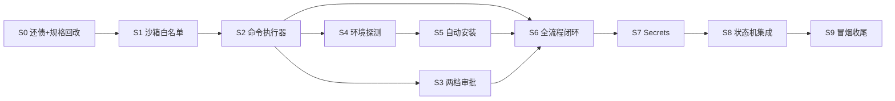

# P03 本地执行与沙箱

> 覆盖 FR-001（本地隔离执行）、FR-003（全流程闭环）、FR-005（自动环境配置）、FR-009（两档审批模式）、FR-012（Secrets 管理）。
> 依赖：P01 客户端骨架 + 状态机（已交付）；P02 云端计量（已交付，任务计费接口可用）。
> 硬原则：未经许可不写代码；真写代码前必须让用户显式确认本 plan。

## 目标

让 DevPilot 从「能展示状态」进化到「能真的在用户本机跑任务」：
- 任务进程被关在沙箱里，默认只能读写项目目录；越界操作/危险命令按两档审批模式让用户决策。
- 接到任务描述后，自动识别项目技术栈、安装缺失依赖、运行测试/lint、失败自动修复、产出 diff。
- 全程给对话/日志脱敏，已配 secrets 以环境变量注入任务进程，绝不漏到 UI 或文件。

## 拆分与依赖

### 批次表

| 批 | Step | 说明 |
|---|---|---|
| B1 | S0 | 还债：统一术语 / 规格漂移修回（P02 遗留的 nonce 规则、计费取整、充值备注字段） |
| B2 | S1 | core-sandbox 骨架：目录白名单 + 路径归一化 + 越界判定 API |
| B3 | S2 | core-exec 骨架：命令执行器（cwd/env/timeout/stdout/stderr 捕获）+ 返回结构化结果 |
| B4 | S3 | 危险命令清单 + 两档审批模式（FR-009）：自动档仍强卡危险命令 |
| B5 | S4 | 环境探测（package.json/requirements.txt/Cargo.toml）+ 环境画像缓存（FR-005/AC-006） |
| B6 | S5 | 自动安装：npm/pip/cargo 缺运行时一键安装向导 + 大白话错误（FR-005/AC-006） |
| B7 | S6 | 全流程闭环 v1（FR-003/AC-004）：读文件→写文件→跑测试/lint→失败自动修复→diff→commit 存档点 |
| B8 | S7 | Secrets 管理（FR-012/AC-014）：注入、脱敏、本地加密存储、快照排除 |
| B9 | S8 | 集成到状态机：阶段 3（建造）chunk 触发执行 + 审批事件持久化 + 产物回写 |
| B10 | S9 | 冒烟 + 文档 + CI 回归 + plan 勾选 + 进度归档 |

## Step 0 · 还债 + 规格漂移修回（前置）✅

- **目标**：把 P02 Phase4 台账里的「规格漂移·做偏」项清掉，避免 P03 重复踩坑。
- **动作**：
  1. `billing/pricing.ts`：计费输入侧改为与 output 一致的向上取整（ceil per 1M tokens），并补 e2e 断言。
  2. `billing/billing.service.ts`：充值 credit 的备注改存 `note` 字段（DB 新增 `token_ledger.note` 或复用 `model` 但语义名改为 `note_or_model`）；Feature Map 与 db_schema 同步。
  3. plan.md / Feature Map 中 chat nonce 描述改为实现形态：`charge:{uid}:chat:{client_nonce}`，未来 multi-round chunk 如需扩展可再改。
- **涉及文件**：`PROJECT/cloud/src/billing/{pricing,billing.service}.ts`、`PROJECT/cloud/flyway/V4__ledger_note.sql`、测试、e2e、文档。
- **验证**：cloud e2e 40/40；check_all 全绿。

## Step 1 · core-sandbox：目录白名单与越界判定（FR-001）✅（cargo test 9/9；fmt/clippy 0 错）

- **目标**：任何文件操作先过沙箱判定，默认只允许在项目根及其子目录内活动。
- **动作**：
  1. 设计 `SandboxPolicy { allow_paths: Vec<PathBuf>, deny_paths: Vec<PathBuf>, default_deny: bool }`。
  2. 实现 `Sandbox::check(path) -> Result<AllowedPath, SandboxError>`：先 resolve 绝对路径（std::fs::canonicalize），再匹配白名单前缀；命中 deny（如 `~/.ssh`、系统目录）直接拒。
  3. 提供 `Sandbox::safe_join(base, rel)` 防 `../` 逃逸。
  4. 测试覆盖：正常子目录通过、父目录 `../` 越界拒绝、符号链接逃逸拒绝、大小写/反斜杠归一化通过。
- **涉及文件**：`PROJECT/desktop/src-tauri/crates/core-sandbox/src/{lib.rs,policy.rs,path.rs}`。
- **依赖**：P01 Step2 骨架已存在；S0 完成。
- **验证**：`cargo test -p core-sandbox` ≥ 8 用例全绿；AC-001 越界暂停逻辑由 S3 覆盖。

## Step 2 · core-exec：命令执行器（FR-003 地基）

- **目标**：能可靠地启动外部进程，捕获 stdout/stderr，受 timeout 控制，结果结构化。
- **动作**：
  1. 定义 `ExecRequest { cmd: String, args: Vec<String>, cwd: PathBuf, env: HashMap<String,String>, timeout_ms: u64 }`。
  2. 定义 `ExecResult { exit_code: Option<i32>, stdout: String, stderr: String, duration_ms: u64, timed_out: bool }`。
  3. 使用 `tokio::process::Command`（异步，避免 UI 阻塞），stdout/stderr 用 `tokio::io::AsyncBufRead` 逐行捕获并压入 RingBuf（默认各保留最后 8KB，可配置）。
  4. 超时杀进程树（Windows `taskkill /T`、Unix `kill -9` 进程组）。
  5. 测试：`echo`、`sleep` 超时、非零退出码、环境变量注入、cwd 切换。
- **涉及文件**：`PROJECT/desktop/src-tauri/crates/core-exec/src/{lib.rs,exec.rs}`、`Cargo.toml`（加 tokio）。
- **依赖**：S1。
- **验证**：`cargo test -p core-exec` ≥ 6 用例全绿。

## Step 3 · 两档审批模式（FR-009）

- **目标**：沙箱 + 执行器之上加审批层，自动模式下危险命令仍强制弹批。
- **动作**：
  1. 危险命令清单（正则/前缀匹配）：`rm -rf /`、`curl ... | sh`、`mkfs.*`、`dd if=/dev/`、`format`、`reg delete`、写系统目录（`C:\Windows`、`/usr/bin` 等）、读 `~/.ssh` 等敏感目录。
  2. `ApprovalPolicy` 枚举：`Auto { danger_requires_approval: true }` / `Manual`。
  3. `ApprovalGate::check(cmd, cwd, env) -> Decision { Allow, Block(reason), Ask(Prompt) }`。
  4. core-state 新增表 `pending_approvals`（id/project_id/task_id/prompt/created_at/decision/resolved_at），审批事件持久化，断点续开可恢复。
  5. Tauri 命令 `commands::submit_approval(id, allow, remember?)`。
  6. 测试：危险命令在 Auto 模式下仍要求审批、普通命令 Auto 直接放行、Manual 模式任何命令都 Ask。
- **涉及文件**：`core-sandbox/src/approval.rs`、`core-state/migrations/L4__pending_approvals.sql`、`core-state/src/db/migrate.rs`、`src-tauri/src/commands.rs`。
- **依赖**：S1、S2。
- **验证**：AC-010/011 单元测试 + 人工走查审批 UI（S9）。

## Step 4 · 环境探测与画像缓存（FR-005 / AC-005）

- **目标**：知道项目是什么技术栈，第二次任务能秒级复用结论。
- **动作**：
  1. `EnvProbe`：扫描项目根，识别 `package.json`（npm/pnpm/yarn/bun）、`requirements.txt`/`pyproject.toml`（pip/poetry/uv）、`Cargo.toml`、`go.mod`、`Gemfile`、`composer.json` 等。
  2. 记录运行时存在性（node/python/cargo/go/ruby/php 版本）、包管理器、已安装依赖指纹（hash of lockfile）。
  3. `EnvProfile` 结构体本地 SQLite 缓存（core-state），key = `(project_path_hash, lockfile_hash)`；命中则跳过探测。
  4. 测试：空项目/Node 项目/Python 项目/混合项目；缓存命中不再读文件系统。
- **涉及文件**：`core-exec/src/probe.rs`、`core-exec/src/profile.rs`、core-state 本地表（可复用/扩展已有表或新建 `env_profiles`）。
- **依赖**：S2。
- **验证**：单元测试 ≥ 6 用例；AC-005「二次 ≤10s」暂由单测模拟（真实计时 S9 人工）。

## Step 5 · 一键安装向导（FR-005 / AC-006）

- **目标**：缺运行时/依赖时给大白话向导，别让用户看英文报错。
- **动作**：
  1. `InstallerDetector`：检测缺失项 → 推荐安装命令（Windows: winget/scoop；Mac: brew；Linux: apt）。
  2. `InstallPlan` 结构：缺什么、装什么、预计多久、风险说明；UI 显示「一键安装」按钮。
  3. 调用 core-exec 执行安装命令，实时输出到日志透明层（FR-038 预留接口）。
  4. 失败重试 1 次，仍失败则大白话报告（网络/权限/不支持的系统）。
  5. MVP 范围：Node、Python、Rust(cargo)；pip/npm install 在 S6 闭环里。
- **涉及文件**：`core-exec/src/install.rs`、桌面 UI 向导组件（`src-ui/components/install-wizard/`）。
- **依赖**：S4。
- **验证**：人工验收 AC-006（真实机器环境差异大，必须人走）；单元测安装命令生成逻辑。

## Step 6 · 全流程闭环 v1（FR-003 / AC-004）

- **目标**：拿到任务描述后，能真正读写文件、跑测试、失败自动修复、产出 diff、commit 存档点。
- **动作**：
  1. `TaskRunner` 状态机：`Pending → Probing → Installing → Running → (Lint/Test → FixRetry) → Done/Failed`。
  2. 文件读写 API：`read_file`、`write_file`、`apply_diff`（统一走 core-sandbox 越界检查）。
  3. 测试/lint 探测：按画像找命令——`npm test`、`cargo test`、`pytest`、`go test` 等；未识别则跳过。
  4. 失败自动修复：捕获失败输出 → 塞回 LLM（经云端 chat/estimate）→ 生成修复补丁 → 重试；默认最多 3 轮。
  5. 存档点：成功后 `git add -A && git commit -m "devpilot: <任务标题>"`；失败也 commit 一个 `devpilot-failed` 标签便于排查。
  6. 输出产物：`TaskResult { success, diff_summary, test_result, fix_attempts, cost_cents }`。
- **涉及文件**：`core-exec/src/runner.rs`、core-orchestrator 扩展、`src-tauri/src/commands.rs`、UI 叙事流组件。
- **依赖**：S2、S3、S4、S5、P02 云端 chat/estimate 接口。
- **验证**：AC-004 e2e——准备一个简单 JS 项目，让 DevPilot 加一个函数并通过测试；失败案例准备一个有 bug 的测试，看自动修复上限。

## Step 7 · Secrets 管理（FR-012 / AC-014）

- **目标**：用户配的密钥只进进程环境变量，UI/日志/快照里全是 `***`。
- **动作**：
  1. core-state 新增 `secrets` 表（id/project_id/name/encrypted_value/created_at）。
  2. 加密：Windows DPAPI / macOS Keychain / Linux 用 keyring crate 或主密钥文件权限 600；MVP 先用 keyring 统一，失败回退到 sqlite 加密（AES-GCM，密钥派生自设备 fingerprint）。
  3. 注入：任务进程 env 添加 `DEVPILOT_SECRET_<NAME>=<value>`，同时维护一个内存脱敏映射。
  4. 脱敏：所有 stdout/stderr/UI 文本流经过 `Redactor`，替换已注册 secret 值为 `***`；大小写不敏感、分词边界匹配。
  5. 快照排除：git commit 自动排除 `secrets` 相关文件（若落盘）。
- **涉及文件**：`core-state/migrations/L5__secrets.sql`、`core-exec/src/secrets.rs`、UI 设置面板。
- **依赖**：S2。
- **验证**：AC-014 自动化测试——配置 secret 后任务进程能读到、UI/日志/快照里看不到原文。

## Step 8 · 状态机集成：阶段 3 chunk 触发执行（FR-003 + 状态机联动）

- **目标**：用户在前端点「开工」后，状态机进入阶段 3，真正调用 TaskRunner。
- **动作**：
  1. 在 `core-state` 的 workflow 转移逻辑里，阶段 3（建造）gate 检查通过 → 生成 chunk task → 调用 runner。
  2. 审批事件与 runner 联动：runner 执行前调用 ApprovalGate，需要 Ask 时挂起 task、写 `pending_approvals`、前端轮询/websocket 推送。
  3. 产物回写：runner 完成后把 diff summary / test result / cost 写回 `tasks` 表，状态机推进到阶段 4（验收）。
  4. 失败处理：test/lint 全失败 → task.status=failed，状态机停在阶段 3 并提示「修复任务」。
- **涉及文件**：`core-state/src/workflow.rs`（或对应引擎文件）、`core-orchestrator`、Tauri 命令、UI 任务面板。
- **依赖**：S3、S6、S7。
- **验证**：e2e 状态机流转 + 人工验收「开工→执行→验收」联动。

## Step 9 · 冒烟、文档、CI 与归档

- **目标**：P03 交付物齐全，质量门全绿。
- **动作**：
  1. 冒烟：用真实简单项目跑通「创建项目→需求确认→开工→自动执行→看到 diff→验收」。
  2. 更新 Feature Map、User-Ops、README、db_schema。
  3. check_all 全绿；cloud/desktop e2e 全绿。
  4. 回填 00_MVP实现计划总索引 P03 状态。
  5. 产开发进度1~n.md 归档。
- **验证**：check_all EXIT=0；check_docs EXIT=0；AC-001/004/006/010/011/014 全核对通过。

> 技术坑点、安全检查、联动点、运维考量、术语表见 [P03_本地执行与沙箱_附录.plan-附录.md](P03_本地执行与沙箱_附录.plan-附录.md)
