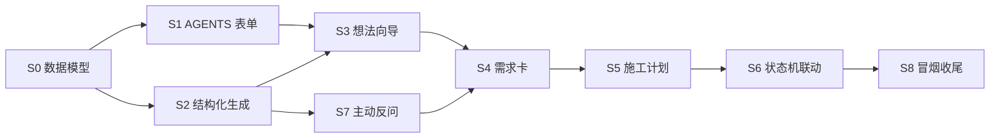

# P04 工作流主链：想法需求计划

> 覆盖 FR-008（AGENTS.md 自动维护）、FR-030（想法打磨向导）、FR-031（需求确认卡片）、FR-032（施工计划审批）、FR-044（主动反问澄清）。
> 依赖：P01 客户端骨架+状态机（已交付）、P02 云端网关（已交付）、P03 本地执行与沙箱（已交付）。
> 硬原则：未经许可不写代码；本 plan 过审后才进 Phase 3。

## 目标

让 DevPilot 从「能跑本地任务」进化到「能独立走完想法→需求→计划」：
- 用户在「想法」视图通过访谈式问答把需求说清楚；AI 先追问歧义，再生成项目分析报告与建议。
- 「需求」视图把报告拆成一张张需求卡（大白话 + 验收标准），用户逐张确认；全部确认才允许推进到「计划」。
- 「计划」视图展示 chunk 级施工计划；用户审批后，才在 `tasks` 表创建任务并解锁「开工」进入建造阶段。
- 用户通过大白话表单维护项目约定，系统自动重写项目根 `AGENTS.md`，零代码用户无需接触该文件。

## 拆分与依赖

### 批次表

| 批 | Step | 说明 |
|---|---|---|
| B1 | S0 | 数据模型：新增 `spec_cards` / `plan_chunks` / `agent_configs` 表及迁移 |
| B2 | S1 | AGENTS.md 大白话表单模型 + 读写解析（FR-008） |
| B3 | S2 | 云端/本地结构化生成管线（generator + prompt + JSON 模式）（FR-030/031/044 基础） |
| B4 | S3 | 想法打磨向导 UI + 报告生成（FR-030/044） |
| B5 | S4 | 需求卡生成与确认流（FR-031） |
| B6 | S5 | 施工计划 chunk 看板（FR-032） |
| B7 | S6 | 状态机联动：确认/审批自动过门禁 + 创建任务（FR-031/032） |
| B8 | S7 | 主动反问澄清 UI 与 generator 集成（FR-044） |
| B9 | S8 | 冒烟、文档、CI 与归档 |

## Step 0 · 数据模型与迁移（FR-008/030/031/032 底座）✅

- **目标**：为需求卡、施工计划 chunk、项目约定提供持久化结构。
- **动作**：
  1. 新增 `core-state/migrations/L7__workflow_artifacts.sql`：
     - `spec_cards(id, project_id, title, detail, ac_json, status, sort_order, created_at, updated_at)`，status ∈ `pending/confirmed/skipped`。
     - `plan_chunks(id, project_id, title, goal, estimated_tokens, dependencies_json, status, sort_order, created_at, updated_at)`，status ∈ `draft/approved/running/done`。
     - `agent_configs(id, project_id, fields_json, updated_at)`：存储大白话表单字段；`AGENTS.md` 为其渲染视图。
  2. `core-state/src/lib.rs` 导出 `spec_card`、`plan_chunk`、`agent_config` 三个模块。
  3. `migrate_is_idempotent` 断言更新到 L1~L7。
- **涉及文件**：
  - `core-state/migrations/L7__workflow_artifacts.sql`
  - `core-state/src/db/migrate.rs`
  - `core-state/src/lib.rs`
- **依赖**：P03 L6 已执行。
- **验证**：`cargo test -p core-state migrate_is_idempotent` 通过。

## Step 1 · AGENTS.md 大白话表单（FR-008）✅

- **目标**：用户改表单即重写 `AGENTS.md`，全程不接触文件。
- **动作**：
  1. 在 `core-state/src/agent_config.rs` 实现：
     - `load(project_id) -> AgentConfig`：读 `agent_configs` 表；无记录则返回默认模板。
     - `save(conn, project_id, fields) -> ()`：更新表，并调用 `render_agents_md(fields) -> String`。
  2. `render_agents_md` 按固定模板把字段转成项目根 `AGENTS.md` 文本（技术约定 / 命名 / 文档 / 测试红线等章节）。
  3. Tauri 命令：`load_agent_config(project_id) -> AgentConfig`、`save_agent_config(project_id, fields) -> ()`。
  4. 前端 `src-ui/components/agent/AgentConfigForm.tsx`：表单字段包括「项目一句话定位」「技术栈偏好」「提交规范」「安全红线」「文档要求」；保存时调用命令。
- **涉及文件**：
  - `core-state/src/agent_config.rs`（新建）
  - `core-state/src/lib.rs`
  - `src-tauri/src/commands.rs`
  - `src-tauri/src/lib.rs`
  - `src-ui/components/agent/AgentConfigForm.tsx`（新建）
- **依赖**：S0。
- **验证**：保存表单后项目根 `AGENTS.md` 内容同步更新；单元测试覆盖渲染与回读。

## Step 2 · 结构化生成管线（FR-030/031/044 基础）✅

- **目标**：让 orchestrator 能调用云端 LLM 生成结构化产物（报告/卡片/plan），并处理歧义追问。
- **动作**：
  1. 在 `core-orchestrator/src/generator.rs` 定义：
     - `GenerationRequest { context_json, prompt_template, output_schema }`
     - `GenerationResult { content_json, clarifying_questions }`：若模型输出 `questions` 数组，则先返回追问，不继续生成。
  2. 实现 `generate(req) -> Result<GenerationResult, GeneratorError>`：
     - 调用桌面 `lib/cloudApi.ts` 的 `/gateway/chat`（SSE 收集完整回复）。
     - 要求模型按 JSON schema 输出；失败时尝试修复一次并返回大白话错误。
  3. Prompt 模板放在 `core-orchestrator/src/prompts/`（如 `idea_analyst.txt`、`spec_card.txt`、`plan_chunk.txt`），编译期 `include_str!`。
- **涉及文件**：
  - `core-orchestrator/src/generator.rs`（新建）
  - `core-orchestrator/src/prompts/*.txt`（新建）
  - `core-orchestrator/src/lib.rs`
  - 可能需 `src-tauri/src/commands.rs` 暴露 `generate_artifact` 命令
- **依赖**：P02 云端 chat 接口可用；P03 secrets 可注入（若未来 prompt 需敏感上下文）。
- **验证**：单元测试用 mock generator 验证 JSON 解析与追问分支；真实调用走人工冒烟。

## Step 3 · 想法打磨向导（FR-030/044）✅

- **目标**：用户在「想法」视图通过问答把点子打磨成可落地的分析报告。
- **动作**：
  1. 替换 `src-ui/views/Idea.tsx` 占位：提供多轮问答卡片流（做给谁、痛点、竞品、赚钱方式、技术约束）。
  2. 每轮答案实时保存到 `rounds` 当前轮的 `title`/`snapshot_tag` 或本地 state；最终点「生成分析」。
  3. Tauri 命令 `analyze_idea(project_id, qa_json) -> AnalysisReport`：
     - 读取 `agent_config` 作为约束。
     - 调用 `generator::generate` 用 `idea_analyst.txt` 模板。
     - 若返回追问，则把问题抛给前端继续对话。
     - 生成报告后写入 `workflow_output/docs/项目分析/项目分析报告.md`，并在 `artifacts` 表注册 type=`analysis`。
  4. 报告 UI 展示「建议：值得做 / 先缩小 / 再想想」三选一 + 关键摘要。
- **涉及文件**：
  - `src-ui/views/Idea.tsx`
  - `src-tauri/src/commands.rs`
  - `core-orchestrator/src/generator.rs`
  - `core-orchestrator/src/prompts/idea_analyst.txt`
- **依赖**：S1、S2。
- **验证**：AC-033：完成访谈后生成报告并给出三选一建议；AC-048：存在歧义时先追问。

## Step 4 · 需求确认卡片（FR-031/044）✅

- **目标**：把分析报告拆成需求卡，用户逐张确认；全确认才解锁「计划」。
- **动作**：
  1. 替换 `src-ui/views/Spec.tsx` 占位：左侧报告摘要，右侧卡片列表。
  2. Tauri 命令 `generate_spec_cards(project_id)`：
     - 读取分析报告 + AGENTS 约束。
     - 调用 generator 的 `spec_card.txt` 模板，输出 `{cards:[{title,detail,ac}]}`。
     - 清空旧 `spec_cards`，插入新记录（status=pending）。
  3. UI 每张卡片展示 title / detail / 验收标准；提供「确认/跳过/编辑」按钮。
  4. Tauri 命令 `confirm_spec_card(id, status)` / `update_spec_card(id, title, detail, ac)`。
  5. 列表底部显示进度「3/5 已确认」；存在未确认且未跳过时，「进入计划」按钮禁用。
- **涉及文件**：
  - `src-ui/views/Spec.tsx`
  - `core-state/src/spec_card.rs`（新建）
  - `core-state/src/lib.rs`
  - `src-tauri/src/commands.rs`
  - `core-orchestrator/src/prompts/spec_card.txt`
- **依赖**：S3。
- **验证**：AC-034：存在未确认卡时「开工/进入计划」按钮锁定。

## Step 5 · 施工计划 chunk 看板（FR-032）✅

- **目标**：把确认后的需求卡转成 chunk 级施工计划，用户审批前引擎不写代码。
- **动作**：
  1. 替换 `src-ui/views/Plan.tsx` 占位：看板列（待开始 / 进行中 / 完成），每个 chunk 一张卡片。
  2. Tauri 命令 `generate_plan_chunks(project_id)`：
     - 读取已确认 `spec_cards` + AGENTS 约束。
     - 调用 generator 的 `plan_chunk.txt` 模板，输出 `{chunks:[{title,goal,estimated_tokens,dependencies}]}`。
     - 清空旧 `plan_chunks`，插入新记录（status=draft）。
  3. UI 支持拖拽排序、编辑 title/goal、删除 chunk。
  4. 「审批计划」按钮触发 `approve_plan(project_id)`：
     - 所有 draft chunk 变为 approved。
     - 按顺序在 `tasks` 表创建 task 记录（round_id = 当前 open 轮次，chunk_no = 顺序，title = chunk.title，status=pending）。
     - 通过状态机 `pass_gate("kickoff")`。
- **涉及文件**：
  - `src-ui/views/Plan.tsx`
  - `core-state/src/plan_chunk.rs`（新建）
  - `core-state/src/lib.rs`
  - `src-tauri/src/commands.rs`
  - `core-orchestrator/src/prompts/plan_chunk.txt`
- **依赖**：S4。
- **验证**：AC-035：未点击「开工/审批计划」前不创建/修改任何代码文件；审批后 `tasks` 表出现对应任务。

## Step 6 · 状态机联动与门禁解锁（FR-031/032）✅

- **目标**：需求确认与计划审批自动同步到状态机门禁。
- **动作**：
  1. 当 `spec_cards` 全部变为 confirmed/skipped 后，自动调用 `pass_gate("requirement_confirm")`（或在用户点击「进入计划」时检查并过门）。
  2. `approve_plan` 成功后自动 `pass_gate("kickoff")`。
  3. 前端状态管道条根据 `pending_gates` 实时更新；已过门禁显示 ✅。
  4. 提供大白话错误：「还有 2 张需求卡未确认」/「施工计划尚未审批」。
- **涉及文件**：
  - `src-tauri/src/commands.rs`
  - `src-ui/views/Spec.tsx`、`src-ui/views/Plan.tsx`
  - 复用 P01 管道条组件
- **依赖**：S4、S5。
- **验证**：状态机测试：未确认卡时 transition 到 plan 被拒；审批计划后可 transition 到 build。

## Step 7 · 主动反问澄清（FR-044）✅

- **目标**：AI 遇到歧义不瞎猜，先问用户。
- **动作**：
  1. 在 generator prompt 中统一加入指令：「若信息不足以生成可靠结果，输出 `clarifying_questions` 数组，禁止自行假设」。
  2. `GenerationResult` 已有 `clarifying_questions` 字段；命令层识别非空时返回特殊响应 `{need_clarify: true, questions: [...]}`。
  3. 前端在 Idea/Spec/Plan 视图检测 `need_clarify`，弹出追问对话框；用户回答后追加到上下文再次生成。
  4. 限制追问轮数（默认 3 轮），超过仍歧义则提示「信息仍不足，建议人工梳理后重试」。
- **涉及文件**：
  - `core-orchestrator/src/generator.rs`
  - `src-tauri/src/commands.rs`
  - `src-ui/components/clarify/ClarifyDialog.tsx`（新建）
  - `src-ui/views/Idea.tsx`、`src-ui/views/Spec.tsx`、`src-ui/views/Plan.tsx`
- **依赖**：S2。
- **验证**：AC-048：给模糊输入时返回追问而非直接生成； mock 测试覆盖。

## Step 8 · 冒烟、文档、CI 与归档 ✅

- **目标**：P04 交付物齐全，质量门全绿。
- **动作**：
  1. 冒烟：用真实简单项目走「创建项目 → 想法问答 → 生成报告 → 确认需求卡 → 审批计划 → 自动解锁 build」。
  2. 更新 `db_schema.md`（新增 L7 表）。
  3. 产出 `Feature Map` + `User-Ops` + `README`。
  4. 更新 `00_MVP实现计划总索引` P04 状态。
  5. `check_all` 全绿；`check_docs` 无 FAIL。
- **涉及文件**：
  - `workflow_output/docs/feature-map/P04_工作流主链：想法需求计划.feature-map.md`
  - `workflow_output/docs/user-ops/P04_工作流主链：想法需求计划用户操作手册.md`
  - `workflow_output/开发进度/P04_工作流主链：想法需求计划/README.md`
  - `workflow_output/docs/specs/db_schema.md`
  - `workflow_output/docs/plans/00_MVP实现计划总索引.md`
- **依赖**：S0~S7。
- **验证**：check_all EXIT=0；check_docs FAIL=0；人工冒烟通过。

## 技术坑点预判

| 坑点 | 规避 |
|---|---|
| LLM 输出不合法 JSON | generator 先做 schema 要求，失败时修复一次；仍失败返回大白话错误，不崩溃。 |
| 多次生成导致卡片/计划重复 | 每次重新生成前先清空本项目的旧 `spec_cards` / `plan_chunks`（事务内执行）。 |
| 状态机门禁与卡片状态不同步 | 过门禁操作与写表放在同一 `db.write` 闭包；CAS 失败后重读状态机。 |
| 长报告导致 token 消耗高 | `estimate` 前置预估；生成前检查余额；报告强制 ≤5000 tokens（约 3000 汉字）。 |
| 前端 mock Tauri 运行时 | 测试统一 `vi.mock("@tauri-apps/api/core")`，像 P01/P03 做法。 |
| `AGENTS.md` 与用户手写内容冲突 | 系统只维护固定字段区域；在文件顶部加「本文件由 DevPilot 自动维护，手动修改会被覆盖」提示。 |

## 安全检查清单（对照 security_strategy）

- **输入校验**：project_id 必须存在；卡片/计划字段长度限制（title ≤100，detail ≤2000）。
- **沙箱**：生成产物只写入项目目录 `workflow_output/`；不越界。
- **鉴权**：Tauri 命令暂时无用户级鉴权（桌面端单用户），但所有操作绑定 project_id。
- **审计**：`transition_history` 自动记录门禁通过；`artifacts` 表记录报告/卡片/plan 版本。
- ** Secrets**：generator 调用云端 chat 时，prompt 中不注入用户 secrets。

## 功能联动点清单

| 触发动作 | 联动对象 | 预期变化 | 边界 |
|---|---|---|---|
| 保存 AGENTS 表单 | 项目根 `AGENTS.md` | 文件重写 | 用户手动改文件会被下次保存覆盖 |
| 生成分析报告 | `spec_cards` 表 | 旧卡清空，新卡 pending | 重新生成会丢失用户对旧卡的编辑/确认状态，需提示确认 |
| 确认/跳过需求卡 | 「进入计划」按钮 | 全部确认后启用 | 取消确认后按钮再次禁用 |
| 生成施工计划 | `plan_chunks` 表 | 旧计划清空 | 同报告重新生成 |
| 审批施工计划 | `tasks` 表 + 状态机 `kickoff` 门禁 | 创建任务并解锁 build | 审批后编辑计划需先「撤销审批」并删除对应 tasks |
| 点击「开工」进入 build | `execute_build` | 按 tasks 顺序执行 | build 阶段回退到 plan 不删除 tasks |

## 运维考量清单

| 项 | 决策 | 说明 |
|---|---|---|
| 模型调用成本 | 做 | 每次生成前调用 `/gateway/estimate`；余额不足禁止生成。 |
| 生成超时 | 做 | generator 设 60s 超时；超时后前端提示重试。 |
| 可观测性 | 做 | 命令层记录 `[generator] project=X template=Y tokens=Z`。 |
| 配置开关 | 后续再说 | prompt 模板随代码发布；外部化模板文件留给 P06。 |
| 限流熔断 | 后续再说 | 云端网关已有 429 限流；桌面端暂不做本地限流。 |
| 产物版本 | 做 | 每次重新生成 `spec_cards`/`plan_chunks` 前先备份旧记录到 `_bak` 表（或文件 `.bak`）。 |
| 容量预案 | 后续再说 | 单个项目卡片/计划 chunk 上限 50；超出提示拆分。 |

## 术语表

| 术语 | 大白话 | 案例 |
|---|---|---|
| chunk | 一次可独立完成的小块任务 | 「实现登录 API」就是一个 chunk |
| 门禁（gate） | 阶段推进前必须满足的条件 | 需求卡全确认才允许进入计划 |
| AGENTS.md | 项目的 AI 使用说明书 | 告诉 AI 代码风格、命名、安全红线 |
| JSON 模式 | 让模型按固定 JSON 格式回答 | 生成需求卡列表时约束字段 |
| 追问（clarify） | AI 遇到歧义先问人，不瞎猜 | 用户说「做个电商」→问「B2B 还是 B2C？」 |

---

**下一步**：本 plan 需用户确认后，进入 `/phase3` 实现。
