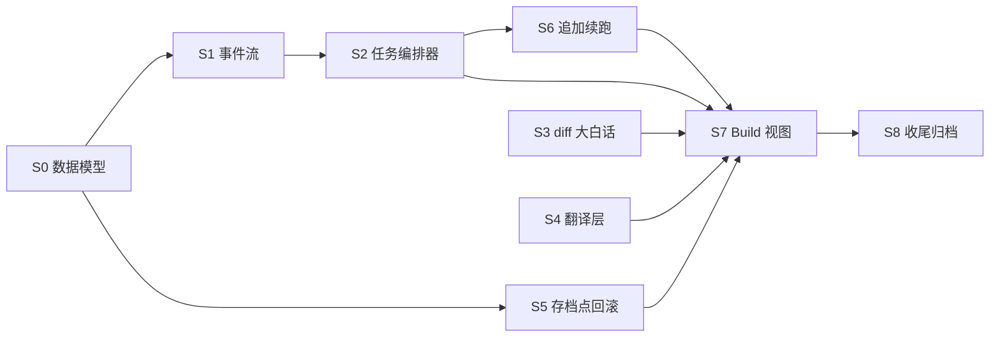

# P05 建造期：任务编排与大白话层

> 覆盖 FR-013（diff 大白话层）、FR-015（追加指令续跑）、FR-036（大白话翻译层）、FR-037（存档点与回滚）、FR-038（日志透明层）。
> 依赖：P01 客户端骨架+状态机、P02 云端网关、P03 本地执行与沙箱、P04 工作流主链（均已交付）。
> 硬原则：未经许可不写代码；本 plan 过审后才进 Phase 3。
> **完整 Step 动作/文件/依赖/验证见 [P05_建造期：任务编排与大白话层.计划详情.md](P05_建造期：任务编排与大白话层.计划详情.md)。**

## 目标

让 DevPilot 的「建造」阶段真正可运行：
- 审批后的 `tasks` 按顺序被 chunk 级任务编排器消费，每个 task 调用 LLM 产出文件变更并本地执行测试/lint。
- 执行过程以「叙事流 + 可展开终端日志」双轨呈现，零代码用户知道 AI 正在做什么。
- 每个 task 结束后生成大白话 diff 摘要（改了什么 / 为什么 / 影响哪里 / 风险）。
- 每次 task 的 git commit 成为存档点，用户可一键回滚到任意历史存档点且不扣 Token。
- 任务完成后用户可用大白话追加指令，在同一项目环境继续跑（不新建轮次）。
- 全局「大白话翻译层」开关：PRD、diff、日志、报错均支持大白话⇄原文切换，术语悬停气泡解释。

## 批次与依赖

| 批 | Step | 目标 | 对应 FR | 状态 |
|---|---|---|---|---|
| B1 | S0 | 数据模型：task 扩展字段 + `task_events` 表 + checkpoints 增强 | FR-038/048 | - [ ] |
| B2 | S1 | 任务事件流：runner 结构化事件 → 持久化 → Tauri 事件推送 | FR-038 | - [ ] |
| B2 | S2 | chunk 任务编排器：顺序消费 pending tasks，LLM 生成文件变更，runner 执行 | FR-003/032 | - [ ] |
| B3 | S3 | diff 大白话摘要 | FR-013 | - [ ] |
| B3 | S4 | 大白话翻译层 | FR-036 | - [ ] |
| B3 | S5 | 存档点列表与回滚 | FR-037 | - [ ] |
| B4 | S6 | 追加指令续跑 | FR-015 | - [ ] |
| B5 | S7 | Build 视图 + 驾驶舱真实数据接通 | FR-038/039/043 | - [ ] |
| B6 | S8 | 测试方案、文档、CI 与归档 | — | - [ ] |

## Step 摘要

- **S0 数据模型扩展**：新增 L8 迁移，扩展 `tasks` 与 `checkpoints`，新建 `task_events`。
- **S1 任务事件流**：把 runner 的日志改成结构化事件，持久化并实时推送到前端。
- **S2 chunk 任务编排器**：按 `chunk_no` 顺序执行 pending tasks，每个 task 调 LLM 生成文件，走 runner 闭环。
- **S3 diff 大白话摘要**：用 LLM 把 git diff 翻译成人话摘要，支持一键看代码原文。
- **S4 大白话翻译层**：全局开关 + 本地术语表 + 模型兜底，技术文本一键转大白话。
- **S5 存档点与回滚**：每个 task 结束都是 git checkpoint；可回滚代码并清空下游任务状态，不扣 Token。
- **S6 追加指令续跑**：任务流完成后追加指令，在同一 round 末尾插入新 task 继续执行。
- **S7 Build 视图 + 驾驶舱**：替换占位，接入真实任务、事件流、diff、存档点时间轴。
- **S8 冒烟收尾**：人工冒烟、更新 db_schema、产 Feature Map/User-Ops/README、更新 MVP 索引、`check_all` 全绿。

## 关键联动点速览

| 触发动作 | 联动对象 | 预期变化 | 边界 |
|---|---|---|---|
| 审批 plan | `tasks` 表 | 生成 pending tasks | 重新审批会清空旧 tasks/checkpoints（先提示） |
| execute_build | scheduler + runner | tasks 顺序执行，成功后到 accept | 任一失败即停，留在 build |
| task 完成 | diff 摘要面板 | 展示大白话摘要；可切原文 | 摘要失败显示原始 diff |
| 回滚存档点 | git HEAD + 下游 tasks | 代码恢复；后续 tasks 重置 pending | 不删除 checkpoints |
| 追加指令续跑 | 新 task + scheduler | 同一 round 末尾新增并执行 | 多次追加按顺序排队 |
| 翻译开关 | PlainText 组件 | 技术文本切换大白话 | 术语气泡始终可用 |

## 出口条件

- [ ] 详细计划已读（含 [计划详情](P05_建造期：任务编排与大白话层.计划详情.md)）。
- [ ] 每个 Step 标注了对应 FR；本功能 FR-013/015/036/037/038 全部覆盖。
- [ ] 依赖与并行化地图一致（批次表 + mermaid）。
- [ ] 功能联动点含反向/边界。
- [ ] 运维考量清单已逐条表态。
- [ ] 用户**明确许可**开始实现。

---

**下一步**：用户确认后，进入 `/phase3` 实现。
