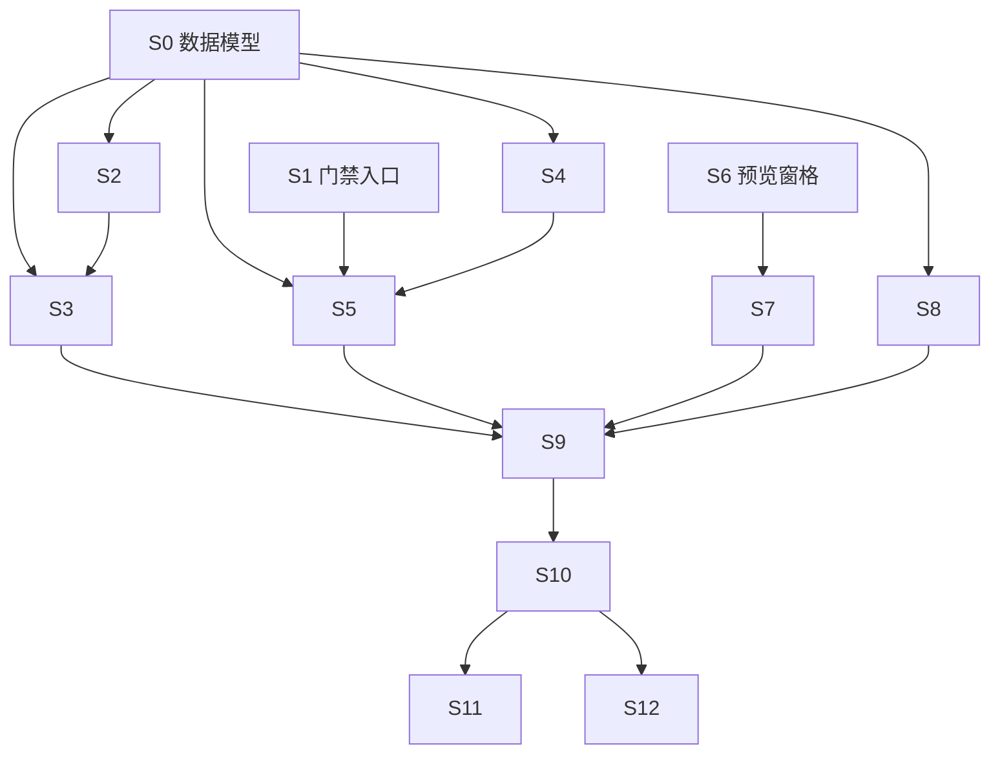

# P06_验收与安全卡点

> Phase 2 产出。Phase 3 逐步勾选执行。只含伪代码，不含真代码。
> 覆盖 FR-033（验收清单模式）、FR-040（安全强制卡点）、FR-052（内置浏览器与冒烟自动化）。
> 依赖：P05 已交付（任务编排/存档点/大白话层）。
> 完整 Step 动作/文件/依赖/验证见 [P06_验收与安全卡点.计划详情.md](P06_验收与安全卡点.计划详情.md)。
> 硬原则：未经许可不写代码；本 plan 过审后才进 Phase 3。

## 背景与目标

P06 是「建造」到「验收/部署」的关口：

- **FR-033 / AC-036**：进入验收阶段后，把 `workflow_output/docs/测试方案/*.md` 转成可逐条核对的清单；自动项交给 Playwright 跑，人工项给出「操作 + 预期结果」。
- **FR-033 / AC-037**：用户在预览窗格里发现不对劲，点「有问题」并圈选元素，系统自动生成一条定位到该元素的修复任务。
- **FR-040 / AC-044**：L2/L3 项目在 `build → accept` 之前强制跑安全扫描；存在未修复的高危项时阻止进入验收，并给出大白话修复清单。
- **FR-052 / AC-057**：验收视图内嵌浏览器预览本地 dev server，支持刷新/设备尺寸切换。
- **FR-052 / AC-058**：自动冒烟使用 Playwright（依赖本机 Node 环境）执行可自动化验收项，并保存截图证据。

## 技术实现坑点预判与规避措施

| 技术点 | 可能的坑 | 规避措施 | 验证方式 |
|---|---|---|---|
| 预览窗格跨域 | Tauri WebView 内嵌 localhost 可能拿不到点击事件 | 用 Tauri webview/iframe + postMessage；点击透传走 Rust 桥接 | 点击后 Rust 收到 selector |
| 元素 selector 生成 | 手写 selector 易随 UI 变化失效 | 优先 `data-testid`，回退 id/class 路径；生成后让用户可编辑 | 刷新后仍能命中 |
| Playwright 运行时依赖 | 用户未装 Node 或浏览器二进制缺失 | 检测可用性；不可用则自动项降级为人工项并提示安装 | 无 Node 时不崩溃 |
| Markdown 测试方案解析 | 格式不统一漏项 | 兼容 `TC-XX` / `用例 N` / 数字标题；失败整段保留为人工项 | 注入多种格式断言项数 |
| 安全扫描误报 | 示例/测试夹具里的密钥被误报 | 白名单 `.test.` / `.example.` / 注释块；用户可标记忽略 | 示例文件不误报 |
| 扫描大仓库 | `node_modules`/`target` 导致 IO 爆炸 | 默认排除；文件 >1MB 跳过；流式返回 | 1w+ 文件 <5s |
| 状态机门禁并发 | 扫描与手动过门禁并发覆盖 gate_status | 复用 `PersistentMachine` CAS；扫描结果写独立表 | 并发 pass_gate 仅一条成功 |

## 安全检查清单

- [x] **鉴权/授权**：`release` 门禁只能由「全部验收项通过」自动触发或用户显式确认。
- [x] **输入校验**：预览 URL 只放行 localhost/127.0.0.1；selector 只接受 CSS/testId；修复描述限长。
- [x] **数据加密**：扫描出的密钥片段在 UI 中部分遮蔽，日志中脱敏。
- [x] **审计日志**：扫描、发布尝试、验收项状态变更写入审计记录。
- [x] **错误处理**：扫描命令失败返回大白话分类错误码，不泄露路径/上游响应体。
- [x] **依赖安全**：`cargo audit`/`npm audit` 仅在用户点击或 CI 中触发，不静默外传。
- [x] **门禁不可绕过**：L2/L3 `security` 门禁未过时 `build → accept` 被拒绝；前端不另开旁路。
- [x] **扫描沙箱**：扫描器只读项目目录，子进程超时强制 kill。

## 性能考虑与验证计划

- [x] **查询效率**：`acceptance_items` 建索引 `(project_id, method, status)`。
- [x] **缓存策略**：测试方案解析结果缓存到表；仅用户点「重新生成」时刷新。
- [x] **并发处理**：Playwright 冒烟串行执行；扫描大文件跳过。
- [ ] **资源使用**：截图存 `~/.devpilot/projects/<id>/screenshots/`，JPEG 压缩，超 50 张归档。
- [ ] **性能验证**：Phase 4 测 100 条验收项滚动不卡顿；L2 项目 5000 文件安全扫描 <10s。

## 运维考量清单

| 项 | 决策 | 说明 |
|---|---|---|
| 可观测性 | 做 | 扫描/冒烟写结构化日志 `{trace_id, project_id, duration_ms, finding_count}`。 |
| 配置开关 | 做 | `security_scan_strict_level`、`smoke_headless`、`smoke_timeout_seconds` 存 `agent_configs`。 |
| 可回滚 | 做 | DB 只增 L9 迁移；截图可手动清理；重新生成清单不删历史 run。 |
| 限流/熔断/降级 | 做 | Playwright 启动 60s 超时；npm audit 网络失败降级提示；大文件跳过。 |
| 运维入口 | 后续再说 | MVP 仅「重新运行扫描/冒烟」按钮；后台批量重跑留 P08。 |
| 告警阈值 | 做 | 冒烟连续失败标红；安全扫描高危项阻断发布即告警。 |
| 容量预案 | 后续再说 | 单项目截图超 100MB 提示清理；本地存储暂不分区。 |

## 依赖与并行化地图

### 执行顺序与并行批

| 批次 | Step | 目标 | 对应 FR | 状态 |
|---|---|---|---|---|
| B1 | S0 | 数据模型与迁移（L9） | FR-033/040/052 | - [x] |
| B1 | S1 | 门禁与发布入口 | FR-040 | - [x] |
| B2 | S2 | 测试方案解析器 | FR-033 | - [x] |
| B2 | S3 | 验收清单持久化 | FR-033 | - [x] |
| B3 | S4 | 安全扫描引擎 | FR-040 | - [x] |
| B3 | S5 | 安全门禁命令 | FR-040 | - [x] |
| B4 | S6 | 预览窗格 | FR-052 | - [x] |
| B4 | S7 | 元素圈选与修复任务 | FR-033 | - [x] |
| B4 | S8 | Playwright 冒烟执行 | FR-052 | - [x] |
| B5 | S9 | Accept 视图整合 | FR-033/040/052 | - [x] |
| B5 | S10 | 联动与发布校验 | FR-033/040 | - [x] |
| B6 | S11 | 测试 | 全部 AC | - [x] |
| B6 | S12 | 文档与索引 | 项目规范 | - [x] |

## 功能联动点清单

| 触发动作 | 联动对象 | 预期变化 | 边界 |
|---|---|---|---|
| 点「进入验收」 | 安全扫描 + 状态机 | L2+ 自动扫描；通过则进入 accept | L0/L1 扫描为建议不拦截 |
| 测试方案文件变更 | acceptance_items | 用户点「重新生成」后重建清单 | 不自动同步，保留历史 run |
| 验收项状态变化 | 发布按钮 | 全部 pass/na → 发布可用；任一 fail → 禁用 | 全跳过提示补充验收项 |
| 点「有问题」生成修复任务 | tasks 表 + Build 视图 | 当前 round 插入 source='fix' 的 pending task | 取消不生成；同一 item 只关联一个未完成 fix_task |
| 修复任务完成 | 验收项 | 关联 item 自动重置 pending | 回滚 checkpoint 时清理下游 fix_task |
| 切换设备尺寸 | 预览窗格 | 容器尺寸变化，页面重排 | 刷新后保持当前尺寸 |
| 运行自动冒烟 | 验收项 + 截图 | 自动项更新 pass/fail；写入 evidence_path | 中断时保留已执行结果 |
| 回退到 build | acceptance_runs + 发布 | 保留历史；当前验收项重置 | 不删除截图 |

## 实现步骤摘要

详细动作/文件/依赖/验证见 [P06_验收与安全卡点.计划详情.md](P06_验收与安全卡点.计划详情.md)。

- **S0 数据模型与迁移（L9）**：新建 `acceptance_items`、`acceptance_runs`、`security_scans` 表；注册 L9；更新 `db_schema.md`。
- **S1 门禁与发布入口**：`enter_acceptance` 强制 L2+ 先过安全扫描；`request_release` 校验全部验收项通过。
- **S2 测试方案解析器**：解析 `workflow_output/docs/测试方案/*.md`，生成 auto/manual 验收项。
- **S3 验收清单持久化**：`core-state` CRUD + IPC；支持重新生成与状态更新。
- **S4 安全扫描引擎**：密钥硬编码、鉴权缺失、DB/端口暴露、依赖漏洞四级规则。
- **S5 安全门禁命令**：扫描结果写库；L2+ 未通过阻止进入验收，输出大白话修复清单。
- **S6 预览窗格**：内嵌浏览器指向本地 dev server；支持刷新与设备尺寸切换。
- **S7 元素圈选与修复任务**：点击预览元素生成 selector，弹窗确认后创建 source='fix' 任务。
- **S8 Playwright 冒烟执行**：为 auto 项生成临时测试脚本，调用 `npx playwright test`，解析 JSON 报告并截图。
- **S9 Accept 视图整合**：清单 + 预览 + 扫描面板 + 发布按钮，重写 `Accept.tsx`。
- **S10 联动与发布校验**：修复任务完成后关联验收项重置；发布前 Rust 侧严格校验。
- **S11 测试**：parser/scanner/smoke/CRUD 单元测试 + 前端测试 + 人工测试方案。
- **S12 文档与索引**：Feature Map、User-Ops、README、db_schema、MVP 总索引、file_structure。

## 整体验证（功能级）

- [x] 所有 Rust/前端单测通过，用例名或注释带 AC 编号。
- [x] `scripts/check_all` 全绿（fmt/clippy/cargo test/vitest/tsc/check_docs）。
- [ ] 人工按 P06 测试方案跑通：清单生成、自动冒烟、圈选修复、L2 安全拦截、L1 安全警告但不拦截。
- [x] 每个 FR-033/040/052 至少有一个 Step 覆盖；每个 AC-036/037/044/057/058 有测试或人工验收覆盖。
- [x] 依赖与并行化地图与 Step「依赖/并行」字段一致；同批 `[P]` 文件无交集。

## 术语表

| 术语 | 大白话 | 简单案例 |
|---|---|---|
| gitleaks | 扫代码里是否泄露密钥的规则集 | 发现 `sk-xxx` 报高危 |
| Playwright | 自动操作浏览器并截图的测试框架 | 自动打开本地网页点按钮 |
| selector | 定位网页元素的一串描述 | `data-testid="login-btn"` |
| smoke test | 快速跑核心路径看有没有炸 | 验收阶段自动验证能登录 |
| 门禁（gate） | 状态机里「必须先满足条件才能下一步」 | 安全扫描没过，进入验收锁死 |
| finding | 安全扫描发现的问题条目 | 「config.ts 第 12 行疑似硬编码 API Key」 |

## 备注

- Playwright 浏览器二进制体积大，MVP 不打包进安装包，依赖用户本机 Node + `npx playwright install chromium`；与架构一致。
- 若 Phase 3 元素 selector 生成跨域受阻，优先降级为「用户手动输入 selector」而非阻塞整功能。
