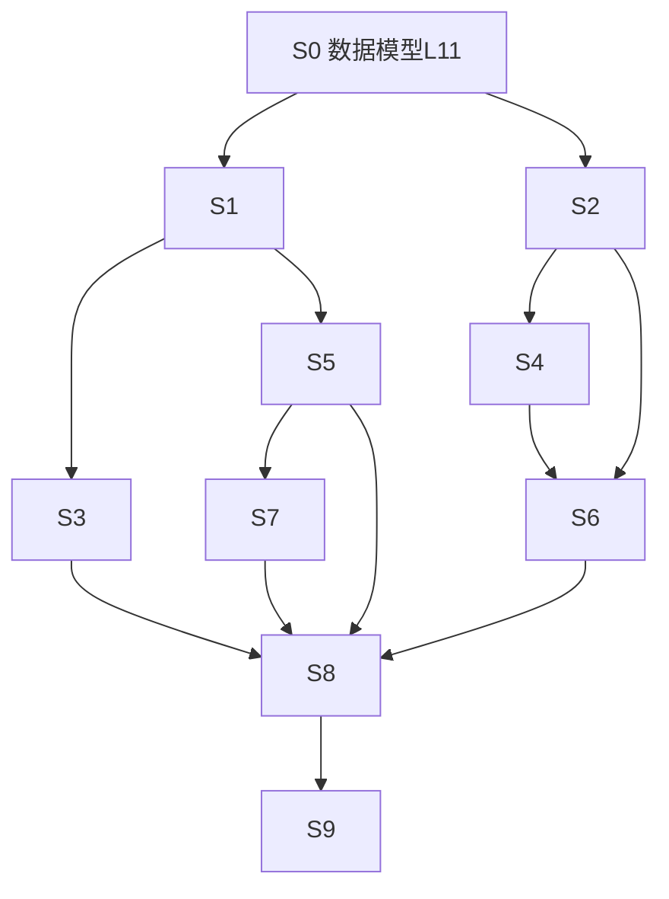

# P07_Skills与MCP

> Phase 2 产出。Phase 3 逐步勾选执行。只含伪代码，不含真代码。
> 覆盖 FR-025（Skills 生成器）、FR-026（MCP server 管理）、FR-010（MCP 图形化市场）、FR-011（多模态输入）。
> 依赖：P03 已交付（沙箱执行）、P04 已交付（工作流主链/任务输入）、P06 已交付。
> 完整 Step 动作/文件/依赖/验证见 [P07_Skills与MCP.计划详情.md](P07_Skills与MCP.计划详情.md)。
> 硬原则：未经许可不写代码；本 plan 过审后才进 Phase 3。

## 背景与目标

P07 是能力开放层：技能可积累、外部工具可插拔、输入方式更自然。

- **FR-025 / AC-028**：任务/对话上下文点「存成技能」→ 生成符合 Claude Skills 规范的 `SKILL.md`（YAML frontmatter + 正文流程）；注册后立即斜杠调用；支持导入导出。
- **FR-026 / AC-029**：已装 MCP server 的启停/状态/日志查看；进程异常退出时管理页标红并提供一键重启。
- **FR-010 / AC-012**：MCP 图形化市场：内置目录点选安装，下载/写配置/启动探测全程免改配置文件。
- **FR-011 / AC-013**：截图/线框图拖入作为任务输入；按住空格语音听写（转写文本进输入框，可见可编辑）。

范围外（记入漂移/后续）：FR-027（DevPilot 自身作为 MCP server 对外暴露，P1 归二期）；技能云端市场（FR-045 二期）。

## 技术实现坑点预判与规避措施

| 技术点 | 可能的坑 | 规避措施 | 验证方式 |
|---|---|---|---|
| MCP 子进程管理 | server 崩溃/僵尸进程拖死内核 | 每个独立 tokio 进程 + kill_on_drop + 退出回调标记异常（AC-029）；重启=杀旧起新 | kill 进程后 UI 标红，一键重启恢复 |
| MCP stdio JSON-RPC | 握手/超时各实现不一 | initialize 10s 超时；超时标 `error` 不阻塞其他 server | 假 server（sleep 不应答）不挂 UI |
| 市场安装来源 | 第三方 server 需 npx/uvx，用户环境缺失 | 安装前探测运行时（node/python），缺失给大白话安装指引；网络失败降级手动填 JSON | 无网络时仍可手动添加 |
| 语音听写 | Tauri WebView 无 Web Speech API；whisper.cpp 体积大 | MVP 走系统听写：Windows 用 OS 口述（`Win+H` 提示）或麦克风按键录音+本机转写二选一；运行时探测不可用则隐藏按钮、只留拖图 | 探测失败时输入框不崩、按钮隐藏 |
| 图片输入 | 大图内存/上下文爆 | 拖入即压缩到 ≤1MB JPEG 存附件目录；任务输入只带路径+摘要 | 拖 10MB 截图不卡 |
| 斜杠调用解析 | `/` 误触发（路径、除号） | 仅在输入为空或以 `/` 开头时弹技能列表；Enter 选中回填 | 输入 `/usr/path` 不弹窗 |
| 按住空格听写 | 打字也要按空格，会误触发录音 | 仅「输入框为空」时按住空格才触发听写；有文本时空格正常上屏 | 输入一半按空格不出录音态 |
| 技能 YAML 手改坏 | frontmatter 解析失败 | 解析失败标 `invalid` 状态 + 大白话错误，不删除文件 | 手改坏后列表仍可用 |

## 安全检查清单

- [ ] **鉴权/授权**：MCP server 安装/启停需用户显式点击确认；技能注册仅写 `~/.devpilot/skills/`（不写项目目录）。
- [ ] **输入校验**：技能名 `[a-z0-9-]` 限长；MCP 配置 JSON schema 校验（command/args/env 白名单字段）；图片仅 png/jpg/webp 且 ≤10MB 源文件。
- [ ] **数据加密**：MCP server 配置中的 env（可能含 key）入库前掩码展示、导出时明示含敏感项需确认。
- [ ] **命令执行**：MCP spawn 的 command/args 受 core-sandbox 目录白名单与危险命令清单约束（沿用 P03）。
- [ ] **审计日志**：技能创建/导入/调用、MCP 安装/启停/重启写审计记录 `{trace_id, source: "skills"|"mcp"}`。
- [ ] **错误处理**：MCP 崩溃/听写不可用返回大白话提示，不泄露进程 stderr 原文（日志页可见但截断限长）。
- [ ] **网络边界**：市场目录打包内置 + 在线刷新可关；安装下载走项目白名单域。

## 性能考虑与验证计划

- [ ] **查询效率**：`skills_local`、`mcp_servers` 查询走 `(project_id?/全局) + enabled` 索引；列表 IPC 一次取全量（量级 <100）。
- [ ] **并发处理**：MCP 多 server 并发启动；健康检查串行轮询（30s 间隔，不并发探测同一 server）。
- [ ] **资源使用**：附件图片压缩 ≤1MB 存 `~/.devpilot/projects/<id>/attachments/`；日志环形缓冲每 server ≤200 行。
- [ ] **性能验证**：Phase 4 验证 20 个技能列表瞬时；5 个 MCP server 同时启动 <5s；语音按键到转写 <3s（本机）。

## 运维考量清单

| 项 | 决策 | 说明 |
|---|---|---|
| 可观测性 | 做 | MCP 进程生命周期/技能调用写结构化日志（trace_id + 耗时）。 |
| 配置开关 | 做 | `mcp_market_online_refresh`、`voice_input_enabled`、`attachment_max_kb` 存 agent_configs。 |
| 可回滚 | 做 | 卸载 MCP=停进程+软删记录（config 留档）；技能删除移回收站目录 `.trash/`。 |
| 限流/熔断/降级 | 做 | MCP initialize 10s 超时；崩溃 server 5 分钟内重启超 3 次转手动；语音不可用自动隐藏。 |
| 运维入口 | 做 | 管理页：全部重启/全部停止；日志一键复制。 |
| 告警阈值 | 做 | server 异常退出即时标红（AC-029）。 |
| 容量预案 | 后续再说 | 技能/服务器数量 MVP 不设上限，超 100 提示整理。 |

## 依赖与并行化地图

| 批次 | Step | 目标 | 对应 FR | 状态 |
|---|---|---|---|---|
| B1 | S0 | 数据模型与迁移（L11） | FR-025/026/011 | - [ ] |
| B2 | S1 | core-skills 解析/注册/启停 | FR-025 | - [ ] |
| B2 | S2 | MCP 进程管理器 | FR-026 | - [ ] |
| B3 | S3 | 技能生成器 + 导入导出 | FR-025 | - [ ] |
| B3 | S4 | MCP 市场安装 | FR-010 | - [ ] |
| B4 | S5 | 斜杠调用与输入框集成 | FR-025 | - [ ] |
| B4 | S6 | MCP 管理页 UI | FR-026 | - [ ] |
| B5 | S7 | 多模态输入（拖图+语音） | FR-011 | - [ ] |
| B5 | S8 | 测试 | 全部 AC | - [ ] |
| B6 | S9 | 文档与索引 | 项目规范 | - [ ] |

同批 `[P]` 文件无交集：B2（core-skills vs core-mcp）、B3（core-skills 生成器 vs core-mcp 市场）、B4（S5 input 组件 vs S6 settings 组件）。S7 依赖 S5 产出的 TaskInputBox（同一文件），故串行排 B5。

## 功能联动点清单

| 触发动作 | 联动对象 | 预期变化 | 边界 |
|---|---|---|---|
| 点「存成技能」 | skills_local + skills 目录 | 新增技能；输入框 `/` 立即可调 | 同名冲突提示覆盖/改名，不静默覆盖 |
| 斜杠调用技能 | 任务输入 | 展开技能内容为任务 prompt 前缀 | 技能被禁用则列表不显示；Enter 不选则按普通文本 |
| 市场点「安装」 | mcp_servers + 进程 | 写配置→启动探测→状态 running | 探测失败标 error 不算装好；取消安装不留半截记录 |
| server 异常退出 | 管理页状态 | 标红 + 一键重启按钮亮起（AC-029） | 自动重启超 3 次/5min 转手动；重启中按钮禁用 |
| 拖入图片 | 任务输入框 | 缩略图 chip + 存附件 | 拖非图片拒绝；删除 chip 同时删文件 |
| 按住空格说话 | 输入框 | 松开插入转写文本（可编辑） | 转写中 Esc 取消；无麦克风权限提示大白话 |
| 禁用技能/server | 列表 + 输入框/运行时 | 禁用即时从候选与注入中消失 | 重新启用无需重启应用 |

## 实现步骤摘要

详细动作/文件/依赖/验证见 [P07_Skills与MCP.计划详情.md](P07_Skills与MCP.计划详情.md)。

- **S0 数据模型与迁移（L11）**：`skills_local`、`mcp_servers`、`input_attachments` 三表；注册 L11；回写 db_schema。
- **S1 core-skills 解析/注册**：SKILL.md（frontmatter+正文）解析校验、注册表 CRUD、启停、invalid 状态。
- **S2 MCP 进程管理器**：core-mcp 内 spawn/stdio JSON-RPC 握手、健康检查、退出回调、日志环形缓冲、重启。
- **S3 技能生成器**：从任务上下文生成 SKILL.md（模板渲染）+ 导入（选目录/文件）导出（复制出 zip）。
- **S4 MCP 市场安装**：内置目录 JSON + 在线刷新 + 运行时探测 + 安装写配置免手改（AC-012）。
- **S5 斜杠调用**：输入框 `/` 触发技能候选；选中展开注入任务输入（AC-028 后半）。
- **S6 MCP 管理页 UI**：设置内新页：列表/启停/状态/日志/一键重启/市场入口。
- **S7 多模态输入**：拖图/粘贴→压缩存附件→chip 展示；按住空格→录音→转写插入（AC-013）。
- **S8 测试**：解析/进程管理/市场安装/斜杠调用/附件单元与前端测试 + 人工测试方案（语音、真实 MCP server）。
- **S9 文档与索引**：Feature Map、User-Ops、README、db_schema、MVP 索引、file_structure。

## 整体验证（功能级）

- [ ] 所有 Rust/前端单测通过，用例名或注释带 AC 编号（AC-012/013/028/029）。
- [ ] `scripts/check_all` 全绿。
- [ ] 人工测试方案：真实 MCP server（如 filesystem server）安装启停重启；语音听写真机；拖图真窗口。
- [ ] 每个 FR-010/011/025/026 至少一个 Step 覆盖；每个 AC-012/013/028/029 有自动化或人工覆盖。
- [ ] 依赖与并行化地图与 Step 字段一致；同批 `[P]` 文件无交集。

## 术语表

| 术语 | 大白话 | 简单案例 |
|---|---|---|
| Skill（技能） | 把一套提示词+流程打包的可复用「招式」 | 「发版检查」一键调用 |
| SKILL.md | Claude Skills 规范的技能文件：开头一段 YAML 说明 + 正文流程 | `name: release-check` |
| frontmatter | 文件开头 `---` 包起来的元数据块 | `name/description/version` |
| MCP | AI 工具的通用插座协议，各家工具即插即用 | 装上「文件系统」工具 AI 能读写目录 |
| stdio JSON-RPC | 子进程用标准输入输出互发 JSON 消息的协议 | 内核发 `{"method":"initialize"}` |
| npx/uvx | 无需预装、临时拉起 Node/Python 包的命令 | `npx -y @modelcontextprotocol/server-filesystem` |
| 环形缓冲 | 只保留最近 N 条、旧的自动挤掉的日志容器 | 每 server 留 200 行 |
| 听写（dictation） | 语音转文字 | 按住空格说话变文字 |

## 备注

- FR-027（对外 MCP Server）与 FR-021/028（CLI/深链）共用委派内核，统一归二期（architecture §4.2），本 plan 不做，记入总索引说明。
- 语音转写 MVP 优先复用系统能力（Win: OS 听写/API；Mac: 键盘听写），不引入 whisper.cpp 大依赖；探测不可用则功能自动隐藏——与「降级不阻塞」原则一致。
- MCP 市场 MVP 目录为安装包内置 JSON（可在线刷新），不做云端市场服务（FR-045 二期）。
