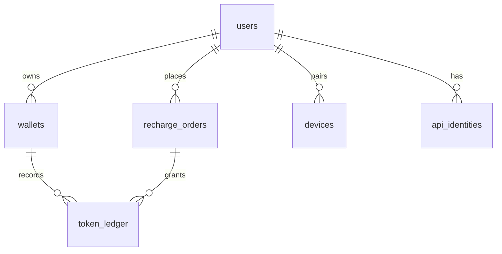
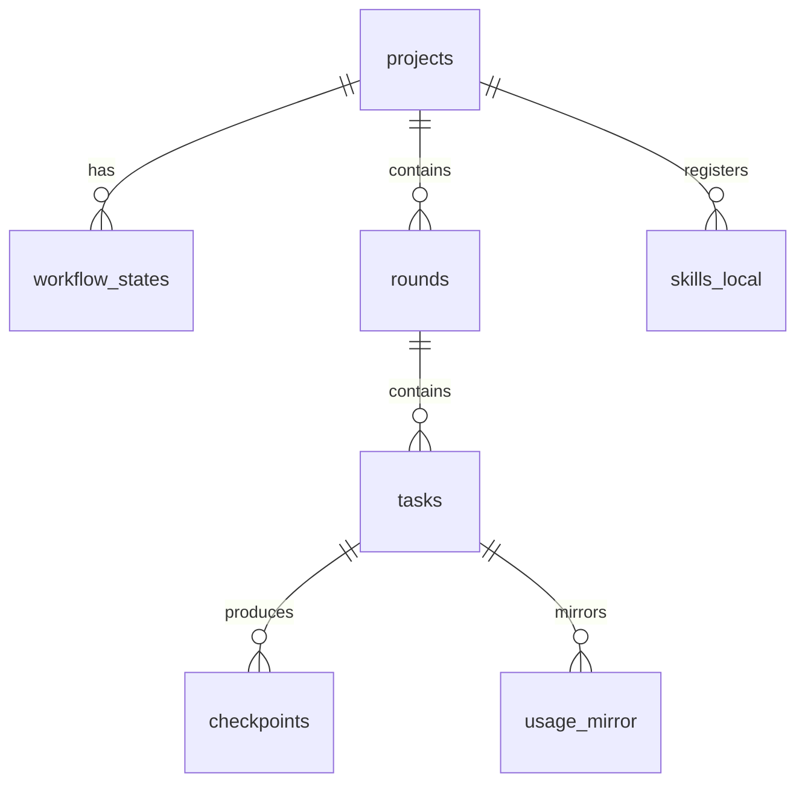

# DB Schema · DevPilot 全局数据库设计

> 上级：[PRD.md](PRD.md)。本文件是数据库的全局权威版；Feature Map 的建表注解是功能视角速查版。
> 两库分离：**云端 PostgreSQL**（账号/计费，Flyway 迁移）+ **本地 SQLite**（项目/状态机，sqlx 迁移）。本地库在用户机器上，schema 变更随客户端升级迁移。
> last_updated: 2026-08-20

## 1. 云端 PostgreSQL（计费与账号）

### 1.1 ER 图

### 1.2 数据字典

**users 用户表**
| 字段 | 类型 | 说明 |
|---|---|---|
| id | BIGINT IDENTITY PK | 用户 ID |
| phone | VARCHAR(20) UNIQUE NOT NULL | 手机号（主登录凭证） |
| password_hash | TEXT NULL | 密码哈希（BCrypt），验证码登录用户可空 |
| nickname | VARCHAR(50) | 昵称 |
| created_at / updated_at | TIMESTAMPTZ | 自动填充 |
| deleted | SMALLINT DEFAULT 0 | 逻辑删除 |

**wallets 钱包表**（一用户一钱包）
| 字段 | 类型 | 说明 |
|---|---|---|
| id | BIGINT IDENTITY PK | |
| user_id | BIGINT FK→users UNIQUE | |
| balance_cents | BIGINT DEFAULT 0 | 充值余额（分） |
| gift_cents | BIGINT DEFAULT 0 | 赠送余额（体验金，优先扣减） |
| version | INT DEFAULT 0 | 乐观锁版本号，防并发超扣 |

**token_ledger Token 账本**（只增不改，审计基座）
| 字段 | 类型 | 说明 |
|---|---|---|
| id | BIGINT IDENTITY PK | |
| user_id | BIGINT FK | |
| task_id | VARCHAR(64) NULL | 关联客户端任务（客户端上报，仅展示用） |
| kind | SMALLINT | 1=消费 2=充值到账 3=赠送 4=人工调整 |
| model | VARCHAR(50) | 消费时的模型名（充值为 NULL） |
| tokens_in / tokens_out | INT | 输入/输出 token 数 |
| amount_cents | BIGINT | 金额（分），消费为负 |
| idempotency_key | VARCHAR(64) UNIQUE | 幂等键（client_nonce），防重复入账 |
| created_at | TIMESTAMPTZ | |

**recharge_orders 充值订单**
| 字段 | 类型 | 说明 |
|---|---|---|
| id | BIGINT IDENTITY PK | |
| user_id | BIGINT FK | |
| pack_code | VARCHAR(20) | 套餐：P50/P200/P500 |
| amount_cents | BIGINT | 应付金额 |
| bonus_cents | BIGINT DEFAULT 0 | 加赠额度 |
| channel | VARCHAR(10) | wechat / alipay / stripe |
| status | SMALLINT | 0=待支付 1=已支付 2=已关闭 3=已退款 |
| trade_no | VARCHAR(64) | 第三方流水号 |
| created_at / paid_at | TIMESTAMPTZ | |

**devices 配对设备**（二期移动端）
| 字段 | 类型 | 说明 |
|---|---|---|
| id | BIGINT IDENTITY PK | |
| user_id | BIGINT FK | |
| device_name / platform | VARCHAR | 设备名 / ios、android |
| device_token | VARCHAR(128) UNIQUE | 推送与鉴权凭证 |
| paired_at | TIMESTAMPTZ | |

**api_identities 上游模型凭证**（服务端持有，一行一供应商；字段：id / provider / api_key_encrypted（AES-GCM 加密落盘）/ priority / status）

### 1.3 Flyway 版本清单
| 版本 | 内容 |
|---|---|
| V1__init.sql | users / wallets / token_ledger / recharge_orders |
| V2__devices.sql | devices（二期） |
| V3__api_identities.sql | api_identities |

## 2. 本地 SQLite（客户端内核，`~/.devpilot/devpilot.db`）

| 表 | 关键字段 | 职责 |
|---|---|---|
| projects | id, name, path UNIQUE, scale(L0~L3), workflow_version, current_phase | 项目档案（FR-042/046） |
| workflow_states | project_id, phase, gate_status JSON, updated_at | 状态机当前态（FR-029/048） |
| rounds | id, project_id, seq, title, status, snapshot_tag | 迭代轮次（FR-047） |
| tasks | id, round_id, chunk_no, title, status, source(local/cli/mcp/deeplink), tokens_est, tokens_actual | 任务/chunk（FR-021/027/028/041） |
| checkpoints | id, task_id, git_commit, snapshot_path, summary_plain, created_at | 存档点（FR-037） |
| artifacts | id, project_id, type(prd/plan/progress/userops...), path, version | 产物索引（FR-030~035） |
| transition_history | id, project_id, from_phase, to_phase, gate, actor, created_at | 状态机转移历史，只增，可回放排查（FR-029 运维项） |
| usage_mirror | id, user_id, kind(1扣费/2充值/3退款/4调整), model, amount_cents, idempotency_key UNIQUE, synced_at | Token 消耗本地镜像，幂等键防重放；与云端 token_ledger 对账（FR-041，P02 Step8 实建） |
| pending_approvals | id, project_id, task_id, kind, title, detail, risk_level, decision, resolved_at | 两档审批待决记录（FR-009，P03 Step3） |
| env_profiles | path_hash UNIQUE, lockfile_hash, profile_json, updated_at | 项目技术栈画像缓存，命中则跳过文件系统探测（FR-005，P03 Step4） |
| secrets | id, project_id, name, encrypted_value | 项目级 Secrets；名称落库，值优先 OS keyring，失败回退 AES-256-GCM（FR-012，P03 Step7） |
| skills_local | id, name, yaml_path, enabled | 技能注册表（FR-025） |
| mcp_servers | id, name, config JSON, status | MCP server 管理（FR-026） |
| agent_configs | id, project_id UNIQUE, fields_json | 项目约定大白话字段；AGENTS.md 的渲染源（FR-008，P04 S0） |
| spec_cards | id, project_id, title, detail, ac_json, status, sort_order | 需求确认卡片；status ∈ pending/confirmed/skipped（FR-031，P04 S0） |
| plan_chunks | id, project_id, title, goal, estimated_tokens, dependencies_json, status, sort_order | 施工计划 chunk；status ∈ draft/approved/running/done（FR-032，P04 S0） |

### 本地迁移版本清单
| 版本 | 内容 |
|---|---|
| L1__init.sql | projects / workflow_states / rounds / tasks / checkpoints / artifacts |
| L2__transition_history.sql | transition_history（P01 Step 6 插入） |
| L3__usage_mirror.sql | usage_mirror（P02 Step8 实建） |
| L4__pending_approvals.sql | pending_approvals（P03 Step3 FR-009） |
| L5__env_profiles.sql | env_profiles（P03 Step4 FR-005） |
| L6__secrets.sql | secrets（P03 Step7 FR-012） |
| L7__workflow_artifacts.sql | agent_configs / spec_cards / plan_chunks（P04 S0 FR-008/031/032） |

## 3. 设计说明

- **账本只增不改**：所有余额变动走 token_ledger 追加，wallets 余额是账本推导的缓存（可对账重建）。
- **双库对账**：usage_mirror 定时与云端 token_ledger 核对，差错位告警（配合 ADR-003 防篡改）。
- **用户项目代码不存云端**：云端只有账号与钱，项目数据全在用户本机（隐私卖点 + 合规避险）。

## 4. 术语表

| 术语 | 大白话 | 简单案例 |
|---|---|---|
| 乐观锁 | 改数据时带版本号，对不上就拒绝，防并发扣错钱 | 两个任务同时扣余额不打架 |
| 幂等键 | 每笔账的唯一编号，重复提交只记一次 | 网络重试不重复扣费 |
| 逻辑删除 | 不真删数据，打个删除标记 | 注销账号可恢复 |
| 对账 | 两边账本互相核对找差错 | 本地显示 vs 云端实扣 |
