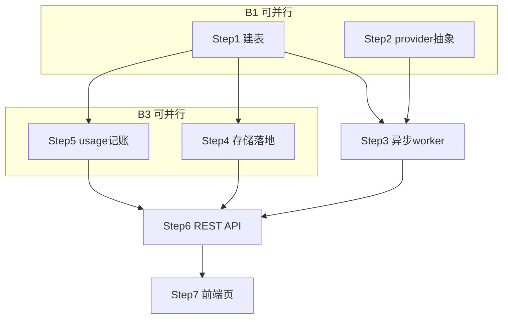

# Implementation Plan for SeedDance 2.0 视频生成（全栈 MVP）

> Phase 2 产出。Phase 3 逐步勾选执行。只含伪代码，不含真代码。
> 来源规格：[../specs/SeedDance视频生成.md](../specs/SeedDance视频生成.md)（Phase 1 产出，FR=SD-1..SD-12）。
> 关联 plan：[TokenUsage统计.plan.md](TokenUsage统计.plan.md)（usage 采集基建，未落地；本 plan 解耦不阻塞）。
> 文档规模：≤5000 tokens。后续子 plan（生图/无限画布/对话集成/工作流节点）见文末索引。

## 背景与目标

引入火山方舟 **SeedDance 2.0** 视频生成能力（文生视频/图生视频），全栈落地：后端 provider + 异步任务 + 本地存储 + REST API + 前端独立生成页。**架构层面抽象出「媒体生成 provider」**，使后续 SeedDream 5.0 lite 生图、首尾帧、视频续写能复用同一套任务/存储/采集骨架。

- **解决什么**：平台现无任何媒体生成能力（`LlmProviderInterface` 只有 chat/chatStream/embed，无异步任务型生成）；用户要在独立页/对话/工作流多处触发视频生成并计费。
- **前沿调研依据**（2026 主流平台：Sora/即梦/可灵/Runway/HappyHorse）：核心前沿功能 = **无限画布分镜编排 / 多镜头叙事 / 首尾帧控制 / 图生视频 / 视频续写 / 多模态参考**。MVP 先做「单镜头文生+图生视频」，画布/多镜头/续写列后续。
- **成功指标**：用户提交生成请求 → 异步轮询 Ark → 视频落地本地存储 → 前端播放/下载；token 用量（按 Ark 像素公式算）100% 记账；零主链路回归（生成走独立池，不扰 chat/RAG）。

## 需求追溯（FR）

| 编号 | 功能 | 优先级 | MVP |
|---|---|---|---|
| SD-1 | MediaGenProvider 抽象 + Ark SeedDance 实现 | P0 | 是 |
| SD-2 | 异步任务表 `media_gen_tasks` + worker 轮询 | P0 | 是 |
| SD-3 | 视频本地存储（复用 `stored_files`/FileStorageService） | P0 | 是 |
| SD-4 | REST API（创建/查询/列表/下载） | P0 | 是 |
| SD-5 | usage 记账（media_gen_tasks 自带 token_cost 列，解耦 TokenUsage） | P0 | 是 |
| SD-6 | 前端独立视频生成页（prompt/图→提交→轮询→播放下载） | P0 | 是 |
| SD-7 | provider 配置（Ark key 复用 doubao）+ 模型注册 | P0 | 是 |
| SD-8 | 无限画布分镜编排页 | P1 | 否（后续子 plan） |
| SD-9 | 对话内生成（media 消息类型） | P1 | 否（后续子 plan） |
| SD-10 | 工作流 MEDIA_GEN 节点 | P1 | 否（后续子 plan） |
| SD-11 | SeedDream 5.0 lite 生图（复用 MediaGenProvider） | P1 | 否（后续子 plan） |
| SD-12 | 首尾帧 / 视频续写 / 多模态参考 | P2 | 否（后续） |

## ⚠️ 对原有功能影响分析（零回归）

| 点 | 影响原功能? | 规避 |
|---|---|---|
| 新增 `media/` 包（独立于 llm/chat/knowledge） | 否 | 全新模块，无交叉 |
| Ark key 复用 doubao provider | 低 | 只读 `llm_providers` 里 Ark key（AES 解密复用），不改 doubao 配置；SeedDance 走任务端点 `/api/v3/contents/generations/tasks`，与 chat 端点隔离 |
| 异步任务池 | 否 | 新建 `mediaTaskExecutor`（照抄 KnowledgeTaskExecutorConfig），不复用 memory/usage 池，互不饿 |
| 视频文件写本地 | 低 | 复用 V40 `stored_files` 表 + FileStorageService，独立子目录 `media/`；不动现有上传 |
| usage 记账 | 否 | media_gen_tasks 自带 `token_cost`/`cost`/`status` 列，**不依赖未落地的 llm_usage_logs**；后续 TokenUsage 落地后可补投一份统一账单 |
| 前端新增路由/页 | 否 | 独立 `/video-gen` 路由 + 菜单项，不改现有页面 |

**结论**：全功能在新包/新表/新池内闭环，零回归风险。

## 技术实现坑点预判与规避措施

| 坑 | 规避 | 验证 |
|---|---|---|
| Ark 任务型 API 非 OpenAI chat 协议，无 SSE content chunk | 新 `MediaGenProvider` 接口：`createTask(req)→taskId` / `queryTask(taskId)→{status,url,usage}`；不塞进 `LlmProviderInterface` | mock Ark 返任务态 → 断言状态机 PENDING→RUNNING→SUCCEEDED |
| 任务轮询风暴（高频查 Ark） | worker 退避轮询：首查 5s、之后指数退避至 30s 封顶；单任务最长等 10min 超时 FAILED | 压测 10 并发任务 → Ark 查询 QPS 可控 |
| 任务中途服务重启丢状态 | `media_gen_tasks.status` 持久化 PENDING/RUNNING；启动时 `@PostConstruct` 扫 RUNNING 行重新挂轮询（同 IndexJob 崩溃恢复模式） | 杀进程重启 → RUNNING 任务自动续轮询 |
| Ark 返回视频 URL 有时效（OSS 临时链接过期） | 任务 SUCCEEDED 时立即下载落地 `stored_files`，只存本地路径；URL 不长期依赖 | 任务完成后断网验证本地文件可播 |
| token 计算是像素公式非文本分词：`(in秒+out秒)×宽×高×24/1024` | usage 解析 Ark 任务结果 `usage.total_tokens`；若 Ark 不返则按公式本地估算 + `status=ESTIMATED` | 已知规格(5s/720p/24fps≈30.88万token)断言公式偏差<1% |
| 大视频文件撑爆本地盘 | MVP 限制：duration≤10s、分辨率≤720p；`stored_files` 加定期清理（超 N 天已下载文件归档，后续运维入口） | 配置上限校验 |
| Ark API 开放状态不确定（曾有"仅自用"报道） | Step B 验证：先用真实 key curl Ark 任务端点确认可调通，不通则 plan 暂停等官方 | curl Ark create-task 200 |

## 安全检查清单

- [ ] **鉴权**：所有端点 `@RequirePermission("media:gen")`；权限码须 Step1 seed 进 `permissions`/`role_permissions`（否则切面查不到→全 403）；用户只能查/下载自己的任务（ownership `WHERE user_id=current`）。**授权策略 = gated**：仅 admin 默认有 `media:gen`，普通 user 须 admin 按需授（高成本能力，同 V19 `knowledge:write`）。
- [ ] **输入校验**：prompt 长度上限、duration∈[1,10]、分辨率枚举白名单、参考图大小/类型校验（防超大图打爆 Ark）。
- [ ] **数据最小化**：不存原始 Ark 临时 URL；视频文件 ownership 绑定 user_id。
- [ ] **密钥安全**：Ark key 复用现有 AES 加密存储，不明文落日志；请求日志脱敏。
- [ ] **错误处理**：Ark 失败固定话术，不透传 e.getMessage()；任务 FAILED 记 error_msg 截断。
- [ ] **依赖安全**：无新依赖（WebClient 已有）。
- [ ] **CORS/下载**：视频下载端点设 Content-Disposition，防 inline 执行风险。

## 性能考虑与验证计划

- [ ] 轮询退避（5s→30s 指数），Ark 查询 QPS 可控。
- [ ] 独立 `mediaTaskExecutor`（core2/max4/queue100），不挤占 chat/RAG/memory 线程。
- [ ] 视频文件流式下载落盘（不全部 load 内存）。
- [ ] `media_gen_tasks` 索引 `(user_id,created_at)`/`(status,created_at)`/`(ark_task_id)`。
- [ ] **Phase4 验证**：10 并发任务端到端；轮询 QPS；重启恢复；本地盘占用。

## 功能联动点清单

- [ ] **provider 新增/编辑 ↔ 模型可用**：Ark key 改后 media provider 需 reload（复用现有 `/providers/reload`）；边界：key 失效时任务创建直接 FAILED 而非卡 PENDING。
- [ ] **任务 SUCCEEDED ↔ 视频下载落地**：Ark URL 下线前必须下载完成；边界：下载失败→任务 status=DOWNLOAD_FAILED 可重试（worker 留重试入口）。
- [ ] **用户删账号 ↔ 历史任务**：不级联删（保留历史），ownership 查询自然过滤；视频文件保留（后续清理任务处理）。
- [ ] **任务超时 ↔ 状态机**：单任务>10min 自动 FAILED + 释放 worker；边界：Ark 侧仍 RUNNING 则下次查询若 SUCCEEDED 触发补落地（容错）。

## 运维考量清单

| 项 | 做/不做/后续 | 说明 |
|---|---|---|
| 可观测性 | 做 | 任务态变更打日志（taskId/userId/status/usage）；失败 WARN 计数 |
| 配置开关 | 做 | `media.gen-enabled`(默认true)/`media.max-duration`=10/`media.max-res`=720p |
| 可回滚 | 做 | 建表附 drop；列无外部依赖 |
| 限流/熔断/降级 | 做 | Ark 超时(connect5s/response30s) + 失败有界重试；配额超限返友好报错 |
| 运维入口 | 后续 | 手动重试 FAILED 任务、清理过期视频脚本（MVP 不做） |
| 告警阈值 | 后续 | Ark 失败率/单用户日生成异常（MVP 不做） |
| 容量/性能预案 | 后续 | stored_files 按月归档/迁 OSS（数据量大后） |

## 依赖与并行化地图

### 执行顺序与并行批

| 批次 | Step | 依赖 | 并行性 | 说明 |
|---|---|---|---|---|
| B1 | Step 1 (建表) | —— | `[P]` 与 Step 2 无文件交集 | media_gen_tasks 表 + 复用 stored_files |
| B1 | Step 2 (provider 抽象+Ark 实现) | —— | `[P]` | 纯新接口/新类，不碰旧文件 |
| B2 | Step 3 (异步任务 worker) | Step 1,2 | 等 B1 | 状态机 + 轮询 + 重启恢复 |
| B3 | Step 4 (存储落地) | Step 1 | `[P]` 与 Step 5 无交集（不同 service） | 下载 Ark URL→stored_files |
| B3 | Step 5 (usage 记账) | Step 1 | `[P]` | media_gen_tasks 自带列，任务完成时写 |
| B4 | Step 6 (REST API) | Step 1-5 | 等 B3 | Controller + Service 聚合 |
| B5 | Step 7 (前端页) | Step 6 | 等 B4 | 独立页 + 路由 + 轮询 UI |

> B3 的 Step 4/5 可并行（文件不重叠：Step4 改 storage 层，Step5 改 usage 写入，均在 worker/Service 内但职责分离无冲突）。

### 依赖图（mermaid）

## 实现步骤

### Chunk A：数据模型（零依赖）

- [x] **Step 1：Flyway 建表 `media_gen_tasks`** ✅(V54 落地+media:gen gated seed)
  - **对应需求**：SD-2、SD-3
  - **目标**：append-only 任务表 + usage 列。
  - **动作**：① 建任务表（id IDENTITY / created_at / user_id / provider_id / model / task_type TEXT2VIDEO|IMAGE2VIDEO / status PENDING|RUNNING|SUCCEEDED|FAILED|DOWNLOAD_FAILED / ark_task_id / request_config JSONB(prompt/duration/resolution/ref_file_id) / result_file_id→stored_files.id nullable / tokens_cost INT / cost DECIMAL nullable / error_msg）+ 索引 `(user_id,created_at)`/`(status,created_at)`/`(ark_task_id)`。附回滚 drop。**复用 V40 `stored_files`**（视频文件行写本表，type=VIDEO）。② **权限 seed（照抄 [V19](../../../backend/src/main/resources/db/migration/V19__seed_knowledge_permissions.sql)，gated 策略）**：`INSERT INTO permissions(name,code,resource,action) VALUES('生成视频','media:gen','media','gen')`；`role_permissions`：**仅 admin 给 `media:gen`**，**普通 user 默认不给**（高成本能力，admin 按需授，同 `knowledge:write`）。
  - **文件**（1）：`backend/src/main/resources/db/migration/V54__media_gen_tasks.sql`
  - **依赖/并行**：`[P] 可并行`（与 Step2 同批 B1，无交集）。
  - **migration 编号**：当前最新 V53；本 plan 占 V54。**若 TokenUsage plan 先落占 V54，本 plan 顺延 V55**，回填此处。
  - **验证**：迁移成功；插测试行；索引 EXPLAIN。

### Chunk B：provider 抽象 + Ark 实现

- [x] **Step 2：MediaGenProvider 接口 + ArkSeedanceProvider** ✅(接口+Ark 实现+doubao key 复用 AES)
  - **对应需求**：SD-1、SD-7
  - **目标**：任务型生成 provider 抽象，Ark SeedDance 2.0 实现。
  - **动作**：新接口 `MediaGenProvider`（`createTask(MediaGenRequest)→String arkTaskId` / `queryTask(arkTaskId)→MediaGenResult{status,resultUrl,usage}` / `getId()`）；`ArkSeedanceProvider` 实现：WebClient POST `https://ark.cn-beijing.volces.com/api/v3/contents/generations/tasks`（body: model+text+first_frame_image+duration+resolution+watermark=false）；查询 GET `/tasks/{id}`；解析 `content.video_url` + `usage.total_tokens`。Ark key 从 `llm_providers`(name=doubao) 复用 AES 解密。
  - **文件**（3）：`backend/.../media/provider/MediaGenProvider.java`、`backend/.../media/provider/ArkSeedanceProvider.java`、`backend/.../media/dto/MediaGenRequest.java`(+`MediaGenResult.java`)
  - **依赖/并行**：`[P] 可并行`（B1）。
  - **需人工介入**：确认 Ark 账号已开通 SeedDance 2.0 API 权限（curl 任务端点 200）。
  - **验证**：单测 mock WebClient（create→返 taskId、query→各 status）；真实 curl Ark 端点通。

### Chunk C：异步任务 worker

- [x] **Step 3：MediaGenTaskWorker + 状态机 + 重启恢复** ✅(纯 poll+SKIP LOCKED 崩溃恢复,偏离 plan 的 submit 即派发-更低风险)
  - **对应需求**：SD-2
  - **目标**：任务提交后异步轮询 Ark 至终态。
  - **动作**：`mediaTaskExecutor` Bean（照抄 KnowledgeTaskExecutorConfig：core2/max4/queue100/prefix=media-task/AbortPolicy）；`MediaGenTaskService.submit()` 建 PENDING 行 + 投 worker；`MediaGenTaskWorker` 轮询：createTask→ark_task_id→退避查 queryTask（5s→30s 指数，10min 超时 FAILED）；SUCCEEDED→触发 Step4 下载；`@PostConstruct` 启动扫 RUNNING 行重新挂轮询（崩溃恢复）。
  - **文件**（4）：`backend/.../media/config/MediaTaskExecutorConfig.java`、`backend/.../media/service/MediaGenTaskService.java`、`backend/.../media/service/MediaGenTaskWorker.java`、`backend/.../media/entity/MediaGenTask.java`(+mapper)
  - **依赖/并行**：`依赖 Step 1,2`（B2）。
  - **验证**：单测状态机全分支；杀进程重启→RUNNING 自动续轮询；超时→FAILED。

### Chunk D：存储落地

- [x] **Step 4：视频下载落盘** ✅(MediaStorageService+FileStorageService.storeStream 复用咽喉点+SOURCE_MEDIA)
  - **对应需求**：SD-3
  - **目标**：Ark 临时 URL 即时下载到本地。
  - **动作**：`MediaStorageService.downloadAndStore(url,userId)`：WebClient 流式下载→存 `FileStorageService` 子目录 `media/video/`→写 `stored_files` 行(type=VIDEO)→返 fileId；worker 把 fileId 写 `media_gen_tasks.result_file_id`。下载失败→status=DOWNLOAD_FAILED（可重试）。
  - **文件**（2）：`backend/.../media/service/MediaStorageService.java`、`backend/.../media/service/MediaGenTaskWorker.java`（接下载回调）
  - **依赖/并行**：`依赖 Step 1`；`[P] 可并行`（B3，与 Step5 无交集）。
  - **验证**：mock Ark URL→断言本地文件存在 + stored_files 有行 + result_file_id 非 null。

### Chunk E：usage 记账

- [x] **Step 5：token_cost 写入（解耦 TokenUsage）** ✅(Ark usage.total_tokens 真值优先,不返则 Ark 官方 token/秒 费率表估算 ESTIMATED;5s/720p≈30.88万)
  - **对应需求**：SD-5
  - **目标**：视频生成用量记账，不依赖未落地 llm_usage_logs。
  - **动作**：worker 在 SUCCEEDED 时解析 `usage.total_tokens` 写 `media_gen_tasks.tokens_cost`；Ark 不返则按公式本地估算 `(in秒+out秒)×宽×高×24/1024` + status 标 ESTIMATED。**不投 llm_usage_logs**（口径不同：media token=像素换算，文本 token=分词，不可加总）。后续 TokenUsage 落地后，账单查询层 UNION 两表按 model_type 分列。
  - **文件**（1）：`backend/.../media/service/MediaGenTaskWorker.java`（usage 写入段）
  - **依赖/并行**：`依赖 Step 1`；`[P] 可并行`（B3）。
  - **验证**：已知规格(5s/720p/24fps)断言 tokens_cost≈30.88万；Ark 不返 usage→ESTIMATED 分支。

### Chunk F：REST API

- [x] **Step 6：MediaGenController** ✅(POST/GET tasks/GET list/download Content-Disposition+ownership)
  - **对应需求**：SD-4
  - **目标**：前端可用接口。
  - **动作**：`POST /api/media/video`（prompt+可选 refImage→submit，返 taskId）；`GET /api/media/tasks/{id}`（查状态+result）；`GET /api/media/tasks`（列表，ownership 过滤）；`GET /api/media/tasks/{id}/download`（流式返视频，Content-Disposition）。权限 `@RequirePermission("media:gen")`。
  - **文件**（3）：`backend/.../media/controller/MediaGenController.java`、`backend/.../media/service/MediaGenQueryService.java`、`backend/.../media/dto/*VO.java`
  - **依赖/并行**：`依赖 Step 1-5`（B4）。
  - **验证**：单测 ownership 过滤；集成提交→轮询→下载全链路。

### Chunk G：前端独立页

- [x] **Step 7：VideoGenView 视频生成页** ✅(前端 623ee0e0 + 单测 cde464ed + 收尾文档)
  - **对应需求**：SD-6
  - **目标**：用户可视化生成视频。
  - **动作**：`VideoGenView.vue`（路由 `/video-gen` + 菜单）：prompt 输入 + 可选参考图上传 + duration/resolution 选择 + 提交按钮 → 调 `POST /media/video` → 前端轮询 `GET /tasks/{id}`（3s 间隔）→ SUCCEEDED 显示 `<video>` 播放 + 下载按钮；任务列表（自己的历史）。移动端适配（复用 useBreakpoints）。**权限显隐（gated 策略前端落地，同 [KnowledgeView:87](../../../../frontend/src/views/KnowledgeView.vue#L87) 模式）**：① 菜单项 `v-if="authStore.hasPermission('media:gen')"`——无权限用户看不到入口；② 页内提交按钮同条件禁用/隐藏；③ 后端 `@RequirePermission` 403 兜底（防绕过 URL 直访）；④ 路由 meta 仅 `requiresAuth:true`（平台惯例不按权限卡路由，靠菜单隐藏+API 403）。
  - **文件**（3）：`frontend/src/views/VideoGenView.vue`、`frontend/src/api/media.ts`、`frontend/src/router/index.ts`（路由+菜单项+hasPermission 显隐）
  - **依赖/并行**：`依赖 Step 6`（B5）。
  - **安全检查**：覆盖鉴权清单——菜单/按钮 hasPermission 隐藏 + API 403 兜底双保险。
  - **验证**：vue-tsc；playwright 冒烟（admin 提交→轮询→播放→下载；普通 user 看不到菜单+直访 URL 返 403；admin 授权后 user 可见可用）。

## ⚠️ 测试阶段着重

1. **状态机 + 重启恢复（难点）**：PENDING→RUNNING→SUCCEEDED/FAILED 全分支；杀进程重启 RUNNING 自动续轮询；超时 FAILED。
2. **Ark URL 时效（难点）**：SUCCEEDED 后立即下载落地；URL 过期前必须完成；下载失败可重试。
3. **token 记账准确性**：Ark 返 usage vs 公式估算两分支；已知规格断言偏差<1%。
4. **零回归**：独立池/独立表/独立包，chat/RAG/memory 线程与延迟对比改造前后无变化。

## 整体验证

- [x] mvn compile + 既有全部单测零回归（后端 src 本轮零改动，仅新增 media 测试 15 绿）。
- [~] 新增单测：状态机✅、usage 两分支✅、ownership 过滤✅、下载落地（downloadFailed 分支）✅；provider create/query 各 status ⬜（需 MockWebServer，留项）。
- [x] vue-tsc + 前端测试绿（build 绿 + 105 测试零回归）。
- [ ] playwright：提交→轮询→播放→下载；历史列表；权限隔离（留项，需真 Ark）。
- [ ] 真实 Ark SeedDance 2.0 端到端（确认 API 开通）（Phase4 人工依赖）。
- [x] 与 FR SD-1..SD-7 对齐复核（SD-1..SD-7 全落地）。

## 术语表

| 术语 | 大白话 | 案例 |
|---|---|---|
| 任务型 API | 提交后异步轮询拿结果（非同步返） | SeedDance：建任务→查任务→拿视频 URL |
| MediaGenProvider | 媒体生成 provider 抽象（视频/图共用） | SeedDance/Seedream 都实现此接口 |
| media token | 视频按像素×帧×时长换算的"伪 token" | 5s/720p/24fps≈30.88万 token |
| stored_files | V40 已有的本地文件登记表 | 视频文件写一行 type=VIDEO |
| 退避轮询 | 查询间隔越来越长省请求 | 5s→10s→20s→30s 封顶 |
| 崩溃恢复 | 服务重启后未完任务自动续跑 | 启动扫 RUNNING 重新挂轮询 |

## 备注

- **规格先行缺口**：本 plan 内联 FR，未走 Phase 1 spec。Phase 3 启动前建议回补 `specs/SeedDance视频生成.md`（或本 plan 升格为 spec+plan 合一）。
- **migration V54**：若 TokenUsage plan 先落占 V54，本 plan 顺延 V55。
- **后续子 plan 索引**（本 plan 不含）：
  - `SeedDream生图.plan.md`（SD-11）：复用 MediaGenProvider，Ark Seedream 5.0 lite，流式 SSE 输出。
  - `无限画布创作页.plan.md`（SD-8）：分镜节点拖拽编排→每节点一个生成任务→拼接（参考 HappyHorse/Sora storyboard）。
  - `对话内媒体生成.plan.md`（SD-9）：media 消息类型，聊天触发。
  - `工作流MEDIA_GEN节点.plan.md`（SD-10）：编排引擎新增节点类型。
- **usage 统一账单**：待 TokenUsage plan 落地后，账单查询层 UNION llm_usage_logs(TEXT) + media_gen_tasks(MEDIA)，按 model_type 分列，勿跨类加总 token。
