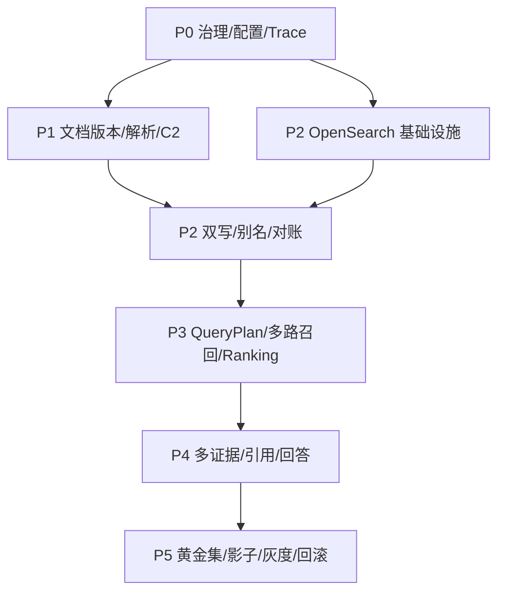

# 企业级精准知识库 RAG 实施计划（总路由）

> Phase 2 产物；Phase 3 按子计划逐 Chunk 执行。只含伪代码，不含真实实现。
> 规格基线：[企业级精准知识库RAG-总览.md](../specs/企业级精准知识库RAG-总览.md)及其 4 份子规格。
> 未经用户明确批准，不进入 Phase 3，不修改业务代码。

## 目标与实施原则

在保留现有 PostgreSQL/pgvector RAG 可用性的前提下，增量建设 PostgreSQL 权威主数据、OpenSearch 专业检索、可插拔 Ranking Engine（重排引擎——统一封装 LLM/专用模型/关闭三种模式）、多证据回答、全链路 Trace 和持续评测。采用双轨迁移，不直接删除旧 L0/L1/L2、旧向量表或旧接口。

## 现状基线

- `RagRetrievalService` 同时承担过滤、召回、排序、上下文、回答和日志，需逐步收敛为编排器。
- C2/L2 原文未建立 Dense 向量；`rerankWithBoost()` 是启发式加权；拒答仍依赖固定阈值。
- `knowledge_bases.rerank_model` 是文本输入，尚未驱动真实重排；运行时不得硬编码模型。
- `RagAnswerCacheMapper.searchCandidates()` 未按 embedding 模型隔离。
- 尚未引入 OpenSearch Java 客户端，因此必须先完成依赖、配置、健康检查和测试容器基座。
- 当前 Flyway 最高版本为 V100；Phase 3 开始前重新扫描版本号，以下 V101+ 如冲突则整体顺延，禁止修改已执行迁移。

## 子计划路由

| 波次 | 子计划 | 主要需求 | 可交付增量 |
|---|---|---|---|
| P0 | [治理、配置与可观测性](企业级精准知识库RAG_P0治理配置与可观测性.plan.md) | RAG-FR-04/08/09 | Pipeline/Ranking 配置、Trace、缓存隔离基座 |
| P1 | [文档版本、解析与分块](企业级精准知识库RAG_P1文档版本解析与分块.plan.md) | RAG-FR-01/02/06 | Canonical Document、版本治理、C2 结构化 Chunk |
| P2 | [OpenSearch 双写与索引治理](企业级精准知识库RAG_P2OpenSearch双写与索引治理.plan.md) | RAG-FR-02/03/09 | Dense/Sparse 双索引、别名、对账、删除传播 |
| P3 | [QueryPlan、召回与重排](企业级精准知识库RAG_P3检索与重排.plan.md) | RAG-FR-03/04/05/08 | 多通道召回、RRF、LLM 重排、Rerank 预留口 |
| P4 | [多证据、引用与回答](企业级精准知识库RAG_P4多证据引用与回答.plan.md) | RAG-FR-05/06/08 | 5～10+ 证据覆盖、补检索、引用校验、拒答 |
| P5 | [评测、迁移与运维验收](企业级精准知识库RAG_P5评测迁移与运维.plan.md) | RAG-FR-07/08/09 | 黄金集、影子检索、灰度、发布门禁、回滚 |

## 依赖与并行化地图

### 执行批次

| 批次 | Step | 依赖 | 并行性 |
|---|---|---|---|
| B1 | P0 | 无 | 串行基座；先统一配置、Trace 和缓存版本语义 |
| B2 | P1 | P0 | `[P]` 可与 P2 的 OpenSearch 基础设施准备并行，但不得同时修改索引任务类 |
| B2 | P2-基础设施 | P0 | `[P]` 仅限客户端、配置、健康检查和测试容器 |
| B3 | P2-双写 | P1、P2-基础设施 | 串行汇合 |
| B4 | P3 | P2 | 串行；新检索依赖可用索引 |
| B5 | P4 | P3 | 串行；覆盖选择依赖统一候选和重排输出 |
| B6 | P5 | P4 | 串行；评测、影子和灰度覆盖完整新链路 |

## 全链路追溯矩阵

| 需求 | 计划覆盖 |
|---|---|
| RAG-FR-01 | P1 Step 1～2，P5 Step 4 |
| RAG-FR-02 | P1 Step 3～5，P2 Step 2～3 |
| RAG-FR-03 | P2 Step 3，P3 Step 1～3 |
| RAG-FR-04 | P0 Step 2，P3 Step 4～5 |
| RAG-FR-05 | P3 Step 1，P4 Step 1～3 |
| RAG-FR-06 | P1 Step 3～4，P4 Step 4 |
| RAG-FR-07 | P5 Step 1～3 |
| RAG-FR-08 | P0 Step 3～4，P3 Step 5，P4 Step 5，P5 Step 5 |
| RAG-FR-09 | P0 Step 5，P2 Step 4～5，P5 Step 2～4 |

## 总体安全与性能闸门

- [ ] OpenSearch 查询在召回前带 tenant/KB/ACL/版本过滤；PG 在上下文和引用前再次裁决，权限泄漏测试必须为 0。
- [ ] Prompt、Chunk 原文、密钥、完整模型响应默认不进入普通日志；诊断采样受权限、脱敏、TTL 和查看审计控制。
- [ ] 所有模型调用走 `LlmGateway` 或统一 Ranking Provider；显式选择 → 管理员默认 → 明确报错，禁止偷偷切模型。
- [ ] 无 LLM 检索链路 P95 ≤1 秒；LLM 单轮重排目标 P95 ≤4 秒；超时和降级可配置且可追踪。
- [ ] 删除、撤销、权限变更和索引切换主动失效缓存并传播到检索副本。

## 功能联动点总表

| 触发动作 | 联动对象 | 预期变化 | 边界 |
|---|---|---|---|
| 更新/撤销文档版本 | Chunk、索引、缓存、引用 | 新版本生效、旧版本退出默认检索 | 历史查询仍可明确选择旧版；冲突不静默合并 |
| 修改 KB Ranking 配置 | 实际重排、缓存 Key、日志面板 | 下一请求使用新配置版本 | 模型不可用明确失败；不回退到列表第一项 |
| 修改 ACL | OpenSearch ACL、副校验、缓存 | 权限立即收紧 | 索引延迟期间 PG 最终拒绝；批量授权/撤销均覆盖 |
| 切换 read alias | 在线检索、知识快照、缓存 | 灰度范围使用新索引 | 失败可原子切回旧 alias |
| 删除知识 | PG 状态、OpenSearch、对象产物、缓存 | SLA 内不可再召回/引用 | 部分删除失败进入可重试队列并告警 |

## Phase 2 出口条件

- [x] 每个 RAG-FR 均有对应子计划和验证入口。
- [x] 每个 Step 列出目标、动作、准确文件、依赖、安全和验证。
- [x] 并行批次同批文件边界已标注；交叉修改的索引任务阶段保持串行。
- [x] 技术坑点、安全、性能、联动和运维已落入子计划。
- [ ] 用户明确批准进入 Phase 3。

## 术语表

| 术语 | 大白话 | 案例 |
|---|---|---|
| 双轨迁移 | 新旧两套同时跑，先比较再切换 | 用户继续读旧结果，新链路只记录影子结果 |
| Pipeline | 一整套检索配置版本 | Analyzer、RRF、重排 Prompt 共同组成 v3 |
| Read alias | 对业务隐藏真实索引名的读取别名 | `kb_chunks_read` 从 v2 原子切到 v3 |

