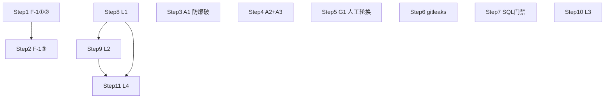

# Implementation Plan for 安全体系 S1 · 止血与基线

> Phase 2 产出。Phase 3 逐步勾选执行。只含伪代码，不含真代码。
> 来源规划（唯一权威）：[5_安全体系.md](../../0_推进计划/5_安全体系.md)；总索引：[安全体系.plan.md](./安全体系.plan.md)
> 背景：计费系统已于 2026-08-07 上线，按路线图规则 L1~L4 提前至本阶段。文档规模 ≤5000 tokens。

## 需求编号映射表

| SEC-FR | 需求（来源条目） | 落点 |
|---|---|---|
| SEC-FR-030a | F-1 修复①：危险类型下载强制 attachment + octet-stream，安全白名单才 inline | Step 1 |
| SEC-FR-030b | F-1 修复②：下载响应固定 `X-Content-Type-Options: nosniff` | Step 1 |
| SEC-FR-030c | F-1 修复③：上传侧扩展名白名单拒收 html/svg（/api/files/upload + 画布上传） | Step 2 |
| SEC-FR-001 | A1 登录防爆破：同账号 5 次失败锁 15min、同 IP >20 次/小时封禁、触发写安全审计 | Step 3 |
| SEC-FR-002 | A2 安全响应头：CSP / X-Frame-Options / nosniff / Referrer-Policy（HSTS 待 HTTPS） | Step 4 |
| SEC-FR-003 | A3 CORS 收紧：生产禁 `*`，仅前端域名白名单（并入 A2 步） | Step 4 |
| SEC-FR-070 | G1 密钥轮换：DB 密码 + JWT_SECRET + RUNTIME_CALLBACK_TOKEN（运维遗留，**人工·阻断性**） | Step 5 |
| SEC-FR-071 | G2 CI gitleaks 扫描，密钥进仓库构建失败 | Step 6 |
| SEC-FR-020 | C1 SQL 注入门禁：CI grep Mapper `${` 即红 | Step 7 |
| SEC-FR-120 | L1 积分扣减并发安全：原子 UPDATE + `CHECK (balance >= 0)` 兜底 | Step 8 |
| SEC-FR-121 | L2 幂等防重放：幂等键去重表，重复提交不重复加扣 | Step 9 |
| SEC-FR-122 | L3 金额参数校验：拒绝负数/零/超上限，服务端重算价格 | Step 10 |
| SEC-FR-123 | L4 计费对账：流水只增不改 + 每日定时对账不平告警 | Step 11 |

## 技术实现坑点预判与规避措施

| 技术点 | 可能的坑 | 规避措施 | 验证方式 |
|---|---|---|---|
| inline→attachment | 画布/资产库图片、视频预览回归（全变下载） | 仅危险类型（html/svg/xml/js/xhtml…）强制 attachment；安全白名单 image png/jpeg/webp/gif、video/*、audio/*、pdf 保持 inline | 上传 png/mp4 预览正常；evil.html 触发下载 |
| nosniff 兼容性 | 担心影响 SSE / 正常下载 | nosniff 只禁 script/style 嗅探，SSE 的 text/event-stream 与 octet-stream+attachment 均不受影响；仍实测 SSE 流 | 对话流式输出逐 token 正常 |
| Redis 防爆破计数锁 | TTL 误杀合法用户；Redis 故障把登录打死 | 失败计数键 TTL=窗口（15min），自然过期自动解锁；Redis 异常降级放行 + WARN（沿用注册限流既有模式）；admin 手工删键解锁路径写入 runbook | 输错 5 次锁 15min 后自动恢复；停 Redis 登录仍可用 |
| 原子扣减与现有实现合并 | 另起一套 `WHERE balance>=?` 与 WalletService 既有 `UPDATE...RETURNING` 行锁双写冲突 | **不新增第二套**：现有 charge 已是原子 UPDATE 行锁，本步只补 DB `CHECK (balance>=0)` 约束 + 并发回归测试；若发现某路径先查后扣则改为走 charge 统一入口 | 阅读全部扣减调用点确认无绕过；并发测试通过 |
| 幂等键唯一约束 × 异步 UsageCollector | 扣减同步、采集异步两写路径竞态：去重占位成功但扣减失败留下死键 | 幂等表先 `INSERT ... ON CONFLICT DO NOTHING` 占位，撞键→直接返回首次结果；扣减失败删占位（同事务回滚）；采集侧不碰幂等表 | 同键并发 10 次只扣一次；扣减失败后同键可重试 |
| gitleaks 误报 | 历史误报/测试假密钥刷屏 | 首次全量扫生成 baseline 文件 + `.gitleaks.toml` allowlist（测试 fixtures、文档示例）；PR 增量扫只拦新增 | 提交假密钥 CI 红；baseline 内既有串不红 |
| CI grep `${` 规则 | MyBatis 注解/XML 中合法内容误伤；shell 里 `$` 需转义 | 规则限定 `**/*Mapper.xml` 与 `**/mapper/*.java`，排除测试目录与注释行；grep 模式用单引号 `'\${'` 防 shell 展开 | 人为在 Mapper 写 `${}` CI 红；现有代码全绿 |
| CHECK 约束上线 | 存量数据若已有负余额则迁移失败 | 迁移前先 `SELECT count(*) WHERE balance<0`，非 0 先人工调账再执行 | 预检查询为 0 |

## 安全检查清单（本计划即安全主题，逐条映射 OWASP）

- [ ] **A01 越权**：下载端点沿用 load 咽喉点归属校验，本步不改鉴权逻辑。
- [ ] **A03 注入**：F-1 修存储型 XSS；C1 门禁防 SQL `${}` 回潮。
- [ ] **A04 不安全设计**：L1 原子扣减、L2 幂等、L3 服务端重算价格（永不信任前端传价）。
- [ ] **A05 配置错误**：安全响应头、CORS 白名单。
- [ ] **A07 认证失效**：登录防爆破 + 锁定；JWT_SECRET 轮换后旧 token 全失效。
- [ ] **A08 完整性**：gitleaks + SQL grep 进 CI 门禁。
- [ ] **A09 日志**：锁定/封禁/幂等冲突/对账不平写安全审计（最小 audit_logs 表）+ 日志。
- [ ] **A02 密钥**：G1 轮换后 git 历史旧密钥全部作废。
- [ ] **错误处理**：锁定/拒收话术固定，不透传内部细节。

## 性能考虑与验证计划

- [ ] **L1 锁竞争**：原子 UPDATE 行锁仅串行化「同用户」扣减（单行 <5ms），不同用户无竞争；并发测试测同用户 20 并发总耗时。
- [ ] **防爆破 Redis 开销**：每次登录失败 2~3 次 INCR/EXPIRE，成功路径 1 次 DEL，可忽略；不引入额外 DB 查询。
- [ ] **对账任务**：每日凌晨一次 GROUP BY 聚合，走索引；非实时零请求路径开销。
- [ ] **magic number 嗅探不在 S1**（F-2 归 S4），本阶段上传校验仅扩展名比对，零解析开销。
- [ ] CI 门禁两个 job 合计 <2min，gitleaks 增量扫。

## 功能联动点清单

- [ ] **附件强制 attachment → 画布/资产库/聊天图片视频预览**：白名单 image/*、video/*、audio/*、pdf 仍 inline，预览不受影响；仅 html/svg/xml/js 变下载。边界：用户上传的 .html「网页素材」不能再在线预览（预期行为，安全换体验）。
- [ ] **登录锁定 → 合法用户被锁**：解锁路径 = 等 15min 自动解锁 / admin 删 Redis 键（runbook）；锁定期间返回固定话术不区分「密码错」与「已锁定」防账号枚举。
- [ ] **扣费原子化 → 并发扣费部分失败**：行锁串行化，后到请求看到最新余额，余额不足则该笔失败、其余成功；流水 balance_after=RETURNING 值，余额与流水恒一致。
- [ ] **幂等键重复提交 → 只生效一次且返回相同结果**：撞键时回查首次流水结果返回，不返回「重复」错误（调用方无感）；边界：同键不同金额视为异常写安全审计。
- [ ] **nosniff/CSP → 前端与 SSE**：Naive UI 内联样式需 CSP `style-src 'unsafe-inline'` 放行；SSE 实测回归。
- [ ] **CORS 收紧 → 前端域名/钉钉免登**：白名单须含全部合法来源（含钉钉 H5 回调域）；漏配表现为前端跨域报错，上线前预发验证。
- [ ] **JWT_SECRET 轮换 → 全员下线**：轮换即全部 access/refresh 失效强制重登，安排低峰执行并提前通知。

## 运维考量清单

| 项 | 做/不做/后续 | 说明 |
|---|---|---|
| G1 密钥轮换 runbook | 做（本阶段人工执行） | 步骤化：改环境变量→滚动重启→验证登录/回调→作废旧值；同时起草 G3 90 天轮换 runbook 初稿入《运维手册》 |
| 最小 audit_logs 表 | 不做（改为复用） | **日志系统 V77 已建全字段 audit_logs 超集**（user_id/client_ip/action/detail_json 全含）+ `common/audit/AuditLogService`（insert-only 异步落库），S1 直接复用，不再另建最小表 |
| 安全基线迁移 | 做（**V80**） | 原 plan 的 V77 已被日志系统占用（V77 audit_logs / V78 REVOKE / V79 权限）；S1 全部 DDL（CHECK 约束、idempotency_keys、ledger 唯一约束、points_ledger REVOKE）统一入 **V80__security_baseline.sql**，迁移前预检存量负余额 |
| 告警 | 不做（本阶段 log.warn/ERROR 计数） | 锁定风暴、对账不平、注入检出后续接运维 P1 钉钉告警 |
| CI 门禁本地脚本 | 做 | gitleaks 与 `${` grep 同时落 `scripts/security/`，本地可跑，不只依赖 CI |
| 回滚 | 做 | billing.enabled 总闸沿用；V80 迁移附回滚段；安全头/CORS 为配置级可秒回 |
| 对账告警出口 | 后续 | 不平先 ERROR 日志 + 对账查询端点，告警接 M2/运维 P1 |

## 实现步骤

- [x] **Step 1：F-1 修复①② 下载端点 inline 白名单 + nosniff**（最高优先，已确认可利用 🔴）✅ `1f5a9b5`
  - **目标**：`/api/files/{fileId}` 对危险类型强制下载，浏览器不再同源渲染。
  - **动作**：引入危险扩展名集合（html/htm/svg/xml/xhtml/js/vbs…）与安全 inline 白名单（png/jpeg/webp/gif/mp4/webm/mp3/wav/pdf）；按 fileId 扩展名判定：危险 → `Content-Disposition: attachment` + `application/octet-stream`；白名单 → 维持 inline + 探测 MIME；其余默认 attachment。响应固定加 `X-Content-Type-Options: nosniff`。
  - **文件**：
    - `backend/src/main/java/com/superprogrammer/file/controller/FileController.java`：get() 改 disposition 决策伪代码 `ext=fileId后缀; if DANGEROUS.contains(ext)→attachment+octet-stream else if INLINE_SAFE.contains(ext)→inline+detectMimeType else→attachment`，追加 nosniff 头
    - `backend/src/main/java/com/superprogrammer/file/service/FileStorageService.java`：detectMimeType 保持不变，仅被白名单分支调用
  - **依赖**：无
  - **需人工介入**：否
  - **安全检查**：A03（XSS）、清单「下载端点不改鉴权」
  - **验证**（渗透自查·文件上传）：上传 evil.html → 打开链接浏览器**下载而非渲染**；上传 SVG 内嵌 script → 同上；上传 png/mp4 → 预览仍正常；响应头含 nosniff。

- [x] **Step 2：F-1 修复③ 上传扩展名白名单** `[依赖: Step 1]` ✅ `6bcbb06`
  - **目标**：无类型校验的两个上传入口拒收危险扩展名，根治入口。
  - **动作**：定义上传允许扩展名白名单（文档/图片/音视频/压缩包等正列举），html/svg/xml/js/exe 等直接 400；两个入口共用同一校验方法（FileUploadValidator 雏形，S4 F-2 再扩展 magic number）。
  - **文件**：
    - `backend/src/main/java/com/superprogrammer/file/controller/FileController.java`：upload() 入口先过校验
    - `backend/src/main/java/com/superprogrammer/canvas/controller/CanvasController.java`：`/{id}/upload` 同接校验
    - `backend/src/main/java/com/superprogrammer/file/service/FileStorageService.java`：新增 validateUploadExtension(file) 伪代码 `ext∉ALLOWED→throw BusinessException(FILE_TYPE_NOT_ALLOWED)`
    - `backend/src/main/java/com/superprogrammer/common/exception/ErrorCode.java`：补 FILE_TYPE_NOT_ALLOWED
  - **依赖**：Step 1（同文件改动串联）
  - **需人工介入**：否
  - **安全检查**：A03
  - **验证**：上传 evil.html / .svg → 400 固定话术；正常 png/docx/mp4 上传成功。

- [x] **Step 3：A1 登录防爆破（复用现有 audit_logs）** `[P] 可并行` ✅ `4bcc288`
  - **目标**：同账号 5 次失败锁 15min；同 IP 失败 >20 次/小时临时封禁；触发写安全审计。
  - **动作**：复用注册限流 Redis 固定窗口模式；登录失败 INCR `login:fail:u:{username}`（TTL 15min）与 `login:fail:ip:{ip}`（TTL 1h）；登录前检查阈值，命中即拒绝（固定话术）；登录成功 DEL 账号计数；锁定/封禁事件经既有 `AuditLogService`（异步 insert-only，V77 全字段表）落审计，**不再新建最小表/新 Service**。
  - **文件**：
    - `backend/src/main/java/com/superprogrammer/auth/service/AuthService.java`：login() 前后插防爆破检查/计数（参照既有 checkRegisterRateLimit 写法）
    - 复用 `common/audit/AuditLogService.java`：登录前 MDC 无身份，走 `fromMdc(...)` 手工建行（module=auth，action=login_locked/ip_banned，userId/username 显式覆盖，detail 只带 reason 码）
    - `backend/src/main/java/com/superprogrammer/common/exception/ErrorCode.java`：补 LOGIN_LOCKED
  - **依赖**：无 `[P]`
  - **需人工介入**：否
  - **安全检查**：A07、A09
  - **验证**（渗透自查·认证）：同账号错 5 次锁 15min（40103），到点自动解锁；同 IP >20 次/小时封 1h；停 Redis 降级放行且 WARN；audit_logs 有锁定事件行。（Phase4 规格漂移修正：原文「1 分钟 50 次 → 429」为早期措辞，实现为更严的账号锁+IP 封双阈值，以此为准）

- [x] **Step 4：A2 安全响应头 + A3 CORS 收紧** `[P] 可并行` ✅ `79c028d`
  - **目标**：统一补安全头；生产 CORS 仅白名单。
  - **动作**：SecurityConfig 加 headers：CSP `default-src 'self'; style-src 'self' 'unsafe-inline'; img-src 'self' data:`（Naive UI 内联样式放行）、X-Frame-Options DENY、X-Content-Type-Options nosniff、Referrer-Policy strict-origin-when-cross-origin；HSTS 注释占位待 HTTPS。CORS 生产 profile 改白名单（配置化域名列表），禁 `*`；dev 保持宽松。
  - **文件**：
    - `backend/src/main/java/com/superprogrammer/auth/security/SecurityConfig.java`：headers 配置伪代码
    - `backend/src/main/java/com/superprogrammer/common/config/CorsConfig.java`：allowedOrigins 改读配置 `app.cors.allowed-origins`
    - `backend/src/main/resources/application.yml`（及 prod profile）：补 cors 白名单配置项
  - **依赖**：无 `[P]`
  - **需人工介入**：部署时确认生产白名单含全部合法域名
  - **安全检查**：A05
  - **验证**：任意响应含 4 个安全头；非白名单 Origin 预检被拒；前端页面渲染/SSE 流式回归正常。

- [ ] **Step 5：G1 密钥轮换（需人工介入·阻断性）** `[P] 可并行`
  - **目标**：DB 密码 + JWT_SECRET + RUNTIME_CALLBACK_TOKEN 全量轮换，git 历史旧值作废。
  - **动作**（纯人工运维，本步为 checklist 与衔接）：生成新随机值 → 更新环境变量 → 滚动重启后端 → 验证登录/刷新/工作流回调/DB 连接 → 确认无旧值引用。JWT_SECRET 轮换 = 全员强制重登（预期），低峰执行。runbook 初稿入《运维手册》（G3 雏形）。
  - **文件**：
    - 环境变量/部署配置（不入库）：DB 密码、JWT_SECRET、RUNTIME_CALLBACK_TOKEN
    - `agent-platform/项目工程文档/`（运维手册位置）：新增轮换 runbook 小节
  - **依赖**：无 `[P]`；建议最后执行避免打断联调
  - **需人工介入**：**是·阻断性**（安全待办已登记在案，无人工无法完成）
  - **安全检查**：A02
  - **验证**：重启后旧 token 401、新登录正常、回调 200、DB 连通；grep 部署环境无旧密钥残留。

- [x] **Step 6：G2 gitleaks CI 门禁** `[P] 可并行` ✅ `9cc7864`（baseline 首扫待人工，H2）
  - **目标**：密钥进仓库即构建失败（防第二次 #2）。
  - **动作**：CI 新增 security-gate job 跑 gitleaks（PR 增量扫 + 首次全量生成 baseline）；`.gitleaks.toml` allowlist 收测试 fixtures/文档示例；同规则落本地脚本。
  - **文件**：
    - `agent-platform/.github/workflows/security-gate.yml`（新建）：gitleaks 步骤伪代码
    - `agent-platform/.gitleaks.toml`（新建）：allowlist + baseline 引用
    - `agent-platform/scripts/security/gitleaks-scan.sh`（新建）：本地同款
  - **依赖**：无 `[P]`（与代码修复文件零重叠）
  - **需人工介入**：首次 baseline 需人工确认既有命中均为误报
  - **安全检查**：A08
  - **验证**（渗透自查）：git 提交假密钥 → gitleaks CI 红；baseline 内既有串不红。

- [x] **Step 7：C1 SQL 注入 grep 门禁** `[P] 可并行` ✅ `9cc7864`（揪出 LlmUsageLogMapper `${dim}` 合法片段入 allowlist）
  - **目标**：Mapper XML/注解出现 `${` 即构建失败，防回潮（现状审计已全干净）。
  - **动作**：security-gate job 加 grep 步骤：扫描 `**/*Mapper.xml` 与 `**/mapper/*.java`，排除测试目录/注释；命中非白名单 `${` → exit 1。
  - **文件**：
    - `agent-platform/.github/workflows/security-gate.yml`：追加 SQL grep 步骤
    - `agent-platform/scripts/security/mybatis-dollar-check.sh`（新建）：伪代码 `grep -rn '\${' --include=*Mapper.xml --include=*Mapper.java backend/src/main | 过滤白名单 → 非空即红`
  - **依赖**：无 `[P]`（与 Step 6 同 job 文件，建议同人顺手做，逻辑上可并行）
  - **需人工介入**：否
  - **安全检查**：A03、A08
  - **验证**（渗透自查·注入）：人为在 Mapper 写 `${}` → CI 红；现有代码全绿。

- [x] **Step 8：L1 积分扣减并发安全核验 + CHECK 约束** `[P] 可并行（billing 域串行起点）` ✅ `a880b53`（V80 CHECK+SQL守卫+并发IT；V65 欠款模型作废）
  - **目标**：扣减全路径原子化，DB 层 `balance>=0` 兜底。
  - **动作**：审计 PointsWalletService 全部扣减/退款调用点，确认均走既有 `UPDATE...RETURNING` 原子路径，发现先查后扣的绕行点改为统一入口；V80 迁移对 user_points_balance 加 `CHECK (balance >= 0)`（迁移前预检存量负余额）。
  - **文件**：
    - `backend/src/main/java/com/superprogrammer/billing/service/PointsWalletService.java`：核查处 + 必要时收口
    - `backend/src/main/java/com/superprogrammer/billing/mapper/UserPointsBalanceMapper.java`：确认原子 UPDATE 语句唯一入口
    - `backend/src/main/resources/db/migration/V80__security_baseline.sql`：ADD CONSTRAINT chk_balance_non_negative（本步段）
    - `backend/src/test/java/.../PointsWalletConcurrencyTest.java`（新建）：并发扣减测试
  - **依赖**：无（billing 域内 Step 9 依赖本步）
  - **需人工介入**：存量负余额预检若非 0 需人工调账
  - **安全检查**：A04
  - **验证**（渗透自查·业务逻辑）：同用户并发 20 个扣积分请求 → 余额不为负、扣减次数正确、余额=初值−Σ。

- [x] **Step 9：L2 幂等与防重放** `[依赖: Step 8]` ✅ `2d01121`（idempotency_keys 占位去重+异额审计；同键并发10次仅1笔流水IT实证）
  - **目标**：积分变动/关键写接口加幂等键，重复提交只生效一次且返回相同结果。
  - **动作**：V77 建 idempotency_keys 表（key UNIQUE、user_id、result_ref、created_at）；charge/refund/admin grant 入口接幂等键：先 ON CONFLICT DO NOTHING 占位 → 撞键回查首次流水返回相同结果 → 扣减与占位同事务（失败整体回滚不留死键）；points_ledger 补 `(ref_type, ref_id, change_type)` 唯一约束兜底。
  - **文件**：
    - `backend/src/main/resources/db/migration/V80__security_baseline.sql`：idempotency_keys 表 + ledger 唯一约束（本步段）
    - `backend/src/main/java/com/superprogrammer/billing/service/PointsWalletService.java`：charge/refund 加幂等键参数与占位逻辑
    - `backend/src/main/java/com/superprogrammer/billing/entity/PointsLedgerEntity.java`、`mapper/PointsLedgerMapper.java`：唯一约束对应查询
    - `backend/src/main/java/com/superprogrammer/billing/controller/WalletAdminController.java`：grant 接口接收幂等键
  - **依赖**：Step 8（同改 charge 路径与 V80，串行）
  - **需人工介入**：否
  - **安全检查**：A04
  - **验证**（渗透自查·业务逻辑）：同一幂等键重复提交积分变动 → 只生效一次，两次返回相同结果；同键并发 10 次 → 只扣一次；扣减失败后同键可成功重试。

- [x] **Step 10：L3 金额参数校验** `[P] 可并行` ✅ `743bfd2`（DTO Bean Validation+@Valid 全挂；服务端重算核查无前端传价入口）
  - **目标**：数量/金额拒绝负数、零、超上限；价格一律服务端重算。
  - **动作**：充值/调账/价表 DTO 补 `@Positive`/`@Max` 等 Bean Validation；Controller 确认 `@Valid` 生效；核查是否存在前端传价被采信的路径（按 F4 红线应全部服务端重算），发现即改。
  - **文件**：
    - `backend/src/main/java/com/superprogrammer/billing/dto/RechargeRequest.java`：金额范围注解
    - `backend/src/main/java/com/superprogrammer/billing/dto/PricingRuleRequest.java`、`RatioTierRequest.java`：数值范围注解
    - `backend/src/main/java/com/superprogrammer/billing/controller/WalletAdminController.java`、`PricingConfigController.java`：@Valid 核查
    - `backend/src/main/java/com/superprogrammer/billing/service/PricingService.java`：确认价格服务端计算
  - **依赖**：无 `[P]`（仅 DTO/校验层，不碰 charge 路径）
  - **需人工介入**：否
  - **安全检查**：A04、输入校验
  - **验证**（渗透自查·业务逻辑）：传负数/零金额 → 400；请求体塞 `balance=99999` → 不生效（C8 红线预演）。

- [x] **Step 11：L4 计费对账定时任务** `[依赖: Step 8, Step 9]` ✅ `ebeefe6`（每日03:20全量对账+差异审计+admin手动端点；篡改余额IT实证检出）
  - **目标**：流水只增不改 + 每日对账（Σledger.delta vs 余额快照），不平告警。
  - **动作**：DB 层 revoke 应用账号对 points_ledger 的 UPDATE/DELETE（V80，沿用 V78 REVOKE 范式）；每日凌晨定时任务：按用户 `SUM(delta)` 对比 user_points_balance.balance，差异行写 audit_logs + ERROR 日志；admin 对账查询端点复用 BillingQueryService 补视图。
  - **文件**：
    - `backend/src/main/resources/db/migration/V80__security_baseline.sql`：REVOKE 段
    - `backend/src/main/java/com/superprogrammer/billing/service/BillingReconcileService.java`（新建）：伪代码 `每日 cron → per-user Σledger.delta 对比 balance → diff 写审计+ERROR`
    - `backend/src/main/java/com/superprogrammer/billing/service/BillingQueryService.java`：对账结果查询
  - **依赖**：Step 8、Step 9（流水语义定型后对账才准确）
  - **需人工介入**：否
  - **安全检查**：A04、A09（D5 雏形，S2 审计链复用）
  - **验证**：手工 SQL 改一行流水 → 次日对账 diff 告警；正常日对账全平。

## 依赖与并行化地图

并行批次表：

| 批次 | Steps | 说明 |
|---|---|---|
| B1 | 1（→2）、3、4、5、6、7、8、10 | 八线并行：文件修复链(1→2)、防爆破、安全头、密钥轮换(人工)、两条 CI 门禁、L1、L3 互不重叠 |
| B2 | 2、9 | 2 依赖 1；9 依赖 8 |
| B3 | 11 | 依赖 8+9 |

## 整体验证（功能级）

- [ ] 全部单测通过（含新增并发扣减/幂等测试）。
- [ ] 渗透自查清单 S1 相关条目全跑：evil.html/SVG 下载不渲染、登录 50 次/分钟锁定、Mapper `${}` CI 红、假密钥 gitleaks 红、并发 20 扣积分余额不为负、同幂等键只生效一次、负数金额 400。
- [ ] 回归：画布/资产库图片视频预览正常、SSE 流式正常、前端跨域正常、登录/刷新/登出全流程正常。
- [ ] 安全检查清单全部完成；与 [5_安全体系.md](../../0_推进计划/5_安全体系.md) S1 行逐项对齐复核。

## 术语表

| 术语 | 大白话 | 简单案例 |
|---|---|---|
| 存储型 XSS | 恶意脚本存进系统，谁打开谁中招 | 上传 evil.html，管理员点链接即被执行 JS 窃取 token |
| Content-Disposition | 响应头决定浏览器「在线打开」还是「下载」 | inline 渲染 html 是漏洞根因；改 attachment 强制下载 |
| nosniff | 禁止浏览器猜文件类型 | 防 octet-stream 被当 html 执行 |
| 防爆破 | 密码错太多次就锁一会儿 | 同账号错 5 次锁 15 分钟 |
| 幂等键 | 请求的唯一编号，重复提交只算一次 | 网络重试不会重复扣积分 |
| 原子扣减 | 「查余额+扣钱」一条 SQL 不可拆 | 并发 20 个请求余额不为负 |
| gitleaks | CI 扫密钥工具，密钥进仓库即红 | 防第二次 #2 密钥泄露 |
| 哈希链 | 审计记录互相咬指纹，改一条全链对不上（S2 落地，本阶段只建基表） | UPDATE 一行审计 → 链校验断链 |
| CHECK 约束 | 数据库层面的硬规则兜底 | balance 永远 ≥0，代码 bug 也越不过去 |

## 备注
- S1 人日 7~8（原 5~6 + L 域提前 2~3）。
- PointsWalletService 既有 charge 已是 `UPDATE...RETURNING` 原子行锁，L1 以核验+DB 约束+并发测试为主，不重写。
- magic number 嗅探（F-2）、上传配额（F-4）明确不在本阶段，归 S4。
