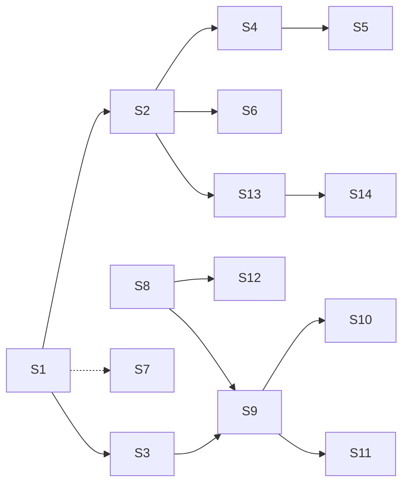

# Implementation Plan for 日志系统

> Phase 2 产出。Phase 3 逐步勾选执行。只含伪代码，不含真代码。
> 来源规格（唯一权威）：[3_日志系统.md](../../0_推进计划/3_日志系统.md)；本功能无 PRD。
> 部署约束：Windows Server 单机（jar + Nginx + PG + Redis + Python sidecar），P2/P3 需服务器运维窗口。
> **文档规模**：≤5000 tokens。

## 背景与目标
- 现状基线：三通道（console/app.log/error.log）已就位；目标：一个 traceId 串起一次请求全部日志（含 SQL、LLM 调用、sidecar 回调）、操作审计落库可前端查询、Grafana 集中检索、脱敏制度化防回潮。
- 建议顺序：P0 → P1 先行（纯代码零运维成本），P2/P3 在部署窗口做；P2 可整体降级跳过（推进计划 §P2-5）。

## 需求编号映射表
| FR | 推进计划条目 | 落点摘要 |
|---|---|---|
| LOG-FR-01 | P0-1 traceId 全链路透传 | micrometer-tracing-bridge-otel + sampling 1.0 + pattern 加 traceId/spanId |
| LOG-FR-02 | P0-2 异步上下文传递 | 线程池加 ContextPropagatingTaskDecorator |
| LOG-FR-03 | P0-3 用户上下文入 MDC | 新增 MdcUserFilter（JWT filter 之后，finally clear） |
| LOG-FR-04 | P0-4 SQL 独立通道 | SQL_FILE appender，mapper DEBUG 开关式，LOG_SQL_ENABLED 默认关 |
| LOG-FR-05 | P0-5 JSON 结构化输出 | logstash-logback-encoder；console 彩色 + 文件 JSON 双格式 |
| LOG-FR-06 | P0-6 请求耗时摘要 | 新增 RequestLogFilter 一行 INFO（不记 body） |
| LOG-FR-07 | P0-7 脱敏制度化 | Logback MessageConverter `%mask` 正则打码 |
| LOG-FR-08 | P0-8 sidecar 对齐 | sidecar structlog JSON；Java 回调传 traceparent |
| LOG-FR-09 | P1-1 audit_logs 表 | Flyway 建表（trace_id/user_id/module/action/detail_json 等） |
| LOG-FR-10 | P1-2 @AuditLog 注解 + AOP | 敏感写操作自动异步落库 |
| LOG-FR-11 | P1-3 登录审计 | 登录/登出/刷新/注册入 audit_logs |
| LOG-FR-12 | P1-4 前端日志中心 | views/admin/logs/，`system:audit:read` 权限 |
| LOG-FR-13 | P1-5 审计保留策略 | 按月分区/定时归档；DB 层 REVOKE UPDATE/DELETE |
| LOG-FR-14 | P2-1 部署 VictoriaLogs + Alloy | 单 exe + WinSW 服务化（人工） |
| LOG-FR-15 | P2-2 Alloy 采集配置 | tail logs/*.log + sidecar 日志 → push |
| LOG-FR-16 | P2-3 Grafana 数据源 + 三视图 | traceId 全链 / userId 行为 / ERROR 实时流 |
| LOG-FR-17 | P2-4 保留策略 | app 30 天、error 90 天、audit 180 天 |
| LOG-FR-18 | P2-5 降级方案 | 不引新组件时跳过 P2，grep JSON 文件 |
| LOG-FR-19 | P3 日志告警 | error 突增（5min>20）、LLM 连败、登录失败同 IP>10/min → 钉钉 |

## 技术实现坑点预判与规避措施
| 技术点 | 可能的坑 | 规避措施 | 验证方式 |
|---|---|---|---|
| micrometer-tracing 接入 | 与现有 Filter/拦截器顺序冲突，traceId 未就绪 | tracing 自动配置保持默认优先；MdcUserFilter 显式排在 JwtAuthenticationFilter 之后 | 单请求日志同时有 traceId+userId |
| @Async 线程池 | 不加 TaskDecorator 则 traceId 断链（记忆管线全异步） | 所有自定义线程池统一过 ContextPropagatingTaskDecorator 包装；新增异步点进评审 checklist | 异步方法日志 traceId 与请求一致 |
| logstash JSON 输出 | 与现有彩色 console pattern 共存配置冲突 | 双 appender 双 pattern：CONSOLE 保留彩色文本、文件类走 LogstashEncoder，互不引用 | console 彩色正常 + app.log 为合法 JSON |
| MDC 线程池复用 | 串号：上一条请求的 userId 漏到下一条 | MdcUserFilter finally 必 `MDC.clear()`；TaskDecorator 负责快照/恢复/清理 | 连续两请求不同用户日志不串号 |
| 正则脱敏性能 | 每日志行跑 N 个正则，热点路径拖慢 | 正则全部预编译 static Pattern；只对最终 message 跑一次转换，不逐参数处理 | 压测 QPS 降幅 <3% |
| SQL DEBUG 通道 | 全开刷爆磁盘 | `LOG_SQL_ENABLED` 环境变量默认关；SQL_FILE 独立滚动上限 | 默认启动无 sql.log 产出，开后才有 |
| RequestLogFilter | 误记 body 泄 PII | 只记 method/uri/status/costMs/userId/traceId，明确不读 body | 日志中无请求体内容 |
| sidecar traceparent | Java/sidecar 各记各的 traceId | 回调 HTTP 头注入 W3C traceparent，sidecar structlog processor 解析入字段 | 同一 traceId 两侧均检索到 |
| 审计异步落库 | 写库失败阻断业务主流程 | 落库异常仅 WARN 吞掉+计数，绝不外抛 | 模拟 DB 断业务仍 200 |

## 安全检查清单
- [ ] **PII 红线**：任何 `log.info` 不打印用户输入原文/记忆原文/LLM 响应原文，只打 length/hash/id（#6 防回潮，进评审 checklist）。
- [ ] **脱敏覆盖**：手机号/银行卡/身份证/邮箱/apiKey 五类正则生效，含 JSON 文件输出。
- [ ] **detail_json 不含 PII 原文**：审计前后值摘要只记字段名+脱敏值。
- [ ] **audit_logs 权限**：DB 层 REVOKE UPDATE/DELETE（只允许 INSERT/SELECT）；查询接口 `@RequirePermission("system:audit:read")`。
- [ ] **日志中心页**：仅 `system:audit:read` 可见，路由守卫同步加。
- [ ] **错误信息**：审计/日志相关异常不外泄内部细节。
- [ ] **新增依赖安全**：micrometer-tracing、logstash-encoder 版本无已知漏洞。

## 性能考虑与验证计划
- [ ] MDC/Filter 每请求开销 <1ms；脱敏正则预编译，压测对比 QPS 降幅 <3%。
- [ ] 审计写库异步（复用记忆管线线程池配置），不占用请求线程；攒批不必，逐条 INSERT 即可。
- [ ] SQL 通道默认关；开启时独立滚动文件限速（50MB×N 上限）。
- [ ] audit_logs 查询走索引（user_id/module/created_at），分页复用 PageResult，禁全表扫。
- [ ] Phase 4 验证：高并发下日志不丢不串号；磁盘占用增速可估（JSON 行均大小 × QPS）。

## 功能联动点清单
- [ ] 开 `LOG_SQL_ENABLED` → sql.log 出现且增长 → 磁盘占用上升；边界：忘关会撑滚动上限（50MB 封顶）。
- [ ] P1 审计写库 → 前端日志中心页 1 秒内可查；边界：异步落库有毫秒级延迟。
- [ ] 审计异步落库失败 → 只 WARN 计数，业务主流程不阻断；边界：失败期间审计缺失需告警兜底（P3）。
- [ ] MDC clear 遗漏 → 下一条请求日志带错 userId；边界：必须 finally clear + TaskDecorator 恢复后清理。
- [ ] sidecar 收不到 traceparent → 两侧各记各的 traceId，跨语言链路断裂；边界：sidecar 缺 header 时生成新 traceId 并记 parent 缺失标记。
- [ ] P2 降级（不装 VictoriaLogs）→ grep JSON 文件排障，审计页不受影响。
- [ ] 高基数红线：userId/traceId 只进日志/span，不进 metric tag（防撑爆 Prometheus）。

## 运维考量清单
| 项 | 做/不做/后续 | 说明 |
|---|---|---|
| 可观测性 | 做 | 每请求一行摘要；审计落库失败 WARN 计数；error.log 独立通道 |
| 配置开关 | 做 | `LOG_SQL_ENABLED`（默认关）、tracing sampling（生产可降）、脱敏正则表集中配置 |
| 可回滚 | 做 | logback/pom 改动纯配置可回退；audit 表 Flyway 附 drop 回滚注释；MDC filter 可配置关闭 |
| 限流/熔断 | 后续 | 日志量突增靠滚动文件上限兜底，不做限流 |
| 运维入口 | 做 | 前端日志中心页（审计查询）；Grafana 三视图（P2） |
| 告警阈值 | 做（P3） | error 5min>20 条、LLM 连败 N 次、登录失败同 IP>10/min → 钉钉 webhook |
| 容量预案 | 后续 | app 30 天 / error 90 天 / audit 180 天保留；audit_logs 按月分区（量上来再做） |

## 实现步骤

### Chunk P0 · 日志规范化（LOG-FR-01~08）

- [x] **Step 1：tracing 依赖与采样配置**（✅ 2026-08-09，commit 1281e5c）
  - **目标**：traceId/spanId 自动进 MDC（LOG-FR-01）。
  - **动作**：pom 加 `micrometer-tracing-bridge-otel`；yml 设 `management.tracing.sampling.probability: 1.0`（伪代码：依赖坐标 + 配置键值）。
  - **文件**（2）：`agent-platform/backend/pom.xml`、`agent-platform/backend/src/main/resources/application.yml`
  - **依赖**：无。**需人工介入**：无。**安全检查**：依赖版本无漏洞。
  - **验证**：启动后任意请求日志 MDC 含 traceId/spanId。

- [~] **Step 2：logback 双格式 + SQL 独立通道**（🚧 进行中 2026-08-09）
  - **目标**：console 彩色 + 文件 JSON 双格式；SQL 独立 sql.log（LOG-FR-04/05，FR-01 pattern 部分）。
  - **动作**：pattern 加 `%mdc{traceId:-},%mdc{spanId:-}`；新增 APP_FILE/ERROR_FILE（LogstashEncoder JSON，滚动 50MB×30天/20MB×90天）；新增 SQL_FILE appender + mapper logger DEBUG 由 `LOG_SQL_ENABLED` 控制默认静默。
  - **文件**（2）：`agent-platform/backend/src/main/resources/logback-spring.xml`、`agent-platform/backend/pom.xml`（logstash-logback-encoder）
  - **依赖**：Step 1。**需人工介入**：无。**安全检查**：JSON 字段不含 body/PII。
  - **验证**：console 彩色正常；app.log 每行合法 JSON 且带 traceId；默认无 sql.log，开开关后 SQL 只进 sql.log。

- [ ] **Step 3：异步上下文传递**
  - **目标**：@Async 不断链（LOG-FR-02）。
  - **动作**：所有自定义线程池 Bean 包 `ContextPropagatingTaskDecorator`（伪代码：decorator 快照 MDC+Observation → 任务前恢复 → finally 清理）；登记「新增异步点必过 decorator」进 checklist。
  - **文件**（≤4）：`agent-platform/backend/src/main/java/com/superprogrammer/chat/config/MemoryTaskExecutorConfig.java` 及其余线程池配置类
  - **依赖**：Step 1。**需人工介入**：无。**安全检查**：无。
  - **验证**：发对话触发记忆管线，异步日志 traceId 与请求一致。

- [ ] **Step 4：MdcUserFilter 用户上下文**
  - **目标**：每条日志带 userId/username/clientIp（LOG-FR-03）。
  - **动作**：新增 OncePerRequestFilter，注册顺序在 JwtAuthenticationFilter 之后；从 SecurityContext 取用户、X-Forwarded-For 首段取 IP，未登录填 `-`；finally `MDC.clear()`。
  - **文件**（3）：`agent-platform/backend/src/main/java/com/superprogrammer/common/logging/MdcUserFilter.java`（新建）、`agent-platform/backend/src/main/java/com/superprogrammer/auth/security/SecurityConfig.java`（注册顺序）、`agent-platform/backend/src/main/resources/logback-spring.xml`（pattern 加 userId）
  - **依赖**：Step 2。**需人工介入**：无。**安全检查**：覆盖「MDC clear 防串号」。
  - **验证**：连续两请求不同用户，日志 userId 正确不串号；未登录为 `-`。

- [ ] **Step 5：RequestLogFilter 请求耗时摘要**
  - **目标**：一行 INFO 摘要替代 Security 噪声（LOG-FR-06）。
  - **动作**：新增 Filter 记录 `method uri status costMs userId traceId`，**不读 body**；视情况调低 Security 默认请求日志级别。
  - **文件**（2）：`agent-platform/backend/src/main/java/com/superprogrammer/common/logging/RequestLogFilter.java`（新建）、SecurityConfig（注册）
  - **依赖**：Step 4（复用 MDC 字段）。**需人工介入**：无。**安全检查**：PII 红线——无 body。
  - **验证**：每请求恰好一行摘要，字段齐全，无请求体。

- [ ] **Step 6：脱敏 MessageConverter（%mask）**
  - **目标**：五类敏感信息正则打码制度化（LOG-FR-07）。
  - **动作**：自定义 ClassicConverter 注册 `%mask`；正则表（手机号/银行卡/身份证/邮箱/apiKey）集中配置、static 预编译；console+文件 pattern 统一换用 `%mask`。
  - **文件**（3）：`agent-platform/backend/src/main/java/com/superprogrammer/common/logging/MaskingConverter.java`（新建）、脱敏正则配置类、`logback-spring.xml`
  - **依赖**：Step 2。**需人工介入**：无。**安全检查**：脱敏覆盖清单项。
  - **验证**：日志写入 `6228...` 测试卡号 → 输出 `6228****...`；压测 QPS 降幅 <3%。

- [ ] **Step 7：sidecar structlog 对齐** `[P]`
  - **目标**：跨 Java/Python 一条链（LOG-FR-08）。
  - **动作**：sidecar 引入 structlog JSON 输出（字段对齐 timestamp/level/traceId/logger/message）；加 processor 从请求头解析 traceparent 提取 traceId，缺失时自生成并标记；Java 侧回调 sidecar 的 HTTP client 注入 traceparent 头。
  - **文件**（4）：`agent-platform/runtime-sidecar/requirements.txt`、`agent-platform/runtime-sidecar/app/main.py`、`agent-platform/runtime-sidecar/app/callback_client.py`、Java 侧调用 sidecar 的 client 类
  - **依赖**：Step 1（语义依赖）；与 Step 3~6 文件不重叠，**[P] 可并行**。**需人工介入**：pip 安装新依赖。
  - **安全检查**：sidecar 日志同样不落原文。
  - **验证**：一次工作流执行，同一 traceId 在 Java 日志与 sidecar 日志均可检索。

### Chunk P1 · 操作审计（LOG-FR-09~13）

- [ ] **Step 8：audit_logs 建表 + 实体/Mapper**
  - **目标**：审计存储就绪（LOG-FR-09）。
  - **动作**：Flyway 新迁移建 `audit_logs`（id/trace_id/user_id/username/module/action/target_type/target_id/detail_json/client_ip/user_agent/result/created_at + user_id/module/created_at 索引）；附 drop 回滚注释；实体继承 BaseEntity + Mapper。
  - **文件**（3）：`agent-platform/backend/src/main/resources/db/migration/V<next>__audit_logs.sql`、`agent-platform/backend/src/main/java/com/superprogrammer/common/audit/AuditLogEntity.java`、对应 Mapper
  - **依赖**：无强依赖（建议 Step 2 后做，trace_id 有值）。**需人工介入**：无。**安全检查**：detail_json 字段注释注明「不含 PII 原文」。
  - **验证**：迁移成功；手工插行查询走索引。

- [ ] **Step 9：@AuditLog 注解 + AOP 异步落库**
  - **目标**：敏感写操作自动审计（LOG-FR-10）。
  - **动作**：定义 `@AuditLog(module, action)`；Aspect 环绕通知：取 MDC traceId/userId + 方法参数摘要（脱敏，前后值）→ 异步 INSERT（线程池复用 Step 3 decorator 配置）；落库异常仅 WARN 不外抛；首批标注：用户/角色/权限增删改、Agent 发布、KB 删除、系统设置变更、积分调整。
  - **文件**（≤8）：`agent-platform/backend/src/main/java/com/superprogrammer/common/audit/AuditLog.java`、`AuditLogAspect.java`、`AuditLogService.java`、被标注的若干 Service/Controller
  - **依赖**：Step 8、Step 3。**需人工介入**：确认首批标注清单。**安全检查**：异步落库失败不阻断主流程；detail 脱敏。
  - **验证**：admin 改一次角色权限 → audit_logs 1 秒内有行，含谁/何时/哪个角色/前后值/IP。

- [ ] **Step 10：登录审计埋点**
  - **目标**：登录成功/失败、登出、token 刷新、注册全部入库（LOG-FR-11）。
  - **动作**：auth 流程各出口调 AuditLogService（module=auth）；失败也记（result=FAIL + 原因码）。
  - **文件**（≤4）：`agent-platform/backend/src/main/java/com/superprogrammer/auth/` 下登录/注册/刷新相关 Service 或 Controller
  - **依赖**：Step 9。**需人工介入**：无。**安全检查**：不记密码/token 原文。
  - **验证**：故意登录失败 → audit_logs 有 FAIL 行含 IP。

- [ ] **Step 11：审计查询 API + 前端日志中心**
  - **目标**：管理员前端可查（LOG-FR-12）。
  - **动作**：后端 `GET /api/audit/logs` 按用户/模块/时间/action 筛选 + PageResult 分页，`@RequirePermission("system:audit:read")`；前端新建 `views/admin/logs/` 审计日志页（筛选栏 + 分页表格），路由加权限守卫，菜单仅授权可见。
  - **文件**（6）：`agent-platform/backend/src/main/java/com/superprogrammer/common/audit/AuditLogController.java`（+DTO）、`agent-platform/frontend/src/api/audit.ts`（新建）、`agent-platform/frontend/src/views/admin/logs/AuditLogView.vue`（新建）、`agent-platform/frontend/src/router/index.ts`
  - **依赖**：Step 9。**需人工介入**：给管理员角色分配 `system:audit:read` 权限。**安全检查**：权限校验 + 路由守卫。
  - **验证**：P1 验收——改角色权限后 1 秒内页面可查到完整审计行；无权限用户 403。

- [ ] **Step 12：审计保留策略与 DB 权限收紧**
  - **目标**：审计防篡改 + 保留策略（LOG-FR-13）。
  - **动作**：迁移追加 `REVOKE UPDATE, DELETE ON audit_logs FROM <app_role>`；归档策略先定时导出旧数据（伪代码：按月分区的 DDL 留 TODO，量上来再启用）。
  - **文件**（2）：`db/migration/V<next+1>__audit_logs_revoke.sql`、归档脚本/配置说明
  - **依赖**：Step 8。**需人工介入**：确认应用 DB 账号非 superuser。**安全检查**：audit_logs 只 INSERT/SELECT。
  - **验证**：用应用账号执行 UPDATE audit_logs 报权限拒绝。

### Chunk P2/P3 · 集中日志栈与告警（需服务器运维窗口 + 人工介入）

- [ ] **Step 13：VictoriaLogs + Alloy + Grafana 部署与视图**
  - **目标**：集中检索三视图（LOG-FR-14/15/16/17；LOG-FR-18 降级时整步跳过）。
  - **动作**：服务器装 VictoriaLogs 单 exe + Grafana Alloy（WinSW 服务化）；Alloy 配置 tail `logs/*.log`（JSON 解析）+ sidecar 日志目录 push；Grafana 加数据源，预置三视图（traceId 全链 / userId 行为 / ERROR 实时流）；保留策略 app 30 天 / error 90 天 / audit 180 天。
  - **文件**（≤4，均为服务器侧配置）：`alloy` 配置文件、WinSW 服务定义、Grafana dashboard JSON、部署说明
  - **依赖**：Step 2（JSON 格式）。**需人工介入**：是——服务器运维窗口，人工安装与端口放行。**安全检查**：Grafana 访问鉴权，不对公网暴露。
  - **验证**：P2 验收——Grafana 输入 traceId，3 秒内列出跨 Java/sidecar 全部日志行按时间排序。

- [ ] **Step 14：日志告警联动**
  - **目标**：异常主动推送（LOG-FR-19）。
  - **动作**：Grafana Alert 规则：error.log 5min>20 条、`LLM调用失败` 连续 N 次、登录失败同 IP>10 次/min；告警通道接钉钉 webhook（复用已有集成，与运维系统共用通道，规则清单统一维护于 4_运维系统 §三）。
  - **文件**（2）：Grafana alert 规则配置、钉钉 webhook 配置
  - **依赖**：Step 13 + 运维系统告警通道。**需人工介入**：是——运维窗口 + 钉钉机器人密钥人工填写。**安全检查**：webhook 密钥入 .env 不入库不入库（不提交）。
  - **验证**：手工造 21 条 ERROR → 5 分钟内钉钉收到告警。

## 依赖与并行化地图
- Step 1 → Step 2 → Step 4 → Step 5（主线串行）；Step 3 依赖 Step 1；Step 6 依赖 Step 2。
- Step 7（Python 侧）与 Step 3~6（Java 侧）文件不重叠，**[P] 可并行**。
- Step 8 独立起步；Step 9 ← Step 8+3；Step 10/11 ← Step 9；Step 12 ← Step 8。
- Step 13 ← Step 2（人工）；Step 14 ← Step 13（人工）。

| 批次 | 可并行 Step |
|---|---|
| B1 | Step 1 |
| B2 | Step 2 |
| B3 | Step 3、Step 4、Step 6、Step 7、Step 8（3/4/6 依赖各自前置已就绪；7 为 [P]） |
| B4 | Step 5、Step 9、Step 12 |
| B5 | Step 10、Step 11 |
| B6 | Step 13（人工窗口） → Step 14（人工窗口） |

## 整体验证（功能级）
- [ ] 所有单测通过；logback 配置启动无报错。
- [ ] **P0 验收（原文要点）**：发一条对话消息 → `grep <traceId> logs/*.log` 可见 HTTP 入请求 → 路由策略 → LLM 调用 → 记忆管线（异步不断链）→ SQL → 出响应，全程同一 traceId；测试银行卡号 `6228...` 输出为 `6228****...`；sql.log 独立成文件，app.log 无 SQL 刷屏。
- [ ] **P1 验收（原文要点）**：管理员改一次角色权限 → 日志中心 1 秒内可查到「谁在什么时间把哪个角色的哪个权限从 X 改成 Y，来源 IP」。
- [ ] **P2 验收（原文要点）**：Grafana 输入 traceId → 3 秒内列出该请求跨 Java/sidecar 全部日志行，按时间排序。
- [ ] 安全检查清单全部完成并验证（PII 红线、脱敏、REVOKE、system:audit:read）。
- [ ] 与 [3_日志系统.md](../../0_推进计划/3_日志系统.md) 逐条对齐复核（LOG-FR-01~19）。

## 术语表
| 术语 | 大白话 | 简单案例 |
|---|---|---|
| MDC | 日志的「随身小纸条」，同一线程内自动带进每条日志 | put("userId","u1") 后该线程日志都带 u1 |
| traceId / spanId | 一次请求的全程票号 / 其中一段的票号 | grep traceId 串起整条请求 |
| Micrometer Tracing | Spring Boot 3 官方链路追踪组件，自动发/接票号 | 引入后 MVC/WebClient 自动带 traceId |
| 结构化日志 | 日志写成 JSON 而非纯文本，机器可检索 | `{"traceId":"abc","costMs":42}` |
| appender（追加器） | Logback 的「输出口子」，决定日志写去哪 | CONSOLE / APP_FILE / SQL_FILE 各一个 |
| TaskDecorator | 线程池任务的「打包员」，把上下文随任务带走 | @Async 方法里 traceId 不断链 |
| traceparent | W3C 标准请求头，跨语言传票号 | Java 调 Python 时带上它 |
| structlog | Python 版结构化日志库 | sidecar 输出 JSON 日志 |
| LogstashEncoder | 把 Logback 日志直接编码成 JSON 的编码器 | 文件 appender 换上它即出 JSON |
| audit_logs | 操作审计表，只许加不许改 | 「谁改了角色权限」查它 |
| VictoriaLogs / Loki / Alloy | 轻量日志存储 / 备选存储 / 采集 agent | Grafana 里按 traceId 秒查 |
| REVOKE UPDATE/DELETE | 数据库层面禁止改/删审计记录 | 防审计被篡改 |

## 备注
- P2 可整体降级跳过（LOG-FR-18），P0+P1 已覆盖约 80% 排障场景。
- 偏离计划处在此注明原因。
