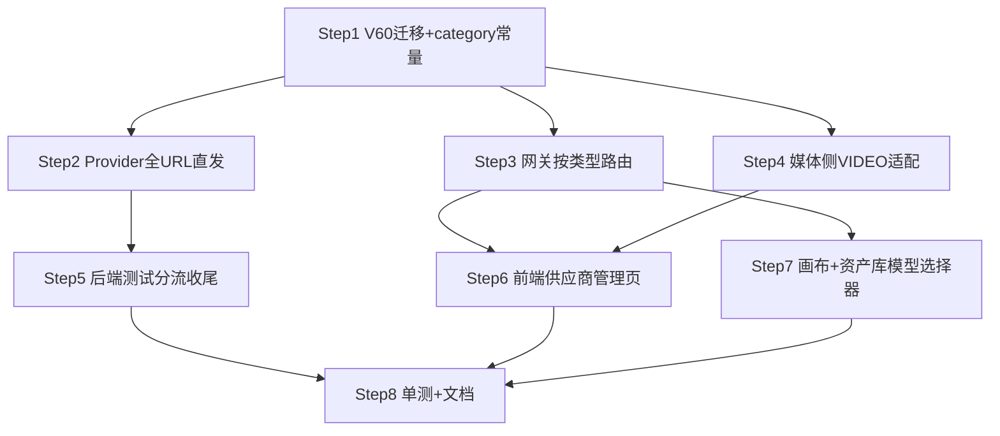

# Implementation Plan for 模型供应商全URL与类型化改造

> Phase 2 产出。Phase 3 逐步勾选执行。只含伪代码，不含真代码。
> 来源规格：无独立 Phase 1 规格（偏离流程，需求来自用户口述 + 现状代码）；现状依据 [速查表18](../../../项目工程文档/项目功能介绍/速查表/18-LLM供应商与网关.md)、[19](../../../项目工程文档/项目功能介绍/速查表/19-用户级LLM配置.md)、[24](../../../项目工程文档/项目功能介绍/速查表/24-无限画布创作页.md)、[SeedDance feature-map](../feature-map/SeedDance视频生成.feature-map.md)。
> 安全策略：沿用 PRD 通用非功能需求（JWT + @RequirePermission + AES 密钥存储）。

## 背景与目标

现状痛点：`api_endpoint` 存的是 base URL，各 provider 运行时拼路径（OpenAI 拼 `/v1/chat/completions`、embed 拼 `/embeddings`、Claude 拼 `/v1/messages`、Ark 拼 `/contents/generations/tasks`），第三方网关路径不标准就全军覆没；`category` 四分（CHAT/EMBEDDING/CHAT_EMBEDDING/MEDIA）里 CHAT_EMBEDDING 双用在全 URL 下不可能成立（chat 与 embed 是两个不同 URL），MEDIA 把视频/生图混为一谈。

目标：
- **FR-001 完整 URL 直发**：用户填完整请求 URL，运行时零内置拼接（唯一例外：视频任务查询/探测的 `/{taskId}` 是 Ark 协议级资源路径，非 base 拼接）。
- **FR-002 类型四分**：category ∈ `CHAT`（对话）/ `VIDEO`（视频）/ `IMAGE`（生图，预留）/ `EMBEDDING`（向量）；废弃 `CHAT_EMBEDDING`、`MEDIA`。
- **FR-003 消费方按类型选模型**：chat 模型列表只出 CHAT；视频目录只出 VIDEO；embed 路由只用 EMBEDDING；IMAGE 预留接口位（画布 R-3 生图）。
- **FR-004 测试按类型分流**：CHAT→POST 全 URL 短对话；EMBEDDING→POST 全 URL embed；VIDEO→任务端点零成本探测；IMAGE→提示「生图 provider 未接入」。
- **FR-005 存量迁移**：V60 迁移 category 值 + endpoint best-effort 补全 + 备份表可回滚。
- **FR-006 板块模型自选收口（画布+资产库）**：画布文本/脚本节点属性面板加模型选择器（后端 `node.data.model` 覆盖早已支持，纯前端补 UI）；资产库剧本拆分场接入已预留的 `assetsApi.breakdown(model)`（按钮 + 模型选择器，此前 API 无调用方）。**不含**记忆模型可配置化（RagConfig 硬编码，另案）与 KB embedding 放开（按库绑定+维度锁定是设计如此）。

**消费方盘点**（哪些模块选这里配的模型——本计划的联动面）：
| 消费方 | 选的模型类型 | 入口 |
|---|---|---|
| 智能对话 ChatView（ModelSelector） | CHAT | `GET /llm/user/models/available` |
| Agent 对话（DefaultChatStrategy/AgentRouter） | CHAT | LlmGateway.chat 按 agent 绑定 model |
| 工作流 LLM 节点（engine LlmCallHandler） | CHAT | LlmGateway |
| 个人记忆（MemoryGenerator/ConflictJudge/TagSelector 等） | CHAT + EMBEDDING | RagConfig MEMORY_JUDGE_MODEL / MEMORY_EMBED_MODEL |
| 知识库 RAG（IndexJobWorker/RagRetrievalService/QueryExpansionService） | EMBEDDING + CHAT | LlmGateway.embed/chat |
| 知识库 IMAGE-AUTO 视觉识图（DocumentOptionsModal） | CHAT（视觉模型） | ModelSelector 复用 |
| SeedDance 视频生成（VideoGenView） | VIDEO | `GET /api/media/models`（MediaModelService） |
| 无限画布 文本/脚本节点（CanvasNodeRunnerService） | CHAT | LlmGateway.chat（后端支持 node.data.model 覆盖，UI 未暴露 → FR-006 补） |
| 无限画布 图片节点（R-3，未做） | IMAGE | 本 plan 只留 category 位 |
| 项目资产库 剧本拆分（AssetScriptService） | CHAT | LlmGateway（后端支持 req.model，前端 breakdown API 无调用方 → FR-006 补入口+选择器） |
| 用户级 LLM 配置（user_llm_providers） | CHAT override | LlmGateway 用户级优先 |

## 技术实现坑点预判与规避措施
| 技术点/功能块 | 可能的坑 | 规避措施 | 验证方式 |
|---|---|---|---|
| V60 迁移 endpoint 补全 | 存量 base URL 形态各异（`/v1`、`/api/v3`、带尾斜杠），猜错路径 → 运行时 404 | 仅当 endpoint 不以已知 API 路径结尾时按 category+protocol 补常规后缀；每条迁移打 WARN 日志；文档要求迁移后逐条点「测试」 | 迁移后全量 provider 点测试按钮 |
| CHAT_EMBEDDING→CHAT | 该行原本兼顾 embed，迁移后 embed 落空 → RAG 索引/记忆 embed 报「没有找到支持模型」 | 迁移日志显式 WARN 列出受影响行；运维清单要求补建 EMBEDDING 行；速查表注明 | 迁移后跑 embed 测试 + 记忆抽取冒烟 |
| 可用模型列表剔 EMBEDDING | 旧行为把 embedding 模型列进 chat 选择器，若有 Agent/会话误绑 embedding 模型 → 调用即抛错 | Step 3 验证 SQL 查 agents/会话 model 是否落在 EMBEDDING 行 models 里，有则人工改绑 | 执行验证 SQL，结果为空 |
| ANTHROPIC + EMBEDDING | ClaudeProvider.embed 不支持 | 保存时 category=EMBEDDING 且 protocol=ANTHROPIC → 前端禁选 + 后端测试返回明确话术 | 组合点测试，话术可读 |
| Ark 视频全 URL | create=POST {url}、query/probe=GET {url}/{id}，`/{id}` 容易被误删成"也不拼" | 注释明确：`/{taskId}` 是协议资源路径保留，其余零拼接 | 单测断言 create 只发 POST {endpoint} 原样 |
| 前端 placeholder 误导 | 全 URL 后旧占位符 `https://api.openai.com/v1` 是错误示范 | placeholder 按 category 动态切换完整 URL 示例 + 软校验（CHAT 行 URL 以 `/v1` 等 base 形态结尾时警告不拦截） | 手测四类 placeholder/警告 |
| 性能：列表 JSON 解析 | listAvailableModels / MediaModelService 逐行 parse models JSON | provider 行数 <<100，忽略；不引缓存 | 不验（量级安全） |

## 安全检查清单
- [ ] **鉴权/授权**：新/改端点沿用 `@RequirePermission("role:manage")`（供应商管理）与 `media:gen`（生成），不新增越权面
- [ ] **输入校验**：endpoint 校验 http(s) 前缀 + 长度 ≤512；category 白名单四分，非法回退 CHAT（沿用 normalizeCategory 容错）
- [ ] **数据加密**：api_key AES 加密存储链路不动；迁移不动密文列
- [ ] **审计日志**：V60 迁移逐条 WARN（name + 旧 endpoint → 新 endpoint，不含 key）
- [ ] **错误处理**：测试/探测失败话术截断 200 字、不含 Authorization header（沿用 truncate/rootMessage）
- [ ] **SSRF（其他）**：管理员可配任意内网 URL 作 provider —— role:manage 仅管理员，风险接受；host 白名单**后续再说**（落字备查）
- [ ] **依赖安全**：无新增三方依赖

## 性能考虑与验证计划
- [ ] **查询效率**：无新表新查询；category 过滤走现有 listActive 全量内存过滤（行数小）
- [ ] **缓存策略**：chat provider 注册表走现有 `llmConfig.reload()`；媒体 WebClient 指纹缓存（endpoint+密文+providerId）不变，key/URL 改后自动重建
- [ ] **并发处理**：无新竞争点
- [ ] **性能验证**：Phase 4 手测 chat 首 token、视频建任务耗时无回归即可

## 功能联动点清单（独立 chunk，Phase 3 逐条对）
- [ ] **改 category**：CHAT→VIDEO 后，该 provider 立刻从 chat 模型列表消失、出现在视频目录；反向同理。边界：正在用其模型的 Agent/会话下次调用抛「没有找到支持模型 'X' 的Provider」——属预期，验证报错话术可读
- [ ] **改 endpoint/key**：保存 → `llmConfig.reload()` chat 热生效；媒体侧 WebClient 指纹不匹配自动重建（无需 reload）
- [ ] **删除/停用 VIDEO provider**：在跑任务轮询报「视频 provider 已停用或删除」置 FAILED；VideoGenView 目录减项；新提交选不到
- [ ] **停用最后一个 EMBEDDING provider**：记忆 embed/RAG 检索静默失败（09 吞异常）——验证 22 号速查表日志关键字可观测；告警**后续再说**
- [ ] **迁移联动**：CHAT_EMBEDDING 行变 CHAT 后，记忆 `MEMORY_EMBED_MODEL` 若无 EMBEDDING 行承接 → 记忆不落库；迁移 WARN 必须列出该行 name 提醒补建
- [ ] **IMAGE 预留**：category=IMAGE 可保存、可出现在列表；视频目录/chat 列表均不含它；测试按钮给「未接入」话术（不 500）
- [ ] **画布节点选模型**：属性面板选模型 → `node.data.model` 落库随画布保存 → 运行用它；清空选择 → 回退 `canvas.text-model` 默认；切换模型不影响已生成内容
- [ ] **资产库拆分场选模型**：选模型点拆分 → breakdown 带 model → content 里 `breakdownModel` 回显所选；不选 → 走 `asset.script-model` 默认

## 运维考量清单
- **可观测性**：做——迁移 WARN 逐条；provider 注册/跳过日志改按新 category 话术（LlmConfig）
- **配置开关**：不做新开关——`media.provider-name` 默认视频 provider 机制保留不动
- **可回滚**：做——V60 先 `CREATE TABLE llm_providers_bak_v60 AS SELECT *` 再 UPDATE；回滚 = 人工回写（Flyway 不自动回滚，plan 附回滚伪 SQL）
- **限流/熔断/降级**：不做——沿用现有超时（RB-001 WebClient 超时另案 P0，不在本 plan）
- **运维入口**：做——「测试」按钮即四类探测入口；`/providers/reload` 保留
- **告警阈值**：后续再说——EMBEDDING 全灭导致记忆静默失败已有日志关键字，接告警平台另案
- **容量/性能预案**：不做——行数十量级

## 依赖与并行化地图

并行批次表：
| 批次 | Step | 说明 |
|---|---|---|
| B1 | Step 1 | Flyway V60 + category 常量（其余一切的地基） |
| B2 | Step 2 | Provider 层全 URL 直发 |
| B3 | Step 3 [P] + Step 4 [P] | 网关路由 / 媒体侧适配，文件无交集 |
| B4 | Step 5 [P] + Step 6 [P] + Step 7 [P] | 后端测试分流 / 供应商管理页 / 画布+资产库选择器，文件无交集 |
| B5 | Step 8 | 单测补齐 + 文档收尾 |

## 实现步骤

- [x] **Step 1：V60 迁移 + category 常量重构**（对应 FR-002、FR-005）✅ 2026-08-06 commit `c4989c2`，llm+media 74 测绿。UserLlmController 可用模型只放 CHAT 提前落地（Step3 核对）。**V60 已在本机 dev 库实跑验证**（seedance MEDIA→VIDEO + endpoint 补全 `/v1/contents/generations/tasks`，WARN/备份表/回滚演练全过；flyway_schema_history 手工补登 checksum=NULL）。剩余人工动作：后端启动后逐条点「测试」。MediaModelService 改动挂工作区随前置批次提交。
  - **目标**：category 四分落库；存量 MEDIA→VIDEO、CHAT_EMBEDDING→CHAT；endpoint best-effort 补全；留备份表
  - **动作**：备份表 → UPDATE category → 按「category + protocol + endpoint 末段形态」补常规后缀（CHAT+OPENAI→`/chat/completions`；CHAT+ANTHROPIC→`/v1/messages` 已含则跳过；EMBEDDING→`/embeddings`；VIDEO→`/contents/generations/tasks`；已以这些结尾的不动），逐条 WARN
  - **文件**：
    - `db/migration/V60__provider_full_url_category.sql`：备份 + UPDATE（伪 SQL：case when endpoint not like '%/chat/completions' and not like '%/messages' then endpoint||suffix）
    - `LlmProviderService.java`：CATEGORIES 改 `CHAT/VIDEO/IMAGE/EMBEDDING`；`CATEGORY_MEDIA` 删，新增 `CATEGORY_VIDEO`/`CATEGORY_IMAGE`；dim 展示仍只看 EMBEDDING
  - **依赖**：无
  - **需人工介入**：迁移后逐条点「测试」确认补全猜对；CHAT_EMBEDDING 行需人工补建 EMBEDDING 行（迁移 WARN 会列出 name）
  - **安全检查**：迁移不含 key 明文；备份表含密文列，库内权限同原表
  - **验证**：本地库跑迁移 → 四类行 category 正确、endpoint 形态正确、备份表行数=原表；回滚伪 SQL 演练一遍（开发库）

- [ ] **Step 2：Provider 层全 URL 直发**（对应 FR-001）🚧 上半已落 2026-08-06 commit `bbdd53f`（OpenAI/Claude 直发 + URL 原样断言，74 测绿）。**ArkSeedanceProvider 已改完挂工作区**（createTask POST endpoint 原样、query/probe 仅留 `/{taskId}` 协议路径 + 2 新测），因依赖未提交前置（MediaGenRequest.providerId/attachments）待随前置媒体批次提交后本步勾完。
  - **目标**：三个 provider 删掉一切路径拼接，endpoint 原样作为请求 URL
  - **动作**：
    - `OpenAICompatibleProvider.java`：chat/chatStream `.uri(完整URL)` 绝对地址直发；embed 不再 `baseUrl+"/embeddings"`，直接 POST endpoint；删 normalizeBaseUrl 类逻辑（保留尾斜杠 trim 即可）
    - `ClaudeProvider.java`：chat/chatStream 直发 endpoint
    - `ArkSeedanceProvider.java`：createTask POST endpoint 原样；queryTask/probe GET `endpoint/{id}`（协议资源路径，注释说明保留理由）；buildClient baseUrl 即 endpoint
  - **文件**：上述 3 个
  - **依赖**：Step 1（endpoint 语义已变）
  - **需人工介入**：无
  - **安全检查**：key 仍只进 Authorization header
  - **验证**：现有单测全绿；新增断言「发出的 URL == 配置的 endpoint 原样」（MockWebServer 或 WebClient 拦截）

- [x] **Step 3：网关按类型路由**（对应 FR-002、FR-003）`[P]` ✅ 2026-08-06 commit `e73677c`，82 测绿。LlmConfig 拆 chat/embed 双注册表（EMBEDDING 行注册 embed 专用表，「仅 embed」日志）；LlmGateway embed 只找 EMBEDDING 行（不吃用户级 override），话术区分「对话/向量 Provider」；新增 LlmGatewayRouteTest 5 测。UserLlmController B1 已落地只放 CHAT，核对无误。
  - **目标**：CHAT 注册进 chat 路由；EMBEDDING 只走 embed；VIDEO/IMAGE 不注册
  - **动作**：
    - `LlmConfig.initProviders`：跳过条件 MEDIA→`VIDEO/IMAGE`；EMBEDDING 行注册但打「仅 embed」日志
    - `LlmGateway`：chat() findProvider 只在 CHAT（+用户级 override）里按 model 找；embed() 只在 EMBEDDING 里找——报错话术区分「没有支持模型 X 的对话/向量 Provider」
    - `UserLlmController.listAvailableModels`：过滤条件 MEDIA→只放 CHAT（修掉 EMBEDDING 模型混进 chat 选择器的旧缺陷）
  - **文件**：`LlmConfig.java`、`LlmGateway.java`、`UserLlmController.java`
  - **依赖**：Step 1
  - **需人工介入**：验证 SQL 查 agents/会话误绑 EMBEDDING 模型（见坑点表）
  - **安全检查**：无新增面
  - **验证**：单测：CHAT 行模型 chat 可达、EMBEDDING 行模型 chat 报「对话 Provider」话术、embed 只命中 EMBEDDING 行

- [x] **Step 4：媒体侧 VIDEO 适配**（对应 FR-002、FR-003）`[P]` ✅ 2026-08-06 commit `e73677c`（MediaGenProperties 注释 VIDEO 化随此提交）。MediaModelService 代码已认 CATEGORY_VIDEO（前置批次未跟踪文件，注释 VIDEO 化已落工作区，随前置批次提交）。
  - **目标**：视频目录/提交路由/探测全部改认 VIDEO；IMAGE 不进视频目录
  - **动作**：`MediaModelService` 过滤 `CATEGORY_MEDIA`→`CATEGORY_VIDEO`；`MediaGenProperties.provider-name` 注释更新；`LlmConfig` 跳过日志话术同步（Step 3 已含则不重复）
  - **文件**：`MediaModelService.java`、`MediaGenProperties.java`
  - **依赖**：Step 1
  - **需人工介入**：无
  - **安全检查**：无
  - **验证**：VideoGenView 模型下拉只列 VIDEO 行模型；提交路由 resolveProviderByModel 正常

- [x] **Step 5：后端测试分流收尾**（对应 FR-004）`[P]` ✅ 2026-08-06 commit `87032b2`，82 测绿。doTestConnection：IMAGE 短路返「生图 provider 尚未接入，配置已保存」不发请求；testEmbedding：ANTHROPIC（显式 protocol 或 name=claude 推断）返明确话术。TestConnectionTest +3 测。
  - **目标**：四类测试各有归宿，话术准确
  - **动作**：`LlmProviderService.doTestConnection` 无需改（provider.chat 已直发）；testEmbedding 同；category=IMAGE → testConnection 直接返回 fail(「生图 provider 尚未接入，配置已保存」) 不发请求；ANTHROPIC+EMBEDDING → 明确话术；`MediaGenController` 的 VIDEO 探测端点不动
  - **文件**：`LlmProviderService.java`
  - **依赖**：Step 2
  - **需人工介入**：无
  - **安全检查**：失败话术不含 key
  - **验证**：四类各点一次测试：CHAT/EMBEDDING/VIDEO 真实探测，IMAGE 话术返回

- [ ] **Step 6：前端供应商管理页**（对应 FR-001、FR-002、FR-004）`[P]`
  - **目标**：类型四分可选；placeholder 引导填完整 URL；测试按类型分流
  - **动作**：
    - `llm.ts`：ProviderCategory 改 `'CHAT'|'EMBEDDING'|'VIDEO'|'IMAGE'`
    - `ProviderManageTab.vue`：categoryOptions 四分（标签 对话/向量/视频/生图）；CATEGORY_TAG 同步；protocol 选择仅 CHAT/EMBEDDING 显示；endpoint placeholder 按 category 给完整 URL 示例（chat→`https://api.openai.com/v1/chat/completions`、embed→`.../v1/embeddings`、video→`https://ark.cn-beijing.volces.com/api/v3/contents/generations/tasks`）；CHAT/EMBEDDING 保存前软校验 URL 以 base 形态结尾（如 `/v1`、`/api/v3`）→ warning 不拦截；测试分流 testKindOf 改四分（IMAGE→直接 info 提示不发请求）
  - **文件**：`llm.ts`、`ProviderManageTab.vue`
  - **依赖**：Step 1、Step 3（可用模型语义）、Step 4（视频目录语义）
  - **需人工介入**：无
  - **安全检查**：无
  - **验证**：vue-tsc 零错；手测四类保存+测试+placeholder 切换+软校验提示

- [x] **Step 7：画布 + 资产库模型选择器**（对应 FR-006）`[P]` ✅ 2026-08-06 commit `3adaa09`，前端 206 测绿 + vue-tsc 0 错。ModelSelector 加 optional 模式（不自动选中/clearable/清空 emit ''，旧调用方零适配）；PropertyPanel 文本/脚本节点挂选择器 + `data-changed` → CanvasView scheduleSave 落库；AssetDetailDrawer 加「AI 拆分场」入口（SCRIPT+canEdit，弹窗选模型 → scriptApi.breakdown，成功重载+emit changed）；`ScriptBreakdownVO` 前端类型补 `model` 字段对齐后端。+10 测。
  - **目标**：两个「后端早已支持 model 覆盖」的板块补上 UI 自选
  - **动作**：
    - 画布：`components/canvas/PropertyPanel.vue` 文本/脚本节点各加一个 ModelSelector（复用 chat 组件，v-model ↔ `node.data.model`，留「默认」空选项）；选择随 scheduleSave 落库；运行时后端已读 `node.data.model`，零后端改动
    - 资产库：剧本资产详情/操作区加「AI 拆分场」入口（此前 `assetsApi.breakdown` 无调用方）——按钮 + ModelSelector 弹层，确认后调 `assetsApi.breakdown(assetId, model)`；空模型 = 后端默认
  - **文件**：`components/canvas/PropertyPanel.vue`、资产库详情视图（Phase 3 定位：`views/` 下资产详情页）、`api/assets.ts`（已就绪，确认签名即可）
  - **依赖**：Step 3（可用模型列表语义定稿——选择器数据源只出 CHAT）
  - **需人工介入**：无
  - **安全检查**：breakdown 端点沿用现有权限（assets 域），无新端点
  - **验证**：画布文本节点选 A 模型运行 → 日志/返回 patch 里 model=A；清空 → 走默认；资产库选 B 模型拆分 → 新版本 content 的 `breakdownModel`=B

- [ ] **Step 8：单测补齐 + 文档收尾**（对应全部 FR 回归）
  - **目标**：新行为有测试锁定；速查表/feature-map 同步
  - **动作**：
    - 单测：provider URL 原样直发（3 provider）、网关按类型路由、MediaModelService 只认 VIDEO、interpretProbe 保持绿
    - 文档：速查表 18（全 URL 语义+四分+端点清单+坑点改写）、19（用户级仍 chat-only 说明）、24（IMAGE 预留位指向本 plan）、SeedDance feature-map（MEDIA→VIDEO 措辞）、总路由表
  - **文件**：`ArkSeedanceProviderTest.java`、新增 `LlmGatewayRouteTest.java`、`MediaModelCapabilityServiceTest.java`（小改）、速查表 18/19/24、25（资产库拆分场入口+模型选择）、`SeedDance视频生成.feature-map.md`、`总路由.md`
  - **依赖**：Step 5、Step 6、Step 7
  - **需人工介入**：无
  - **安全检查**：清单逐项打勾
  - **验证**：`mvn test` 全绿 + `vue-tsc` 零错 + 文档链接可点

## 整体验证（功能级）
- [ ] 所有单测通过（backend `mvn test`、frontend `vue-tsc` + 相关 vitest）
- [ ] 关键路径手动验证：四类 provider 各建一条 → 测试通过 → 对话选 CHAT 模型聊一句 → 视频页选 VIDEO 模型建一个任务 → RAG 问答一次（embed 链路）→ 画布文本节点选模型运行 → 资产库选模型拆分场
- [ ] 安全检查清单全部完成并验证
- [ ] 功能联动点清单逐条验证（含反向：改回 category、停用 provider、删最后一个 EMBEDDING、画布清空模型回退默认）
- [ ] 与 FR-001~006 对齐复核（无 PRD，以本文件 FR 为准）

## 术语表（专业术语 · 大白话 · 案例）
| 术语 | 大白话 | 简单案例 |
|---|---|---|
| 完整 URL 直发 | 填什么地址就打什么地址，代码一个字符都不补 | 填 `…/v1/chat/completions` 就 POST 它，不再自动加 `/chat/completions` |
| 任务型 provider | 不是一问一答，而是「下单→轮询→取货」的异步接口 | 视频生成：POST 建任务拿 id，再 GET 查进度 |
| category 四分 | 给供应商贴「对话/视频/生图/向量」标签，各模块按标签找人 | 视频页下拉只出现贴了「视频」标签的供应商的模型 |
| 热重载（reload） | 改配置不用重启服务，点一下就生效 | 改完模型列表点「刷新配置」，新模型立刻可选 |
| 指纹缓存 | 用「endpoint+密钥」算个指纹，变了才重建 HTTP 客户端 | 换了 API Key，下次调用自动用新客户端 |
| best-effort 迁移 | 程序尽力猜着补全，猜错由人兜底 | 老配置 `…/v1` 自动补成 `…/v1/chat/completions`，猜错就点测试发现再手改 |

## 备注
- 偏离流程说明：无 Phase 1 spec/PRD，FR 编号为本文件自定义（FR-001~005），如需并入 PRD 追溯体系请补 Phase 1。
- RB-001（WebClient 无超时）为另案 P0，本 plan 不覆盖，但 Step 2 改 provider 时**不得破坏** ArkSeedanceProvider 已有的超时设置。
- IMAGE 仅预留 category 与 UI 位，生图 provider 实现属画布 R-3 子 plan。
