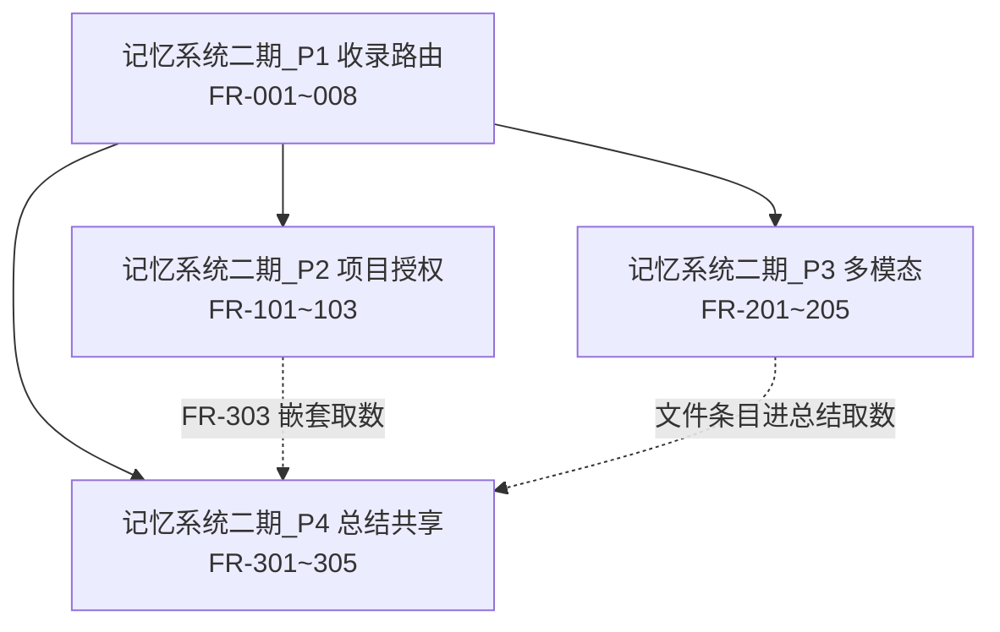

# Implementation Plan for 记忆系统二期（主索引）

> Phase 2 产出。Phase 3 逐步勾选执行。只含伪代码，不含真代码。
> 来源规格：[../specs/记忆系统二期.md](../specs/记忆系统二期.md)（FR 编号索引）
> 设计真相源：[项目工程文档/设计/记忆系统二期-项目自动收录与多模态-总体设计.md](../../../项目工程文档/设计/记忆系统二期-项目自动收录与多模态-总体设计.md)
> **规模控制**：按 P1-P4 拆 4 个子 plan，本文件只放横切内容 + 索引 + 依赖图。

## 子 plan 索引

| 子 plan | 内容 | 覆盖 FR |
|---|---|---|
| [记忆系统二期_P1收录路由.plan.md](记忆系统二期_P1收录路由.plan.md) | 规则 CRUD + 路由粗筛/精判 + 条目 + 审核 + 召回合流 + 一期清理 | FR-001~008 |
| [记忆系统二期_P2项目授权.plan.md](记忆系统二期_P2项目授权.plan.md) | 授权双向确认状态机 + 召回合流 + 审计通知 | FR-101~103 |
| [记忆系统二期_P3多模态.plan.md](记忆系统二期_P3多模态.plan.md) | 附件上传 + ingestion + 文件记忆召回/深读 + 路由进项目 | FR-201~205 |
| [记忆系统二期_P4总结共享.plan.md](记忆系统二期_P4总结共享.plan.md) | 项目共享总结 + 成员压缩通道 + 嵌套取数 + 废 12h | FR-301~305 |

## ⚠️ 对原有功能影响分析（零回归要求）

| 点 | 影响原功能? | 规避 |
|---|---|---|
| `memory_turns` 删四列 | **高风险**：一期代码处处读 project_ids/born_personal | 先加新链路、再删旧读取、最后删列；删列前全量编译+测试 |
| `memory_recall_acl` DROP + 端点 404 | 中 | 老端点 404 测试沿用 SystemSettingLegacyEndpoint404Test 模式 |
| `MemoryRecallPipeline` 插两步 | **高风险**：召回主链路 | 新步独立组件注入，失败降级跳过（每步 try/catch+traceId），不动原七步内部 |
| `MemoryGenerationService.processTurnAsync` 接路由 | 中 | 路由作为 fire-and-forget 后置钩子，异常不炸主写入 |
| 写入目标 UI 下线 | 低 | 前端删组件 + 后端端点 404；召回 scope popover 保留 |
| 总结/coverage/conflict 语义扩展（P4） | **高风险** | 扩列不删列；老行兼容；12h 拒绝分支删除而非改语义 |

## 技术实现坑点预判与规避（横切；各子 plan 另有本模块坑表）

| 坑 | 规避 | 验证 |
|---|---|---|
| halfvec `<=>` 在 MyBatis XML 裸 `<` 崩启动（V33 旧教训） | 全部转义 `&lt;=>` | 启动冒烟 |
| `BIGINT[]` LambdaUpdateWrapper 不吃 typeHandler（V33 旧教训） | 显式 `set(col,val,"typeHandler=...LongArrayTypeHandler")` | 更新后回读断言 |
| 路由精判每轮调 LLM 烧钱 | 粗筛不过零 LLM；精判批量一次 K 项目 | 日志统计 LLM 调用次数 |
| 路由 prompt 注入（turn 内容/规则文本劫持判定） | 双方内容 `<memory_data>` 包裹 + prompt 声明「数据非指令」；蒸馏输出正则过敏感黑名单 | 注入用例不进条目 |
| 蒸馏脱敏不可靠 → 隐私进项目 | 蒸馏 prompt 明示 + 落库前敏感黑名单二次扫描，命中降 PENDING_REVIEW；宁漏勿错 | 含密码/证件的 turn 断言不落 ACTIVE 条目 |
| 授权 STALE 重压风暴（频繁撤销/重建） | 重生走既有 worker 队列幂等去重 | 连续撤销授权各一次，断言只重生一次 |
| ingestion 大文件 worker 长任务 | D4 上限硬卡 + 分页流式解析 + SKIP LOCKED 任务锁（沿用 ConsolidationWorker 模式） | 200 页 PDF ingestion 不 OOM |
| 文件 ACL 放行开新口子 | 只复用资产库共享 ACL 已有放行路径，不新写鉴权逻辑 | 非成员下载 403 |

## 安全检查清单

- [ ] **鉴权/授权**：规则/审核/授权端点 `@RequirePermission` + owner/admin 校验；条目/文件读取强制 scope 过滤
- [ ] **原文不出域**：所有项目端点响应体不含 raw_content（结构性集成测试断言）
- [ ] **输入校验**：rule_text/正负例长度上限；授权 project_id 存在性与身份校验；文件类型/大小白名单
- [ ] **prompt 注入**：路由/蒸馏/ingestion 三处 LLM 输入全部 `<memory_data>` 包裹
- [ ] **审计日志**：授权发起/通过/拒绝/撤销；条目审核收/弃；文件删除
- [ ] **IDOR**：文件下载走 FileStorageService.load 强校验；条目/记忆 {id} 端点 ownership/成员校验
- [ ] **错误处理**：LLM/解析失败固定话术，不透传 e.getMessage()
- [ ] **依赖安全**：新增解析库（PDF/PPT/转写）过漏洞扫描

## 性能考虑与验证计划

- [ ] 路由粗筛走 anchor 向量+tsv（有索引），零 LLM 路径为绝大多数轮次
- [ ] 召回合流不破坏 <2s 目标：条目查询走 (project_id,status) 索引；深读 chunks top-k≤5
- [ ] ingestion 异步 worker 不阻塞聊天；解析分页流式
- [ ] N+1：召回合流按项目批量查条目，禁 per-tag 循环
- [ ] Phase4 测量：召回 p95、路由 LLM 调用率、ingestion 吞吐

## 功能联动点清单

- [ ] **规则停用 → 路由跳过**：owner 关 enabled → 该项目不再收新条目（边界：已收条目保留；重开→恢复收录，不回溯历史）
- [ ] **会员关「允许被路由」→ 全项目停收**：该用户新对话不产生条目（边界：重开→之后正常；历史已收条目不动）
- [ ] **删 turn → 级联条目+总结**：作者删流水账 → 蒸馏条目软删 → 波及总结 STALE（边界：无条目时无级联；个人总结同一期语义）
- [ ] **授权通过 → 召回扩容**：ACTIVE 即时生效（边界：撤销→下次召回即不含；REJECTED→30 天防刷；PENDING 期间不可见）
- [ ] **项目删除 → 全 cascade**：条目/规则/授权双向链/共享总结全清 + 通知（边界：个人流水账/文件记忆不动；文件记忆的项目条目删、个人记忆留）
- [ ] **成员离职 → 失读权**：DEPARTED 后读不到项目条目（边界：其产出的条目留在项目；其个人流水账不受影响）
- [ ] **文件删除 → 记忆降级**：stored_files CLEANED → 记忆标「原文件已删除」，总结仍可召回（边界：项目侧文件条目同步标失效，下载 404 友好话术）
- [ ] **审核弃条目 → 负例反哺**：弃→turn 内容进该项目 negative_examples（边界：负例上限 5 条，先进先出滚动）

## 运维考量清单

- **可观测性**：做。路由每步 traceId 打点（粗筛命中数/精判候选数/分流结果）；ingestion 每阶段耗时；指标：路由 LLM 调用率、PENDING_REVIEW 积压量、ingestion FAILED 率
- **配置开关**：做。`memory.routing.enabled`（路由总开关，出问题全停且不影响个人流水账）；置信度阈值 KV 可调；`memory.asset.ingest.enabled`
- **可回滚**：做。新表新列全部独立 Flyway（V65 起；V54-V64 已被 SeedDance/资产库/积分计费占用）；turns 删列放 V67（P1 最后），之前代码双读兼容
- **限流/熔断/降级**：做。路由/ingestion LLM 失败降级=不收录/FAILED 可重试；ingestion worker 队列上限背压
- **运维入口**：做。PENDING_REVIEW 审核页签即运维入口；ingestion FAILED 列表+手动重试端点
- **告警阈值**：做。PENDING_REVIEW >200、ingestion FAILED 率 >20%、路由 LLM 日调用超预算 → 日志告警（接入现有告警通道）
- **容量预案**：后续再说。entries/chunks 增长预估低；百万行后再议分区

## 依赖与并行化地图

| 批次 | 内容 | 说明 |
|---|---|---|
| B1 | P1 全部（内部步骤串行，见子 plan） | 主干，先行 |
| B2 | P2 ∥ P3（`[P]` 可并行） | 文件交集仅 MemoryRecallPipeline/api.ts，已在各自子 plan 内错峰到不同 Step；仍建议不同 worktree |
| B3 | P4（依赖 P1；FR-303 依赖 P2，文件条目总结依赖 P3 落库形态） | 收尾 |

## 整体验证（功能级）

- [ ] 所有子 plan 单测通过；后端全量编译+测试绿
- [ ] 关键路径 E2E：配规则→聊天→自动收录→审核→授权→跨项目召回→上传课件→问课件→项目总结共享
- [ ] 安全检查清单全部完成（重点：原文不出域结构性断言）
- [ ] 与二期设计 §12 决策定案逐条对齐复核

## 术语表

| 术语 | 大白话 | 简单案例 |
|---|---|---|
| 收录规则 | 项目创建者写的「什么内容算本项目的」 | 「涉及 SeedDance 参数的讨论」 |
| 路由 | 写时自动判定记忆该进哪些项目 | 聊到 SeedDance → 自动进视频项目组 |
| 蒸馏条目 | 脱敏后写进项目的记忆（原文不出个人域） | 「张三问了 SeedDance 的 cfg 参数」 |
| PENDING_REVIEW | 置信度灰区的收录，等 owner 审核 | 置信度 0.6 的条目待确认 |
| 双向确认授权 | B 给 A 授权，A 也要点通过才生效 | 防谁都能把项目分享进来 |
| 语义锚点 page_ref | 文件分块带的页码，引用能指回原位置 | 「第 12 页」 |
| STALE | 总结过期标记，worker 会重压 | 撤销授权后父总结重压 |

## 备注

- 偏离计划的地方在此注明原因
