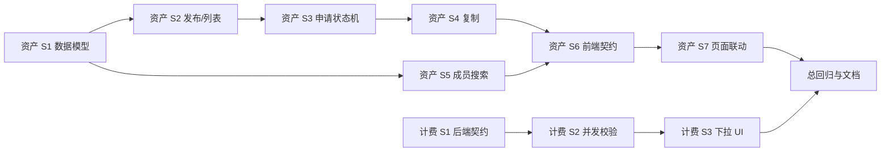

# 资产库公众池与价表模型选择 Implementation Plan

> **For agentic workers:** REQUIRED SUB-SKILL: Use superpowers:subagent-driven-development (recommended) or superpowers:executing-plans to implement this plan task-by-task. Steps use checkbox (`- [ ]`) syntax for tracking.

**Goal:** 完成人工测试中资产授权、公众池及价表模型手填三项遗留问题。

**Architecture:** 资产发布仅增加项目公开状态，读取仍落到原项目、资产与版本；审批授权独立于项目成员表。价表候选从启用的全局供应商实时派生，创建时在后端锁定供应商并校验模型归属与重复。

**Tech Stack:** Java 17、Spring Boot 3.2.5、MyBatis-Plus、PostgreSQL/Flyway、Vue 3、TypeScript、Naive UI、JUnit 5/Mockito、Vitest。

---

## 需求追踪

| 追踪编号 | 规格来源 | 子计划 |
|---|---|---|
| FR-F19-01 | 变更规格 §2.1/2.2：公开发布与官方标记 | [资产子计划](资产库公众池与成员授权.plan.md) |
| FR-F19-02 | §2.3：申请、审批、拒绝、撤销 | [资产子计划](资产库公众池与成员授权.plan.md) |
| FR-F19-03 | §3：普通 OWNER 成员候选搜索 | [资产子计划](资产库公众池与成员授权.plan.md) |
| FR-F19-04 | §5：只读引用与事务复制 | [资产子计划](资产库公众池与成员授权.plan.md) |
| FR-F20-01 | §4：未配置全局模型下拉与防绕过 | [计费子计划](价表模型选择.plan.md) |

## 依赖与并行化地图

| 批次 | 可执行步骤 | 说明 |
|---|---|---|
| B1 | 资产 Step 1；计费 Step 1 `[P]` | 文件无交集，可并行 |
| B2 | 资产 Step 2；计费 Step 2 `[P]` | 各自后端 TDD |
| B3 | 资产 Step 3→5；计费 Step 3 `[P]` | 资产状态机需串行；计费前端独立 |
| B4 | 资产 Step 6→7 | 前端契约先于页面 |
| B5 | 总计划 Step 1 | 全量回归、文档与问题单收口 |

## 实现步骤

- [ ] **Step 1：跨模块回归、人工验收与问题单收口**（移交 Phase 4）
  - **对应需求**：FR-F19-01、FR-F19-02、FR-F19-03、FR-F19-04、FR-F20-01。
  - **目标**：两个子计划完成后，以可重复证据关闭人工测试问题。
  - **动作（伪代码）**：Phase 3 已完成 Feature Map、User-Ops、README 与开发进度；Phase 4 按“相关单测→模块全测→编译构建→人工角色矩阵”执行，成功后再更新两份人工问题文档的已解决状态。
  - **文件**（≤20）：`workflow_output/docs/feature-map/项目资产库.feature-map.md`、`workflow_output/docs/user-ops/项目资产库用户操作手册.md`、`workflow_output/docs/feature-map/积分计费系统.feature-map.md`、`workflow_output/docs/user-ops/积分计费系统用户操作手册.md`、`workflow_output/人工测试问题/2x. 资产库和无限画布.md`、`workflow_output/人工测试问题/7x_积分系统.md`；新建 `workflow_output/开发进度/资产库公众池与价表模型选择/开发进度1.md`。
  - **依赖**：资产 Step 7、计费 Step 3。
  - **需人工介入**：真实浏览器最终验收需 OWNER、普通用户、管理员三个账号；无账号时先完成自动化门禁并记录待验项。
  - **安全/无障碍**：验证键盘可操作、按钮禁用说明、403 不泄露内容；验证普通用户看不到 `/api/users` 资料。
  - **验证**：后端 `mvn test`、`mvn compile`；前端 `npm run test -- --run`、`npm run build`；预期均退出码 0。人工覆盖 OPEN、申请审批、撤销、移出、复制、价表新增/编辑。

## Phase 3 硬闸门

- [x] 两份子计划及本总计划已由用户审阅。
- [x] 用户明确回复允许开始实现；未许可前不得修改业务代码。

## 术语表

| 术语 | 大白话 | 简单案例 |
|---|---|---|
| ACL | 判断某人对某份数据能做什么 | 获批用户只能读公共项目 |
| TDD | 先写失败测试，再写最少实现 | 先证明未获批读取失败 |
| 回滚锚点 | 出问题时可退回的 Git 节点 | `a0b67cf4157b792fea4833c018806b6e53b44a55` |
