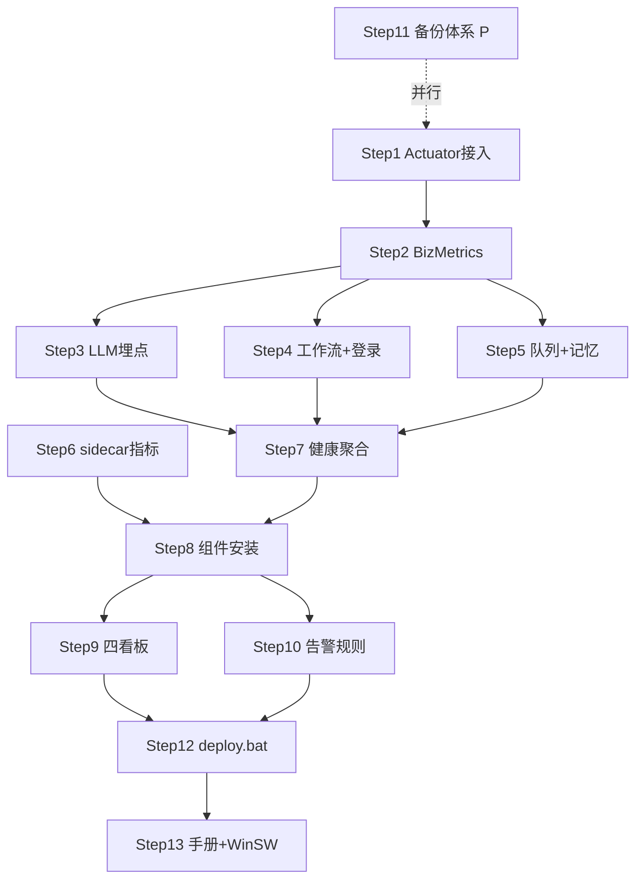

# Implementation Plan for 运维系统（Observability + Alerting + Backup + Release）

> Phase 2 产出。Phase 3 逐步勾选执行。只含伪代码，不含真代码。
> 来源规格：[4_运维系统.md](../../0_推进计划/4_运维系统.md)（唯一权威，本功能无 PRD）。
> 部署约束：Windows Server 单机、无 K8s；组件全部 WinSW 服务化；看板 JSON 入 `项目工程文档/运维/grafana-dashboards/` 版本化。
> 文档规模：≤5000 tokens。

## 背景与目标

现状：只有日志文件、出问题靠用户反馈、无备份策略、手工发布。目标四个「可」：可观测（JVM/HTTP/LLM/工作流/队列指标 + Grafana）、可告警（钉钉+邮件 5 分钟到人）、可恢复（RTO≤1h、RPO≤24h）、可发布（健康检查门禁 + 10 分钟回滚）。本规划是 RB-001「出事几小时才发现」的制度化修复。

## 需求编号映射表

| FR | 推进计划条目 | 内容 |
|---|---|---|
| OPS-FR-01 | P0-1 | Actuator + Prometheus registry 依赖与端点暴露（仅 localhost） |
| OPS-FR-02 | P0-2 | JVM/HTTP 基础指标（autotime 直方图） |
| OPS-FR-03 | P0-3① | LLM 指标：llm.calls/tokens.total + llm.latency，埋点 LlmGateway |
| OPS-FR-04 | P0-3② | 工作流指标：workflow.executions.total/duration |
| OPS-FR-05 | P0-3③ | 索引队列：knowledge.index.queue.depth Gauge / indexed.total |
| OPS-FR-06 | P0-3④ | 记忆管线：memory.pipeline.duration / memory.incidents.total |
| OPS-FR-07 | P0-3⑤ | 登录：auth.login.total{result} / 注册限流触发数 |
| OPS-FR-08 | P0-4 | sidecar 指标（prometheus-fastapi-instrumentator） |
| OPS-FR-09 | P0-5 | 健康检查聚合：sidecar HealthIndicator + 磁盘水位 indicator |
| OPS-FR-10 | P1-1 | Prometheus/Grafana/Alertmanager/windows_exporter 安装并 WinSW 服务化 |
| OPS-FR-11 | P1-2 | 四个预置看板（系统总览/接口质量/AI 核心链路/安全态势） |
| OPS-FR-12 | P1-3 | 告警规则 7 条 → 钉钉 webhook + 邮件兜底 |
| OPS-FR-13 | P2-1 | PG 每日 pg_dump 备份 + 保留策略 + 失败告警 |
| OPS-FR-14 | P2-2 | uploads/ robocopy 增量镜像 |
| OPS-FR-15 | P2-3 | Redis 默认 RDB，不投入精力 |
| OPS-FR-16 | P2-4 | 异地副本周同步 |
| OPS-FR-17 | P2-5/6 | 每季度恢复演练；RPO≤24h、RTO≤1h |
| OPS-FR-18 | P3-1 | deploy.bat 发布脚本（停→备→拷→起→健康轮询→失败回滚） |
| OPS-FR-19 | P3-2 | Flyway 门禁（flyway:repair + 迁移失败中止发布） |
| OPS-FR-20 | P3-3 | 回滚策略：jar/dist 保 3 版 + DB 只增不删 |
| OPS-FR-21 | P3-4 | 《运维手册.md》：巡检清单 + 故障 runbook |
| OPS-FR-22 | P3-5 | 后端 jar/sidecar/VictoriaLogs/Prometheus 全部 WinSW 兜底 |

## 技术坑点预判与规避措施

| 技术点 | 可能的坑 | 规避措施 | 验证方式 |
|---|---|---|---|
| metric tag 基数 | userId/traceId/agentId 进 tag 撑爆时序库 | **红线**：高基数值只进日志/span；Code Review + grep 检查 BizMetrics 调用点 | grep 全部 increment/record 调用确认 tag 为枚举集 |
| autotime 直方图 | uri 含路径变量（/chat/{id}）导致 uri tag 爆炸 | 用 Spring 的 URI 模板聚合（默认即模板），禁自定义 uri tag | /actuator/prometheus 看 http_server_requests 序列数 <200 |
| LLM SSE 埋点时机 | 流式调用成功/失败/中断路径多条，计数漏或重 | 在 LlmGateway 统一出口埋点：entry 计 calls，doOnComplete/doOnError/doOnCancel 三分支各记 result 且**正好一次**；tokens 仅成功且有 usage 时记 | 单测三分支断言各 +1；中断请求断言 cancel 计数 |
| IndexJobWorker Gauge | Gauge 注册时机晚于首次采集显示 NaN；5s 轮询不可见 | 应用启动即注册 queue.depth Gauge，读数回调查队列表 count；worker 每轮处理结束记 indexed.total | curl 启动后立即查 gauge 有值；塞 3 条任务看 counter +3 |
| /actuator 暴露面 | 端点被公网访问泄露 heap/配置 | Nginx **不反代** /actuator；management.server.port 不另开端口仅 localhost；防火墙复核 | 外网 curl /actuator → 404/拒连；localhost 可达 |
| pg_dump Windows 计划任务 | 中文路径/编码乱码；任务以 SYSTEM 跑无 DB 密码 | 脚本与备份目录全英文路径；bat 首行 chcp 65001 + pgpass 文件或 PGPASSWORD 环境变量；用服务账号跑 | 手工跑一次 bat 还原到测试库验证可用 |
| deploy.bat 健康轮询 | 启动慢超时误判 → 误回滚；回滚自身失败 | 轮询 /actuator/health 最长 5min、间隔 5s；回滚分支也跑健康轮询，再失败则告警人工介入 | 模拟坏包发布，断言自动回滚且旧版 UP |
| Alertmanager webhook | 钉钉机器人 URL 含 secret token 入 git | webhook 配置放服务器本地 alertmanager.yml，仓库只存模板 `alertmanager.yml.example` | git grep 无真实 token |
| 指标埋点开销 | 每请求计数拖慢主链路 | Micrometer 计数 O(1)；直方图 bucket 用默认分位直方图；禁在埋点里做 IO/查库（Gauge 回调除外） | JMeter 压测对比埋点前后 P95 差异 <3% |

## 安全检查清单

- [ ] **端点暴露**：/actuator 仅 localhost 可达，Nginx 无反代规则（OPS-FR-01）
- [ ] **高基数红线**：userId/traceId/agentId 不进任何 metric tag
- [ ] **密钥管理**：钉钉 webhook URL 只存服务器本地，仓库仅模板；告警内容不含 prompt/用户数据
- [ ] **备份文件权限**：备份目录 ACL 仅服务账号+管理员可读；异地副本传输走加密通道
- [ ] **错误处理**：HealthIndicator 失败信息不泄露连接串/凭证
- [ ] **密钥轮换衔接**：runbook 写明「密钥泄露→轮换→Redis 黑名单失效旧 token」流程，与安全体系文档衔接
- [ ] **依赖安全**：micrometer-registry-prometheus、prometheus-fastapi-instrumentator 无已知 CVE

## 性能考虑与验证计划

- [ ] 埋点本身开销：Counter/Timer 为 O(1) 内存操作，主链路零 IO；压测 P95 差异 <3%
- [ ] 直方图 bucket：llm.latency 用毫秒级 bucket（100ms~60s），http autotime 用默认 bucket
- [ ] 采集异步：Prometheus 15s 拉模式，不阻塞应用；queue.depth Gauge 回调走既有轻查询
- [ ] sidecar 埋点复用 instrumentator 中间件，图执行耗时直方图 bucket 对齐 LLM 慢调用量级
- [ ] Phase4 验证：连续聊天 50 轮观察 Prometheus 序列数稳定不膨胀

## 功能联动点清单

| 触发 | 联动对象 | 预期变化 | 边界 |
|---|---|---|---|
| 任意 LLM 调用（含流式） | llm.calls.total{provider,model,result} | +1，正好一次 | 中断记 result=cancel，不重不漏 |
| LLM 指标 + 积分计费已上线 | 对账 | llm.calls 成功数 ≈ 计费 usage_logs 成功行数 | 允许极小差（扣减失败重试），偏差大即告警线索 |
| kill 后端进程 | up==0 → Alertmanager | 1min 内 critical → 钉钉群 | 恢复后自动发 resolved |
| LLM 单 provider 失败率 >30%/5min | warning 告警 | RB-001 类故障早期信号 | 流量太低时比率抖动，配 for 窗口 |
| 索引队列积压 >1000 持续 10min | warning 告警 → runbook | 重启 IndexJobWorker 处置 | 大批量导入期属正常，看趋势不看单点 |
| 备份脚本失败 | 事件日志 + 告警 | 当日巡检必清零 | 磁盘满是最常见失败因 |
| 单 IP 登录失败 >10 次/min | warning → 联动安全体系 | 提示爆破 | 与安全体系限流策略阈值对齐 |
| deploy.bat 迁移失败 | Flyway 门禁 | 中止发布，不起新包 | 人工 flyway:repair 后重发 |

## 运维考量清单

| 项 | 结论 | 说明 |
|---|---|---|
| 可观测性 | **做（核心交付）** | 本计划主体即指标+看板+告警；关键脚本（备份/发布）写事件日志 |
| 配置开关 | 做 | `management.metrics.enable.*` 可关单项指标；告警规则热加载（alertmanager reload） |
| 可回滚 | 做 | P0 纯代码随版本回退；发布=Flyway 门禁 + jar/dist 保 3 版 + DB 只增不删 |
| 限流/熔断/降级 | 不做 | 本计划不做限流熔断，另见 [5_安全体系.md](../../0_推进计划/5_安全体系.md) |
| 运维入口 | 做 | 《运维手册.md》巡检清单 + runbook 为统一入口 |
| 告警阈值 | 做 | 7 条阈值表见 OPS-FR-12（宕机/磁盘/5xx/LLM 失败率/队列积压/heap/爆破） |
| 容量预案 | 做 | 备份保留 7 日备+4 周备控磁盘；磁盘 <15% critical 告警即水位闸门 |

## 实现步骤

### Chunk P0 · 指标采集 + 健康检查（纯代码，FR-01~09）

- [x] **Step 1：Actuator + Prometheus 接入**（对应需求：OPS-FR-01、OPS-FR-02）
  - **目标**：三个端点（health,info,prometheus）仅 localhost 可达；JVM/HTTP 指标自动产出。
  - **动作**：pom 加 actuator + micrometer-registry-prometheus；yml 暴露 health,info,prometheus，开启 `web.server.request.autotime`；确认 Nginx 无 /actuator 反代。
  - **文件**：`backend/pom.xml`、`backend/src/main/resources/application.yml`
  - **依赖**：无。**需人工介入**：复核线上 Nginx 配置。
  - **安全检查**：端点暴露面。**验证**：`curl localhost:8080/actuator/prometheus` 有 jvm_/http_server_requests 序列且 uri 为模板。

- [x] **Step 2：BizMetrics 统一注册类**（对应需求：OPS-FR-03~07 骨架）
  - **目标**：`common/metrics/BizMetrics.java` 集中声明全部业务指标，tag 白名单化。
  - **动作**：注入 MeterRegistry；定义 llmCalls(provider,model,result)、llmTokens(provider,model,direction)、llmLatency、workflowExecutions(status)、workflowDuration、indexQueueDepth(Gauge 回调注册)、indexed(result)、memoryDuration、memoryIncidents、authLogin(result)、registerRateLimited 各方法；类注释写明高基数红线。
  - **文件**：`common/metrics/BizMetrics.java`
  - **依赖**：Step 1。**验证**：单测各方法注册后 /actuator/prometheus 出现对应序列。

- [ ] **Step 3：LLM 指标埋点**（对应需求：OPS-FR-03）
  - **目标**：所有 LLM 调用（含 SSE）在咽喉处正好计一次。
  - **动作**：`llm/LlmGateway.java` 出口统一包埋点：进入计 calls；阻塞式 try/catch/finally 记 result；流式在 doOnComplete/doOnError/doOnCancel 三分支各记一次；成功且有 usage 时记 tokens in/out + latency 直方图。
  - **文件**：`llm/LlmGateway.java`、`common/metrics/BizMetrics.java`
  - **依赖**：Step 2。**验证**：聊一轮 → grep llm_calls_total 对应 provider/model +1；模拟失败与中断各计一次不重不漏。

- [ ] **Step 4：工作流 + 登录指标埋点**（对应需求：OPS-FR-04、OPS-FR-07）
  - **目标**：工作流终态与登录结果可计量。
  - **动作**：`execution/service/ExecutionLogService.java` 在状态落库处按终态记 workflow.executions.total{status} + duration；`auth/service/AuthService.java` 登录成功/失败各记 auth.login.total{result}，注册限流触发处记 registerRateLimited。
  - **文件**：`execution/service/ExecutionLogService.java`、`auth/service/AuthService.java`
  - **依赖**：Step 2。**[P] 可并行**（与 Step 3/5/6 文件不重叠）。**验证**：跑一次工作流 + 一次失败登录，序列按预期 +1。

- [ ] **Step 5：索引队列 + 记忆管线指标**（对应需求：OPS-FR-05、OPS-FR-06）
  - **目标**：5s 轮询黑盒与记忆管线故障可见。
  - **动作**：`knowledge/service/IndexJobWorker.java` 每轮处理结束记 indexed.total{result}，queue.depth Gauge 回调查队列表 count（启动即注册）；`chat/service/MemoryService.java` recordIncident 处记 memory.incidents.total，管线耗时记 memory.pipeline.duration。
  - **文件**：`knowledge/service/IndexJobWorker.java`、`chat/service/MemoryService.java`
  - **依赖**：Step 2。**[P] 可并行**。**验证**：塞 3 条索引任务 → counter +3、gauge 回落；触发一次 incident → +1。

- [ ] **Step 6：sidecar 指标**（对应需求：OPS-FR-08）
  - **目标**：FastAPI 图执行次数/耗时/节点失败率进 Prometheus。
  - **动作**：sidecar 引入 prometheus-fastapi-instrumentator 挂 /metrics；图执行服务加自定义 counter/histogram（执行次数、耗时、节点失败率，低基数 tag=节点类型）。
  - **文件**：`sidecar/main.py`（或等价入口）、`sidecar/requirements.txt`、图执行服务文件
  - **依赖**：无（sidecar 独立）。**[P] 可并行**。**验证**：curl sidecar /metrics 有序列；跑一次图执行 +1。

- [ ] **Step 7：健康检查聚合**（对应需求：OPS-FR-09）
  - **目标**：/actuator/health 一处看全 PG/Redis/sidecar/磁盘。
  - **动作**：新增 SidecarHealthIndicator（HTTP 探活 sidecar /health，超时 2s 记 DOWN）+ DiskSpaceHealthIndicator 调阈值（可用 <15% 报 DOWN，对齐告警）。
  - **文件**：`common/health/SidecarHealthIndicator.java`、`common/health/DiskSpaceHealthIndicator.java`（或 yml 调阈值）
  - **依赖**：Step 1。**需人工介入**：无。**验证**：停 sidecar → health 变 DOWN 含 sidecar 节点；恢复 → UP。

### Chunk P1 · 看板 + 告警（FR-10~12，需服务器运维窗口）

- [ ] **Step 8：监控组件安装与服务化**（对应需求：OPS-FR-10）
  - **目标**：Prometheus/Grafana/Alertmanager/windows_exporter 常驻自启。
  - **动作**：四组件解压安装；prometheus.yml 配 4 个 scrape job（backend actuator、sidecar、windows_exporter、自身）；全部 WinSW 注册为 Windows 服务（开机自启+崩溃重启）。
  - **文件**：`项目工程文档/运维/prometheus/prometheus.yml`、`项目工程文档/运维/winsw/*.xml`（服务定义模板入库）
  - **依赖**：Step 1~7（需真实端点验证抓取）。**需人工介入**：服务器窗口安装 + 启动服务。**验证**：Prometheus targets 页全部 UP。

- [ ] **Step 9：四个预置看板**（对应需求：OPS-FR-11）
  - **目标**：系统总览/接口质量/AI 核心链路/安全态势四屏可用。
  - **动作**：逐看板建 panel（系统：CPU/内存/磁盘/heap/GC/Tomcat；接口：QPS/P95/P99/4xx5xx 按 uri 模板；AI：llm 量/成功率/延迟/token 按 provider+model、workflow 成功率、队列深度；安全：登录失败趋势/限流/审计量），导出 JSON 入库版本化，Grafana provisioning 自动加载。
  - **文件**：`项目工程文档/运维/grafana-dashboards/system-overview.json`、`api-quality.json`、`ai-core.json`、`security.json`
  - **依赖**：Step 8。**需人工介入**：面板视觉微调。**验证**：四看板数据齐全（P1 验收要点）。

- [ ] **Step 10：告警规则 + 通知通道**（对应需求：OPS-FR-12）
  - **目标**：7 条告警 → 钉钉 + 邮件兜底，5 分钟到人。
  - **动作**：alert rules 文件写 7 条规则（up==0 1min critical；磁盘<15% critical；5xx 率>5%/5min warning；单 provider LLM 失败率>30%/5min warning；queue.depth>1000/10min warning；heap>85%/10min info；单 IP 登录失败>10/min warning）；alertmanager.yml 配钉钉 webhook + SMTP 邮件兜底；仓库只存模板去密钥。
  - **文件**：`项目工程文档/运维/prometheus/alert-rules.yml`、`项目工程文档/运维/alertmanager/alertmanager.yml.example`
  - **依赖**：Step 8。**需人工介入**：填真实 webhook/SMTP 密钥（不入库）。**安全检查**：密钥不入 git。**验证**：kill 后端进程 → 5 分钟内钉钉收到 critical；恢复后 resolved（P1 验收要点）。

### Chunk P2 · 备份恢复（FR-13~17，与 P0 无依赖可并行）

- [ ] **Step 11：备份脚本 + 计划任务 + 异地副本 + 演练规程**（对应需求：OPS-FR-13~17）
  - **目标**：RPO≤24h、RTO≤1h，备份失败可见。
  - **动作**：① `backup-pg.bat`：pg_dump -Fc 每日 02:00，chcp 65001 + 全英文路径，保留 7 日备+4 周备，完成写事件日志、失败调告警 webhook；② `backup-files.bat`：robocopy /MIR 增量镜像 uploads/；③ Redis 维持默认 RDB 不投入；④ `sync-offsite.bat` 周同步异地；⑤ 演练规程文档：隔离环境恢复 PG+文件→起应用抽查，记录入运维手册。
  - **文件**：`项目工程文档/运维/backup/backup-pg.bat`、`backup-files.bat`、`sync-offsite.bat`、`项目工程文档/运维/恢复演练规程.md`
  - **依赖**：无。**[P] 可并行**（与 P0 代码完全独立）。**需人工介入**：注册计划任务、准备异地目标机/对象存储。**安全检查**：备份目录 ACL。**验证**：手工跑 pg_dump 并还原到测试库抽查数据；删一文件后 robocopy 同步正确。

### Chunk P3 · 发布标准化 + 手册（FR-18~22）

- [ ] **Step 12：deploy.bat + Flyway 门禁 + 回滚策略**（对应需求：OPS-FR-18~20）
  - **目标**：一键发布，迁移失败中止，10 分钟可回滚。
  - **动作**：deploy.bat 伪流程：先 flyway:repair + migrate（失败即中止退出）→ 停服 → 备份当前 jar/dist 到版本目录（只保最近 3 版）→ 拷新包 → 起服 → 轮询 /actuator/health 5min/5s → 超时则自动换回旧包再轮询 → 仍失败告警人工；DB 迁移纪律「只增不删、向后兼容」写入脚本注释与手册。
  - **文件**：`项目工程文档/运维/deploy/deploy.bat`
  - **依赖**：Step 10（健康门禁与告警就位，推进计划明确 P3 依赖 P1）。**需人工介入**：真实发布窗口首跑。**验证**：模拟坏包发布 → 自动回滚旧版 UP；模拟迁移失败 → 发布中止。

- [ ] **Step 13：《运维手册》+ WinSW 兜底**（对应需求：OPS-FR-21、OPS-FR-22）
  - **目标**：巡检/runbook 成文，全部进程服务化。
  - **动作**：手册含每日巡检（告警清零/磁盘/备份成功标记）、每周（错误日志趋势/慢查询）、每季（恢复演练）；runbook 三条（LLM 超时→查 provider 状态与告警；队列积压→重启 IndexJobWorker；线程打满→grep io-8080-exec 速查表 22）；后端 jar/sidecar/VictoriaLogs/Prometheus 全部 WinSW 注册（崩溃自启+开机自启），服务 xml 模板入库。
  - **文件**：`项目工程文档/运维/运维手册.md`、`项目工程文档/运维/winsw/backend.xml`、`sidecar.xml`、`victorialogs.xml`
  - **依赖**：Step 12。**需人工介入**：服务器注册服务。**验证**：kill 后端服务进程 → WinSW 自动拉起；手册评审通过。

## 依赖与并行化地图

- 串行主干：Step1 → Step2 → {Step3, Step4, Step5} → Step7 → Step8 → Step9/Step10 → Step12 → Step13
- `[P]` 并行：Step3/4/5/6 互不重叠；**Step11（P2 备份）与全部 P0/P1 代码工作可并行**（推进计划明确 P2 无依赖）。

| 批次 | 可并行 Steps |
|---|---|
| B1 | Step 1、Step 6、Step 11 |
| B2 | Step 2 |
| B3 | Step 3、Step 4、Step 5 |
| B4 | Step 7 |
| B5 | Step 8 |
| B6 | Step 9、Step 10 |
| B7 | Step 12 → Step 13 |

## 整体验证（功能级）

- [ ] P0 验收（推进计划原文要点）：`curl localhost:8080/actuator/prometheus | grep llm_calls_total` 有数据；聊一轮天 → 对应 provider/model 计数 +1
- [ ] P1 验收（原文要点）：手动 kill 后端进程 → 5 分钟内钉钉群收到 critical 告警；Grafana 四个看板数据齐全
- [ ] 备份还原演练通过（PG + 文件，抽查数据正确）
- [ ] 模拟坏包发布 → 自动回滚；模拟迁移失败 → 发布中止
- [ ] 安全检查清单全部完成（端点 localhost、webhook 无密钥入 git、备份 ACL）
- [ ] 高基数红线复核：grep 全部埋点 tag 均为枚举集；Prometheus 序列数稳定不膨胀
- [ ] 与 [4_运维系统.md](../../0_推进计划/4_运维系统.md) 逐条对齐复核（FR-01~22 全覆盖）

## 术语表

| 术语 | 大白话 | 简单案例 |
|---|---|---|
| Actuator | Spring Boot 自带的「体检接口」 | /actuator/health 返回 UP 表示活着 |
| Prometheus | 定时来抄指标的「指标仓库」 | 每 15s 拉一次 /actuator/prometheus |
| Counter | 只增不减的计数器 | llm.calls.total 每调一次 +1 |
| Gauge | 可升可降的瞬时表 | queue.depth 当前积压 37 条 |
| Histogram | 分桶统计分布（算 P95/P99） | llm.latency 落在 1~2s 桶的次数 |
| Alertmanager | 告警「分拣+派送员」 | up==0 持续 1min → 推钉钉群 |
| WinSW | 把 jar/exe 包成 Windows 服务的工具 | 后端崩溃后自动重启、开机自启 |
| RTO/RPO | 多久能恢复 / 最多丢多久数据 | RTO≤1h、RPO≤24h（日备） |
| pg_dump | PostgreSQL 官方备份工具 | 每日 02:00 导出 -Fc 压缩格式 |

## 备注

- 无 PRD，FR 编号为本计划自定义；如推进计划条目调整需同步映射表。
- 告警 webhook/SMTP 密钥、异地副本目标地址等环境值在执行时由人工填入服务器本地配置，不入库。
