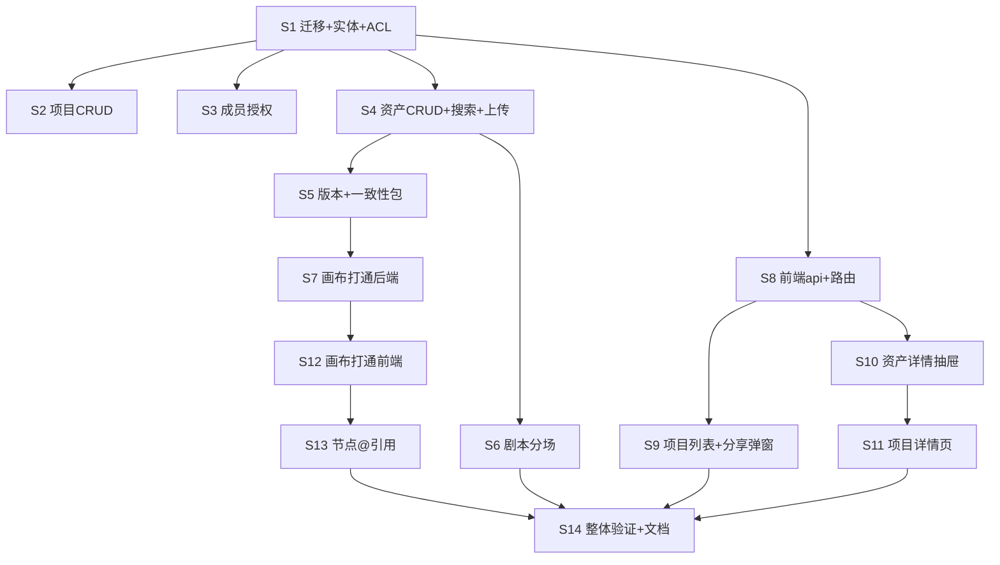

# Implementation Plan for 项目资产库

> Phase 2 产出。Phase 3 逐步勾选执行。只含伪代码，不含真代码。
> 来源规格：[项目资产库设计方案.md](项目资产库设计方案.md)（本功能无 Phase 1 PRD，设计方案即规格；FR 编号本 plan 自定义并回链方案章节）
> 范围：设计方案 P0 + P1 + §十三 @引用机制；P2（AI 打标/以图搜图/链接分享）不在本 plan。

## 背景与目标

- 项目级资产中枢：五类资产（提示词/剧本/图片/视频/音频）× 叙事角色（人物/道具/场景/风格/通用）双轴矩阵 + 项目级三角色授权 + 版本/一致性包 + 画布双向打通 + 画布节点 @引用。
- FR 编号 ↔ 方案章节：FR-001 项目CRUD(§九)｜FR-002 成员授权(§七)｜FR-003 资产CRUD+双轴(§二)｜FR-004 上传+技术元数据(§三)｜FR-005 搜索筛选(§2.2)｜FR-006 版本状态机(§六)｜FR-007 一致性包(§五)｜FR-008 画布入库(§八)｜FR-009 库→画布引用(§八)｜FR-010 剧本分场(§四)｜FR-011 双向追溯(§八)｜FR-012 节点@引用(§十三)

## 技术实现坑点预判与规避措施

| 技术点/功能块 | 可能的坑 | 规避措施 | 验证方式 |
|---|---|---|---|
| JSONB 标签/角色筛选 | 全表 jsonb 扫描慢 | 先用 `(project_id,media_type,updated_at)` 部分索引缩圈，角色过滤走 `asset_role_links` 关系表（不查 JSONB） | 查执行计划，确认走索引 |
| 资产列表带角色/版本号 | N+1（每资产查一次角色链接） | 列表查出 ids 后 `IN` 批查 role_links 内存组装 | 开 SQL 日志数查询条数 |
| 矩阵每格计数徽章 | 每格一次 count = 几十次查询 | 单条 `GROUP BY media_type, role` 聚合返全图 | 接口只发 1 条聚合 SQL |
| 版本表 content 大文本 | 列表查询带出剧本全文拖慢 | 版本列表只 select meta，content 按需单取 | 列表响应 <300ms |
| 并发建新版本 | 两人同时提交版本号撞车 | `current_version` 乐观锁（UPDATE … WHERE current_version=?），失败重读重试 | 并发单测模拟 |
| 重复授权 | 同人同项目两条 member | `UNIQUE(project_id,user_id)` 数据库兜底 | 重复 POST 返回友好错误 |
| 中文模糊搜索 | PG LIKE 中文不走索引 | 项目内数据量小可接受；q≤50 字符；后续 pg_trgm | 千条资产搜索 <500ms |
| 视频技术元数据提取 | javacv 读大文件阻塞上传请求 | 上传先返 fileId，元数据异步/懒提取补写 | 大视频上传不超时 |
| 祖先链 BFS（前端） | 画布有环时 BFS 死循环 | visited 集合；检测成环 → 选择器为空+提示解环 | 构造环画布手测 |
| @占位符解析 | 递归展开死循环 | 不递归：注入的是上游已物化产出文本，不再二次解析 | A@B、B 内含@ 手测 |
| 快照 label 唯一 | 历史快照有重复 label | loadSnapshot 时自动加序号幂等修正 | 载入旧快照验证 |

## 安全检查清单

- [ ] **鉴权/授权**：`/api/assets/**` 全端点 `@RequirePermission("asset:write")`；`AclService.loadAccessible` 三判（owner/member/admin）为所有项目级端点咽喉；viewer 可只读引用、一切写操作 403
- [ ] **输入校验**：name≤100、提示词/剧本≤8000、搜索 q≤50、role_key 受控词汇内、上传类型↔资产类型匹配（mp4 不可入图片资产）
- [ ] **数据加密**：无新增敏感数据（复用现有 JWT/文件 auth）
- [ ] **审计日志**：成员授权/移除/转让、定稿、归档打日志（userId/projectId/assetId/动作）
- [ ] **错误处理**：固定话术，不透传 `e.getMessage()`（同 canvas 安全清单）
- [ ] **CORS/CSRF**：无新增跨域面
- [ ] **依赖安全**：无新增第三方依赖
- [ ] **越权读文件**：bindings/usages/下载前校验调用方对 asset 的访问权，防遍历 fileId

## 性能考虑与验证计划

- [ ] 查询效率：三索引（assets 部分索引、role_links(asset_id)、members(user_id)）；列表全分页（默认 20）
- [ ] 缓存：MVP 不加缓存（项目内数据量小）；受控词汇随项目详情一次返
- [ ] 并发：版本乐观锁；快照保存沿用画布节流模式
- [ ] 资源：上传复用 `storeStream` 流式；版本 content 懒加载
- [ ] Phase 4 测量：项目详情首屏（100 资产）<1s；矩阵筛选 <300ms；搜索 <500ms

## 功能联动点清单（独立 chunk，Phase 3 逐条实现+验证）

| # | 触发动作 | 联动对象 | 预期变化 | 边界（反向/半选/批量） |
|---|---|---|---|---|
| L1 | 移除成员 | 其「共享给我」列表 | 项目消失；其画布已引用快照不变 | owner 不可被移除；移除自己=退出；移除 viewer/editor 一视同仁 |
| L2 | 资产定稿(LOCK) | 画布引用 | 已有引用锁定当前版本快照；后续新版不影响 | 解锁回退草稿可再改；归档资产不可定稿 |
| L3 | 资产归档 | 列表/搜索 | 默认列表隐藏、搜索加状态过滤可及；画布引用不受影响 | 取消归档恢复；批量归档逐条确认 |
| L4 | 删除项目 | 项目内资产/成员/绑定 | 全部级联软删；stored_files 文件保留；画布引用快照不受影响 | 仅 owner；有成员时二次确认列明影响 |
| L5 | 节点入库 | 资产库计数 | 对应矩阵格计数+1；落 PRODUCED 绑定 | 已有 PRODUCED 绑定的节点再入库 → 默认「存为新版本」（可选新建）；空节点拦截 |
| L6 | 从库选择资产到节点 | 节点徽标 | 显示「来自资产·xx v2」；资产升 v3 后徽标提示「有新版」不自动变 | 手动「更新到最新版」；资产归档/失权后徽标灰显但快照可用 |
| L7 | 删连线 | 下游 @引用 | chip 灰显「断链」，运行前提示重连或移除 | 重连后自动恢复；多条断链逐条列出 |
| L8 | 删节点/重命名 | 下游 @引用 | 删节点→标红「上游缺失」；重命名→chip 跟随新名（id 不断链） | 级联不删下游 |
| L9 | label 唯一 | 新建/粘贴/重命名 | 三入口查重：自动序号或拦截 | 旧快照载入幂等修正 |
| L10 | 删除叙事角色桶 | 挂该桶的资产 | 有资产挂载时二次确认：资产自动归入「通用」 | 空桶直接删；默认五桶可删可加 |

## 运维考量清单

- **可观测性**：做——CRUD/授权/入库/引用关键路径打日志（userId/projectId/assetId，复用 media traceId 风格）
- **配置开关**：做——`asset:write` 权限 seed gated 仅 admin（同 canvas:write 范式，控得住入口）
- **可回滚**：做——V56~V59 全新表无存量变更，回滚=drop 表；不涉及存量数据迁移
- **限流/熔断/降级**：做——上传大小/类型复用 stored_files 现有限制；剧本拆分场走 LlmGateway 现有超时+容错话术；无新第三方依赖故不新增熔断
- **运维入口**：不做——admin 旁路全量可查可修，暂够；脏数据修复后续再说
- **告警阈值**：不做——复用平台现有告警，无新指标
- **容量预案**：想过，后续再说——版本表 content 随剧本迭代增长，千版本级再评估保留策略（如只留近 20 版）

## 依赖与并行化地图

### 执行顺序与并行批

| 批次 | Step | 依赖 | 并行性 | 说明 |
|---|---|---|---|---|
| B1 | S1 迁移+实体+ACL | —— | 独立先行 | 全部后端的地基 |
| B2 | S2 项目CRUD / S3 成员授权 / S4 资产CRUD+搜索+上传 / S8 前端api+路由 | S1 | `[P]`×4 文件互不重叠 | S8 接口契约以本 plan 为准先行 |
| B3 | S5 版本状态机+一致性包 / S6 剧本分场 / S9 项目列表页+分享弹窗 / S10 资产详情抽屉 | S4 / S4 / S8 / S8 | `[P]`×4 | S5/S6 后端不同文件；S9/S10 前端不同文件 |
| B4 | S7 画布打通后端 / S11 项目详情页 | S5 / S10 | `[P]`×2 前后端分离 | S11 内嵌 S10 的抽屉故在其后 |
| B5 | S12 画布打通前端 | S7 | 串行 | 改 PropertyPanel/CanvasView |
| B6 | S13 节点@引用 | S12 | 串行 | 同改 PropertyPanel/CanvasView，禁并行 |
| B7 | S14 整体验证+文档收尾 | 全部 | 串行 | 速查表 25 + FeatureMap + UserOps |

> ⚠️ S12 与 S13 同改 `PropertyPanel.vue`/`CanvasView.vue`，**不得并行**（模板铁律：文件重叠降级串行）。

### 依赖图（mermaid）

## 实现步骤

- [x] **Step 1：Flyway V56~V59 + 实体/Mapper + AclService**（aa9b2385，AclServiceTest 10/10）
  - **对应需求**：FR-001/002/003/006/011（地基）
  - **目标**：六表就位（asset_projects / assets / asset_versions / asset_role_links / asset_project_members / asset_bindings）+ 归属咽喉点
  - **动作**：写 4 个迁移 SQL（新 `SOURCE_ASSET` 常量入 FileStorage 枚举处）；实体继承 BaseEntity；Mapper 纯 BaseMapper；`AclService.loadAccessible(projectId,userId)` 伪码：`project.ownerId==user → OWNER；member 表查到 → 其角色；isAdmin → 旁路；否则 403`
  - **文件**：`db/migration/V56__asset_projects.sql`、`V57__assets.sql`、`V58__asset_members.sql`、`V59__asset_bindings.sql`、`asset/entity/*`(6)、`asset/mapper/*`(6)、`asset/service/AssetAclService.java`、stored_files source 常量
  - **依赖/并行**：B1 独立先行
  - **需人工介入**：否
  - **安全检查**：唯一索引 (project_id,user_id)；部分索引 WHERE deleted=0
  - **验证**：Flyway 启动通过；AclService 单测（owner/viewer/editor/admin/无关人 5 角色矩阵）

- [x] **Step 2：项目 CRUD + 受控词汇维护**（356946e4，ProjectServiceTest 8/8）
  - **对应需求**：FR-001
  - **目标**：项目建/改/删/列表（我的+共享给我两视图）
  - **动作**：ProjectController/Service；删项目=级联软删资产/成员/绑定（L4）；narrative_roles JSONB 默认五桶；删桶联动 L10
  - **文件**：`AssetProjectController.java`、`AssetProjectService.java`、`dto/Project*Request/VO`
  - **依赖/并行**：依赖 S1；B2 `[P]` 与 S3/S4/S8 无文件交集
  - **安全检查**：全端点 `@RequirePermission("asset:write")` + Acl 咽喉
  - **验证**：单测 CRUD + 级联软删 + 两视图列表正确性

- [x] **Step 3：成员授权**（152c71b9，MemberServiceTest 10/10）
  - **对应需求**：FR-002
  - **目标**：成员列表/邀请(角色)/改角色/移除/转让 owner（L1）
  - **动作**：MemberController/Service；授权/移除/转让打审计日志；转让=旧 owner 降级 editor
  - **文件**：`AssetMemberController.java`、`AssetMemberService.java`、`dto/Member*`
  - **依赖/并行**：依赖 S1；B2 `[P]`
  - **安全检查**：仅 owner 可操作成员；移除后 Acl 即刻拒访
  - **验证**：单测授权矩阵（viewer 写操作 403）+ 审计日志断言

- [x] **Step 4：资产 CRUD + 矩阵筛选/搜索 + 上传**（6ed92598+7f644112，AssetServiceTest 12/12）
  - **对应需求**：FR-003/004/005
  - **目标**：五类资产建改删查；`GET /assets?type=&role=&tag=&q=&status=` 矩阵筛选；计数聚合端点；上传落 SOURCE_ASSET + 技术元数据（图片宽高/视频时长分辨率，javacv 懒提取）
  - **动作**：AssetController/Service；role_links 批查组装（防 N+1）；`GROUP BY` 计数端点；上传类型↔资产类型校验
  - **文件**：`AssetController.java`、`AssetService.java`、`AssetUploadController.java`、`dto/Asset*`
  - **依赖/并行**：依赖 S1；B2 `[P]`
  - **安全检查**：输入校验全套（name/q 长度、类型匹配）
  - **验证**：单测筛选组合 + 计数聚合 + 上传元数据回写

- [x] **Step 5：版本与状态机 + 一致性包结构**（11/11 单测：AssetVersionServiceTest 7 + AssetServiceTest 状态机 +5）
  - **对应需求**：FR-006/007
  - **目标**：自动版本（乐观锁）、版本列表（meta only）、定稿/归档状态机（L2/L3）、一致性包字段约定（主参考图/图集/标准描述/参数基线 入 content/gen_meta）
  - **文件**：`AssetVersionService.java`、`AssetService.java`(追加)、`dto/Version*`
  - **依赖/并行**：依赖 S4；B3 `[P]`
  - **验证**：并发版本单测 + 状态机非法跃迁 400
  - **落地**：`AssetMapper.bumpVersionOptimistic`（WHERE current_version=? 0 行=冲突→CONFLICT）；lock/unlock/archive/unarchive（幂等+非法跃迁 400）；`AssetVersionService.createVersion/saveConsistencyPack`；一致性包局部合并进 `content.consistency`（null=不改）；端点 GET/POST versions、POST lock/unlock/archive/unarchive、PUT consistency-pack

- [x] **Step 6：剧本分场（AI 拆分）**（AssetScriptServiceTest 6/6：正常/围栏/纯文本兜底 + 类型校验）
  - **对应需求**：FR-010
  - **目标**：剧本资产「拆分场」端点 → LlmGateway → scenes JSONB 入 content
  - **动作**：复用 canvas parseScenes 容错模式（剥围栏→取数组→兜底单条）；剧本 ≤8000 校验
  - **文件**：`AssetScriptService.java`、`dto/Scene*`
  - **依赖/并行**：依赖 S4；B3 `[P]`
  - **验证**：单测 mock LlmGateway：正常 JSON/带围栏/纯文本三态
  - **落地**：`AssetScriptService.breakdown`（model 缺省 `asset.script-model`；scenes 入 `content.scenes`+产新版本；非剧本 400）

- [x] **Step 7：画布打通后端 + 权限 seed**（081cead8，AssetBindingServiceTest 5 + AssetCanvasBridgeServiceTest 9 = 14/14 新绿；asset 包 72/72）
  - **对应需求**：FR-008/009/011
  - **目标**：`POST /canvas-import`（节点产出入库：谱系捕获+PRODUCED 绑定+重复入库建议新版本）；`POST /assets/{id}/resolve`（引用解析=返当前/指定版本 fileId+内容，viewer 可用）；`GET /assets/{id}/usages`；bindings 落表；`asset:write` seed gated admin
  - **文件**：`AssetCanvasBridgeController.java`、`AssetCanvasBridgeService.java`、`AssetBindingService.java`、权限 seed SQL(并入 V58)
  - **依赖/并行**：依赖 S5；B4 `[P]`
  - **安全检查**：resolve/usages 前过 Acl（防遍历 fileId）；入库弹窗项目列表=owner/editor 项目（viewer 过滤）
  - **验证**：单测绑定双向查 + viewer resolve 通过/write 403 + 重复入库检测
  - **落地**：`AssetBindingService`（PRODUCED/REFERENCE 写入 + findProduced 重复检测 + listUsages）；`AssetCanvasBridgeService`（importFromCanvas 按节点类型映射 5 类资产 + gen_meta 谱系捕获 + 空节点拦截 + 重复三态 NEW_VERSION/NEW_ASSET/提示；resolve 版本快照 viewer 可读；usages 双向追溯）；单向只读依赖 `CanvasService.loadOwned` 复用画布归属咽喉点 + 读 snapshot，canvas 包零回归（设计 §十四）。`asset:write` seed 已在 V58（S3 落），S7 无新迁移。`AssetMapper +updateGenMeta`；`AssetService` 公开 `attachRoles`/`validateAssetName` 复用受控词汇校验。端点：`POST /api/assets/canvas-import` + `POST /api/assets/assets/{id}/resolve` + `GET /api/assets/assets/{id}/usages`。

- [x] **Step 8：前端 api/types/路由/Sidebar**（5fc4bd9d，vue-tsc 绿 + vitest 105/105 零回归）
  - **对应需求**：FR-001~005（前端地基）
  - **目标**：`api/assets.ts` 全端点封装；`types/asset.ts`；路由 `/assets`、`/assets/:id`；Sidebar「资产库」`hasPermission('asset:write')` 显隐；页内 403 卡片
  - **文件**：`api/assets.ts`、`types/asset.ts`、`router/index.ts`、`components/Sidebar.vue`、`views/AssetListView.vue`、`views/AssetProjectView.vue`（占位，S9/S11 填充）
  - **依赖/并行**：依赖 S1（契约以 plan 为准）；B2 `[P]`
  - **验证**：无权限用户菜单隐藏 + 直访路由 403 卡片
  - **落地**：`types/asset.ts` 全量类型（项目/成员/资产/矩阵计数/版本/一致性包/分场/画布打通 import·resolve·usage）；`api/assets.ts` 按域分 6 组（projectApi/memberApi/assetApi/versionApi/scriptApi/assetBridgeApi）全端点封装，复用 `@/api/admin` 的 `PageResult` + `./request` 的 `ApiResponse`；路由 `/assets`+`/assets/:id`（三重兜底同 canvas）；Sidebar `AlbumsOutline` 入口 `canEditAssets`（asset:write）显隐；两占位 view（403 gate + S9/S11 stub）。

- [x] **Step 9：项目列表页 + 分享弹窗**（9d06b774 + 23737506，AssetListView 4 + ShareDialog 5 = 9 单测；vue-tsc 绿 + vitest 114/114）
  - **对应需求**：FR-001/002
  - **目标**：`/assets` 卡片网格（我的项目/共享给我 Tab）；新建项目；分享弹窗（成员列表+用户选择器+角色下拉+移除）
  - **文件**：`views/AssetListView.vue`、`components/asset/ShareDialog.vue`
  - **依赖/并行**：依赖 S8；B3 `[P]`
  - **验证**：授权后对方列表出现项目；移除后消失（L1）
  - **落地**：AssetListView 替换 S8 占位——按 `ProjectVO.role` 客户端拆 Tab（OWNER→我的；EDITOR/VIEWER→共享）；卡片网格（响应式 4→3→2→1，首字母色块封面+叙事角色计数+role NTag）；新建项目内联弹窗（name trim+空 desc→undefined，narrativeRoles 走后端默认五桶）；删除 useDialog.warning 二次确认（owner only，L4 级联软删）。ShareDialog——n-data-table 成员表（owner 行角色锁定 NTag+不可移除；成员行 NSelect 改角色+移除+转让 owner）；邀请栏（多选 filterable+已成员过滤+角色选择→逐个 memberApi.invite+reload）；移除→memberApi.remove（L1）；转让→projectApi.transfer+旧 owner 降 editor+关弹窗。MemberVO 无 username，adminApi.listUsers 建 userId→username 映射联显。@changed 触发父列表重载（转让/改角色致归属/角色态变）。

- [x] **Step 10：资产详情抽屉 + 一致性包视图 + 版本时间线**（ec3197fc + 52767264，AssetDetailDrawer 5 + VersionTimeline 2 + ConsistencyPack 2 = 9 单测；vue-tsc 绿 + vitest 123/123）
  - **对应需求**：FR-006/007/011
  - **目标**：预览+元数据编辑+版本时间线（回滚查看）+使用记录列表+操作（发到画布/定稿/归档/下载）；人物/道具/场景类额染一致性包编辑区
  - **文件**：`components/asset/AssetDetailDrawer.vue`、`VersionTimeline.vue`、`ConsistencyPack.vue`
  - **依赖/并行**：依赖 S8；B3 `[P]`
  - **验证**：定稿→引用锁定语义界面呈现（L2）；归档隐藏（L3）
  - **落地**：AssetDetailDrawer——n-drawer 右抽屉：状态/类型/版本 NTag；按 mediaType 预览（文本 JSON 美化；IMAGE/VIDEO/AUDIO `fetchCanvasPreview`→objectURL，关抽屉/换资产 `URL.revokeObjectURL`）；元数据 n-descriptions（描述/叙事角色/标签/创建时间）；状态机动作（canEdit，L2/L3：DRAFT→[定稿][归档]、LOCKED→[解锁][归档]、ARCHIVED→[取消归档]、文件类[下载] `/files/{id}` blob→`<a download>`）；usages 使用记录列表（assetBridgeApi.usages 双向追溯，viewer 可读）；@changed 触发父重载。VersionTimeline——`versionApi.list` 倒序版本列表 + 点选 `versionApi.get` 拉只读历史内容（回滚查看，快照不可变）+ 当前版高亮。ConsistencyPack——主参考图 fileId/图集 fileIds(n-dynamic-tags)/标准描述/参数基线 四字段编辑 → `versionApi.saveConsistencyPack` 局部合并产新版本（空串→null）；抽屉仅在 roleKeys∈{人物,道具,场景} 额染（解析 content.consistency），@saved 重载资产。

- [x] **Step 11：项目详情页（矩阵筛选+搜索+卡片网格）**（a703df0f，AssetCard 3 + AssetMatrixFilter 6 + AssetProjectView 8 = 17 单测；vue-tsc 绿 + vitest 140/140）
  - **对应需求**：FR-003/005
  - **目标**：顶 Tab 类型 × 左栏角色矩阵筛选 + 计数徽章 + 搜索框 + 资产卡片 + 上传/新建提示词·剧本入口；内嵌 Step 10 抽屉
  - **文件**：`views/AssetProjectView.vue`、`components/asset/AssetCard.vue`、`AssetMatrixFilter.vue`
  - **依赖/并行**：依赖 S10；B4 `[P]`
  - **验证**：矩阵交集筛选正确；计数与列表一致；空态双引导
  - **落地**：AssetCard（类型色块图标占位 + 状态/版本/叙事角色徽标，角色>3 聚合 +N；点击 emit open）；AssetMatrixFilter（顶栏类型分段 + 左栏角色分段 + 计数徽章 **下钻交集算法**：选类型→角色徽标=该类型下各角色 cell 计数；选角色→类型徽标=该角色下各类型 cell 计数；"全部"行/列随另一轴选择收窄；搜索 q≤50；主区走 slot 接父网格）；AssetProjectView（替换 S8 占位——`projectApi.get` 取项目元，`role∈{OWNER,EDITOR}` → `canWrite` 写权/`VIEWER` 只读；`assetApi.list(type,role,q,page,size)` + `countMatrix` 双拉；上传按 mime 推断 IMAGE/VIDEO/AUDIO+不支持拦截；新建提示词/剧本弹窗 mediaType radio+roleKeys 多选受控词汇；内嵌 S10 AssetDetailDrawer `canEdit=canWrite`，`@changed→reload` 重载列表+矩阵 L2/L3 联动；空态双引导：无资产→上传/新建、无匹配→清除筛选；分页 size=24）。

- [x] **Step 12：画布打通前端（入库弹窗 + 资产选择器 + 徽标）**（e20ac162，SaveToAssetDialog 8 + AssetPicker 5 + PropertyPanel 7 = 20 单测；vue-tsc 绿 + vitest 160/160）
  - **对应需求**：FR-008/009
  - **目标**：节点右键「存入资产库」弹窗（项目→角色→命名，L5）；属性面板「从资产库选择」AssetPicker（L6）；节点「来自资产 v2/有新版」徽标
  - **文件**：`components/canvas/AssetPicker.vue`、`SaveToAssetDialog.vue`、`PropertyPanel.vue`、`CanvasView.vue`、`CanvasBoard.vue`
  - **依赖/并行**：依赖 S7；B5 串行（与 S13 文件重叠禁并行）
  - **验证**：端到端：画布产图→入库→详情页可见→另一画布引用→徽标/绑定正确
  - **落地**：`SaveToAssetDialog`（项目下拉仅 `role∈{OWNER,EDITOR}`；`hasOutput` 空产出预检；`importFromCanvas` 重复三态：首次无 mode→created=false 显 duplicate，用户选 NEW_VERSION/NEW_ASSET 再带 mode）；`AssetPicker`（项目全列 viewer 可读引用，300ms 关键词 debounce，按 `NODE_TO_MEDIA` 映射过滤列表，`resolve` emit picked）；`CanvasNodeBase` 加 `assetBadge` prop + header chip（hasUpdate 黄高亮）+ `useNodeAssetBadge` composable，5 节点穿透；`PropertyPanel` 通用「资产库」区（4 emit：save-to-asset/pick-from-asset/check-update/update-asset）；`CanvasView.applyAssetResolve` 按 mediaType 写回（PROMPT→outputText / SCRIPT→synopsis+scenes / 文件类→fileId+fetchCanvasPreview·fetchVideoBlob）+ `onCheckUpdate`（asset.get 比对 currentVersion）+ `onUpdateAsset`（re-resolve）；`CanvasBoard` `@node-context-menu` emit + boardRoot `@contextmenu.prevent`。types/canvas.ts 加 `AssetBadge` + CanvasNodeData 平铺 4 字段。顺带 bundle canvas 预存修复（loadCanvas `await nextTick()` 修重进画布空白）。

- [ ] **Step 13：节点 @引用机制**
  - **对应需求**：FR-012
  - **目标**：prompt 输入框 `@` 选择器（祖先链：反向 BFS + visited 防环）；`@{{node:id}}` 占位 chip；运行前插值注入（不递归）；断链灰显（L7）；label 唯一三入口+旧快照幂等修正（L8/L9）
  - **文件**：`utils/interpolate.ts`、`components/canvas/MentionTextarea.vue`、`PropertyPanel.vue`、`CanvasView.vue`、`CanvasBoard.vue`、`types/canvas.ts`
  - **依赖/并行**：依赖 S12；B6 串行
  - **验证**：文本→视频链路 @注入内容正确；删连线灰显；环画布选择器为空；重名自动序号

- [ ] **Step 14：整体验证 + 文档收尾**
  - **对应需求**：全部 FR
  - **目标**：后端 asset 包测试全绿；前端构建过；按 canvas 范式产出收尾文档
  - **文件**：`项目工程文档/项目功能介绍/速查表/25-项目资产库.md`、`workflow_output/docs/feature-map/项目资产库.feature-map.md`、`user-ops/项目资产库用户操作手册.md`、`开发进度/资产库/*`
  - **依赖/并行**：依赖全部；B7 串行
  - **验证**：下方「整体验证」清单全勾

## 整体验证（功能级）

- [ ] 所有单测通过（用例带 FR 编号）；asset 包测试绿
- [ ] 关键路径 E2E：建项目→授权→上传/入库→双轴筛选→定稿→画布引用→@引用→拼接成片
- [ ] 安全检查清单全部完成并验证（重点：viewer 越权写、fileId 遍历、无 asset:write 直访 API）
- [ ] 功能联动点 L1~L10 逐条手测（含反向/边界）
- [ ] 与设计方案对齐复核（每个 FR 有 Step、每条联动有验证）
- [ ] 依赖地图与各 Step「依赖/并行」一致；同批 `[P]` 文件无交集

## 术语表（专业术语 · 大白话 · 案例）

| 术语 | 大白话 | 简单案例 |
|---|---|---|
| 双轴矩阵 | 用"类型"和"用途"两个维度交叉给资产归格 | 图片×人物 = 所有人物图 |
| 受控词汇 | 分类名只能从一个维护好的清单里选，不许随便造 | 角色桶只有人物/道具/场景… |
| 一致性包 | 一个角色的"定妆档案"，生成时整套注入保形象不变 | 老板娘=主参考图+三视图+标准描述 |
| 版本快照 | 引用资产时锁定当时那一版，资产升级不影响已生成内容 | 镜头引用老板娘 v2，升 v3 后镜头不变 |
| 咽喉点 | 所有请求必经的权限检查入口 | loadAccessible 三判 |
| 祖先链 | 沿连线往上游能到达的所有节点 | 视频→图片→文本，文本在视频的祖先链上 |
| 插值 | 把占位符替换成真内容 | `@扩写结果` → 该节点的 outputText |
| 乐观锁 | 改数据前先核对版本号，对不上就拒 | WHERE current_version=3 |
| 部分索引 | 只给未删除的行建索引，更小更快 | WHERE deleted=0 |
| PRODUCED/REFERENCE 绑定 | 记录"资产产自哪个节点/被哪个节点引用"的双向台账 | 资产详情页的"使用记录" |

## 备注

- 本功能无 Phase 1 PRD，规格即设计方案文档；FR 编号为本 plan 自定义，若后续补 PRD 需做编号映射。
- S12/S13 因同改 PropertyPanel/CanvasView 强制串行，不可为赶工并行。
