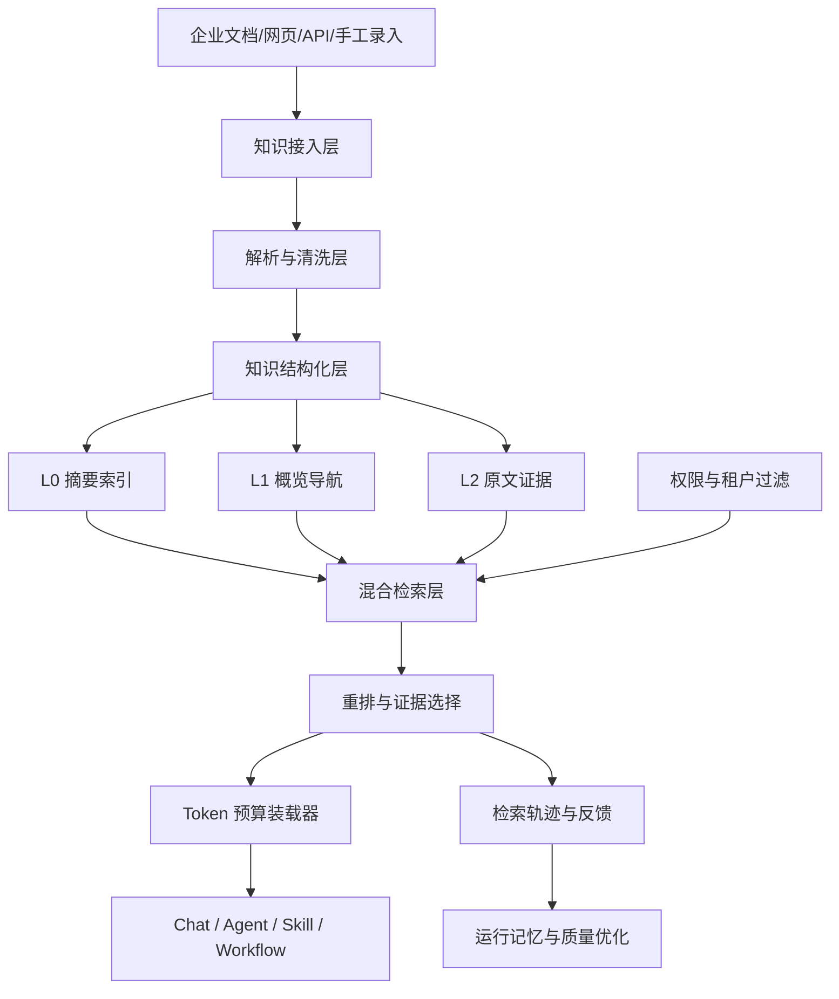
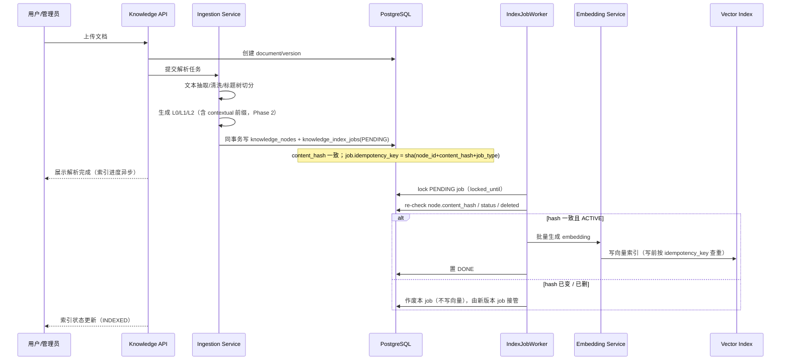

# 企业级 RAG 向量库知识库设计

> 创建时间：2026-06-14  
> 适用项目：agent-platform  
> 目标：建设企业级知识库与 RAG 检索能力，参考 OpenViking 的文件系统范式与 L0/L1/L2 三级上下文架构，并在权限、精度、Token 成本、可观测性和 Agent/Workflow 集成上做平台化增强。

---

## 1. 背景与目标

当前平台已经具备 Agent、Skill、Workflow、Chat、Runtime Sidecar 和对象级 Agent 授权能力。下一阶段需要为企业用户提供统一的知识库能力，让用户可以把制度文档、项目资料、产品手册、会议纪要、接口文档、代码说明等内容接入平台，并在智能对话、Agent 能力和工作流执行中按权限检索和引用。

传统 RAG 常见做法是“文档切块 + 向量召回 + 拼接上下文”，存在几个问题：

- Token 消耗高：召回 chunk 后直接塞给模型，容易把无关文本带入提示词。
- 命中不稳定：扁平 chunk 缺少目录、章节、文档层级，语义相近但上下文错误时容易误召回。
- 权限难治理：企业知识往往需要租户、部门、用户、Agent、Workflow 多层授权。
- 可观测性弱：用户很难知道答案来自哪些知识、为何命中、为何没命中。
- 知识演进难：文档更新、版本回滚、重复内容合并和过期知识清理缺少统一机制。

本设计参考 OpenViking 的核心思想：

- 文件系统范式：把上下文组织为目录和文件，而不是一堆扁平向量块。
- L0/L1/L2 三级上下文：L0 摘要用于低成本检索，L1 概览用于判断和重排，L2 原文用于必要时深读。
- 目录递归检索：先定位目录和主题范围，再在范围内做语义召回，提升准确率。
- 检索轨迹可观察：记录每一步检索、过滤、重排和上下文装载过程。
- 上下文自迭代：对会话、文档和使用反馈进行摘要、合并与沉淀。

在 OpenViking 基础上，本平台进一步增强：

- 企业权限前置过滤，避免越权内容进入向量召回和模型上下文。
- 混合检索：目录检索、关键词/BM25、向量检索、元数据过滤、重排模型组合使用。
- Token 预算控制：优先 L0/L1，只有证据不足时按需加载 L2。
- 可引用答案：所有答案片段带知识来源、版本、章节和命中原因。
- Agent/Workflow 原生集成：Agent 可绑定知识库，Skill 可声明知识输入，Workflow 可使用知识检索节点。

---

## 2. 设计原则

1. 权限先于检索  
   任何知识召回必须先按租户、知识库、文档、目录、标签、用户和角色做权限过滤。禁止先召回再过滤敏感内容。

2. 分层加载优先  
   默认只把 L0/L1 给模型。L2 原文只在高置信度候选、用户明确要求细节、或答案证据不足时加载。

3. 目录优先于扁平向量  
   知识库应保留“空间结构”：知识库、目录、文档、章节、段落、表格、附件。检索先缩小空间，再做语义匹配。

4. 引用可追溯  
   RAG 输出必须能追溯到文档版本、章节、chunk、页码或段落。后续执行监控可展示检索轨迹。

5. 成本可控  
   每次检索要有明确预算：召回数量、L1 数量、L2 字符数、最终上下文 token 上限、重排模型调用次数。

6. 渐进实现  
   第一阶段使用 PostgreSQL + pgvector 或可插拔向量存储完成闭环；后续再扩展 Milvus、Elasticsearch、对象存储和企业连接器。

---

## 3. OpenViking 三级架构映射

### 3.1 L0：摘要索引层（章节级原子召回单元）

**粒度锁定（修订）**：L0 = 章节级（section）原子摘要，是平台唯一的向量召回单元。一个 section 对应一条 L0、最多一条 dense embedding。文档级摘要作为"文档 L0"特殊节点存在，仅用于目录定位，不参与主召回语义匹配——避免文档级与章节级粒度混杂导致"召回→重排"漏斗倒置（见 §4.4 与 §6.4.1）。

用途：

- 用一句话或极短摘要描述一个章节 / 知识节点。
- 用于快速向量召回、目录候选过滤和低成本初筛。

建议内容：

```json
{
  "title": "报销制度 - 差旅标准",
  "abstract": "说明不同城市等级的住宿、交通和餐饮报销标准。",
  "keywords": ["报销", "差旅", "住宿", "交通", "餐饮"],
  "path": "/财务制度/报销制度/差旅标准",
  "entityHints": ["城市等级", "住宿标准", "发票要求"]
}
```

Token 预算：

- 单个 L0 控制在 50-120 tokens。
- 一次检索可装载 20-50 条 L0，用于候选判断。

### 3.2 L1：概览导航层（文档级，仅作聚合与上下文）

用途：

- 承载文档核心信息、章节结构、适用场景和关键约束。
- **文档级**：一个文档一条 L1。仅用于把召回的 L0 章节按文档聚合、为最终 prompt 注入文档背景，**不参与 rerank 排序**（避免"先召回章节、再用文档级 rerank 门槛"的反向漏斗，见 §6.4.1）。
- 判断是否需要读取 L2 时，作为 L2 候选生成的文档范围依据（§4.4 step6）。

建议内容：

```json
{
  "summary": "本制度规定员工差旅报销范围、城市等级、住宿上限、交通工具标准和审批要求。",
  "outline": [
    "1. 适用范围",
    "2. 城市等级与住宿标准",
    "3. 交通费用",
    "4. 发票与审批"
  ],
  "usageScenarios": [
    "判断某城市住宿费用是否超标",
    "查询高铁/飞机报销条件",
    "核对发票附件要求"
  ],
  "importantRules": [
    "超标准报销必须走部门负责人审批",
    "缺少发票时不能直接报销"
  ]
}
```

Token 预算：

- 单个 L1 控制在 800-2000 tokens。
- 一次检索通常只加载 top 3-8 个 L1。

### 3.3 L2：原文证据层

用途：

- 存放完整原文、表格、图片 OCR、附件文本、代码片段或网页正文。
- 仅在最终回答需要精确条款、数字、表格、引用时加载。

Token 预算：

- 单次 L2 总预算默认 3000-8000 tokens。
- 支持按段落、表格行、页码、标题路径局部加载，不默认加载整篇文档。

### 3.4 平台优化：L3 运行记忆层

OpenViking 以 L0/L1/L2 为核心。本平台建议扩展一个“运行记忆层”，不作为知识原文层，而作为动态反馈层：

- 记录用户问题、命中知识、最终答案、用户反馈、低置信度原因。
- 用于后续优化同义词、查询改写、热知识缓存和召回策略。
- 不直接作为事实来源，必须回链到 L2 或人工确认后的知识条目。

---

## 4. 总体架构



### 4.1 知识接入层

支持来源：

- 文件上传：PDF、Word、Excel、PPT、Markdown、TXT、HTML、CSV。
- 网页采集：指定 URL、站点 sitemap、内部文档站。
- 手工录入：FAQ、制度条款、知识片段。
- 系统连接器：后续可接企业网盘、Confluence、飞书文档、钉钉文档、Git 仓库。

首期建议：

- 文件上传 + Markdown/TXT/PDF/Word 解析。
- 手工录入知识片段。
- 管理员维护知识库目录。

### 4.2 解析与清洗层

职责：

- 文件类型识别。
- 文本抽取、OCR、表格抽取。
- 页码、标题层级、段落、表格、图片说明保留。
- 清理页眉页脚、重复水印、目录页、无意义空白。
- 文档版本 hash 计算，支持重复检测。

关键优化：

- 表格不简单打散为文本，应保留表头、行列关系和单位。
- 标题路径要写入每个 chunk 的 metadata，提升精确检索。
- 对长文档先按标题树切分，再按语义段落切分，不按固定字符数粗暴切。

### 4.3 知识结构化层

把文档转为虚拟文件系统：

```text
kb://tenant/{tenantId}/kb/{kbId}/
  财务制度/                          ← DIRECTORY
    报销制度/                         ← DIRECTORY
      差旅标准/                        ← DOCUMENT（L1 文档概览锚点）
        .doc_overview.md              ← L1（文档级，仅聚合+背景注入，不召回不 rerank）
        .doc_abstract.md              ← 文档级 L0 特殊节点（仅目录定位，非主召回，见 §3.1）
        original.pdf
        sections/
          001-适用范围/
            .abstract.md              ← L0（section 级原子召回单元，唯一向量化目标）
            passages/*.md             ← L2（原文证据，§4.4step6 parent-anchored 取子节点）
          002-住宿标准/
            .abstract.md              ← L0
            passages/*.md             ← L2
          003-交通费用/
            .abstract.md              ← L0
            passages/*.md             ← L2
```

> 树形锁定：`Document(L1) → Section(L0) → Passage(L2)`。L0 = section 级（§3.1 粒度锁定），L0 节点下挂 L2 passage 子节点；文档级摘要另存"文档 L0 特殊节点"仅做目录定位，不参与主召回语义匹配。

每个知识节点保存：

- path：虚拟路径。
- nodeType：directory/document/section/table/faq。
- level：L0/L1/L2。
- sourceDocumentId。
- versionId。
- aclScope。
- metadata。
- embedding。

#### 4.3.1 Contextual Retrieval（上下文注入式切分，作用于 L0 召回层）

孤立 chunk 的向量会丢失"属于哪篇文档、哪个章节"的语义，导致误召回。采用 Anthropic 的 Contextual Retrieval 思路。

**关键：contextual 化必须作用于召回层。** 本平台召回入口是 L0 摘要（见 §4.4，只有 L0 参与向量召回），因此 Contextual Retrieval 只对 **L0** 注入上下文。L1/L2 不生成 dense embedding（见 §8.3），故无需 contextual 化——若给不参与召回的 L2 加 contextual embedding，等价于零召回收益，纯属浪费 ingestion 成本与存储。

流程：

1. 生成 L0/L1/L2 后，对每个 L0 摘要取其所属文档的标题路径 + 上级 L1 概述片段，拼成短前缀（建议 50-100 tokens）。
2. 前缀 + L0 摘要一起送 embedding 模型。
3. L0 原文（无前缀）仍单独存于 `knowledge_nodes.content`，前缀仅参与向量化，不污染摘要展示。

成本控制：前缀生成复用生成 L1 时的 LLM 调用结果，避免重复推理；批量 embedding 走 prompt caching（见 §5.5）摊薄成本。

效果：contextual 化命中真正的召回入口。**事实订正**：Anthropic 公布的"检索失败率下降 67%"是 **contextual embedding + BM25 + rerank 复合栈**的总降幅，非 contextual embedding 单项（单项约 35%，加 BM25 约 49%）。本平台召回主力是 L0 摘要而非 L2 chunk，且 §4.3.1 前缀复用文档级 L1 片段（同文档章节共享前缀），属"文档上下文盖章"，弱于 Anthropic 原义 per-chunk 唯一上下文，增益预计低于原实验值，具体以 §14 评测为准。

> **增益档位（修订补全）**：前缀两档——①共享文档级前缀（当前默认，最省成本，增益低于原实验）；②per-section 唯一前缀（标题路径 + 本 section 角色 + 邻接 section 标题，复用 L1 生成的 LLM 调用多抽一句，边际成本近零），逼近 Anthropic 单项 35% 降幅。Phase 2 评测两档 Recall@K 决定是否升级。

> 注意：本平台选 Contextual Retrieval，**不采用** Late Chunking（见 §19 非目标），二者在 chunk 上下文注入环节机制冲突。

### 4.4 混合检索层

检索流程：

1. Query Analyze  
   识别用户问题类型、实体、时间、部门、知识库范围、是否需要精确数字。

2. Intent Routing（意图路由 → 选择检索模式）  
   按问题类型自动选 mode（省 Token / 平衡 / 高精度），mode 决定后续各能力开关（rerank、HyDE、CRAG 重检索、多跳、长上下文），见 §12 能力开关表。  
   规则示例：金额/日期/法务/制度条款类 → 强制高精度；FAQ/闲聊/方向性 → 省 Token；其余 → 平衡（默认）。用户也可手动覆盖。

3. Permission Pre-filter  
   根据当前用户、角色、部门、Agent 绑定权限、Workflow 执行身份，得到可检索知识范围。

4. Directory Routing  
   先在知识库目录和 L0 摘要中定位候选目录，例如“财务制度/报销制度”。目录匹配用 query 与目录名/L0 摘要做语义 + 关键词匹配。**若定位失败或 query 跨目录，自动降级为全库 L0 向量召回**，不强制限定目录，保证召回兜底。

5. Hybrid Recall（仅 L0 章节级参与向量召回）  
   在候选目录内（或降级后的全库）组合，用 RRF（见 §6.2）融合各路排名：
   - L0 向量召回（Contextual Retrieval 增强后的 embedding）。
   - BM25 通道固定索引 **L0 章节摘要**（文档级 L1 不建 BM25，避免粒度混杂）；L1 概览仅在 §6.4.1 文档聚合时按"该文档下所有 L0 的最好 rank"继承定位，不独立入 BM25 池。
   - metadata filter，如标签、部门、时间、版本。
   - 同义词扩展，如”差旅费/出差报销/旅费”。
   召回结果 = **L0 章节候选池**（已定位到章节粒度）。注意：L2 不参与召回。

6. L2 候选生成 + 单级 Rerank（见 §6.4.1，修订：删除 L1 粗排门槛）  
   - **L2 候选生成（关键，防无界扫描）**：对召回的每个 L0 章节节点，取其 **L2 子节点**（parent-anchored expansion）作为该章节的 L2 候选；并在候选文档范围内用 BM25 预筛到每文档 cap（默认 ≤20 片段）。**禁止**对整篇文档的全部 L2 做 cross-encoder 扫描。
   - **单级 Rerank**：cross-encoder（bge-reranker）对上述有界 L2 候选 pairwise 打分（query vs 片段原文），定位真正命中的证据段落。
   - L1 文档概览**不作为 rerank 排序门槛**，仅用于：①把命中 L2 按文档 coalesce；②把文档 outline 作为背景注入最终 prompt。删掉”文档级 rerank 门槛”环节，消除反向漏斗。

7. Evidence Loading  
   取 rerank 后 top K（mode 决定）L2 片段，按 token 预算截断进最终 prompt。装载前做 evidence hash 二次校验（见 §7.3.5）。注意：rerank 阶段已读 L2 原文做打分，此处”按需加载”特指**控制进入 LLM prompt 的片段数与 token**，不省 rerank 的计算开销（cross-encoder token 与 LLM token 分属不同成本池）。

8. Answer Context Pack  
   生成最终上下文包，包含证据、引用、约束和禁止回答规则。生成后经 CRAG 评估与 Citation 校验（见 §6.4）方可输出。

---

## 5. 更省 Token 的策略

### 5.1 渐进式上下文装载

默认流程：

```text
L0 章节召回 40 条（向量+BM25+RRF）             ← 平衡默认，§12.1
→ L0 预筛 cross-encoder 打分，取 top 8 L0 / top 5 文档   ← §6.4.1 第一步，省 L2 扫描
→ L2 候选生成（预筛后 L0 子节点 + BM25 预筛，每文档 cap 20）
→ L2 单级 cross-encoder rerank，取 top K（3）
→ 最终上下文包 3000-6000 tokens（含 L1 文档 outline 背景）
```

只有以下情况才扩大 L2：

- 用户要求“原文条款”“完整制度”“逐条对比”。
- L1 置信度不足。
- 答案涉及金额、日期、法务条款、配置参数等高精度内容。

### 5.2 Token Budget Manager

每次 RAG 调用携带预算：

```json
{
  "maxContextTokens": 6000,
  "maxL0Candidates": 40,
  "maxL1Read": 6,
  "maxL2Read": 3,
  "maxEvidenceTokens": 4500,
  "answerTokenReserve": 1200,
  "maxLlmCalls": 4
}
```

预算分配规则：

- L0 阶段成本极低，可扩大召回。
- L1 阶段用于判断，不全部进入最终 prompt。
- L2 阶段只保留答案所需证据。
- 最终 prompt 中不放完整检索轨迹，只放压缩后的证据说明。

### 5.3 上下文去重与压缩

- 相同文档不同段落命中时，按标题路径聚合。
- 相似 chunk 做语义去重，只保留信息增量最高的片段。
- 长表格先生成“行列定位摘要”，必要时只读取相关行。
- L2 片段进入 prompt 前做 evidence compression，但保留引用 id。

### 5.4 缓存体系（会话内 + 跨会话语义缓存）

缓存分两层，命中即省 token 与延迟：

**会话内缓存**（同一会话）：

- 缓存最近命中的 L1/L2 evidence id。
- 用户追问时优先在已命中文档内检索。
- 不重复把相同证据全文塞入 prompt，可传引用摘要和必要增量。

**跨会话语义缓存**（全平台，高频 FAQ 场景关键省 token）：

- query embedding 与缓存库查询比对，相似度 ≥ 阈值且同一知识库范围 → 直接返回缓存答案（带原 trace 与引用，标记"来自缓存"）。
- 缓存 key 必须包含 `permission_signature + kb_scope + mode`，**禁止跨权限/跨范围命中**，否则会向低权用户泄露高权证据。
- **失效粒度：文档级 `doc_version`（修订：原用 KB 全局 `kb_version`，单文档编辑即清空整库缓存，活跃 KB 命中率趋零）**。cache key 附加 `{命中 doc_id 集合 : 各 doc_version}`。单文档编辑只失效引用该文档的答案，其余保留。
- 缓存 value 内嵌命中 evidence 的 `content_hash` 集合（见 §7.3.7）作为**主校验**：命中后对每个命中 node 逐条 point-lookup 当前 `content_hash`，任一不匹配则 miss。配合 doc_version，做到"只有真正变更的文档才失效"。
- 无法覆盖的场景（如"新增了一篇更相关的新文档"）由 TTL + 定期全量失效兜底，默认 TTL 1h。
- 热门 query 缓存 + 文档 reindex 完成时广播清引用该 doc 的 query 缓存。
- 高精度模式默认绕过语义缓存（要新鲜证据）；省 Token 模式优先命中。
- **abstention（拒答）结果不写入跨会话语义缓存**（见 §6.4.3），否则知识补充后仍永远拒答。拒答仅落 trace，进知识维护待办。

### 5.5 Prompt Caching（前缀缓存，最大 token 杠杆）

LLM provider 的 prompt/KV cache 可对稳定前缀复用计算，省 90% cost、85% latency。RAG 的难点是动态插入的 evidence 会破坏前缀缓存。对策是**锁死 prompt 结构**：

```text
[ stable system prompt ]
[ 知识库描述 / 检索约束 / 禁答规则 ]   ← 稳定段，前置，命中 cache
--- cache boundary ---
[ 动态 evidence 片段 ]                 ← 每次不同，不进 cache
[ 用户 query ]
```

规则：

- 稳定段必须前置且顺序固定，业务层禁止自由拼接上下文（见 §19 非目标 C5）。
- 知识库描述按 kb_id 粒度缓存，同一 kb 多次问答复用。
- **BYOK 粒度塌缩（修订补全，效益降级）**：prefix cache 按 provider + 组织/密钥隔离。本平台 OPENAI_COMPATIBLE 用户自带 key → 每用户独立 cache 命名空间 → 跨用户零复用，平台级命中塌缩为单会话内。§5.5 定位应从"最大 token 杠杆"下调为**会话级 / 同 key 优化**。若要换平台全局 cache 局部性，需引入平台共享 RAG 代理 key，但牺牲 BYOK 成本归属，须显式 trade-off（默认不做）。
- Contextual Retrieval 的前缀生成（§4.3.1）走 prompt caching 摊薄 ingestion 成本。
- 缓存命中率指标 `rag_prompt_cache_hit_rate` 按 **provider 维度尽力采集**。本平台为多 provider、用户自带 key（OPENAI_COMPATIBLE 协议），不同 provider（Doubao / OpenAI / DeepSeek / Qwen 等）的 prefix cache 协议与命中反馈字段不一致，部分 provider 不返回命中 token 数。指标允许缺失，告警阈值仅对已知支持 cache feedback 的 provider 生效；采集不到时记为未知，不作硬性告警，不阻断流程。

---

## 6. 查询更精准的策略

### 6.1 目录递归检索

先找“在哪个知识空间”，再找“哪段内容”。

示例：

```text
用户问：上海出差住宿能报多少？

1. L0/目录定位：/财务制度/报销制度/差旅标准
2. L1 判断：该文档包含城市等级和住宿标准
3. L2 精读：读取“城市等级与住宿标准”表格
4. 回答：给出上海对应等级、金额、审批例外和引用
```

这样比全库向量召回更稳定，能减少“语义相似但制度类型错误”的误召回。

### 6.2 混合打分：RRF 召回融合 + cross-encoder 定最终分

召回阶段各路信号量纲不同（dense cosine ∈ [-1,1]、BM25 无界正实数、directory match 0/1、recency ∈ [0,1]），**直接手工加权无可比性**，BM25 一项会压垮其他所有通道。召回阶段改用 **Reciprocal Rank Fusion（RRF）** 融合各路排名，无需归一化，鲁棒且为工业标准：

```text
rrf_score(d) = Σ over channels  1 / (k + rank_channel(d))     # k 默认 60
```

参与融合的通道：dense vector（L0 召回）、BM25、directory match、metadata match、recency。每通道先各自取 top-N 排名，再 RRF 合并得召回候选池。

最终证据排序**不靠 RRF**，由 §6.4.1 的 cross-encoder 精排 L2 片段决定。RRF 只负责"把可能的候选捞进候选池"。

不同场景调整的是**参与通道与各自召回深度**，而非权重数字：

- 法规制度：BM25 + metadata + 版本通道加深召回深度。
- 项目文档：directory + recency 通道加深。
- FAQ：dense vector 通道加深。

**userFeedbackScore 不进在线召回打分**：在线反馈（§14.2）是 answer 级（答案有用 / 无用 / 引用不相关），无法归因到单 node（一个答案含多条 evidence），强行映射会引入噪声。反馈改为：①喂离线评测；②聚合为 query rewrite 同义词与 rerank 模型调权信号；③不作为单 node 在线 score 项。

### 6.3 Query Rewrite

用户问题进入检索前做轻量改写：

- 生成关键词版本。
- 生成语义版本。
- 提取实体和限定条件。
- 判断是否需要精确引用。
- HyDE（Hypothetical Document Embeddings，仅高精度模式开启）：用 LLM 生成一段假设性答案文档，用该文档向量做召回，再用原始 query 重排。对短查询、口语化查询召回提升明显。代价是每次查询多一次 LLM 调用，故只在高精度模式触发。

示例：

```json
{
  "raw": "上海出差住酒店最多能报多少",
  "keywords": ["上海", "出差", "住宿", "报销标准"],
  "semantic": "查询上海城市等级对应的差旅住宿费报销上限",
  "filters": {
    "domain": "财务制度",
    "docType": "policy"
  },
  "requiresExactEvidence": true
}
```

### 6.4 Rerank、纠正式检索与可信输出

本节统一负责"召回后到输出前"的精度兜底，由四个环节组成。

#### 6.4.1 L2 候选生成 + 单级 Rerank（修订：删除 L1 粗排门槛）

**修订背景**：原设计"L1 粗排选文档 + L2 精排选片段"存在两个问题：①反向漏斗——L0 召回已是章节粒度（更细），再用文档级 L1 做门槛是粗粒度过滤细粒度结果，可能砍掉"仅一节高度相关"的文档；②L2 候选无界——召回层不产生 L2 候选，cross-encoder 无对象可排，若退化为扫整篇文档全部 L2 则成本爆炸。修订为**单级 rerank + 显式 L2 候选生成**。

**第一步：L0 预筛 + L2 候选生成（双重有界）**

- **L0 预筛（省 cross-encoder 成本，修订补全）**：平衡/高精度模式先对 RRF 召回的 L0 摘要（50-120 token，极便宜）做一次 cross-encoder 打分，按 mode 取 top M（平衡 8 / 高精度 12）L0 节点、top D（平衡 5 / 高精度 8）文档进入 expand。避免 40 个 L0 各 expand ≤20 → 最坏 800 pair 的扫描。
- 对预筛后的每个 L0 章节节点，取其 **L2 子节点**（parent-anchored expansion）。
- 在候选文档范围内用 BM25 预筛，每文档 cap ≤20 片段，作为最终 cross-encoder 输入。
- 双重 cap（文档数 D + 每文档片段数）保证 cross-encoder 候选集有界，杜绝整篇 L2 全扫描。

**第二步：单级 Rerank（cross-encoder over L2 片段）**

- cross-encoder 对有界 L2 候选 pairwise 打分（query vs 片段原文）。
- 作用：在同文档内多个 L2 片段中定位真正命中段落，这是 rerank 核心价值。
- 仅输入候选 L2 片段（非整篇），控制原文 token 消耗。

**L1 概览的新定位**：不再做 rerank 门槛。仅用于 ①把命中 L2 按文档 coalesce 去重；②把文档 outline 作为背景注入最终 prompt（供模型理解片段所属文档结构）。

模型选型：Phase 2 用 bge-reranker-base（本地、轻量）；后续可接 bge-reranker-large / Cohere Rerank。

只在高精度模式开启冲突证据检查（同一问题命中互斥条款时标红并列出）。

#### 6.4.2 CRAG 纠正式检索（答案前质量分档）

召回重排后、生成前，用 retrieval evaluator 评估证据质量分档：

- **correct**：证据充足且相关 → 进入证据装载与生成。
- **ambiguous**：证据部分相关或置信度不足 → 触发 query rewrite 二次召回（省 Token 模式不重检索，直接降级为 abstain；平衡模式重检索 1 次；高精度模式最多重检索 2 次）。
- **incorrect**：证据严重不足或越权 → abstention。

**retrieval evaluator 实现选型（修订补全）**：默认用**启发式打分**（top1 cross-encoder 分数 + 命中证据数 + 权限可见证据占比 + 跨文档冲突标志），阈值分档，**不消耗 LLM 调用**，保护 §12.1 预算。**省 Token 模式无 cross-encoder 分数**，该位用 top1 dense cosine 替代（与 §6.4.3 abstain 分数源一致）。若对分档质量要求高，可改轻量 LLM judge，但每检索 +1 调用，须计入 `maxLlmCalls`。Phase 2 默认启发式。

#### 6.4.3 Abstention 拒答（"100% 精准"的前提）

敢于拒答比硬答更接近"精准"。触发条件（满足任一）：

- top1 相关性分数低于阈值：高精度/平衡用 cross-encoder 分（默认 0.5）；省 Token 模式关 rerank，改用 top1 dense cosine（默认 0.55，须按知识库校准）。分数来源随 mode 切换，避免无 rerank 时阈值悬空。
- 证据冲突且无仲裁规则可裁决。
- 命中证据全部越权（无可见证据）。
- CRAG 判定 incorrect。

拒答行为：

- 返回固定话术："未在当前知识库找到可信依据，建议转人工或补充知识。"
- 记录 abstention 原因到 retrieval trace，进入知识维护待办。
- 不编造、不用通用知识兜底（企业合规要求）。

#### 6.4.4 Citation Grounding 校验（防幻觉引用）

LLM 可能编造引用（伪造 nodeId / 页码 / 章节名）。生成后强制校验：

- 抽取答案中每个 claim 与其所标引用。
- 回 cited evidence 原文 span 核对 claim 是否被支撑（chunk attribution / faithfulness）。
- 幻觉引用（claim 无证据支撑 / 引用指向不存在节点）→ 标红或拒绝输出，回退重生成。
- 校验结果写入 trace，作为在线评测的 faithfulness 指标来源（见 §14）。

> **更优：结构化引用前置（修订补全）**。prompt 注入 evidence 时强制编号（`[1]...[K]`），约束答案只能引用注入编号。生成后做**字符串校验**（`[n]` ∈ 注入集合）+ **claim span 包含校验**（claim 文本是否被 cited evidence 原文支撑，编辑距离/embedding 相似判定）。零额外 LLM，确定性优先，不计入 `maxLlmCalls`。LLM judge 降级为 §14 在线评测低频采样（faithfulness 指标源）。

> 本平台用 CRAG + LLM-as-judge 近似实现"自我反思"，**不采用** 原生 Self-RAG（需微调带 reflection token 的模型，API 模型不可用），见 §19 非目标。

---

## 7. 权限与安全设计

### 7.1 权限模型

对象层级：

```text
Tenant
  └── KnowledgeBase
      └── Directory
          └── Document
              └── Section / Chunk   (继承所属 Document 权限，不独立授权)
```

**授权粒度（修订补全）**：permission 仅在 KB / DIRECTORY / DOCUMENT 三级独立授权（见 §8.4 `target_type` 枚举）。Section / Chunk 不作为独立授权对象，继承其所属 Document 的权限。如需章节级敏感隔离，拆分为独立 Document 或独立 KB。

权限类型（仅 3 类，对应 §8.4 三 boolean 列）：

- canRead：可检索和阅读。
- canWrite：可上传、编辑、重建索引。
- canManage：可授权、删除、配置知识库。

> Agent/Workflow 绑定知识库是**检索范围配置**（scope），不是权限类型，故无 canUseInAgent / canUseInWorkflow。绑定后仍以"执行身份对该 kb 的实际授权"为基线求交（见下）。

授权主体（仅三类，Agent/Workflow 不作为独立授权主体）：

- 用户。
- 角色。
- 部门。

> Agent 与 Workflow 是用户拥有的资源，其"知识库绑定"是**检索范围限定**（scope），不是独立权限主体。检索权限始终以**触发用户**对该知识库的实际授权为基线，Agent/Workflow 的绑定再与基线求交。这样避免"给 Agent 主体单独授权"导致的语义混乱与越权面扩大（见 §8.4 subject_type）。

检索时必须使用"执行身份"：

- Chat：当前用户身份。
- Agent：当前用户对该 kb 的权限 ∩ Agent 绑定的 kb 范围。
- Workflow：触发用户对该 kb 的权限 ∩ Workflow 绑定的 kb 范围 ∩ 节点配置范围。

三者求交后得到最终可检索范围，**禁止任何一条单独放大权限**。

### 7.2 安全边界

- 向量库不存明文敏感字段的可逆索引。
- embedding metadata 中只放必要过滤字段，不放全文敏感信息。
- 删除知识后，向量、L0/L1/L2、缓存和检索轨迹都要失效。
- 检索轨迹展示给用户时，只展示用户有权查看的证据信息。
- 支持知识库级水印：回答中可标记来源为内部资料。

### 7.3 原文-向量索引一致性保障

传统 RAG 容易出现“向量索引与原文脱离”的问题：文档更新或删除后，旧向量仍参与召回；解析失败导致有原文无向量；缓存指向过期 evidence。本节强化一致性，确保向量索引始终是原文的可重建派生物，绝不成为脱离原文的独立真相源。

#### 7.3.1 一致性原则与不变式

原则：

1. `knowledge_nodes.content` 是唯一真相源，embedding 是可重建的派生缓存。
2. 任何 node 参与召回必须同时满足不变式：
   - `node.status = 'ACTIVE'`
   - `node.deleted = 0`
   - `embedding.content_hash = node.content_hash`
   - `embedding.embedding_model ∈ kb.active_embedding_models`（稳态塌缩为单值；模型迁移期允许新旧并存，见 §7.3.11）
3. 违反不变式的 node 一律不进召回，并立即触发自动修复任务。
4. 检索层只信任原文，向量只用于“定位”，证据装载必须回原文二次校验。

#### 7.3.2 索引任务编排（Outbox 模式）

新增 `knowledge_index_jobs` 表，将“写原文”与“写向量”解耦但保证最终一致。

| 字段 | 类型 | 说明 |
|------|------|------|
| id | BIGINT | 主键 |
| node_id | BIGINT | 知识节点 |
| kb_id | BIGINT | 知识库 |
| job_type | VARCHAR | UPSERT / DELETE / REINDEX |
| content_hash | VARCHAR | 本次任务对应的内容 hash |
| status | VARCHAR | PENDING / RUNNING / DONE / FAILED / DEAD |
| attempt | INTEGER | 已重试次数 |
| max_attempt | INTEGER | 最大重试次数（默认 5） |
| locked_until | TIMESTAMPTZ | 锁定到期时间，防重复消费 |
| idempotency_key | VARCHAR | 幂等键 = sha(node_id + content_hash + job_type) |
| last_error | TEXT | 最近错误信息 |
| created_at | TIMESTAMPTZ | 创建时间 |
| updated_at | TIMESTAMPTZ | 更新时间 |

写入流程（单事务）：

1. 写 `knowledge_nodes`（原文 + content_hash + status）。
2. 同事务写 `knowledge_index_jobs` 一条 PENDING 任务，content_hash 必须等于 node.content_hash。
3. 事务提交后，独立 worker 拉取任务、lock。**lock 后、生成 embedding 前必须 re-check**：`SELECT content_hash, status, deleted FROM knowledge_nodes WHERE id=?`。若当前 `content_hash ≠ job.content_hash`，或 `status≠ACTIVE`、`deleted≠0`，说明 node 已被并发更新 / 删除（见 §7.3.3 CAS），**作废本 job（不写向量、不置 DONE）**，由新版本的 UPSERT job 或 delete job 接管。只有 content_hash 一致才生成 embedding、写向量库、置 DONE。此 re-check 防止 worker 用过期内容生成 embedding 后被 §7.3.5 不变式过滤丢弃（白发）并误触发对账 drift 告警。
4. 失败按指数退避重试，超 `max_attempt` 置 DEAD 并告警。
5. **abandoned RUNNING 清扫（修订补全）**：step3 re-check 作废的 job 既非 DONE 也非 FAILED，悬置 RUNNING；新版 content_hash 不同 → idempotency_key 不同 → 新 job 行接管，旧 RUNNING 无主。worker 拉取时增加超时判定：`status='RUNNING' AND locked_until < now()` 的 job 视为僵尸，置 FAILED（last_error 记 timeout）或直接删除（语义已被新 job 取代），避免 RUNNING 堆积污染 `(status, locked_until)` 拉取查询。对账（§7.3.6）兜底扫描此类僵尸。

幂等保证：worker 写向量前先按 `idempotency_key` 查重，已 DONE 直接跳过；重复消费安全。

#### 7.3.3 版本切换一致性

更新文档时不允许“新原文 + 旧向量”并存：

1. 新版本 node 写入，status=ACTIVE，content_hash 为新值。
2. 同事务用 CAS 作废旧版本：`UPDATE knowledge_nodes SET status='STALE' WHERE id=? AND status='ACTIVE'`。affected rows=0 说明已被并发改动，放弃本次并重读。
3. 同事务写两条 index_job：旧 node 的 DELETE、新 node 的 UPSERT。
4. worker 先作废旧 embedding，再写新 embedding。
5. `effectiveAt` 与 status 共同决定可参与检索的版本。

CAS 防并发覆盖，避免双 ACTIVE 或 ACTIVE/ACTIVE 漂移。

#### 7.3.4 删除级联失效

删除走“墓碑 + 编排”而非一次性多表删除：

1. node 软删（deleted=1，status 置 ARCHIVED）。
2. 同事务生成一组 delete_job（每项目标一条，独立幂等）：
   - 向量索引删除（按 node_id）。
   - L0/L1/L2 内容缓存清理。
   - 会话 evidence 缓存失效（按 evidence id 集合）。
   - 检索轨迹脱敏：保留 trace 用于审计，但移除 evidence body 或标记 revoked。
3. 各 delete_job 独立重试，单步失败不阻塞其他步。
4. 全部完成后按保留期物理清理 node 与原始文件。

补偿：向量库删除 API 失败时 job 进重试；超阈值未完成 → 该 node 进“隔离区”，检索层硬过滤隔离区，直到修复完成。

#### 7.3.5 检索层强制约束

Hybrid Recall（§4.4）所有召回 SQL 与向量查询**必须**带不变式过滤：

```sql
WHERE n.status = 'ACTIVE'
  AND n.deleted = 0
  AND e.content_hash = n.content_hash
  AND e.embedding_model = ANY(kb.active_embedding_models)   -- 迁移期多模型并存；稳态集合塌缩为单值
```

evidence 装载前再做一次原文 hash 校验：从 `knowledge_nodes` 取当前 content_hash，与召回返回的 embedding.content_hash 比对，不匹配则丢弃该证据并自动补一条 REINDEX job。

此过滤封装在 `RagRetrievalService` 基础召回方法内，禁止业务层绕过。可通过代码审查 + 单测强制。

#### 7.3.6 周期性对账（Reconciliation）

定时任务（默认每小时，按知识库可配）扫描并修复漂移：

1. ACTIVE node 的 content_hash 与 embedding.content_hash 不一致 → 补 REINDEX job。
2. 孤儿向量：embedding 存在但对应 node 已删除/ARCHIVED → DELETE job。
3. STALE/ARCHIVED node 仍残留 embedding → DELETE job。
4. DEAD job 累计超阈值 → 告警并触发人工介入。

结果写入 `knowledge_reconciliation_reports`（kb_id、扫描时间、漂移数、修复数、残留数）。前端知识库详情展示“索引一致性”健康度，drift>0 标红。

#### 7.3.7 缓存失效策略

缓存 key 内嵌 content_hash，使原文更新后旧缓存自然 miss，避免主动失效遗漏：

- evidence 缓存：`evidence:{nodeId}:{contentHash}`。
- 会话命中缓存：`hit:{sessionId}:{nodeId}:{contentHash}`。
- 热门 query 缓存：TTL + 版本失效广播（知识库 reindex 完成时清该 kb 的 query 缓存）。

#### 7.3.8 不变式运行校验与可观测

运行期采样校验（可开关，默认采样 1%）：

- 召回后对每条 evidence 校验库内 node 的 content_hash 是否一致，不一致计数。
- 指标暴露 Prometheus：
  - `rag_index_drift_total`（hash 不一致计数）
  - `rag_orphan_embeddings_total`（孤儿向量）
  - `rag_index_job_pending / running / dead`（任务积压）
  - `rag_index_job_latency`（任务耗时分布）
  - `rag_reconciliation_repaired_total`（对账修复数）
  - `rag_evidence_hash_mismatch_total`（运行期二次校验不匹配数）

告警阈值：单知识库 drift 比例 > 0.1% 触发自动全量 reindex；DEAD job > 0 触发告警。

#### 7.3.9 与现有流程的集成点

- `KnowledgeIngestionService`：解析完成写 node + index_job 必须同事务。
- `KnowledgeIndexService`：统一消费 index_job，对外只暴露幂等 `upsertIndex` / `deleteIndex`，不提供绕过 job 的直接写向量接口。
- `KnowledgeBaseService` / `KnowledgePermissionService`：删除知识库或文档时级联生成所有受影响 node 的 delete_job。
- `RagRetrievalService`：召回强制不变式过滤 + evidence 二次 hash 校验。
- `RetrievalTraceService`：轨迹记录每条 evidence 的 content_hash，便于事后审计与对账。

#### 7.3.10 首期最小实现

Phase 1 必须落地以保证闭环可信：

- `knowledge_index_jobs` 表 + 单 worker + 指数退避重试。
- 写 node 同事务写 job。
- 检索层强制 `status='ACTIVE' AND deleted=0` 过滤（hash 校验可 Phase 2 加）。
- 手动 reindex 接口（Phase 1 新建 `POST /api/knowledge-documents/{id}/reindex`）补写 job 而非直写。**代码库当前无 knowledge 模块**（已核对：knowledge / reindex / pgvector 全 0 命中），下列 RAG API 全部为 Phase 1 新增，非"已有"。

Phase 2 起：hash 运行校验、周期对账、孤儿向量清理、健康度看板。

#### 7.3.11 Embedding 模型版本迁移（跨模型漂移治理）

§7.3.1-7.3.10 只覆盖同模型内 hash 漂移。换 embedding 模型时维度与语义空间变化，旧向量与新向量不可比，会静默劣化召回。治理协议：

1. 模型版本注册表：`knowledge_embeddings.embedding_model` 记录每条向量所用模型；新增 `embedding_model_versions` 维护版本、维度、上线状态。
2. 双模型并存过渡：新模型上线后不立即切换，新旧向量库并行召回，A/B 对比 Recall@K / MRR，确认新模型不劣化。
3. 全量 re-embed job：切换决策后，按 kb 粒度生成 REINDEX job（复用 §7.3.2 outbox），灰度推进，避免一次性打爆 embedding 服务预算。
4. 切换原子性：单 kb 完成全量 re-embed 并对账通过后，才把该 kb 的 `active_embedding_models` 塌缩为新模型单值（此前 A/B 期新旧并存，由 §7.3.5 的 `ANY(active_embedding_models)` 过滤承载，不违反不变式），旧向量随后由 delete_job 清理。
5. 语义缓存联动：跨会话语义缓存（§5.4）的 query embedding 绑定模型版本，模型切换即清空对应缓存。
6. 可观测：`rag_embedding_model_drift_total`（旧模型向量占比）、迁移进度看板。

---

## 8. 数据模型设计

### 8.1 knowledge_bases

| 字段 | 类型 | 说明 |
|------|------|------|
| id | BIGINT | 主键 |
| tenant_id | BIGINT | 租户 ID，单租户阶段可默认 1 |
| name | VARCHAR | 知识库名称 |
| description | TEXT | 描述 |
| visibility | VARCHAR | PRIVATE / TEAM / PUBLIC |
| embedding_model | VARCHAR | 默认 embedding 模型（稳态单值） |
| active_embedding_models | TEXT | JSON 数组，迁移期并存模型集合；稳态等同 `[embedding_model]`，承载 §7.3.11 双模型 A/B |
| chunk_strategy | VARCHAR | 切分策略 |
| status | VARCHAR | ACTIVE / ARCHIVED |
| created_by | BIGINT | 创建人 |
| created_at | TIMESTAMPTZ | 创建时间 |
| updated_at | TIMESTAMPTZ | 更新时间 |
| deleted | INTEGER | 软删除 |

### 8.2 knowledge_nodes

表示目录、文档、章节、表格等虚拟文件系统节点。

| 字段 | 类型 | 说明 |
|------|------|------|
| id | BIGINT | 主键 |
| kb_id | BIGINT | 知识库 ID |
| parent_id | BIGINT | 父节点 |
| path | TEXT | 虚拟路径 |
| node_type | VARCHAR | DIRECTORY / DOCUMENT / SECTION / TABLE / FAQ |
| title | VARCHAR | 标题 |
| level | VARCHAR | L0 / L1 / L2 |
| source_document_id | BIGINT | 来源文档 |
| version_id | BIGINT | 文档版本 |
| content | TEXT | L0/L1/L2 文本 |
| metadata | TEXT | JSON |
| token_count | INTEGER | 预估 token |
| content_hash | VARCHAR | 内容 hash |
| status | VARCHAR | ACTIVE / STALE / ARCHIVED |
| created_at | TIMESTAMPTZ | 创建时间 |
| updated_at | TIMESTAMPTZ | 更新时间 |
| deleted | INTEGER | 软删除 |

### 8.3 knowledge_embeddings

仅 **L0 章节节点**（召回原子单元，见 §3.1 粒度锁定）生成 dense embedding。L1（文档概览）不向量化——已降级为聚合与 prompt 背景，不参与 rerank（见 §6.4.1）；L2 仅按 nodeId 取原文不向量化。故 1 个 node 对应 0..1 行 embedding（仅 L0 node 有），不再保留 `level` 冗余字段（node.level 已是真相源）。

| 字段 | 类型 | 说明 |
|------|------|------|
| id | BIGINT | 主键 |
| node_id | BIGINT | 知识节点（L0），唯一 |
| kb_id | BIGINT | 知识库 |
| embedding_model | VARCHAR | embedding 模型版本 |
| embedding | VECTOR | pgvector dense 向量（HNSW 索引，见 §15.1） |
| external_vector_id | TEXT | 外部向量库（Milvus/Qdrant）时存外部 id；pgvector 模式留空 |
| sparse_terms | TEXT | 关键词/BM25 辅助索引 |
| metadata | TEXT | JSON 过滤字段 |
| content_hash | VARCHAR | 对应 node.content_hash，不变式校验用（§7.3.5） |
| created_at | TIMESTAMPTZ | 创建时间 |

`embedding`（本地 pgvector）与 `external_vector_id`（外部库）二选一，按部署形态决定，避免同字段两种语义导致查询层 if 分叉。索引：`node_id` 唯一索引；`(kb_id)` 普通索引。

> **表示层演进（Phase 2 评估，修订补全）**：当前为 dense + 独立 BM25 sparse（`sparse_terms`）。评估 **BGE-M3** 单模型原生输出 dense + sparse + colbert 三路 → 可删除独立 BM25 建索引链路，并使 §19 C4（Multi-vector/ColBERT）解禁成本从"一致性面 ×3"降为开关。Phase 2 评测 BGE-M3 vs 当前 dense+BM25 的 Recall@K/MRR 后决策，换模型走 §7.3.11 迁移协议（承载于 §8.1 `active_embedding_models`）。

### 8.4 knowledge_permissions

| 字段 | 类型 | 说明 |
|------|------|------|
| id | BIGINT | 主键 |
| target_type | VARCHAR | KB / DIRECTORY / DOCUMENT |
| target_id | BIGINT | 授权对象 |
| subject_type | VARCHAR | USER / ROLE / DEPARTMENT（Agent/Workflow 不作为授权主体，通过绑定范围限定，见 §7.1） |
| subject_id | BIGINT | 授权主体 |
| can_read | BOOLEAN | 可读 |
| can_write | BOOLEAN | 可写 |
| can_manage | BOOLEAN | 可管理 |
| granted_by | BIGINT | 授权人 |
| created_at | TIMESTAMPTZ | 创建时间 |

### 8.5 rag_retrieval_logs

记录检索轨迹。

| 字段 | 类型 | 说明 |
|------|------|------|
| id | BIGINT | 主键 |
| trace_id | VARCHAR | 链路 ID |
| user_id | BIGINT | 用户 |
| kb_ids | TEXT | 检索知识库 |
| query | TEXT | 原始问题 |
| rewritten_query | TEXT | 改写结果 |
| candidates_l0 | TEXT | L0 候选 JSON |
| candidates_l1 | TEXT | L1 文档聚合 JSON（背景，非 rerank） |
| evidence_l2 | TEXT | 最终证据 JSON |
| token_budget | TEXT | 预算 JSON |
| latency_ms | BIGINT | 耗时 |
| created_at | TIMESTAMPTZ | 创建时间 |

### 8.6 knowledge_index_jobs

见 §7.3.2。索引任务编排表，保证原文与向量最终一致。

| 字段 | 类型 | 说明 |
|------|------|------|
| id | BIGINT | 主键 |
| node_id | BIGINT | 知识节点 |
| kb_id | BIGINT | 知识库 |
| job_type | VARCHAR | UPSERT / DELETE / REINDEX |
| content_hash | VARCHAR | 任务对应内容 hash |
| status | VARCHAR | PENDING / RUNNING / DONE / FAILED / DEAD |
| attempt | INTEGER | 已重试次数 |
| max_attempt | INTEGER | 最大重试 |
| locked_until | TIMESTAMPTZ | 锁定到期时间 |
| idempotency_key | VARCHAR | 幂等键，唯一索引 |
| last_error | TEXT | 最近错误 |
| created_at | TIMESTAMPTZ | 创建时间 |
| updated_at | TIMESTAMPTZ | 更新时间 |

索引建议：`(status, locked_until)` 供 worker 拉取；`idempotency_key` 唯一索引；`(node_id, job_type)` 普通索引。

### 8.7 knowledge_reconciliation_reports

见 §7.3.6。周期对账结果，供健康度展示。

| 字段 | 类型 | 说明 |
|------|------|------|
| id | BIGINT | 主键 |
| kb_id | BIGINT | 知识库 |
| scanned_at | TIMESTAMPTZ | 扫描时间 |
| total_nodes | INTEGER | 扫描节点数 |
| drift_count | INTEGER | hash 不一致数 |
| orphan_count | INTEGER | 孤儿向量数 |
| stale_with_embedding | INTEGER | STALE/ARCHIVED 残留向量数 |
| repaired_count | INTEGER | 本次修复数 |
| dead_job_count | INTEGER | DEAD 任务累计 |
| created_at | TIMESTAMPTZ | 创建时间 |

---

## 9. 后端模块设计

建议新增包：

```text
backend/src/main/java/com/superprogrammer/knowledge/
  controller/
  service/
  mapper/
  entity/
  dto/
  rag/
```

核心服务：

- `KnowledgeBaseService`：知识库 CRUD、目录树、权限入口。
- `KnowledgeIngestionService`：上传、解析、切分、生成 L0/L1/L2，写 node 与 index_job 同事务。
- `EmbeddingService`：embedding 生成、批处理、重试、模型适配。
- `KnowledgeIndexService`：统一消费 index_job，对外只暴露幂等 `upsertIndex` / `deleteIndex`，禁止直写向量。
- `IndexJobWorker`：拉取 PENDING 任务、lock、调用 EmbeddingService 与向量库、指数退避重试、DEAD 告警。
- `IndexReconciliationService`：周期对账，发现 hash 漂移、孤儿向量、STALE 残留并自动补 job。
- `RagRetrievalService`：查询分析、权限过滤、混合召回、重排、证据装载，强制不变式过滤与 evidence hash 二次校验。
- `RagContextBuilder`：按 token 预算构造最终上下文。
- `KnowledgePermissionService`：知识库对象授权，删除时级联生成 delete_job。
- `RetrievalTraceService`：检索轨迹记录和查询，每条 evidence 带 content_hash 供审计。

### 9.1 API 设计

> 以下 API 均为 **Phase 1 新建**，当前代码库无 knowledge 模块（已核对 grep 0 命中），无任何已存在端点。

知识库：

```http
GET    /api/knowledge-bases
POST   /api/knowledge-bases
GET    /api/knowledge-bases/{id}
PUT    /api/knowledge-bases/{id}
DELETE /api/knowledge-bases/{id}
```

目录与文档：

```http
GET    /api/knowledge-bases/{id}/tree
POST   /api/knowledge-bases/{id}/directories
POST   /api/knowledge-bases/{id}/documents/upload
GET    /api/knowledge-documents/{id}
DELETE /api/knowledge-documents/{id}
POST   /api/knowledge-documents/{id}/reindex
```

检索：

```http
POST /api/rag/retrieve
POST /api/rag/answer
GET  /api/rag/traces/{traceId}
```

Agent/Workflow 绑定：

```http
GET  /api/agents/{id}/knowledge-bases
PUT  /api/agents/{id}/knowledge-bases
GET  /api/workflows/{id}/knowledge-bases
PUT  /api/workflows/{id}/knowledge-bases
```

### 9.2 检索请求

```json
{
  "query": "上海出差住宿最多报销多少？",
  "kbIds": [1, 2],
  "mode": "BALANCED",
  "maxContextTokens": 6000,
  "requireCitations": true,
  "filters": {
    "documentType": "policy",
    "effectiveAt": "2026-06-14"
  }
}
```

### 9.3 检索响应

```json
{
  "traceId": "rag-trace-001",
  "answerContext": "...",
  "evidence": [
    {
      "nodeId": 1201,
      "documentId": 88,
      "title": "差旅标准",
      "path": "/财务制度/报销制度/差旅标准",
      "level": "L2",
      "snippet": "一线城市住宿标准为...",
      "score": 0.91,
      "citation": {
        "page": 3,
        "section": "城市等级与住宿标准"
      }
    }
  ],
  "tokenUsage": {
    "l0Tokens": 900,
    "l1Tokens": 2200,
    "l2Tokens": 3100,
    "finalContextTokens": 4300
  }
}
```

---

## 10. 前端功能设计

### 10.1 知识库管理页

新增导航：`知识库`

页面能力：

- 知识库列表：名称、描述、文档数、索引状态、更新时间、权限状态。
- 新建知识库：名称、描述、可见性、默认 embedding 模型。
- 知识库详情：左侧目录树，右侧文档列表和节点预览。
- 上传文档：拖拽上传、批量上传、解析进度、索引进度。
- 文档版本：查看当前版本、历史版本、重建索引。
- 权限管理：用户/角色/部门授权（§7.1）。Agent/Workflow 的知识库绑定放独立"绑定范围"配置区，非授权主体。

### 10.2 检索调试台

用于管理员和知识库维护者调试 RAG：

- 输入 query。
- 选择检索模式：省 token / 平衡 / 高精度。
- 展示 L0 章节召回、L2 候选生成、L2 rerank 证据、最终上下文（L1 仅作文档聚合背景展示）。
- 展示 token 消耗、耗时、命中路径。
- 支持“标记有用/无用”，进入反馈优化。

### 10.3 Chat 集成

聊天页增强：

- 会话可选择知识库。
- Agent 绑定知识库时，聊天目标选择 Agent 后自动继承可用知识库。
- 回答展示引用来源。
- 用户可展开“检索依据”，查看摘要和原文片段。

### 10.4 Agent / Skill 集成

Agent 配置：

- 绑定一个或多个知识库。
- 配置检索模式和 token 预算。
- 配置是否允许读取 L2 原文。

Skill 配置：

- 新增 `RAG_RETRIEVE` 动作类型，先检索再交给 LLM。
- `LLM_CALL` 可声明 `knowledgeEnabled=true`，自动注入 RAG 上下文。

### 10.5 Workflow 集成

新增节点：

- `KNOWLEDGE_RETRIEVE`：输入 query，输出 evidence/context。
- `KNOWLEDGE_ANSWER`：输入 query，直接输出带引用答案。

节点配置：

- 知识库范围。
- 检索模式。
- token 预算。
- 是否需要引用。
- 最大证据数量。

---

## 11. 与现有 Runtime 的集成

### 11.1 ChatSessionService

普通聊天：

- 如果用户选择知识库，则在 LLM 调用前执行 RAG。
- RAG 上下文注入 system/user message。
- 回答后保存 retrieval trace id 到 chat_messages metadata。

Agent 聊天：

- AgentRouter 执行前读取 Agent 绑定知识库。
- SkillExecutor 执行 `LLM_CALL` 前按 skill 配置决定是否检索。

Workflow：

- Runtime callback 遇到 `KNOWLEDGE_RETRIEVE` 节点时调用 Java RAG 服务。
- Sidecar 只负责流程编排，不直接接触向量库，避免 Python/Java 权限逻辑分叉。

### 11.2 ExecutionLog

建议在 runtime event metadata 中记录：

```json
{
  "ragTraceId": "rag-trace-001",
  "kbIds": [1],
  "evidenceCount": 3,
  "finalContextTokens": 4300
}
```

执行监控页可展示 RAG 检索轨迹。

---

## 12. 检索模式与能力路由

三种检索模式不仅决定 L0/L1/L2 召回数量，还决定各能力开关。mode 由 §4.4 的 Intent Routing 自动选择，用户可手动覆盖。

### 12.1 能力路由总表

| 能力 | 省 Token 模式 | 平衡模式（默认） | 高精度模式 |
|------|:---:|:---:|:---:|
| L0 召回量 | top 20 | top 40 | top 60 |
| L2 候选文档数（expand 上限 D） | top 3 | top 5 | top 8 |
| L2 加载量 | top 1-2（最小） | top 3 | top 5 / 单文档 L2 全量精读 |
| final context 上限 | ≤ 3000 tokens | ≤ 6000 tokens | ≤ 10000 tokens |
| Cross-encoder rerank | ❌ 关 | ✅ 开 | ✅ 开 + 冲突证据检查 |
| HyDE 假设文档检索 | ❌ 关 | ❌ 关 | ✅ 开 |
| CRAG 重检索 | ❌ 关（直接 abstain） | ✅ 重检索 1 次 | ✅ 最多重检索 2 次 |
| Abstention 拒答 | ✅ 开 | ✅ 开 | ✅ 开 |
| Agentic 多跳分解 | ❌ 关 | ❌ 关 | ✅ 开（最多 3 跳） |
| Contextual compression（抽相关句） | ✅ 开（省 L2） | ✅ 开 | ❌ 关（要原文） |
| 跨会话语义缓存 | ✅ 优先命中 | ✅ 命中 | ❌ 绕过（要新鲜） |
| Intent routing | ✅ | ✅ | ✅ |

设计取舍：延迟与成本随 mode 阶梯上升。普通用户永远走平衡模式；高精度模式只给法务/财务/制度/技术参数场景，由 intent 自动触发或用户手动选。

**LLM 调用预算上限**（防高精度模式调用数爆炸；修订：原清单漏算 answer-gen / CRAG-eval / rewrite，现补全）：

完整高精度单 query 调用清单（按流水线顺序）：

- Intent routing：默认规则判定 0 次（若改 LLM 判定则 +1）。
- Query rewrite LLM：1 次（§6.3）。
- HyDE：1 次（高精度开启）。
- 基础答案生成：1 次（**必发，原清单遗漏**）。
- CRAG retrieval evaluator：每次检索 1 次（**原清单遗漏**；建议启发式打分而非 LLM，见 §6.4.2，否则每次 +1）。
- CRAG 重检索重生成：≤2 次。
- 多跳分解：≤3 次。
- Citation grounding：结构化引用（默认，0 LLM，§6.4.4）+ LLM judge 采样（评测用，不计入在线预算）。

理论峰值 = 1(rewrite) + 1(HyDE) + 1(ans-gen) + 2(CRAG-regen) + 3(multi-hop) = **8 次**（默认：CRAG-eval 启发式 0 + 结构化引用 0）。最坏 = +1(CRAG-eval 用 LLM) +1(citation judge 命中采样) = **10 次**。Token Budget Manager（§5.2）扩展 `maxLlmCalls` 字段（**高精度默认上限 10，平衡 4，省 Token 1**），超限强制降级为 abstain 或跳过后续多跳。原"高精度 6 / 平衡 3"不足以覆盖，已上调。

### 12.2 省 Token 模式

适用：常规问答、FAQ、方向性答案。

要点：最小 L2、关 rerank、优先语义缓存命中、开 contextual compression 压 L2。CRAG 不重检索，质量不足直接 abstain。**contextual compression 用句级 embedding 相似启发式抽相关句（零 LLM）**，不消耗 `maxLlmCalls=1` 预算（答案生成独占该 1 次）；abstain 用 top1 dense cosine 阈值（§6.4.3，无 rerank 分数时启用）。

### 12.3 平衡模式

适用：默认模式，大多数企业知识问答。

要点：单级 rerank（L2 候选生成 + L2 片段 cross-encoder 精排，§6.4.1）、CRAG 最多重检索一次、语义缓存命中、contextual compression 开。

### 12.4 高精度模式

适用：制度、法务、财务、技术参数，需引用原文。

要点：全开 rerank + HyDE + CRAG（重检索 2 次）+ 多跳分解 + 冲突检查；对**命中候选中的单个文档**加载其全部 L2 片段做全量精读（非整库、非放弃三级架构，仅放宽"单文档内"的 L2 上限）；绕过语义缓存要新鲜证据；Citation grounding 强制校验；受 `maxLlmCalls` 上限约束（见 §12.1 调用预算）。

---

## 13. 索引与更新流程



两套状态解耦：

- 文档级解析状态（document 表）：PENDING / PARSING / SUMMARIZING / EMBEDDING / INDEXED / FAILED。
- 向量索引一致性状态（knowledge_index_jobs 表，见 §8.6）：PENDING / RUNNING / DONE / FAILED / DEAD。

文档可已 INDEXED（解析完成）但仍有 RUNNING job（向量补建中）；检索层以 §7.3.5 不变式为准，**不依赖 job 状态**。

---

## 14. 质量评估

### 14.1 离线评测集

每个知识库维护一组测试问题：

- 问题。
- 标准答案要点。
- 必须命中文档。
- 禁止命中文档。
- 是否要求精确引用。

指标：

- Recall@K。
- MRR。
- 引用准确率。
- 答案 groundedness。
- 平均 token 消耗。
- 平均延迟。

### 14.2 在线反馈

用户可反馈：

- 答案有用。
- 答案错误。
- 引用不相关。
- 缺少知识。

反馈进入：

- query rewrite 同义词。
- rerank 权重。
- 知识维护待办。
- 热门问题缓存。

---

## 15. 部署与存储选型

### 15.1 首期推荐

- 元数据：PostgreSQL。
- 向量：pgvector，**必须用 HNSW 索引**（`CREATE INDEX ... USING hnsw (embedding vector_cosine_ops)`，配合 `SET hnsw.ef_search` 调参），不用默认 IVFFlat（召回质量差，会冤枉地否定 pgvector 可行性）。需当前 PostgreSQL 环境可安装 pgvector 扩展。当前部署为 **Windows PostgreSQL 16**（`C:\Program Files\PostgreSQL\16\data`），pgvector 需取 Windows 预编译 `vector.dll`（或本地 MSVC 编译）放入 `lib/` 后 `CREATE EXTENSION vector`。**Phase 1 第 0 步必须先验证扩展可加载 + HNSW 索引建成功**，否则 HNSW 验收阻塞。pom 仅需 postgresql driver（VECTOR 类型经 JDBC 字符串传递，无专用依赖）。
- **HNSW × 强过滤召回劣化（修订补全）**：pgvector HNSW 不支持高效前置过滤，过滤在 ANN 召回后执行。本平台权限前置（§7.1）+ 一致性不变式（§7.3.5）过滤选择性高，企业多 KB + 严格 ACL 下有效搜索空间是全集小子集，HNSW 后过滤会召回饥饿、recall 跌。对策：①按 `kb_id` 建 **partial index / 分区**（pgvector 0.7+ 支持），把 KB 范围从运行时过滤变为结构性索引选择；②权限可见集预计算为 `node_id` bitmap，召回 SQL `AND node_id = ANY(:visible_bitmap)` 走 bitmap scan，把 ACL 从 ANN 后过滤变为索引前集运算（重 ACL 场景比 over-fetch 稳）；③权限维度无法结构化时，HNSW over-fetch（3-5× top K）后过滤，调大 `ef_search`，并监控 `rag_recall_after_filter` 指标。**禁止**在未分区单 HNSW 上叠加重 ACL 过滤并默认参数。
- 文件：本地文件存储或后续对象存储。
- 异步任务：Spring `@Async` 起步，后续接队列。
- 解析：Java 基础解析 + 可插拔 Python/sidecar 解析服务。

优点：

- 与现有技术栈一致。
- 部署复杂度低。
- 便于快速闭环。

风险：

- 大规模向量检索性能有限。
- 大文件解析可能阻塞后端资源。

### 15.2 企业扩展

- 向量库：Milvus、Qdrant、Elasticsearch dense vector。
- 全文检索：Elasticsearch / OpenSearch。
- 文件存储：MinIO / S3。
- 任务队列：Redis Stream / RabbitMQ。
- OCR：PaddleOCR 或云 OCR。
- Reranker：本地 bge-reranker 或外部 rerank 服务。

---

## 16. 实施分期

分期映射 A 桶（全上）/ B 桶（mode 路由）/ C 桶（非目标见 §19）到 Phase 1-4。

### Phase 1：知识库最小闭环 + 精度地基

目标（最小闭环，砍掉 A1/A2/A3，特性全部推 Phase 2）：

- **第 0 步（前置 blocker）**：验证 pgvector 扩展可加载 + HNSW 索引建成功（§15.1），Windows dll 部署到位。
- 知识库 CRUD、文件上传、文本解析、L0/L1/L2 生成。
- L0 节点生成 dense embedding（**孤立 embedding，不含** Contextual Retrieval 前缀，Phase 2 再上 §4.3.1）。
- `knowledge_index_jobs` 表 + IndexJobWorker，写 node 与写 job 同事务（§7.3），含 worker re-check（§7.3.2）。
- pgvector 向量召回（HNSW 索引，§15.1），强制 `status='ACTIVE' AND deleted=0` 过滤。
- 权限前置过滤（user/role/dept，§7.1），权限求交（§7.1 执行身份）。
- 平衡单 mode（默认）+ Intent Routing 骨架（B 桶）；省 Token / 高精度 mode 推后。
- C 桶决策定稿，写非目标（§19）。
- RAG 检索调试接口、Chat 手动选择知识库问答。

Phase 1 不上 Contextual Retrieval / cross-encoder rerank / prompt caching，保证最小闭环与快速验收。

验收：

- 上传一份制度文档后，可问答并返回引用。
- 平衡模式下最终上下文 token 可控（maxContextTokens 上限生效）。
- 用户无权限时无法检索该知识库。
- 删除文档后不再召回，向量被 delete_job 清除。
- worker 失败重试不产生重复向量（幂等键生效）。
- worker 并发更新时 re-check 生效，不写过期 embedding（§7.3.2）。

### Phase 2：精准检索增强 + 可信输出

目标（A1-A8 全上 + B 桶三 mode + 一致性进阶）：

- **A1 Contextual Retrieval**：ingestion 期 L0 摘要前缀拼标题路径 + L1 片段再 embed（§4.3.1，作用于召回层）。
- **A2 Prompt Caching**：锁死 prompt 结构，稳定前缀前置，命中率按 provider 尽力采集（§5.5）。
- **A3 Rerank（修订：L0 预筛 + 单级 + L2 候选生成）**：L0 摘要 cross-encoder 预筛（卡文档数 D）→ L2 候选生成（预筛后 L0 子节点 + BM25 预筛，每文档 cap 20）→ L2 片段 cross-encoder 单级精排，bge-reranker-base（§6.4.1）。删除原"L1 粗排门槛"。
- 目录递归检索（含定位失败降级全库兜底，§4.4）、BM25 + 向量混合召回（RRF 融合，§6.2）、query rewrite（含高精度模式 HyDE）。
- **A4 CRAG 纠正式检索**、**A5 Abstention 拒答**、**A6 Citation Grounding 校验**。
- **A7 跨会话语义缓存**（key 含 permission_signature + kb_scope + mode + 文档级 doc_version；拒答不缓存，§5.4）。
- **A8 Embedding 模型版本迁移协议**（§7.3.11）。
- 省 Token / 高精度 mode 全开（HyDE/多跳/冲突检查/单文档 L2 全量精读），含 `maxLlmCalls` 调用预算上限（§12.1）。
- evidence hash 二次校验 + 周期对账（IndexReconciliationService）。
- 孤儿向量清理、索引一致性健康度看板。
- 检索轨迹页面、文档版本与重建索引。

验收：

- 同一问题能展示 L0/L1/L2 检索路径。
- 相比纯向量召回，命中文档准确率提升（Recall@K / MRR 有评测数据）。
- 召回质量不足时正确 abstain，不硬答不编造。
- 幻觉引用被 Citation 校验拦截。
- 语义缓存命中不跨权限泄露。

### Phase 3：Agent/Workflow 深度集成 + GraphRAG 可选层

目标：

- Agent 绑定知识库、Skill 支持 RAG_RETRIEVE、Workflow 新增 KNOWLEDGE_RETRIEVE / KNOWLEDGE_ANSWER 节点。
- 执行监控展示 ragTraceId 和 evidence。
- **GraphRAG 可选层**（C 桶 C3）：仅对实体密集库（组织架构/产品依赖/合规关联）开启，查询路由分流实体关系/多跳问题到 GraphRAG，文档问答仍走向量 RAG。

验收：

- Agent 回答自动使用绑定知识库。
- Workflow 可把检索结果传给后续 Skill/Agent。
- 执行日志可追溯检索来源。
- GraphRAG 库的多跳问题准确率高于纯向量。

### Phase 4：企业治理 + 持续质量

目标：

- 角色/部门/Agent/Workflow 多主体授权。
- 批量导入、连接器、对象存储。
- 在线 LLM-as-judge 持续评估（faithfulness / relevance 采样 + 漂移告警）。
- RAG 评测集（离线）、热知识缓存、冲突知识检测。
- PII / 敏感信息 ingestion 检测与脱敏。
- 知识失效日期（effectiveAt + deadline，过期自动降权归档）。
- Multi-vector（ColBERT）评估（视瓶颈，C 桶 C4 解禁条件）。

验收：

- 企业管理员可按部门授权知识库。
- 评测集能输出召回、引用、token、延迟指标。
- 知识更新后旧版本不再进入默认检索。
- 在线评测能发现召回/引用质量劣化并告警。

---

## 17. 风险与对策

| 风险 | 表现 | 对策 |
|------|------|------|
| 检索不准 | 答案引用无关内容 | 目录递归检索 + 单级 L2 cross-encoder rerank + metadata filter |
| Token 过高 | 长文档片段大量进入 prompt | L0/L1 优先、L2 局部加载、Token Budget Manager |
| 权限泄露 | 用户召回无权文档 | 权限前置过滤，检索后再次校验 evidence |
| 文档解析差 | 表格、扫描件、页眉页脚污染 | 表格结构化、OCR、清洗规则、人工预览 |
| 索引延迟 | 大文件上传后长时间不可用 | 异步任务、进度状态、失败重试 |
| 知识冲突 | 不同版本制度同时命中 | 版本状态、effectiveAt、冲突证据提示 |
| 成本不可控 | embedding/rerank/LLM 调用过多 | 分模式预算、缓存、批处理、限流 |

---

## 18. 关键验收标准

1. 用户可创建知识库、上传文档、看到解析和索引状态。
2. 知识库内容自动生成 L0/L1/L2 三层上下文。
3. 检索默认先走 L0/L1，只有必要证据进入 L2。
4. RAG 回答必须带引用来源，至少包含知识库、文档、章节或页码。
5. 未授权用户无法检索或引用受限知识。
6. 同一问题可查看检索轨迹，包括候选、重排、最终证据和 token 消耗。
7. Agent 可绑定知识库并在聊天中自动使用。
8. Workflow 可通过知识检索节点把 evidence/context 传给后续节点。
9. 支持省 Token、平衡、高精度三种检索模式。
10. 文档更新后可重建索引，并避免旧版本默认参与检索。

---

## 19. 非目标（显式排除）

为控制复杂度与成本，以下方案本平台不采用，避免后人重复评估。每项附替代方案与解禁条件。

| 编号 | 不采用 | 理由 | 替代 / 解禁条件 |
|------|--------|------|----------------|
| C1 | **Late Chunking** | 与 Contextual Retrieval（§4.3.1）在 chunk 上下文注入环节机制冲突，二者改的是同一环节 | 采用 Contextual Retrieval。若实测该方案在长文档场景显著更优，Phase 4 重新评估 |
| C2 | **原生 Self-RAG（reflection token 微调模型）** | 需微调带 reflection token 的模型，API 模型不可用，架构锁定 | 用 CRAG + LLM-as-judge 近似（§6.4.2） |
| C3 | **GraphRAG 全量替换向量 RAG** | 双索引维护成本高，并非所有知识库都需要 | 向量 RAG 为默认，GraphRAG 仅 Phase 3 对实体密集库可选开启 + 查询路由分流 |
| C4 | **Multi-vector / ColBERT 表示** | 多向量使一致性 outbox 面 ×3、存储 ×3、复杂度陡增 | 单 dense + BM25 + cross-encoder 已覆盖主要精度瓶颈。Phase 4 视召回瓶颈实测结果解禁；若 Phase 2 已采纳 BGE-M3（§8.3），其原生 colbert 路使 C4 解禁成本从"一致性面 ×3"降为开关 |
| C5 | **动态 prompt 组织** | RAG 动态 evidence 破坏前缀缓存，自由拼接牺牲 cache 命中 | prompt 结构锁死换 cache 命中（§5.5），业务层禁止自由拼接上下文 |
| C6 | **起步即分布式向量库（Milvus/Qdrant）** | 渐进实现原则，过早引入增加运维复杂度 | pgvector 先闭环，性能瓶颈实测后迁移（§15） |
| C7 | **跨用户/跨权限语义缓存** | 同 query 不同用户可见 evidence 不同，跨权限命中会泄露 | 语义缓存 key 强制含 permission_signature + kb_scope（§5.4） |

> 顶尖企业级 RAG = 取舍清晰、trade-off 显式、可配置可观测，而非功能最多。任何超出 A 桶的新增技术，须先论证与现有架构无 C 桶冲突、且能落到具体 mode，方可纳入。

---

## 20. 参考资料

- OpenViking GitHub：<https://github.com/volcengine/OpenViking>
- OpenViking 中文 README：<https://github.com/volcengine/OpenViking/blob/main/README_CN.md>
- OpenViking 文档：<https://volcengine-openviking.mintlify.app/>
- OpenViking Context Layers：<https://github.com/volcengine/OpenViking/blob/main/docs/en/concepts/03-context-layers.md>
