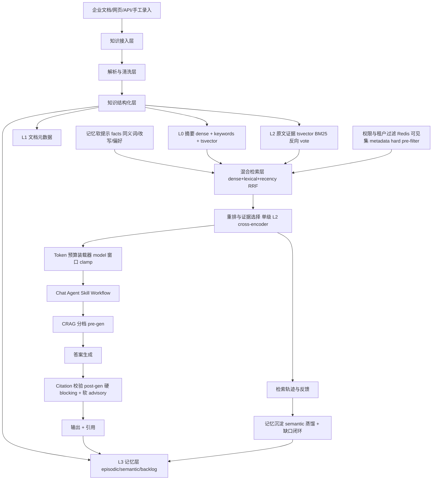
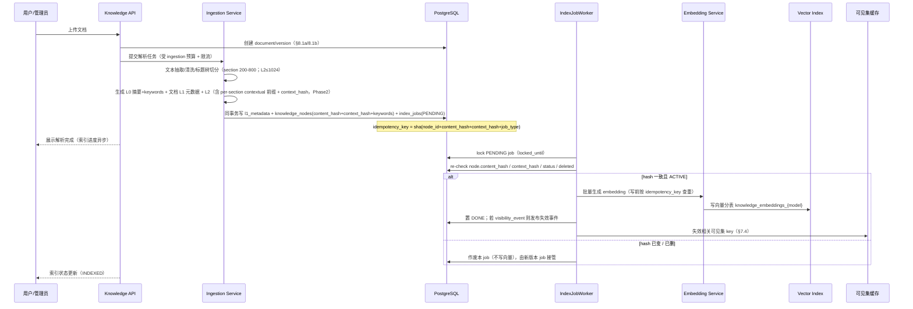
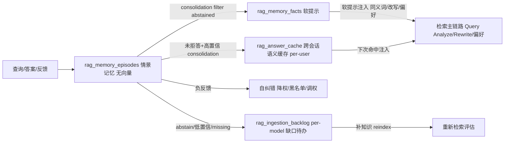

# 企业级 RAG 记忆知识库设计 v5

> 创建：2026-06-16
> 适用项目：agent-platform
> 状态：**最终设计态，self-contained**。本文取代 v3/v4 及其预算账/交接文件。凡内部冲突，以本文 §4 检索流程 + §21 预算账为准。
> 方法论：每个能力要么进 §22 不变式，要么进 §12 mode 表，要么删——不留散文"应该/禁止"。预算数（§21）从候选扇出推导，三者（召回种子/预算/不变式）锁在同一文件，杜绝跨文件漂移。

---

## 0. 设计要点速览

- **三级上下文 + 记忆层**：L0 章节摘要（主 dense 召回）/ L1 文档元数据 / L2 原文证据 / L3 记忆（episodic·semantic·active-learning）。
- **召回双独立种子**：L0 dense（语义）+ L0 keywords 词汇召回（存在性命中，非词频）。两路**独立**选 L0 候选 → RRF 融合，消除"L0 dense 单路漏召"（dense 漏的章节，keywords 路可捞回）。L2 tsvector BM25 跑 L2 全文，反向 vote 父 L0 提权（非 RRF 通道，零额外 embedding）。
- **混合召回 RRF 三通道**：dense(L0) + lexical(L0 keywords) + recency。directory match 前置路由（非通道）；metadata match = 硬 pre-filter（非通道）；tsvector BM25 = L2 层反向 vote（非 L0 通道）。信号正交，无重叠。
- **原文-向量一致性**：原文唯一真相源，向量可重建派生。不变式 `content_hash + context_hash + 模型版本 + ACTIVE + 未删`；Outbox 解耦写原文与写向量。
- **权限前置**：(tenant,kb) 结构性分区 + partial index 把搜索空间缩到单 KB；Redis 可见集做 post-ANN 过滤（pgvector HNSW 不支持前置过滤）；重 ACL 配 over-fetch + ef_search；缓存强制 per-user + permission_signature + evidence hash 二次校验 + exact-key 快路径。
- **向量按 active embedding 模型分表（仅大表）**：`knowledge_embeddings_{model}`、`rag_ingestion_backlog_{model}` per-model 分表（大语料/query 向量）。`rag_memory_facts`、`rag_answer_cache` **单表**（bounded、低 churn）。`rag_memory_episodes` **无向量列、单表**。
- **记忆在线命中查 facts / answer_cache，不查 raw episodes**：软提示查 facts；缓存答案查 answer_cache；raw episode 仅审计 + consolidation 原料。
- **记忆只服务检索，不替代证据**：同义词/改写/偏好作软提示；任何事实 claim 必须由 L2 证据支撑并引用（硬约束 C8）。
- **成本三桶独立**：maxLlmCalls / maxEmbeddingCalls / maxRerankPairs，受 model context window clamp。
- **Citation 校验分层**：`[n]∉注入集` 硬错误 blocking；claim 包含校验 advisory 不阻断。
- **多跳 = decompose + 并行 retrieve + 单次 synthesize**（hops≤2）。

---

## 1. 背景与目标

当前平台已具备 Agent、Skill、Workflow、Chat、Runtime Sidecar 和对象级 Agent 授权能力。下一阶段为企业用户提供统一知识库能力：用户把制度文档、项目资料、产品手册、会议纪要、接口文档、代码说明接入平台，并在对话、Agent、工作流中按权限检索、引用、记忆。

传统 RAG（文档切块 + 向量召回 + 拼上下文）的问题：

- Token 消耗高：召回 chunk 直接塞模型，无关文本污染提示词。
- 命中不稳定：扁平 chunk 缺目录/章节/文档层级，语义相近但上下文错误时误召回。
- 权限难治理：企业知识需租户、部门、用户、Agent、Workflow 多层授权。
- 可观测性弱：用户难知答案来源、命中/未命中原因。
- 知识演进难：更新、回滚、合并、过期清理缺统一机制。
- 无记忆：相同/相似问题反复全量检索，不沉淀经验，不识别知识缺口，不个性化。

本设计参考 OpenViking 核心思想：

- 文件系统范式：上下文组织为目录/文件，而非扁平向量块。
- L0/L1/L2 三级上下文：L0 摘要低成本检索，L1 文档元数据聚合，L2 原文按需深读。
- 目录递归检索：先定位目录/主题范围，再范围内语义召回。
- 检索轨迹可观察：记录每步检索、过滤、重排、装载、记忆命中。
- 上下文自迭代：对会话、文档、反馈做摘要、合并、沉淀。

平台在 OpenViking 基础上增强：企业权限前置过滤；混合检索（目录/keywords/向量/recency/重排）；Token 预算控制（含模型窗口 clamp + embedding/rerank 调用预算）；可引用答案；Agent/Workflow 原生集成（含后台 service-account）；L3 记忆层（episodic 沉淀 / semantic 蒸馏 / active-learning 缺口自补 / 个性化 / 自纠错 / 治理）。

---

## 2. 设计原则

1. **权限先于检索**：任何召回先按租户、知识库、文档、目录、标签、用户、角色、service-account 过滤。禁止先召回再过滤敏感内容。

2. **分层加载 + 召回双独立种子**：默认只把 L0 + 文档元数据子集给模型。L2 原文仅在高置信候选、用户明确要细节、证据不足时加载。L0 召回 = dense（语义）+ keywords（词汇）两路独立种子经 RRF 融合，消除单路漏召。

3. **目录优先于扁平向量**：保留"空间结构"：知识库、目录、文档、章节、段落、表格、附件。先缩小空间，再语义匹配。

4. **引用可追溯**：输出可追溯到文档版本、章节、chunk、页码或段落。执行监控展示检索+记忆轨迹。

5. **成本可控（含模型窗口 + embedding + rerank 预算）**：每次检索有明确预算——召回数、L1 子集、L2 字符数、最终上下文 token 上限、LLM 调用数、embedding 调用数、rerank pair 数；预算按 `min(maxContextTokens, modelMaxContext − reserve)` clamp。

6. **记忆服务于检索，不替代证据**：记忆（L3）仅作软提示（同义词、偏好、已答过的问题），任何事实性 claim 必须由 L2 证据支撑并引用，记忆不得单独成为答案来源。

7. **预算从扇出推导**：maxXxxCalls 必须 ≥ 该 mode 候选扇出合计上界（§21）。**regen 重检索复用上一向量，0 新 embedding**（锁不变式 B7），杜绝重检索路径爆 embedding 预算。

8. **渐进实现**：Phase1 PostgreSQL + pgvector 闭环；后续扩展 Milvus/Elasticsearch/对象存储/连接器。

---

## 3. 上下文与记忆架构（L0/L1/L2 + L3 记忆层）

### 3.1 L0：摘要索引层（章节级原子召回单元）

L0 = 章节级（section）原子摘要，平台**主** dense 召回单元 + **主** keywords 词汇召回单元。一个 section 对应一条 L0、最多一条 dense embedding（按当前 active embedding model）。文档级摘要作为"文档元数据摘要"存在，仅用于目录定位与文档背景，**不参与主召回语义匹配**——避免文档级与章节级粒度混杂导致漏斗倒置。

**section 粒度约束**：section 正文 **200-800 tok**。超 800 → 按子标题再切 sub-section（各自一条 L0）；不足 200 且语义不独立 → 合并相邻 section；不足 200 但语义独立（如单条 FAQ/表格行）→ 允许独立 section。

用途：一句话/极短摘要描述一个章节/知识节点；快速向量召回、目录候选过滤、低成本初筛。

建议内容：

```json
{
  "title": "报销制度 - 差旅标准",
  "abstract": "说明不同城市等级的住宿、交通和餐饮报销标准。",
  "keywords": ["报销", "差旅", "住宿", "交通", "餐饮", "城市等级"],
  "path": "/财务制度/报销制度/差旅标准",
  "entityHints": ["城市等级", "住宿标准", "发票要求"]
}
```

Token 预算：单个 L0 控制 50-120 tokens；一次检索装载 20-60 条 L0（按 mode）做候选判断。

**召回双独立种子**：
- **dense 种子（语义）**：query embed vs L0 摘要 embed（含 contextual 前缀，Phase2）。
- **keywords 种子（词汇）**：query 关键词/实体 vs L0 `keywords` 字段 + title/path 做**存在性命中**（命中即入候选池，非词频打分）。L0 摘要仅 50-120 tok 无有效词频，故不用 BM25 打分 L0；keywords 存在性命中是独立词汇信号，能捞回 dense 语义偏移漏掉的章节。
- 两路各自 top-N 候选 → §6.2 RRF 融合得 L0 章节候选池。
- **L2 词汇提权**：§4 step6 对候选文档 L2 原文跑 tsvector BM25，命中 L2 反向 vote 其父 L0 纳入/提权候选池。复用 L2 tsvector，零额外 embedding。

### 3.2 L1：文档元数据层（文档属性，非检索层）

L1 不作为独立"检索/判断层"，仅为**文档级元数据**，存为 `knowledge_documents.l1_metadata`（§8.1a）。检索中 L1 仅用于：

- 把命中 L2 按文档 coalesce 去重；
- 把文档 **outline + importantRules 子集**作背景注入最终 prompt。

注入量：仅 outline + importantRules 子集，**每文档 ≤250 tok**，top D 文档合计有界（平衡 D=5 → ≤1250 tok），不爆 final context 预算。`summary`/`usageScenarios` 不默认注入。

建议内容（存为 JSON）：

```json
{
  "summary": "本制度规定员工差旅报销范围、城市等级、住宿上限、交通工具标准和审批要求。",
  "outline": ["1. 适用范围", "2. 城市等级与住宿标准", "3. 交通费用", "4. 发票与审批"],
  "usageScenarios": ["判断某城市住宿费用是否超标", "查询高铁/飞机报销条件"],
  "importantRules": ["超标准报销必须走部门负责人审批", "缺少发票时不能直接报销"]
}
```

### 3.3 L2：原文证据层

用途：存放完整原文、表格、图片 OCR、附件文本、代码片段、网页正文；仅在最终回答需精确条款、数字、表格、引用时加载。

**切分约束**：单个 L2 passage ≤1024 tokens（对齐 bge-reranker-v2-m3 8k max_seq，留余量防截断静默失败）。长表格按"行列定位摘要 + 局部行"切。

**L2 不向量化**：L2 仅 tsvector + 按 nodeId 取原文，不生成 dense embedding。词汇提权由 L2 tsvector BM25 承担（§4 step6），无需 L2 dense 向量。避免全量 L2 向量化的存储/ingestion 成本，亦消除"L2 dense 懒生成 160 embedding/次"预算黑洞（§21.5）。

Token 预算：单次 L2 总预算默认 3000-8000 tokens（mode 决定上限）；支持按段落、表格行、页码、标题路径局部加载。

### 3.4 L3：记忆层（一等公民）

使知识库具备"经验沉淀、缺口自补、个性化、自纠错"能力。分三类记忆，各有独立表与治理（§8.8-§8.10）。

**① Episodic 记忆（情景记忆）— `rag_memory_episodes`（无向量列、单表）**

- 记录每次检索 episode：原始 query、改写 query、命中 L0/L2 evidence、最终答案、citations、用户反馈、置信度、mode、耗时、trace_id。
- 用途：①跨会话语义缓存的**原料**；②semantic 记忆蒸馏的原料；③在线评测的真实样本流。
- 与 `rag_retrieval_logs` 区分：logs 全量只追加审计流；episodes 是**记忆原料**（consolidation 离线 re-embed）。
- **不存 query 向量列、单表不分表**：raw episode 不进在线相似命中，存向量列过度工程；consolidation 需相似聚合时离线 batch re-embed。
- **不直接做在线相似命中**（见 semantic 记忆）。

**② Semantic 记忆（语义记忆）— `rag_memory_facts`（单表）**

- 离线 consolidation job 把高频/高正反馈、未拒答的 episode 蒸馏为可复用**软提示**条目：synonym（同义词/别名）、rewrite_template（改写模板）、preference（用户偏好）、domain_hint（领域提示）。跨会话缓存答案存独立表 `rag_answer_cache`。
- 每条记忆带：`key_embedding`（在线 ANN 主索引）、`provenance`（回链 L2 evidence + 源 episodes）、`confidence`、`usage_count`、`decay_at`。
- 用途：检索前注入同义词扩展（§4 step1）、query 改写（§6.3）、个性化偏好。**在线相似命中的软提示主表**。
- **在线命中查 facts（软提示）/ answer_cache（缓存答案），不查 raw episodes**：均已蒸馏 bounded、低 churn；raw episode 仅审计 + consolidation 原料，不建在线 HNSW。
- **硬约束 C8**：semantic 记忆仅作软提示，**绝不单独成为答案事实来源**。

**③ Active-learning 缺口闭环 — `rag_ingestion_backlog_{model}`（per-model 分表）**

- abstention、低置信答案、用户"缺少知识"反馈 → 自动生成知识缺口候选：query + 命中不足原因 + 建议来源。
- 进管理员 ingestion 待办，闭环"识别缺口→补知识→重新评测"。
- 缺口去重（相似 query 聚合）+ 优先级（频次 × 业务域权重）。

**记忆治理**：

- 置信度随 usage_count 上升、随时间衰减；`decay_at` 到期未用 → 自动归档（不删，可恢复）。
- 负反馈触发：episode 标 negative；相关 semantic 记忆 confidence 降权或黑名单；rerank 权重/同义词即时调整候选（经离线评测确认后生效）。
- 记忆可审计、可撤销（admin 可禁用某条记忆）。
- PII/敏感信息 ingestion 检测与脱敏同样作用于 episode/记忆写入（Phase4）。

> L3 记忆不打破 L0/L1/L2 检索主链路；它在主链路前后做加速（已答过命中）、增强（同义词/改写）、兜底（缺口自补）、自纠（负反馈）。

---

## 4. 总体架构与检索流程

### 4.0 总体架构



### 4.1 知识接入层

支持来源：文件上传（PDF/Word/Excel/PPT/Markdown/TXT/HTML/CSV）、网页采集（URL/sitemap）、手工录入（FAQ/制度条款）、系统连接器（后续：企业网盘/Confluence/飞书/钉钉/Git）。

首期：文件上传 + Markdown/TXT/PDF/Word 解析；手工录入片段；管理员维护目录。

### 4.2 解析与清洗层

职责：文件类型识别；文本抽取、OCR、表格抽取；保留页码、标题层级、段落、表格、图片说明；清理页眉页脚、重复水印、目录页、无意义空白；文档版本 hash、重复检测。

关键优化：

- 表格不打散为纯文本，保留表头、行列关系、单位。
- 标题路径写入每个 chunk metadata。
- 长文档先按标题树切分，再按语义段落切分，不按固定字符数粗暴切。
- section 正文 200-800 tok，超切 sub-section，碎合并（§3.1）。
- L2 passage ≤1024 tokens，对齐 bge-reranker-v2-m3 8k 留余量；表格按行/逻辑单元切，每片保留"所属表 + 表头"前缀。
- L0 摘要同时抽取 `keywords`（标题词/实体/高频实词），写入 `knowledge_nodes.keywords`，供词汇召回种子。

### 4.3 知识结构化层（虚拟文件系统）

```text
kb://tenant/{tenantId}/kb/{kbId}/
  财务制度/                          ← DIRECTORY
    报销制度/                         ← DIRECTORY
      差旅标准/                        ← DOCUMENT（L1 元数据锚点）
        original.pdf
        sections/
          001-适用范围/
            .abstract.md             ← L0（section 级；dense + keywords + tsvector）
            passages/*.md            ← L2（原文证据；tsvector；BM25 反向 vote）
          002-住宿标准/
            .abstract.md             ← L0
            passages/*.md            ← L2
```

每个 `knowledge_nodes` 保存：path、node_type（DIRECTORY/SECTION/TABLE/FAQ）、level（L0/L2）、source_document_id、version_id、content、keywords、content_hash、context_hash、content_tsv、status、deleted。L1 不占 node 行，存 documents 元数据。

#### 4.3.1 Contextual Retrieval（作用于 L0 召回层）

孤立 chunk 向量丢失"属于哪篇文档、哪个章节"语义，误召回。采用 Anthropic Contextual Retrieval 思路。

**作用于召回层**：本平台召回入口是 L0 摘要，只有 L0 参与向量召回，故只对 L0 注入上下文。L1/L2 不生成 dense embedding，无需 contextual 化。

流程：

1. 生成 L0 后，对每个 L0 摘要取其所属文档标题路径 + 文档 L1 outline 片段，拼短前缀（50-100 tokens）。
2. 前缀 + L0 摘要送 embedding 模型。
3. L0 原文（无前缀）单独存 `knowledge_nodes.content`，前缀文本 hash 存 `context_hash`，前缀仅参与向量化。

**两档增益**：

- ① 共享文档级前缀（最省，增益弱）：embedding 输入 = doc_title + section_path + L0 摘要，无 LLM 调用。
- ② per-section 唯一前缀（逼近 Anthropic 单项约 35% 失败率降幅）：专用长上下文 ingestion LLM，单文档 1 次调用。

Phase1 不上 contextual 前缀（孤立 embedding，context_hash=占位值，与 §15/§8.2 一致）；Phase2 上档①（无 LLM，前缀=纯模板拼接）+ 档②，评测两档 Recall@K 决定取舍。

**一致性**：embedding 输入含前缀，content_hash（仅 hash content）无法覆盖前缀变更。故 `context_hash = sha256(前缀文本)` 进不变式（§22 I1）。Phase1 不上 contextual（前缀为空/模板），context_hash = 占位值，不变式仍成立。

**事实订正**：Anthropic"检索失败率下降 67%"是 contextual embedding + BM25 + rerank **复合栈**总降幅，非 contextual embedding 单项（单项约 35%，加 BM25 约 49%）。本平台前缀属"文档上下文盖章"，增益以 §14 评测为准。

> 本平台选 Contextual Retrieval，**不采用** Late Chunking（§18 C1），二者在 chunk 上下文注入环节机制冲突。

### 4.4 检索流程（13 步，顺序锁定）

1. **Intent Routing（选 mode）+ Query Analyze + 记忆预注入 + 缓存短路**
   先做 Intent Routing（规则判定 0 LLM）按问题类型选 mode（省 Token / 平衡 / 高精度；规则示例：金额/日期/法务/制度条款 → 强制高精度，FAQ/闲聊/方向性 → 省 Token，其余 → 平衡默认；用户可手动覆盖）——mode 须先于 signature 与缓存短路（signature 含 mode §22 P3；高精度 mode 跳过缓存短路要新鲜证据）。随后识别问题类型、实体、时间、部门、KB 范围、是否需精确数字；产出 **query embed**（复用于 facts/backlog/answer_cache ANN + step5 dense，§21.1 row1）。**先加载 Redis 可见集 `vis:{tenant}:{identity}:{kb}`**（step3 复用，不重载）→ 算 `permission_signature`（§22 P3，此时 mode 已知）。从 `rag_memory_facts` 取该用户/KB 的高置信同义词/别名/改写模板、个性化偏好（软提示，不改变 L2 证据要求）。随即查 `rag_answer_cache`（exact-key 点查 → HNSW 兜底，§5.4 命中链路）：**高精度 mode 跳过此短路（要新鲜证据）**；非高精度 **命中且通过 scope_user + permission_signature + evidence content_hash 现值 + doc_version_set + evidence doc_id ⊆ visible_set 全校验 → 直接返回缓存答案**（标“来自缓存”，可一键新鲜检索），bump cache `usage_count`，**跳过 step2-13、不写新 episode**。未命中 → 进 step2。
   > 缓存短路在 step3 之前，但已加载 visible_set 并做 signature + evidence doc ⊆ visible_set 校验（§22 P2），不构成权限泄露。mode 先定（Intent Routing 前置于 step1）使 signature 含正确 mode、高精度跳缓存 guard 正确生效——修 v5 原「缓存短路早于模式路由」顺序矛盾。

2. **Mode 配置加载**
   按 step1 Intent Routing 所选 mode 载入 §12 能力开关与三桶预算（L0/L2 召回量、rerank/HyDE/CRAG/多跳/缓存/compression 开关、maxLlmCalls/maxEmbeddingCalls/maxRerankPairs）。Intent Routing 已前置到 step1（须先于缓存短路，因 signature 含 mode + 高精度须跳缓存）。

3. **Permission Pre-filter（复用 step1 已加载的可见集 + metadata 硬过滤）**
   复用 step1 已加载的 `vis:{tenant}:{identity}:{kb}` 可见 doc_id set（§7.4）；identity 含 USER 与 SERVICE_ACCOUNT，按执行身份求交（§7.1）。metadata match（doc_type/effectiveAt 等 filters）作为**硬 pre-filter**并入 SQL WHERE，**不进 RRF**。求交得最终可检索范围，禁止任一单独放大。

4. **Directory Routing（前置路由，非 RRF 通道）**
   先在 KB 目录与 L0 摘要中定位候选目录（query vs 目录名/L0 keywords 存在性匹配）。定位失败或 query 跨目录 → 降级全库召回，但降级路径**必须走 §7.5 分区 + 可见集 bitmap 召回**，禁止裸 HNSW + 重 ACL 后过滤。routing 是否命中记入 trace，供 step6 全量释放 gate 判定。

5. **Hybrid Recall（RRF：dense + lexical + recency 三通道）**
   候选目录内（或降级全库）多通道召回，RRF（§6.2）融合排名。
   - **前置 Query Expansion（§6.3，按 mode，召回前执行）**：平/高 产 rewrite 向量；高 + HyDE abstract 向量（**仅主 query，禁 subquery-HyDE**）；高精度多跳 decompose 产 ≤2 subquery 向量（纯 retrieve，无 HyDE）。这些向量作下方 dense 种子，已在 §21.1 计（省 Token 仅 raw 向量，无 expansion）。
   - **dense 通道**：所有已产出的 query 向量作召回**种子**（raw query 必有；平/高 + rewrite 向量；高 + HyDE abstract；多跳 + subquery），各种子分别 HNSW 近邻、RRF 合并。每种子 1 embed，已在 §21.1 计。
   - **lexical 通道**：query 关键词/实体 vs L0 `keywords`/title/path **存在性命中**（GIN 索引），非词频打分。与 dense 独立的词汇种子。
   - **recency 通道**：文档/章节 recency。
   - directory match 不作通道（已 step4 前置路由）。**tsvector BM25 不作 L0 RRF 通道**（L0 摘要 50-120 tok 无词频；BM25 在 step6 跑 L2）。每通道先各自 top-N 再 RRF 合并得 **L0 章节候选池**。

6. **L2 候选生成（双重有界，BM25 在此反向 vote）**
   - 直接取 RRF top M（平衡 8 / 高精度 12）L0 节点、top D（平衡 5 / 高精度 8）文档进 expand。
   - 对 top M 的每个 L0 章节节点，取其 L2 子节点（parent-anchored expansion）。
   - 候选文档范围内用 **tsvector BM25（L2 全文）** 预筛——命中 L2 反向 vote 其父 L0 节点纳入/提权候选池。**L2 候选集 = top-M L0 子节点 ∪ BM25 命中片段（均限 top-D 候选文档内），合并去重后受每文档 cap 钳制**（平衡 ≤20；高精度：routing 命中或 top-1 rerank margin≥δ 时放开 top-1 文档全量 L2，软上限 50 passage，其余 ≤20）。
   - 双重 cap（文档数 D + 每文档片段数）+ top-1 软上限 50 保证 cross-encoder 候选集有界，最坏 pair 190 ≤ §21.3 高 300。
   - **词汇兜底与 step5 lexical 种子正交**：step5 lexical 在 L0 层捞回 dense 漏的章节；step6 BM25 在 L2 层提权已召回文档内的命中段落。两层不重叠。

7. **（无独立 dense 兜底通道）**
   - dense 单路漏召由 step5 lexical（L0 keywords 独立种子）+ step6 L2 BM25 反向 vote 共同承担，无需 L2 dense 向量。
   - 不设 L2 dense 兜底通道：与 step6 BM25 信号同候选集重叠，且单次吞 160 embedding 爆预算（§21.5）。
   - CRAG 判 ambiguous（step10）走二次召回（**复用 §6.3 已产出向量 + 扩 ef_search/放宽 directory，不重新 rewrite、0 新 LLM、0 新 embed**，不变式 B7）。

8. **单级 Rerank（cross-encoder over L2 片段）**
   cross-encoder 对有界 L2 候选 pairwise 打分（query vs 片段原文），在同文档多片段中定位真正命中段落。L1 元数据不参与 rerank 门槛。pair 数受 `maxRerankPairs` 约束（§21.3）。

9. **Evidence Loading（model 窗口 clamp）**
   取 rerank 后 top K（mode 决定）L2 片段，按 token 预算截断进最终 prompt。预算 = `min(maxContextTokens, modelMaxContext − answerReserve)`。装载前 evidence hash（content + context）二次校验（§22 I3）。注入 L1 仅 outline+importantRules 子集（≤250 tok/doc）。

10. **CRAG 分档（pre-gen）**
    召回重排后、**生成前**，retrieval evaluator 评估证据质量分档（§6.4.2）：correct→生成；ambiguous→二次召回（复用已产出向量+扩参，0 新 embed）再分档；incorrect→abstention。**CRAG 必须在答案生成之前**。

11. **Answer Generation**
    生成最终答案 + 结构化引用 `[1]..[K]`。

12. **Citation Grounding 校验（post-gen，分层）**
    生成后做校验：硬错误（`[n]` ∉ 注入集合）→ 拒绝/重生成；软校验（claim span 包含，**编辑距离判定**）→ **advisory 标红/告警，不阻断**（防误杀好答案）。advisory 仅用确定性编辑距离，**零 embedding、零 LLM**（防隐式 embedding 调用爆预算）。幻觉引用硬错误才拒绝。

13. **记忆沉淀（L3）**
    输出后写 episodic 记忆（query/answer/evidence/feedback/confidence）；负反馈触发自纠错；低置信/abstain 入 active-learning 缺口待办。

### 4.5 三级架构定位（防粒度混杂）

| 层 | 粒度 | 召回角色 | 向量化 | 词汇信号 |
|---|---|---|---|---|
| L0 | section 200-800 tok，摘要 50-120 tok | **主召回单元**（dense + keywords 双种子） | dense embedding（含 contextual 前缀） | keywords 存在性（非 BM25） |
| L1 | 文档级 | 非检索层；outline+rules 子集背景注入 | 无 | 无 |
| L2 | passage ≤1024 tok | 证据层；BM25 反向 vote 父 L0 | **无**（不向量化） | tsvector BM25（词频） |

### 4.6 关键不变式（运行期强制，详 §22）

- **I1 一致性**：node 参与召回须 `status='ACTIVE' AND deleted=0 AND embed.content_hash=node.content_hash AND embed.context_hash=node.context_hash AND embed.table=active_model.table_name`。
- **P1 权限**：召回结果 doc ∈ visible_set；metadata 作为硬 pre-filter 并入 SQL。
- **P2 缓存**：answer_cache 命中强制 scope_user + permission_signature + evidence content_hash 现值 + doc_version_set + evidence doc_id ⊆ visible_set 校验。
- **B7 regen 复用向量**：CRAG 重检索复用请求内已产出的向量，0 新 embedding。
- **C8 记忆非证据**：任何事实 claim 必须由 L2 证据支撑并引用。

### 4.7 原文-向量索引一致性（Outbox 模式）

`knowledge_index_jobs`（§8.6）将"写原文"与"写向量"解耦但保证最终一致。

写入流程（单事务）：

1. 写 `knowledge_nodes`（原文 + content_hash + context_hash + status + keywords）。
2. 同事务写 `knowledge_index_jobs` 一条 PENDING，content_hash/context_hash 须等于 node 现值。
3. 提交后独立 worker 拉取、lock。**lock 后、生成 embedding 前 re-check**：`SELECT content_hash, context_hash, status, deleted FROM knowledge_nodes WHERE id=?`。若任一不一致（并发更新/删除，§4.8 CAS），**作废本 job（不写向量、不置 DONE）**，由新版本 UPSERT/DELETE job 接管。只有一致才生成 embedding、写向量、置 DONE。
4. 失败指数退避重试，超 `max_attempt` 置 DEAD 告警。
5. **abandoned RUNNING 清扫**：step3 作废的 job 悬置 RUNNING；新版 hash 不同 → idempotency_key 不同 → 新 job 接管。worker 拉取加超时判定：`status='RUNNING' AND locked_until < now()` 视为僵尸，置 FAILED 或删除。

幂等保证：worker 写向量前按 `idempotency_key` 查重，已 DONE 跳过。`idempotency_key = sha(node_id + content_hash + context_hash + job_type)`（§22 I5）。

### 4.8 版本切换一致性

更新文档不允许"新原文+旧向量"并存：

1. 新版本 node 写入，status=ACTIVE，content_hash/context_hash 新值。
2. 同事务 CAS 作废旧版本：`UPDATE knowledge_nodes SET status='STALE' WHERE id=? AND status='ACTIVE'`。affected=0 说明被并发改动，放弃并重读。
3. 同事务写两条 index_job：旧 DELETE、新 UPSERT。
4. worker 先作废旧 embedding，再写新。
5. `effectiveAt` 与 status 共同决定可检索版本。

CAS 防并发覆盖，避免双 ACTIVE 漂移。

### 4.9 删除级联失效

删除走"墓碑+编排"：

1. node 软删（deleted=1，status=ARCHIVED）。
2. 同事务生成一组 delete_job（每目标一条，独立幂等）：向量索引删；L0/L2 内容缓存清；会话 evidence 缓存失效；L3 记忆引用失效（episode/fact 引用该 node 标 revoked 或脱敏）；检索轨迹脱敏。
3. 各 delete_job 独立重试，单步失败不阻塞其他。
4. 全部完成按保留期物理清理 node 与原始文件。

补偿：向量库删除 API 失败 job 重试；超阈值未完成 → node 进"隔离区"，检索层硬过滤。

### 4.10 周期性对账（Reconciliation）

定时（默认每小时，按 KB 可配）扫描修复漂移：ACTIVE node hash ≠ embedding hash → REINDEX；孤儿向量 → DELETE；STALE/ARCHIVED 残留 embedding → DELETE；DEAD job 超阈值 → 告警人工。结果写 `knowledge_reconciliation_reports`。

**记忆表 HNSW 对账**：`rag_memory_facts`、`rag_answer_cache` 虽 bounded，仍持续 add/disable/archive/decay，pgvector HNSW 删除/更新致图退化。同周期额外扫描：DISABLED/ARCHIVED 残留向量 → DELETE；累计 churn（deleted 比例 >5%）→ 触发 HNSW 全量重建。监控 `rag_memory_fact_active`、`rag_answer_cache_active`、`rag_memory_hnsw_stale_ratio`，stale_ratio > 阈值告警。

**记忆 HNSW per-user 召回衰减对策**：facts/answer_cache 为单表全局 HNSW（与 knowledge_embeddings 的结构性 partial-per-KB 不同——记忆表 bounded、低 churn，不建 per-tenant partial HNSW），查询时按 tenant + scope_user 高选择性后过滤。对策：①answer_cache 先 `query_hash` exact-key 点查快路径（高频命中走点查，绕开 HNSW 后过滤）；②HNSW 查询 over-fetch（5-10×）+ 调大 ef_search；③监控 `rag_cache_recall_after_filter`，持续低位则按 (tenant, scope_user) 细分分区（将来升级项，非当前态）。facts 同理（按 fact_type 预过滤缩小候选）。

### 4.11 检索层强制约束

Hybrid Recall 所有召回 SQL 与向量查询**必须**带不变式过滤：

```sql
WHERE n.status = 'ACTIVE'
  AND n.deleted = 0
  AND e.content_hash = n.content_hash
  AND e.context_hash = n.context_hash          -- contextual 一致性
  AND e.embedding_model = kb.embedding_model   -- 单 active 模型；路由到对应分表
  AND n.document_id = ANY(:visible_set)        -- 权限 post-ANN
  AND (cardinality(:meta_filter)=0 OR n.doc_type = ANY(:meta_filter))  -- metadata 硬 pre-filter（示例；空 filter 置真，避免 ANY('{}') 召回零行）
```

过滤封装在 `RagRetrievalService` 基础召回方法内，禁止业务层绕过（代码审查 + 单测强制，§22）。

---

## 5. Token 与成本控制

### 5.1 渐进式上下文装载

默认（平衡）流程：

```text
L0 章节召回 top 40（dense + lexical + recency RRF）        ← §12.1
→ RRF 排序取 top 8 L0 / top 5 文档
→ L2 候选生成（top L0 子节点 + L2 tsvector BM25 反向 vote，每文档 cap 20）
→ L2 单级 cross-encoder rerank，取 top 3
→ 最终上下文包 ≤6000 tokens（含 L1 outline+rules 子集 ≤250/doc；model 窗口 clamp）
```

扩大 L2 的条件：用户要"原文条款/完整制度/逐条对比"；证据置信不足；答案涉金额/日期/法务/配置参数（高精度 mode 自动满足）。

### 5.2 Token Budget Manager

每次 RAG 调用携带预算（示例为平衡模式默认值，随 mode 变，§12）：

```json
{
  "maxContextTokens": 6000,
  "modelMaxContext": 32000,
  "answerTokenReserve": 1200,
  "effectiveContextCap": 6000,
  "maxL0Candidates": 40,
  "maxL1Read": 6,
  "maxL2Read": 3,
  "maxEvidenceTokens": 4500,
  "maxLlmCalls": 3,
  "maxEmbeddingCalls": 2,
  "maxRerankPairs": 100,
  "ingestion": {
    "llmCallsPerDocBudget": 3,
    "embeddingBatchSize": 64,
    "tenantQpsLimit": 50
  }
}
```

`effectiveContextCap = min(maxContextTokens, modelMaxContext − answerTokenReserve)`。业务层只认 `effectiveContextCap`，防小窗模型爆 context。

三桶独立计（终态值见 §21）：

- **maxLlmCalls**：省 1 / 平 3 / 高 6。
- **maxEmbeddingCalls**：省 1 / 平 2 / 高 5。
- **maxRerankPairs**：省 0 / 平 100 / 高 300。
- **ingestion**：L1 元数据 + per-section contextual 前缀 + L0 摘要生成 LLM，按文档计 `llmCallsPerDocBudget`；embedding 走批量；每租户 QPS 限流。

> 三桶终态值 = §21 预算账推导结果。**本节示例数字必须与 §21 一致**——若两者冲突，以 §21 为准并改本节。

### 5.3 上下文去重与压缩

- 相同文档不同段落命中，按标题路径聚合。
- 相似 chunk 语义去重，保留信息增量最高片段。
- 长表格先生成"行列定位摘要"，必要时只读相关行。
- L2 片段进 prompt 前做 evidence compression，保留引用 id。
- 省/平衡 mode 的 contextual compression **走 tsvector 选句**（零 embedding、零新表）：**§4 step1 Query Analyze 抽取的 query 关键词**（非 §6.3 rewrite——省 Token 无 rewrite，关键词源是 step1 规则抽取）命中 L2 句子（复用 content_tsv），选 top-N 相关句拼压缩证据。
- **选句保 grounding 兜底**：若 tsvector 命中句数 < 阈值（默认 1）→ **退回整 passage 不压缩**（牺牲 token 保 C8 grounding）。中文改写常零词重叠（"能报多少" vs "报销上限"），纯词汇选句有漏句风险，故设此兜底，未实测前不裸跑压缩。

### 5.4 缓存体系（会话内 + 跨会话语义缓存）

**会话内缓存**（同一会话）：缓存最近命中 L1/L2 evidence id；追问优先在已命中文档内检索；不重复塞相同证据全文，传引用摘要+增量。

**跨会话语义缓存**（全平台，FAQ 高频场景省 token）——数据源 `rag_answer_cache`（D7 独立表，**不查 raw episodes、不查 facts**）：

- **命中链路（exact 快路径优先）**：
  1. `query_hash = hash(query_canonical)` 点查 `(tenant, scope_user, query_hash)` → 命中走快路径；
  2. 否则 key_embedding HNSW 近邻 + over-fetch 兜底。
  3. 命中后校验链：scope_user + permission_signature + evidence_hashes 逐条 content_hash 现值 + doc_version_set。任一不匹配 miss。
  4. 通过 → 返回缓存答案（带原 trace + 引用，标"来自缓存"，可一键新鲜检索）。
- **强制 per-user**：cache key = `user_id + permission_signature + doc_version_set`。`permission_signature = hash(visible_doc_set + kb_scope + mode)`。**跨用户命中默认禁用**（同 query 不同用户可见 evidence 不同，跨权限命中会泄露，§18 C7）。
- **失效粒度：文档级 doc_version**。单文档编辑只失效引用该文档的答案（evidence_hashes 逐条 miss）。
- 命中后对每条 evidence 再做可见集二次校验（permission_signature 对应 doc_set ⊇ evidence doc_id），防可见集失效延迟窗口越权。
- 新增更相关文档等场景由 TTL + 定期全量失效兜底，默认 TTL 1h。
- 高精度模式默认绕过语义缓存（要新鲜证据）；省 Token 模式优先命中。
- abstention 不写缓存；派生仅取未拒答且 confidence≥阈值的 episode。

### 5.5 Prompt Caching（前缀缓存）

LLM provider prompt/KV cache 对稳定前缀复用计算。RAG 难点是动态 evidence 破坏前缀缓存。对策锁死 prompt 结构：

```text
[ stable system prompt ]
[ 知识库描述 / 检索约束 / 禁答规则 ]   ← 稳定段，前置，命中 cache
--- cache boundary ---
[ 动态 evidence 片段 ]                 ← 每次不同，不进 cache
[ 用户 query ]
```

规则：稳定段前置且顺序固定，业务层禁止自由拼接上下文（§18 C5）；知识库描述按 kb_id 粒度缓存。Contextual Retrieval 前缀生成走 prompt caching 摊薄 ingestion 成本。多 provider（Doubao/OpenAI/DeepSeek/Qwen）cache 命中反馈字段不一致，指标允许缺失。

**BYOK 粒度塌缩**：OPENAI_COMPATIBLE 用户自带 key → 每用户独立 cache 命名空间 → 跨用户零复用，平台级命中塌缩为单会话内。§5.5 定位为会话级/同 key 优化。

---

## 6. 查询更精准的策略

### 6.1 目录递归检索

先找"在哪个知识空间"，再找"哪段内容"：

```text
用户问：上海出差住宿能报多少？
1. L0/目录定位：/财务制度/报销制度/差旅标准（keywords 存在性匹配）
2. L1 文档背景：outline 含"城市等级与住宿标准"
3. L2 精读：读取"城市等级与住宿标准"表格
4. 回答：给出上海对应等级、金额、审批例外和引用
```

比全库向量召回更稳定，减少"语义相似但制度类型错误"误召回。

### 6.2 混合打分：RRF 召回融合 + cross-encoder 定最终分

各路信号量纲不同，直接手工加权无可比性。召回阶段用 **Reciprocal Rank Fusion（RRF）** 融合排名，无需归一化、鲁棒、工业标准：

```text
rrf_score(d) = Σ over channels  1 / (k + rank_channel(d))     # k 默认 60
```

**RRF 三通道**：dense vector（L0）、lexical keywords（L0 存在性命中）、recency。

**非通道**（明确，防漂移）：

- **directory match**：step4 前置路由，不进 RRF。
- **metadata match**：step3 硬 pre-filter，并入 SQL WHERE，不进 RRF。
- **tsvector BM25**：跑 L2 全文，在 step6 预筛 + 反向 vote 父 L0 纳入/提权候选池，不在 L0 层做 RRF（L0 摘要 50-120 tok 无词频）。

每通道先 top-N 再 RRF 合并得召回候选池。最终证据排序**不靠 RRF**，由 §6.4.1 cross-encoder 精排 L2 决定。RRF 只负责"把可能候选捞进池"。

userFeedbackScore 不进在线召回打分：在线反馈是 answer 级，无法归因到单 node。反馈改为：①喂离线评测；②聚合为 query rewrite 同义词与 rerank 调权信号（经 L3 semantic 沉淀）；③不作为单 node 在线 score。

### 6.3 Query Rewrite（含 HyDE-abstract）

检索前轻量改写：生成关键词版、语义版、提取实体与限定、判断是否需精确引用。

**HyDE（仅高精度模式，且仅作用于主 query）**：用 LLM 生成**假设性 section abstract（≤120 tok，匹配 L0 粒度）**而非完整答案，用该假设摘要向量做召回，再用原始 query 重排。代价每次 +1 LLM +1 embedding，故只高精度模式触发。**禁止对多跳 subquery 跑 HyDE**：subquery 是 decompose 拆出的精确子问题（语义已明确，不需假设性摘要补全），subquery-HyDE 边际收益≈0 却线性放大预算（+2 LLM +2 embed 直接破 §21 预算）。HyDE 只补强主 query 语义模糊场景；subquery 走纯 retrieve。

### 6.4 Rerank、纠正式检索与可信输出

本节统一"召回后到输出前"精度兜底。顺序锁定：召回重排 → ⑩CRAG 分档（pre-gen）→ ⑪答案生成 → ⑫Citation 校验（post-gen，分层）。CRAG 必须生成前，Citation 必须生成后。

#### 6.4.1 L2 候选生成 + 单级 Rerank

**第一步：RRF 选 L0 + L2 候选生成（双重有界）**

- 取 RRF top M（平衡 8 / 高精度 12）L0、top D（平衡 5 / 高精度 8）文档进 expand。
- 对 top M 每个 L0 章节节点，取其 L2 子节点（parent-anchored expansion）。
- 候选文档范围内 **L2 tsvector BM25** 预筛，命中 L2 反向 vote 父 L0 纳入/提权候选池（L2 候选集 = top-M 子节点 ∪ BM25 命中，限 top-D 文档内，去重后按每文档 cap 钳制）。
- 每文档 cap：平衡 ≤20；高精度 top-1 文档全量 L2 释放需 gate——`routing_hit=true OR rerank top1-top2 margin≥δ`（δ 默认 0.15），其余 ≤20。**top-1 全量释放有软上限 50 passage**：单文档 L2 超 50 时截断至 50（防一篇巨文档独吞 rerank 预算挤掉其他文档证据；50 passage≈50k tok 足覆盖任一单章节精读，超 50 的极巨文档应按 §3.1 拆 sub-section）。
- 双重 cap（文档数 D + 每文档片段数）+ top-1 软上限 50 保证 cross-encoder 候选集有界，最坏 pair = 7×20+50=190 ≤ `maxRerankPairs` 高 300，受 §21.3 约束。

**第二步：单级 Rerank（cross-encoder over L2 片段）**

- cross-encoder 对有界 L2 候选 pairwise 打分，同文档多片段中定位真正命中段落。
- 仅输入候选 L2 片段，控原文 token。

**L1 元数据定位**：不做 rerank 门槛。仅 ①把命中 L2 按文档 coalesce 去重；②outline+importantRules 子集作背景注入（≤250 tok/doc）。

模型选型：Phase2 用 bge-reranker-v2-m3（8k 多语含中文，L2≤1024 远小于 8k 无截断）。高精度模式开启冲突证据检查（同问题命中互斥条款时标红并列出）。

#### 6.4.2 CRAG 纠正式检索（pre-gen 分档）

召回重排后、**生成前**，retrieval evaluator 评估证据质量：

- **correct**：证据充足相关 → 生成。
- **ambiguous**：部分相关/置信不足 → **二次召回**（**复用 §6.3 已产出的 rewrite 向量，扩 ef_search + 放宽 directory 范围捞更多候选；不重新 rewrite、0 新 LLM、0 新 embed**，锁不变式 B7；省 Token 不重检索直接 abstain；平衡重检索 1 次；高精度最多 2 次）再分档。**禁止 regen 产生新 query/embed**——regen 的"重检索"成本仅在 LLM 桶（重生成 synthesize，§21.2 已计），embedding 桶恒 0。
- **incorrect**：证据严重不足/越权 → abstention。

**实现选型**：默认**启发式打分**（top1 cross-encoder 分 + 命中证据数 + 跨文档冲突标志），阈值分档，0 LLM。省 Token 模式无 cross-encoder 分数，用 top1 dense cosine 替代（与 §6.4.3 abstain 分数源一致）。

> "权限可见证据占比"不入启发式：权限已 step3 前置过滤，到 CRAG 时该值恒=1.0，无信息量。

#### 6.4.3 Abstention 拒答（"100% 精准"前提）

**触发顺序与优先级**：先 CRAG 分档，CRAG=incorrect → 直接 abstain；CRAG=correct/ambiguous 后，再按 top1 相关性分判：

- top1 相关性分数低于阈值：高精度/平衡用 cross-encoder 分（默认 0.5）；省 Token 关 rerank，用 top1 dense cosine（默认 0.55，按 KB 校准）。分数源随 mode 切换。
- 证据冲突且无仲裁规则。
- 命中证据全部越权（空可见集）已在 step3 体现为 abstain，不在此重复列。

**多跳级联**：高精度多跳中任一跳 CRAG=incorrect/abstain → 全局 abstain，trace 记中断跳号。

拒答行为：固定话术"未在当前知识库找到可信依据，建议转人工或补充知识"；记 abstention 原因到 trace；不编造、不用通用知识兜底（企业合规）；abstain 不写语义缓存，落 episodic + 进 active-learning 缺口待办。

#### 6.4.4 Citation Grounding 校验（post-gen，分层防幻觉）

LLM 可能编造引用（伪造 nodeId/页码/章节）。**生成后**分层校验：

- prompt 注入 evidence 时强制编号 `[1]..[K]`，约束答案只能引用注入编号。
- **硬校验（blocking）**：`[n]` ∉ 注入集合 → 拒绝/重生成。零额外 LLM，确定性，不计 `maxLlmCalls`。
- **软校验（advisory）**：claim span 包含校验（claim 文本是否被 cited evidence 原文支撑，**编辑距离判定**）→ 标红/告警，**不阻断、不重生成**。零 embedding、零 LLM。
- LLM judge 降级为 §14 在线评测低频采样（faithfulness 指标源），不计在线预算。

> 用 CRAG + LLM-as-judge 近似"自我反思"，**不采用**原生 Self-RAG（需微调带 reflection token 模型，API 不可用，§18 C2）。

---

## 7. 权限与安全设计

### 7.1 权限模型

对象层级：

```text
Tenant
  └── KnowledgeBase
      └── Directory
          └── Document（L1 元数据锚点 + 授权对象）
              └── Section / Chunk（继承 Document 权限，不独立授权）
```

**授权粒度**：permission 仅在 KB / DIRECTORY / DOCUMENT 三级独立授权（§8.4）。Section/Chunk 继承所属 Document 权限。需章节级敏感隔离 → 拆独立 Document 或独立 KB。

权限类型（3 类 boolean）：canRead / canWrite / canManage。

> Agent/Workflow 绑定 KB 是**检索范围配置（scope）**，非权限类型（§8.4b）。绑定后以"执行身份对该 kb 实际授权"为基线求交。

授权主体（四类）：用户 / 角色 / 部门 / **SERVICE_ACCOUNT**。Agent/Workflow 非独立主体（通过绑定范围限定）。

检索用"执行身份"：

- Chat：当前用户身份。
- Agent：当前用户对该 kb 权限 ∩ Agent 绑定 kb 范围。
- Workflow：触发用户对该 kb 权限 ∩ Workflow 绑定 ∩ 节点配置。
- 后台 Agent/Workflow（无触发用户，如定时任务/事件驱动）：绑定 service-account，按 service-account 对 kb 实际授权 ∩ 绑定范围。

求交得最终可检索范围，**禁止任一单独放大权限**（§22 P4）。

### 7.2 安全边界

- 向量库不存明文敏感字段可逆索引。
- embedding metadata 只放必要过滤字段，不放全文敏感信息。
- 删除知识后，向量、L0/L2、缓存、记忆引用、检索轨迹都要失效。
- 检索轨迹展示给用户时，只展示有权查看的证据信息。
- 支持知识库级水印：答案标记来源为内部资料。

### 7.3 原文-向量索引一致性保障

确保向量索引始终是原文的可重建派生物，绝不脱离原文成独立真相源。一致性原则与不变式见 §4.6 / §22 I1-I5；Outbox 编排见 §4.7；版本切换 §4.8；删除级联 §4.9；周期对账 §4.10；检索层强制过滤 §4.11。

#### 7.3.1 Embedding 模型版本迁移（跨模型漂移治理）

§4.6-4.11 覆盖同模型内 hash 漂移。换 embedding 模型时维度与语义空间变化，旧向量与新向量不可比，会静默劣化召回。治理协议：

1. **模型版本注册表**：`embedding_model_versions`（§8.12）维护版本、维度、上线状态、`table_name`/`backlog_table_name`。`knowledge_embeddings_{model}` 按 model 分表，每表 VECTOR(dim) 维度匹配。`knowledge_bases.embedding_model`（**标量**）记录 active 模型。
2. **仅 shadow，不进 serving**：新模型不进在线召回，仅 shadow eval-set 离线 embedding + 评测。删除"检索层跨表 union + RRF 融合两路 dense"（同源 dense 用 RRF 非最优，且双倍成本）。shadow 离线 A/B 比 Recall@K/MRR，确认不劣化才切换。
3. **全量 re-embed job**：切换决策后按 kb 粒度生成 REINDEX job（复用 §4.7 outbox），灰度推进，避免一次打爆 embedding 预算。
4. **切换原子性**：单 kb 全量 re-embed 且对账通过后，`embedding_model` 切换为新模型标量值，旧表数据随后 delete_job 清理（旧表可保留只读用于回滚窗口）。切换前后均**单模型 serving**，无在线并存 → 无跨表 union/RRF（§18 C9）。查询层按 `embedding_model_versions.table_name` 路由到当前 active 分表。
5. **记忆表联动（明确，防混表）**：
   - `knowledge_embeddings_{model}` / `rag_ingestion_backlog_{model}`：**per-model 分表**（大语料/query 向量）。shadow 需并行表。
   - `rag_memory_facts` / `rag_answer_cache`：**单表**（bounded、低 churn）。key_embedding 维度绑 active 模型：**同维切换** in-place re-embed；**跨维切换**（dim 变）**清空 + 离线 re-embed**（cache 命中率自然回落，可接受）——**禁止 ALTER 列类型**（pgvector 跨维向量不可保留数据，ALTER 无意义）。provenance 回链 node_id，不受模型切换影响。
   - `rag_memory_episodes`：无向量列、单表、不分表，consolidation 离线 re-embed。
6. **语义缓存联动**：跨会话语义缓存 key_embedding 绑定模型版本，模型切换清空对应缓存。
7. **可观测**：`rag_embedding_model_drift_total`、迁移进度看板。

### 7.4 权限可见集缓存

`PermissionVisibilityService` 维护 Redis 可见集：

- key `vis:{tenant}:{identity}:{kb}` → 该 identity 对该 kb 可见 doc_id set（含经 role+dept 联合展开；identity 含 USER 与 SERVICE_ACCOUNT）。
- 检索时先取可见集，召回 SQL `AND document_id = ANY(:visible_set)` 在 HNSW 返回候选后做 **post-ANN SQL 过滤**。pgvector HNSW **不支持前置过滤**，故 ACL 是后过滤；但 §7.5 的 (tenant,kb) 结构性分区 + partial index 已把搜索空间缩到单 KB，doc 级后过滤在缩小的候选集上做，重 ACL 场景配 over-fetch(3-5×) + 调大 ef_search 补偿（§8.13），监控 `rag_recall_after_filter`。
- **失效**：grant/revoke/文档状态变更/KB 成员变更 → 经 index_job outbox 同事务发"可见集失效事件"，异步删对应 Redis key（或标脏懒重建）。最终一致，不阻塞授权事务。
- **冷启动/缓存击穿**：未命中时回源 DB 计算 + 写回，加 per-key 互斥锁防击穿。

### 7.5 分区与召回结构

- `knowledge_embeddings_{model}` 与 `knowledge_nodes` 按 `(tenant_id, kb_id)` 分区或建 partial index，把租户+KB 范围从运行时过滤变为结构性索引选择。
- **HNSW 规模阈值**：partial index = 每 KB 一个 HNSW（pgvector 0.7+）。KB 数 ≤ 阈值（默认 200）用 pgvector partial index；**KB 数 > 阈值 → catalog 膨胀 + planner 开销 → 迁 Milvus/Qdrant**（§8.13）。阈值按实测调，监控 `pg_catalog_index_count` + 查询计划耗时。
- 目录降级全库召回（§4 step4）显式走分区选择 + 可见集 bitmap，**禁止裸 HNSW + 重 ACL 后过滤**。
- 权限维度无法结构化时，HNSW over-fetch（3-5× top K）后过滤，调大 `ef_search`，监控 `rag_recall_after_filter`。

---

## 8. 数据模型

> 全表字段对齐 §4 不变式与 §21 预算。维度一律 `VECTOR(dim)` 占位，建表时按 §8.12 active 模型的 `dim` 实例化（Phase1 Doubao=2048）。

### 8.1 knowledge_bases

| 字段 | 类型 | 说明 |
|------|------|------|
| id | BIGINT PK | 主键 |
| tenant_id | BIGINT | 租户（单租户阶段=1） |
| name | VARCHAR | 名称 |
| description | TEXT | 描述 |
| visibility | VARCHAR | PRIVATE / TEAM / PUBLIC |
| embedding_model | VARCHAR | **标量**，当前 active embedding 模型 code |
| rerank_model | VARCHAR | reranker code（Phase2 bge-reranker-v2-m3） |
| chunk_strategy | VARCHAR | 切分策略 |
| status | VARCHAR | ACTIVE / ARCHIVED |
| effective_partition | VARCHAR | `(tenant_id, kb_id)` 派生 |
| created_by / created_at / updated_at / deleted | — | 通用 |

> 历史的 `active_embedding_models`（数组）**不建**：稳态单模型，迁移仅 shadow eval-set。

### 8.1a knowledge_documents（L1 元数据锚点）

| 字段 | 类型 | 说明 |
|------|------|------|
| id | BIGINT PK | 主键 |
| kb_id | BIGINT | 知识库 |
| directory_id | BIGINT | 所属目录 node |
| title | VARCHAR | 文档标题 |
| doc_type | VARCHAR | policy/manual/faq/api/... |
| status | VARCHAR | PENDING/PARSING/SUMMARIZING/EMBEDDING/INDEXED/FAILED |
| current_version_id | BIGINT | 当前版本 |
| l1_metadata | TEXT(JSON) | summary/outline/usageScenarios/importantRules；注入仅 outline+importantRules 子集 |
| file_ref | TEXT | 原始文件引用 |
| file_hash | VARCHAR | 重复检测 |
| effective_at / deadline | TIMESTAMPTZ | 生效/失效（Phase4 过期降权） |
| created_by / created_at / updated_at / deleted | — | 通用 |

### 8.1b knowledge_document_versions

| 字段 | 类型 | 说明 |
|------|------|------|
| id | BIGINT PK | 主键 |
| document_id | BIGINT | 文档 |
| version_no | INTEGER | 版本号 |
| parent_version_id | BIGINT | 父版本（回滚链） |
| content_hash | VARCHAR | 该版本内容 hash |
| change_note | TEXT | 变更说明 |
| effective_at | TIMESTAMPTZ | 生效时间 |
| status | VARCHAR | ACTIVE / STALE / ARCHIVED |
| created_by / created_at | — | 通用 |

### 8.2 knowledge_nodes（L0/L2 节点；L1 不占 node 行）

| 字段 | 类型 | 说明 |
|------|------|------|
| id | BIGINT PK | 主键 |
| tenant_id | BIGINT | 分区键 |
| kb_id | BIGINT | 分区键 |
| document_id | BIGINT | §8.1a |
| parent_id | BIGINT | 父节点 |
| path | TEXT | 虚拟路径 |
| node_type | VARCHAR | DIRECTORY / SECTION / TABLE / FAQ |
| level | VARCHAR | L0 / L2（L1 已移出） |
| title | VARCHAR | 标题 |
| content | TEXT | L0 摘要 / L2 原文 |
| keywords | JSONB | L0/文档抽取的关键词/实体（§4 step1 lexical 召回种子；JSONB 以支持 GIN jsonb_path_ops） |
| content_tsv | tsvector | generated（to_tsvector over content）；BM25 词频信号源 |
| metadata | TEXT(JSON) | 标题路径、页码、表头前缀 |
| token_count | INTEGER | 预估（section 200-800；L2≤1024） |
| content_hash | VARCHAR | 内容 hash |
| context_hash | VARCHAR | contextual 前缀 hash（Phase1 占位，Phase2 真实计算） |
| status | VARCHAR | ACTIVE / STALE / ARCHIVED |
| version_id | BIGINT | §8.1b |
| created_at / updated_at / deleted | — | 通用 |

索引：GIN(`content_tsv`)；GIN(`keywords` jsonb_path_ops)；`(tenant_id, kb_id, level)`；`(document_id)`；`(parent_id)`；`(tenant_id,kb_id) partial where level='L0'` 供 L0 RRF 召回。

> `keywords` 是 v5 新列：承载 §4 step1 lexical 召回种子，解 dense 单路漏召。

### 8.3 knowledge_embeddings_{model}（L0 dense 向量；per-model 分表）

**只 L0 生成 dense embedding。L2 不向量化**（§4 删 L2 dense）。1 个 L0 node ↔ 0..1 行。

per-model 分表 `knowledge_embeddings_{model}`，每表 `VECTOR(dim)` 匹配该模型。下表为模板：

| 字段 | 类型 | 说明 |
|------|------|------|
| id | BIGINT PK | 主键 |
| node_id | BIGINT | L0 节点（唯一） |
| tenant_id | BIGINT | 分区键 |
| kb_id | BIGINT | 分区键 |
| node_level | VARCHAR | 固定 L0（L2 无行） |
| embedding_model | VARCHAR | 冗余便于查询 |
| embedding | VECTOR(dim) | dense 向量（HNSW 索引） |
| external_vector_id | TEXT | 外部库 id；pgvector 留空 |
| metadata | TEXT(JSON) | 过滤字段 |
| content_hash | VARCHAR | §22 I1 校验 |
| context_hash | VARCHAR | §22 I1 校验 |
| created_at | TIMESTAMPTZ | 创建 |

索引：`node_id` 唯一；`(tenant_id, kb_id)`；HNSW on `embedding vector_cosine_ops`（§8.13 partial-per-kb 或分区）。

> 历史 `sparse_terms` 列不建：BM25 统一走 `knowledge_nodes.content_tsv`。`embedding`(pgvector) 与 `external_vector_id`(外部库) 二选一。

### 8.4 knowledge_permissions

| 字段 | 类型 | 说明 |
|------|------|------|
| id | BIGINT PK | 主键 |
| tenant_id | BIGINT | 租户 |
| target_type | VARCHAR | KB / DIRECTORY / DOCUMENT |
| target_id | BIGINT | 授权对象 |
| subject_type | VARCHAR | USER / ROLE / DEPARTMENT / SERVICE_ACCOUNT |
| subject_id | BIGINT | 授权主体 |
| can_read / can_write / can_manage | BOOLEAN | 三类 |
| granted_by | BIGINT | 授权人 |
| created_at | TIMESTAMPTZ | 创建 |

### 8.4b agent_kb_scope / workflow_kb_scope（检索范围，非权限）

| 字段 | 类型 | 说明 |
|------|------|------|
| id | BIGINT PK | 主键 |
| owner_type | VARCHAR | AGENT / WORKFLOW |
| owner_id | BIGINT | Agent/Workflow id |
| kb_id | BIGINT | 绑定知识库 |
| default_mode | VARCHAR | 默认检索 mode |
| allow_l2_read / allow_lexical_fallback / allow_personalization | BOOLEAN | 能力开关 |
| service_account_id | BIGINT | 后台执行身份（无触发用户时） |
| created_at | TIMESTAMPTZ | 创建 |

### 8.5 rag_retrieval_logs（可观测审计流，全量只追加）

| 字段 | 类型 | 说明 |
|------|------|------|
| id | BIGINT PK | 主键 |
| trace_id | VARCHAR | 链路 ID |
| tenant_id | BIGINT | 租户 |
| user_id | BIGINT | 用户（可空，记 identity_type） |
| identity_type | VARCHAR | USER / SERVICE_ACCOUNT |
| kb_ids | TEXT | 检索知识库 |
| query | TEXT | 原始问题 |
| rewritten_query | TEXT | 改写结果（可空） |
| mode | VARCHAR | 省 Token/平衡/高精度 |
| candidates_l0 | TEXT(JSON) | L0 候选 |
| l2_lexical_fallback | BOOLEAN | L2 BM25 vote 是否改排序 |
| evidence_l2 | TEXT(JSON) | 最终证据（每条带 content_hash + context_hash） |
| memory_hits | TEXT(JSON) | facts 软提示命中 + answer_cache 命中标记 |
| crag_verdict | VARCHAR | correct/ambiguous/incorrect |
| token_budget | TEXT(JSON) | 含 effectiveContextCap、llmCalls/embeddingCalls/rerankPairs 计数 |
| latency_ms | BIGINT | 耗时 |
| created_at | TIMESTAMPTZ | 创建 |

### 8.6 knowledge_index_jobs（Outbox，§4.7）

| 字段 | 类型 | 说明 |
|------|------|------|
| id | BIGINT PK | 主键 |
| node_id | BIGINT | 知识节点 |
| kb_id | BIGINT | 知识库 |
| job_type | VARCHAR | UPSERT / DELETE / REINDEX |
| content_hash | VARCHAR | 任务对应内容 hash |
| context_hash | VARCHAR | 任务对应 contextual 前缀 hash |
| status | VARCHAR | PENDING / RUNNING / DONE / FAILED / DEAD |
| attempt / max_attempt | INTEGER | 已重试 / 上限 |
| locked_until | TIMESTAMPTZ | 锁定到期 |
| idempotency_key | VARCHAR | 唯一（§22 I5） |
| visibility_event | BOOLEAN | 是否触发可见集失效 |
| last_error | TEXT | 最近错误 |
| created_at / updated_at | TIMESTAMPTZ | |

索引：`(status, locked_until)`；`idempotency_key` 唯一；`(node_id, job_type)`。

### 8.7 knowledge_reconciliation_reports（§4.10）

| 字段 | 类型 | 说明 |
|------|------|------|
| id | BIGINT PK | 主键 |
| kb_id | BIGINT | 知识库 |
| scanned_at | TIMESTAMPTZ | 扫描时间 |
| total_nodes / drift_count / orphan_count / stale_with_embedding / repaired_count / dead_job_count | INTEGER | |
| facts_stale_ratio | REAL | facts/answer_cache HNSW 退化比例 |
| memory_rebuilt | BOOLEAN | 是否触发记忆 HNSW 重建 |
| created_at | TIMESTAMPTZ | 创建 |

### 8.8 rag_memory_episodes（episodic；**无向量列、单表**）

> §4 D8：raw episode 不进在线相似命中，存向量列过度工程。

| 字段 | 类型 | 说明 |
|------|------|------|
| id | BIGINT PK | 主键 |
| tenant_id | BIGINT | 租户 |
| user_id | BIGINT | 用户（可空） |
| scope_user_id | BIGINT | 缓存作用域用户 |
| kb_ids | TEXT | 涉及知识库 |
| trace_id | VARCHAR | 关联检索 trace |
| query_raw / query_canonical | TEXT | 原始/归一化 query |
| answer | TEXT | 答案（脱敏） |
| evidence_node_ids | TEXT(JSON) | 命中 L2 node id 集合 |
| evidence_hashes | TEXT(JSON) | 命中 evidence content_hash 集合 |
| citations | TEXT(JSON) | 引用 JSON |
| feedback | VARCHAR | useful/useless/irrelevant/missing |
| confidence | REAL | 置信度 |
| mode | VARCHAR | 检索模式 |
| abstained | BOOLEAN | 是否拒答 |
| consolidation_role | VARCHAR | CACHE_SOURCE / CONSOLIDATION_SOURCE / BOTH |
| status | VARCHAR | ACTIVE / REVOKED |
| created_at | TIMESTAMPTZ | 创建 |

索引：`(tenant_id, scope_user_id, created_at)`；`(feedback)`；`(consolidation_role, abstained)`。**无 query_embedding 列**。

### 8.9 rag_memory_facts（语义软提示记忆；**单表**）

> §4 D9：本表只承载 synonym/rewrite/preference/domain_hint 软提示，**不含**答案缓存（答案缓存独立 §8.9a）。

| 字段 | 类型 | 说明 |
|------|------|------|
| id | BIGINT PK | 主键 |
| tenant_id | BIGINT | 租户 |
| kb_ids | TEXT | 适用知识库（空=全租户） |
| fact_type | VARCHAR | synonym / rewrite_template / preference / domain_hint |
| key | TEXT | 主键词/场景 |
| key_embedding | VECTOR(dim) | facts key 向量（在线 ANN 主索引） |
| key_embedding_model | VARCHAR | 向量模型版本 |
| value | TEXT | 记忆值 |
| provenance_node_ids | TEXT(JSON) | 回链 L2 evidence node |
| provenance_episode_ids | TEXT(JSON) | 回链源 episodes |
| confidence | REAL | 置信度 |
| usage_count | INTEGER | 使用次数 |
| decay_at | TIMESTAMPTZ | 衰减到期 |
| scope_user_id | BIGINT | 个性化归属（空=租户级） |
| status | VARCHAR | ACTIVE / DISABLED / ARCHIVED |
| created_at / updated_at | TIMESTAMPTZ | |

索引：HNSW on `key_embedding`；`(tenant_id, scope_user_id, fact_type, status)`；`(tenant_id, status, decay_at)`。

### 8.9a rag_answer_cache（跨会话语义缓存；**单表、per-user 强制**）

> §4 D7 拆出：cached_answer 校验链（强 doc_version + permission_signature + content_hash）与 synonym/preference 不同，故独立表。

| 字段 | 类型 | 说明 |
|------|------|------|
| id | BIGINT PK | 主键 |
| tenant_id | BIGINT | 分区键 |
| scope_user_id | BIGINT | 缓存归属用户（**非空**，per-user） |
| kb_ids | TEXT | 适用知识库 |
| query_canonical | TEXT | 归一化 query |
| query_hash | VARCHAR | exact-key（hash canonical），点查快路径 |
| key_embedding | VECTOR(dim) | query 向量（HNSW 兜底） |
| key_embedding_model | VARCHAR | 向量模型版本 |
| answer | TEXT | 答案 JSON（脱敏） |
| provenance_node_ids | TEXT(JSON) | 回链 L2 evidence node |
| evidence_hashes | TEXT(JSON) | content_hash 集合（逐条 point-lookup 二次校验） |
| permission_signature | VARCHAR | hash(visible_doc_set + kb_scope + mode) |
| doc_version_set | TEXT(JSON) | `{doc_id: version}` |
| confidence | REAL | 派生自 episode confidence |
| usage_count | INTEGER | 命中次数 |
| decay_at | TIMESTAMPTZ | 衰减到期 |
| status | VARCHAR | ACTIVE / DISABLED / ARCHIVED / REVOKED |
| created_at / updated_at | TIMESTAMPTZ | |

索引：HNSW on `key_embedding`；`(tenant_id, scope_user_id, query_hash)` 唯一（exact 快路径）；`(scope_user_id, decay_at)`。

> 命中链路见 §5.4：query_hash exact 点查 → scope_user + permission_signature + evidence content_hash 现值 + doc_version_set 校验。HNSW per-user 高选择性后过滤见 §4.10 over-fetch。

### 8.10 rag_ingestion_backlog_{model}（active-learning 缺口；per-model 分表）

| 字段 | 类型 | 说明 |
|------|------|------|
| id | BIGINT PK | 主键 |
| tenant_id | BIGINT | 租户 |
| kb_ids | TEXT | 相关知识库 |
| query_canonical | TEXT | 缺口 query |
| query_embedding | VECTOR(dim) | 相似聚合用（分表） |
| query_embedding_model | VARCHAR | 向量模型版本 |
| gap_reason | VARCHAR | abstention / low_confidence / user_missing / irrelevant_citation |
| occurrences | INTEGER | 出现次数 |
| suggested_sources | TEXT(JSON) | 建议来源 |
| priority | REAL | 频次 × 业务域权重 |
| status | VARCHAR | OPEN / INGESTING / RESOLVED / IGNORED |
| created_at / updated_at | TIMESTAMPTZ | |

索引：HNSW on `query_embedding`；`(tenant_id, status, priority)`。

### 8.11 embedding_model_versions

| 字段 | 类型 | 说明 |
|------|------|------|
| id | BIGINT PK | 主键 |
| model_code | VARCHAR | doubao-embedding / bge-m3 / ... |
| dim | INTEGER | 向量维度（Phase1 doubao=2048） |
| table_name | VARCHAR | 对应 `knowledge_embeddings_{model}` |
| backlog_table_name | VARCHAR | 对应 `rag_ingestion_backlog_{model}` |
| status | VARCHAR | CANDIDATE / SHADOW / ACTIVE / RETIRED |
| provider | VARCHAR | 提供方 |
| notes | TEXT | 说明 |
| created_at | TIMESTAMPTZ | 创建 |

> facts/answer_cache/episodes 单表，故本表无 memory_table 字段——只有 embeddings/backlog 按 model 分表。

### 8.12 部署形态（pgvector HNSW）

- 元数据 + 向量：PostgreSQL 16 + pgvector，**必须 HNSW**（`USING hnsw (embedding vector_cosine_ops)` + `SET hnsw.ef_search`），不用 IVFFlat。
- **Windows PG16**（`C:\Program Files\PostgreSQL\16\data`）：pgvector 取 Windows 预编译 `vector.dll` 放 `lib/` 后 `CREATE EXTENSION vector`。**Phase1 第 0 步必须先验证扩展可加载 + HNSW 建成功**，否则验收阻塞。pom 仅需 postgresql driver（VECTOR 经 JDBC 字符串传递）。
- **HNSW × 强过滤召回劣化**：pgvector HNSW 不支持高效前置过滤。对策：①按 `(tenant_id, kb_id)` 分区/partial index 把范围从运行时过滤变为结构性索引选择（缩小搜索空间根本）；②权限可见集预计算为 Redis `doc_id set`，召回 SQL post-ANN 过滤（①已把候选池缩到单 KB）；③权限维度无法结构化时 HNSW over-fetch（3-5×）+ 调大 ef_search，监控 `rag_recall_after_filter`。禁止未分区单 HNSW 叠加重 ACL 过滤并默认参数。
- **reranker 截断**：L2 passage ≤1024 tok；Phase2 bge-reranker-v2-m3（8k 多语含中文）覆盖长中文条款不截断。
- 文件：本地文件存储或后续对象存储。
- 异步任务：Spring `@Async` 起步，后续接队列。
- 解析：Java 基础解析 + 可插拔 Python/sidecar 解析服务。
- embedding：Phase1 Doubao embedding API（复用现有 chat 栈，无 GPU）；Phase2 评估 BGE-M3 自托管（原生 dense+sparse+colbert，可删 tsvector BM25 链路，解禁 §18 C4）。

### 8.13 企业扩展

- 向量库：Milvus、Qdrant、Elasticsearch dense vector（KB 数超阈值或性能瓶颈）。
- 全文检索：Elasticsearch / OpenSearch（tsvector 不够时）。
- 文件存储：MinIO / S3。任务队列：Redis Stream / RabbitMQ。OCR：PaddleOCR 或云 OCR。Reranker：本地 bge-reranker-v2-m3 或外部服务。

---

## 9. 后端模块设计

新增包：

```text
backend/src/main/java/com/superprogrammer/knowledge/
  controller/   service/   mapper/   entity/   dto/   rag/   memory/
```

核心服务：

- `KnowledgeBaseService`：知识库 CRUD、目录树、权限入口。
- `KnowledgeIngestionService`：上传、解析、切分（section 200-800 tok；L2≤1024）、生成 L0 + 文档 L1 元数据 + L2 + L0 keywords、（Phase2）per-section contextual 前缀，写 node 与 index_job 同事务；受 §5.2 ingestion 预算 + 租户限流约束。
- `EmbeddingService`：embedding 生成、批处理、重试、模型适配（Doubao / BGE-M3）；调用计入 `maxEmbeddingCalls`。
- `KnowledgeIndexService`：统一消费 index_job，对外只暴露幂等 `upsertIndex`/`deleteIndex`，禁止直写向量；re-check 含 context_hash。
- `IndexJobWorker`：拉取 PENDING、lock、re-check（content_hash + context_hash）、指数退避重试、DEAD 告警、可见集失效事件发布。
- `IndexReconciliationService`：周期对账（含 facts/answer_cache HNSW），发现 hash 漂移、孤儿向量、STALE 残留、记忆 HNSW 退化自动补 job/重建。
- `PermissionVisibilityService`：维护 Redis 可见集 + 失效事件消费（§7.4），identity 含 USER/SERVICE_ACCOUNT。
- `RagRetrievalService`：查询分析、记忆预注入（facts）、权限过滤（含 metadata 硬 pre-filter）、混合召回（dense + lexical + recency RRF，无 L0 BM25）、L2 候选生成（L2 BM25 + 反向 vote）、单级 rerank、CRAG 分档、证据装载；强制不变式过滤 + evidence hash 二次校验。**regen 复用请求内向量**（B7）。
- `RagContextBuilder`：按 `effectiveContextCap` 构造最终上下文。
- `KnowledgePermissionService`：对象授权（含 SERVICE_ACCOUNT），删除时级联生成 delete_job + 可见集失效。
- `RetrievalTraceService`：检索轨迹记录与查询，每条 evidence 带 content_hash + context_hash。
- `MemoryEpisodeService`：episodic 记忆写入（无向量列、不分表）+ 派生分流标记；raw episode 不参与在线相似命中。
- `MemoryFactService`：facts 写入 + 在线 ANN 相似命中（软提示主表）；强制 ACTIVE + confidence 阈值 + per-user scope。
- `AnswerCacheService`：跨会话语义缓存（独立表 rag_answer_cache）；exact-key 快路径 + per-user + permission_signature + evidence content_hash + doc_version 校验。
- `MemoryConsolidationService`：离线 consolidation job，episodes（filter abstained）→facts/answer_cache，带置信度/衰减。
- `IngestionBacklogService`：缺口识别（abstain/低置信/missing）、相似聚合、优先级、补知识闭环。

### 9.1 API 设计

> 以下 API 全为新建（当前代码库无 knowledge 模块）。前缀 `/api/`，认证 `Authorization: Bearer {token}`。

知识库：

```http
GET    /api/knowledge-bases
POST   /api/knowledge-bases
GET    /api/knowledge-bases/{id}
PUT    /api/knowledge-bases/{id}
DELETE /api/knowledge-bases/{id}
```

目录与文档：

```http
GET    /api/knowledge-bases/{id}/tree
POST   /api/knowledge-bases/{id}/directories
POST   /api/knowledge-bases/{id}/documents/upload
GET    /api/knowledge-documents/{id}
GET    /api/knowledge-documents/{id}/versions
DELETE /api/knowledge-documents/{id}
POST   /api/knowledge-documents/{id}/reindex
```

检索：

```http
POST /api/rag/retrieve
POST /api/rag/answer
GET  /api/rag/traces/{traceId}
```

记忆：

```http
GET  /api/rag/memory/facts              # 查看 facts 软提示（admin）
POST /api/rag/memory/facts/{id}:disable # 撤销记忆
GET  /api/rag/memory/answer-cache       # 查看跨会话缓存条目（admin）
POST /api/rag/memory/answer-cache/{id}:revoke
GET  /api/rag/memory/backlog            # 知识缺口待办
POST /api/rag/memory/backlog/{id}:resolve
```

Agent/Workflow 绑定（检索范围，非授权主体）：

```http
GET  /api/agents/{id}/knowledge-bases
PUT  /api/agents/{id}/knowledge-bases
GET  /api/workflows/{id}/knowledge-bases
PUT  /api/workflows/{id}/knowledge-bases
```

service-account 管理：

```http
POST   /api/service-accounts
GET    /api/service-accounts/{id}/knowledge-permissions
PUT    /api/service-accounts/{id}/knowledge-permissions
```

### 9.2 检索请求

```json
{
  "query": "上海出差住宿最多报销多少？",
  "kbIds": [1, 2],
  "mode": "BALANCED",
  "maxContextTokens": 6000,
  "modelMaxContext": 32000,
  "requireCitations": true,
  "filters": { "documentType": "policy", "effectiveAt": "2026-06-16" },
  "identity": { "type": "USER", "id": 1024 }
}
```

> identity 可省（默认当前认证用户）；后台调用显式传 SERVICE_ACCOUNT。`filters` 进 metadata 硬 pre-filter，不进 RRF。

### 9.3 检索响应

```json
{
  "traceId": "rag-trace-001",
  "answerContext": "...",
  "cragVerdict": "correct",
  "l2LexicalFallback": false,
  "evidence": [
    {
      "nodeId": 1201,
      "documentId": 88,
      "title": "差旅标准",
      "path": "/财务制度/报销制度/差旅标准",
      "level": "L2",
      "snippet": "一线城市住宿标准为...",
      "score": 0.91,
      "contentHash": "sha256:...",
      "citation": { "page": 3, "section": "城市等级与住宿标准" }
    }
  ],
  "memoryHits": { "synonyms": ["差旅费↔出差报销"], "cachedAnswer": false },
  "tokenUsage": {
    "l0Tokens": 900,
    "l1OutlineTokens": 1100,
    "l2Tokens": 2300,
    "finalContextTokens": 4300,
    "effectiveContextCap": 6000,
    "llmCalls": 2,
    "embeddingCalls": 2,
    "rerankPairs": 100
  }
}
```

---

## 10. 前端功能设计

### 10.1 知识库管理页

- 知识库列表：名称、描述、文档数、索引状态、更新时间、权限状态、记忆健康度。
- 新建：名称、描述、可见性、默认 embedding 模型、rerank 模型。
- 详情：左侧目录树，右侧文档列表与节点预览。
- 上传文档：拖拽/批量、解析进度、索引进度。
- 文档版本：当前/历史/重建索引。
- 权限管理：用户/角色/部门/service-account 授权；Agent/Workflow 绑定放独立"绑定范围"区。
- 记忆中心：facts 软提示（置信度/用量/衰减/归属用户）、answer_cache 缓存条目、知识缺口待办（采纳→补知识→重评测）、相似问题命中统计。

### 10.2 检索调试台

- 输入 query；选 mode。
- 展示 L0 章节召回（dense + lexical + recency RRF，分通道可见）、L2 候选生成（L2 BM25 + 反向 vote）、L2 rerank 证据、CRAG 分档、最终上下文（L1 仅 outline+rules 背景展示）、记忆命中（facts 软提示 + answer_cache）。
- 展示 token 消耗（含 effectiveContextCap、llmCalls/embeddingCalls/rerankPairs 计数）、耗时、命中路径。
- 支持"标记有用/无用/引用不相关/缺少知识"，进反馈与缺口闭环。

### 10.3 Chat 集成

- 会话可选知识库；Agent 绑定知识库时自动继承可用范围。
- 回答展示引用来源；用户可展开"检索依据"查看摘要与原文片段。
- 标记"来自缓存"的答案可一键要求新鲜检索。

### 10.4 Agent / Skill 集成

Agent 配置：绑定 KB；配置 mode 与 token 预算；是否允许读 L2；是否启用 L2 BM25 词汇兜底；是否启用个性化记忆；后台 Agent 绑定 service-account。

Skill 配置：新增 `RAG_RETRIEVE`（先检索再交 LLM）；`LLM_CALL` 可声明 `knowledgeEnabled=true` 自动注入 RAG 上下文。

### 10.5 Workflow 集成

新增节点：`KNOWLEDGE_RETRIEVE`（输出 evidence/context）、`KNOWLEDGE_ANSWER`（输出带引用答案）。配置：KB 范围、mode、token 预算、是否需引用、最大证据数、执行身份（触发用户/service-account）。

---

## 11. 与现有 Runtime 的集成

### 11.1 ChatSessionService

普通聊天：用户选知识库则 LLM 调用前执行 RAG（CRAG 分档 pre-gen → 生成 → Citation post-gen 分层）；RAG 上下文注入 system/user message；回答后保存 trace id 到 chat_messages metadata + 写 episodic 记忆（含派生分流标记）。

Agent 聊天：AgentRouter 执行前读绑定 KB；SkillExecutor 执行 `LLM_CALL` 前按 skill 配置决定是否检索。

Workflow：Runtime callback 遇 `KNOWLEDGE_RETRIEVE` 调 Java RAG 服务；Sidecar 只负责流程编排，不直接接触向量库，避免 Python/Java 权限逻辑分叉。后台 Workflow 用 service-account 身份。

### 11.2 ExecutionLog

runtime event metadata 记录：

```json
{
  "ragTraceId": "rag-trace-001",
  "kbIds": [1],
  "evidenceCount": 3,
  "l2LexicalFallback": false,
  "cragVerdict": "correct",
  "finalContextTokens": 4300,
  "llmCalls": 2,
  "embeddingCalls": 2,
  "rerankPairs": 100,
  "identityType": "USER",
  "memoryHit": false
}
```

执行监控页展示 RAG 检索 + 记忆轨迹。

---

## 12. 检索模式与能力路由

三种模式决定 L0/L2 召回量与各能力开关。mode 由 §4 Intent Routing 自动选，用户可覆盖。

### 12.1 能力路由总表

| 能力 | 省 Token | 平衡（默认） | 高精度 |
|------|:---:|:---:|:---:|
| L0 召回量 | top 20 | top 40 | top 60 |
| L0 进 expand（top M） | top 4 | top 8 | top 12 |
| L2 候选文档数（top D） | top 3 | top 5 | top 8 |
| L2 每文档 cap | ≤10 | ≤20 | top-1 全量（gate，软上限 50），其余 ≤20 |
| L2 加载量 | top 1-2 | top 3 | top 5 / 单文档全量精读 |
| L2 BM25 词汇兜底 | ❌ 关 | ✅（vote 改排序） | ✅（vote 改排序） |
| final context 上限 | ≤3000 | ≤6000 | ≤10000（再受 model 窗口 clamp） |
| Cross-encoder rerank | ❌ 关 | ✅ 开 | ✅ 开 + 冲突检查 |
| HyDE 假设摘要检索 | ❌ | ❌ | ✅ 开（abstract 粒度） |
| CRAG 重检索 | ❌（直接 abstain） | ✅ 1 次 | ✅ 最多 2 次 |
| 多跳 abstain 级联 | — | — | ✅ 任一跳 incorrect→全局 abstain |
| Abstention 拒答 | ✅ 开 | ✅ 开 | ✅ 开 |
| Agentic 多跳 | ❌ | ❌ | ✅ 开（hops≤2，decompose+并行 retrieve+单 synthesize） |
| Contextual compression | ✅ 开（tsvector 选句 + 兜底） | ✅ 开 | ❌（要原文） |
| 跨会话语义缓存（answer_cache） | ✅ 优先命中 | ✅ 命中 | ❌ 绕过 |
| 记忆预注入（facts 软提示） | ✅ | ✅ | ✅ |
| active-learning 缺口闭环 | ✅ | ✅ | ✅ |
| Intent routing | ✅ | ✅ | ✅ |
| **maxLlmCalls** | **1** | **3** | **6** |
| **maxEmbeddingCalls** | **1** | **2** | **5** |
| **maxRerankPairs** | **0** | **100** | **300** |

> 三桶终态值 = §21 预算账推导结果。本表与 §21 必须一致——若冲突，以 §21 为准并改本表。

设计取舍：延迟与成本随 mode 阶梯上升。普通用户永远走平衡；高精度只给法务/财务/制度/技术参数，由 intent 自动触发或用户手动选。

### 12.2 省 Token 模式

适用：常规问答、FAQ、方向性答案。要点：最小 L2、关 rerank、关 L2 BM25 词汇兜底、优先 `rag_answer_cache` 语义缓存命中、开 contextual compression 压 L2（tsvector 选句，命中句数 < 阈值退回整 passage 保 grounding）。CRAG 不重检索，质量不足直接 abstain；abstain 用 top1 dense cosine 阈值。dense 用 raw query 向量（无 rewrite），embedding=1。

### 12.3 平衡模式

适用：默认，多数企业知识问答。要点：单级 rerank（L2 候选生成 + L2 BM25 反向 vote + L2 片段 cross-encoder 精排）、CRAG 最多重检索 1 次（regen 复用 rewrite 向量，0 新 embed）、answer_cache 命中、contextual compression 开、记忆预注入。embedding = raw query(1) + rewrite(1) = 2。

### 12.4 高精度模式

适用：制度、法务、财务、技术参数，需引用原文。要点：全开 rerank + HyDE（abstract 粒度）+ CRAG（重检索 2 次，regen 复用向量）+ 多跳（decompose + 并行 retrieve + 单 synthesize，hops≤2，任一跳 incorrect 全局 abstain）+ 冲突检查 + L2 BM25 反向 vote；对 top-1 文档放开全量 L2 精读（gate）；绕过语义缓存要新鲜证据；Citation 强制硬校验 + advisory 软校验。embedding = raw query(1) + rewrite(1) + HyDE(1，仅主 query) + ≤2 subquery(2，纯 retrieve 无 HyDE) = 5。

---

## 13. 索引与更新流程



两套状态解耦：

- 文档级解析状态（knowledge_documents.status）：PENDING/PARSING/SUMMARIZING/EMBEDDING/INDEXED/FAILED。
- 向量索引一致性状态（knowledge_index_jobs.status）：PENDING/RUNNING/DONE/FAILED/DEAD。

文档可已 INDEXED 但仍有 RUNNING job；检索层以 §4.11 不变式为准，**不依赖 job 状态**。

---

## 14. 质量评估

### 14.1 离线评测集

每个 KB 维护测试问题：问题、标准答案要点、必须命中文档、禁止命中文档、是否要求精确引用。

指标：Recall@K、MRR、引用准确率、答案 groundedness、平均 token 消耗、平均延迟、L2 BM25 触发率（vote 改排序占比）、embedding 调用数、rerank pair 数、记忆命中率（facts 软提示 / answer_cache 命中占比）、缺口收敛率、shadow 模型 Recall@K/MRR 对比、**lexical 种子召回增量**（keywords 路捞回 dense 漏召的占比）。

### 14.2 在线反馈

用户反馈：答案有用/答案错误/引用不相关/缺少知识。

反馈进入：①LLM-as-judge 在线评测低频采样（faithfulness/relevance）；②L3 semantic 记忆 consolidation（同义词/改写/偏好，filter abstained）；③rerank 调权信号；④active-learning 缺口待办；⑤负反馈即时自纠错（降 confidence/黑名单/重评测）。

---

## 15. 实施分期

分期映射 A 桶（全上）/ B 桶（mode 路由）/ C 桶（非目标 §19）/ M 桶（记忆）到 Phase 1-4。关键字段就位但功能随 Phase 推进（context_hash Phase1 占位、L2 BM25 词汇兜底 Phase2、service-account Phase3 深集成）。

### Phase 1：知识库最小闭环 + 精度地基

- **第 0 步（前置 blocker）**：验证 pgvector 扩展可加载 + HNSW 建成功，Windows dll 部署到位。
- 知识库 CRUD、文件上传、文本解析、L0 + 文档 L1 元数据 + L2 生成（section 200-800；L2≤1024）+ L0 keywords。
- L0 节点 dense embedding（Doubao API，孤立 embedding，不含 contextual 前缀，Phase2 上 §4.3.1）；context_hash 字段就位（占位值）。
- tsvector generated column + GIN；keywords GIN。
- `knowledge_index_jobs` + IndexJobWorker，写 node/document 与写 job 同事务（§4.7），含 worker re-check。
- `knowledge_documents`/`knowledge_document_versions` 表。
- pgvector 向量召回（HNSW），强制 `status='ACTIVE' AND deleted=0` 过滤。
- 权限前置过滤（user/role/dept）+ 求交 + Redis 可见集缓存（§7.4）。
- 平衡单 mode（默认）+ Intent Routing 骨架。
- episodic 记忆写入（无向量列、不分表，含 consolidation_role 标记）。
- C 桶决策定稿，写非目标（§19）。
- RAG 检索调试接口、Chat 手动选知识库问答。

Phase1 不上 Contextual Retrieval / cross-encoder rerank / prompt caching / semantic consolidation / L2 BM25 词汇兜底。

验收：上传制度文档后可问答并返回引用；平衡模式 final context token 可控（effectiveContextCap 生效）；无权限用户无法检索；删文档后不再召回，向量被 delete_job 清除；worker 失败重试不产生重复向量（幂等键）；worker 并发更新 re-check 生效，不写过期 embedding；episodic 写入成功。

### Phase 2：精准检索增强 + 可信输出 + 记忆沉淀

- **A1 Contextual Retrieval**（L0 摘要 per-section 前缀 + context_hash 真实计算）。
- **A2 Prompt Caching**（锁死结构）。
- **A3 单级 Rerank**：RRF 选 L0（dense+lexical+recency）→ L2 候选生成（L2 BM25 + 反向 vote，每文档 cap，高精度 top-1 全量 gate）→ L2 cross-encoder 精排，bge-reranker-v2-m3。
- 目录递归检索（含定位失败降级走分区+bitmap）、tsvector BM25（L2 层）+ 向量混合召回（RRF）、query rewrite（含高精度 HyDE-abstract）。
- **A4 CRAG（pre-gen 分档）**、**A5 Abstention**、**A6 Citation Grounding（post-gen，硬 blocking + 软 advisory）**。
- **A7 跨会话语义缓存**（answer_cache 独立表；key = user_id + permission_signature + doc_version_set；per-user 强制；exact-key 快路径；拒答不缓存；派生 filter abstained）。
- **A8 Embedding 模型版本迁移**（per-model 分表 + shadow-only，§7.3.1；记忆表联动）。
- 省 Token/高精度 mode 全开，含三桶预算与 model 窗口 clamp（§12.1）。
- evidence hash（content + context）二次校验 + 周期对账（含记忆 HNSW）+ 孤儿清理 + 一致性健康度看板。
- **M2 semantic 记忆 consolidation job**（filter abstained →facts）+ **M3 active-learning 缺口闭环**；facts 在线 ANN 相似命中主表。

验收：同问题展示 L0/L2 检索路径 + L2 BM25 触发标记 + 记忆命中；相比纯向量召回准确率提升（Recall@K/MRR 有数据）；召回不足正确 abstain 不硬答不编造；幻觉引用硬错误被 Citation 拦截、软校验 advisory 不误杀；语义缓存不跨权限/跨用户泄露；知识缺口被识别进待办并闭环；shadow 模型离线评测不劣化才切换；lexical 种子召回增量有数据。

### Phase 3：Agent/Workflow 深度集成 + GraphRAG 可选层

- Agent 绑定 KB、Skill RAG_RETRIEVE、Workflow KNOWLEDGE_RETRIEVE/KNOWLEDGE_ANSWER 节点。
- service-account 身份深集成。
- 执行监控展示 ragTraceId + evidence + memoryHit + l2LexicalFallback。
- 个性化记忆（M4）：per-user 偏好注入。自纠错（M5）：负反馈即时降 confidence/黑名单 + rerank 调权。
- GraphRAG 可选层（C3）：仅实体密集库开启，查询路由分流实体关系/多跳到 GraphRAG，文档问答仍走向量 RAG。

### Phase 4：企业治理 + 持续质量

- 角色/部门多主体授权治理、批量导入（受 ingestion 预算 + 限流）、连接器、对象存储。
- 在线 LLM-as-judge 持续评估（采样 + 漂移告警）。
- RAG 评测集、热知识缓存、冲突知识检测。
- PII/敏感信息 ingestion 检测与脱敏。
- 知识失效日期（过期自动降权归档）。
- 记忆治理强化（M6：审计、撤销、合规留痕）。
- Multi-vector（ColBERT）评估（视瓶颈；若已采纳 BGE-M3 则成本降为开关）。

---

## 16. 风险与对策

| 风险 | 表现 | 对策 |
|------|------|------|
| 检索不准 | 答案引用无关内容 | 目录递归 + 单级 L2 cross-encoder rerank + metadata 硬 pre-filter + L2 BM25 反向 vote + 记忆同义词 |
| L0 dense 单路漏召 | 语义偏移章节漏召 | **dense + keywords 双独立种子 RRF**（keywords 捞回 dense 漏的）+ L2 BM25 反向 vote；§14 评 lexical 种子增量 |
| Token 过高 | 长文档片段大量进 prompt | L0 优先、L2 局部加载、Token Budget Manager（model 窗口 clamp + 三桶预算） |
| 权限泄露 | 召回无权文档 / 缓存跨权限 | 权限前置过滤 + Redis 可见集 + 检索后 evidence 二次校验；缓存 per-user + signature + content_hash + exact-key |
| 后台 Agent 越权 | 无用户上下文全可见/全拒 | service-account 身份 + 权限求交 |
| 文档解析差 | 表格/扫描件污染 | 表格结构化、OCR、清洗、L2≤1024、section 粒度、人工预览 |
| 索引延迟 | 大文件上传后长时间不可用 | 异步任务、进度状态、失败重试、ingestion 预算/限流 |
| 知识冲突 | 不同版本制度同时命中 | 版本状态、effectiveAt、冲突证据提示 |
| 成本不可控 | embedding/rerank/LLM 多 | 分模式三桶预算（maxLlmCalls/maxEmbeddingCalls/maxRerankPairs/ingestion）、缓存、批处理、限流、regen 复用向量 |
| HNSW 强过滤劣化 | 多租户重 ACL 召回饥饿 | (tenant,kb) 分区 + 可见集 bitmap、over-fetch+ef_search、监控 recall_after_filter |
| 记忆表 HNSW 衰减 | facts/answer_cache per-user 后过滤饥饿 + 图退化 | exact-key 快路径 + over-fetch + ef_search；周期对账重建；监控 stale_ratio / cache_recall_after_filter |
| 记忆污染 | 记忆失真误导答案 | 记忆仅软提示、绝不作事实来源（C8）、负反馈降权、可撤销；缓存派生 filter abstained |
| episode 规模 | raw episode 无界增长 | 在线命中查 facts/answer_cache 不查 raw episode；raw 仅 consolidation 源 |
| 缺口失控 | active-learning 待办堆积 | 缺口相似聚合、优先级、TTL 自动归档 |
| contextual 一致性 | outline 改后 embedding stale | context_hash 进不变式 |
| citation 误杀 | 模糊包含判定拒好答案 | 软校验 advisory 不阻断 |
| 省 Token 丢 grounding | tsvector 选句零词重叠漏句 | 命中句数 < 阈值退回整 passage 不压缩（§5.3） |
| 模型跨维迁移 | 旧向量与新向量不可比 | 仅 shadow + 切换原子；facts/answer_cache 跨维清空+离线 re-embed（禁 ALTER） |

---

## 17. 关键验收标准

1. 用户可创建知识库、上传文档、看解析与索引状态。
2. 文档自动生成 L0 + 文档 L1 元数据 + L2 + L0 keywords，section 200-800 tok，L2≤1024。
3. 检索默认先走 L0（dense + lexical 双种子），仅必要证据进 L2；L1 仅 outline+rules 子集注入。
4. RAG 回答必须带引用来源（知识库/文档/章节/页码）。
5. 未授权用户无法检索或引用受限知识（可见集生效）；缓存 per-user 不跨权限泄露。
6. 同一问题可查看检索 + 记忆轨迹（候选、L2 BM25 vote、L2 词汇兜底触发、重排、CRAG 分档、最终证据、token、embedding/rerank 计数、记忆命中）。
7. Agent 可绑定知识库并在聊天中自动使用；后台 Agent 用 service-account 身份。
8. Workflow 可通过知识检索节点把 evidence/context 传后续节点。
9. 支持省 Token/平衡/高精度三模式，三桶预算（maxLlmCalls/maxEmbeddingCalls/maxRerankPairs/ingestion）mode-aware 且受 model 窗口 clamp，**与 §21 预算账一致**。
10. 文档更新后可重建索引，旧版本不进默认检索；context_hash 覆盖 contextual 前缀变更。
11. CRAG 在生成前分档，Citation 在生成后校验（硬 blocking + 软 advisory）。
12. 记忆层闭环：相似问题命中 answer_cache（per-user）；软提示查 facts；知识缺口进待办可闭环；负反馈触发自纠错；记忆可审计可撤销；abstain 不回灌缓存。
13. L2 BM25 词汇兜底：L0 dense 漏召时由 step5 lexical 种子 + step6 L2 BM25 反向 vote 补足，trace 可见。

---

## 18. 非目标（显式排除）

| 编号 | 不采用 | 理由 | 替代 / 解禁条件 |
|------|--------|------|----------------|
| C1 | Late Chunking | 与 Contextual Retrieval 在 chunk 上下文注入环节机制冲突 | 采用 Contextual Retrieval。长文档场景显著更优时 Phase4 重评 |
| C2 | 原生 Self-RAG（reflection token 微调） | 需微调模型，API 不可用，架构锁定 | CRAG + LLM-as-judge 近似（§6.4.2） |
| C3 | GraphRAG 全量替换向量 RAG | 双索引维护成本高，非所有 KB 需要 | 向量 RAG 默认，GraphRAG Phase3 实体密集库可选 + 路由分流 |
| C4 | Multi-vector / ColBERT 表示 | 多向量使 outbox 面扩大、存储 ×N、复杂度陡增 | 单 dense（L0）+ keywords（L0 lexical）+ L2 tsvector BM25 + cross-encoder 覆盖主要瓶颈。Phase4 视瓶颈解禁；若 Phase2 采纳 BGE-M3，其原生 colbert 使 C4 解禁成本降为开关 |
| C5 | 动态 prompt 组织 | 动态 evidence 破坏前缀缓存 | prompt 结构锁死换 cache 命中（§5.5），业务层禁止自由拼接 |
| C6 | 起步即分布式向量库 | 渐进实现，过早引入增运维 | pgvector 先闭环，KB 数超阈值或性能瓶颈迁 |
| C7 | 跨用户/跨权限语义缓存 | 同 query 不同用户可见 evidence 不同，跨权限命中会泄露 | 语义缓存强制 per-user + permission_signature |
| C8 | 记忆作为答案事实来源 | 记忆失真会直接产生幻觉，违背企业合规 | 记忆仅作软提示，事实 claim 必须由 L2 证据支撑并引用 |
| C9 | 跨模型在线 union + RRF 融合两路 dense | 同源 dense 用 RRF 非最优；整迁移窗口双倍成本 | 双模型仅 shadow（离线评测），切换后单模型 serving |
| C10 | 跨维模型切换 ALTER 列类型 | pgvector 跨维向量不可保留数据，ALTER 无意义 | facts/answer_cache 跨维 = 清空 + 离线 re-embed |
| C11 | L2 dense 兜底懒生成 | 与 step6 L2 BM25 同候选集重叠 + 160 embed/次爆预算 | 词汇兜底由 step5 lexical 种子 + step6 L2 BM25 反向 vote 承担 |

> 顶尖企业级记忆 RAG = 取舍清晰、trade-off 显式、可配置可观测、记忆服务检索而不替代证据。任何超出 A/M 桶的新增技术，须先论证与现有架构无 C 桶冲突、且能落到具体 mode，方可纳入。

---

## 19. 记忆层深度设计

### 19.1 记忆分类与数据流



> 在线相似命中 / 跨会话缓存查 `rag_answer_cache`（per-user + 校验链 + exact-key）；软提示查 `rag_memory_facts`。均不查 raw episodes。

### 19.2 Episodic 记忆（M1）

- 写入：每次检索输出后（含 abstain）写一条 episode（**缓存短路命中除外——见 §4 step1，命中直接返回缓存答案、跳过 step2-13、不写新 episode**）（无向量列、不分表），含 query 文本、答案（脱敏）、evidence/citations（含 content_hash 集合）、feedback、confidence、mode、abstained、consolidation_role。
- **不直接做在线相似命中**：raw episode 不建 HNSW。相似命中经 consolidation 落到 facts 后由 facts ANN 承担。
- 与 logs 区分：logs 审计全量只追加；episodes 是 consolidation 的原料。
- 治理：脱敏（PII 检测，Phase4）、保留期、文档删除时引用 episode 标 REVOKED。
- **双用途分流**：consolidation_role=CACHE_SOURCE 的 episode 进缓存派生（abstained=false 且 confidence≥阈值）；CONSOLIDATION_SOURCE 含 abstain 进缺口/同义词蒸馏；BOTH 兼具。

### 19.3 Semantic 记忆 + 在线相似命中主表（M2）

- consolidation job（离线，按 tenant 定时）：扫描高 usage/高正反馈、未拒答的 episodes，蒸馏为 facts：synonym / rewrite_template / preference / domain_hint；跨会话缓存答案存独立表 `rag_answer_cache`。
- 每条 fact 带 key_embedding（在线 ANN 主索引）、provenance、confidence、usage_count、decay_at。
- 注入：Query Analyze（§4 step1）取高置信同义词做扩展、取偏好做软排序偏向。
- **在线相似命中 / 跨会话缓存**：新 query embedding 近邻查 `rag_answer_cache`（同 tenant、可见 KB 范围、同 mode），exact-key 点查优先 → permission_signature + scope_user + evidence content_hash + doc_version 二次校验 → 返回（标"来自缓存"，可一键新鲜检索）。软提示记忆（同义词/偏好）查 `rag_memory_facts`。
- **硬约束 C8**：facts 仅软提示，绝不单独作答案事实来源。
- 衰减：confidence 随 usage_count 升、随时间降；decay_at 到期未用→ARCHIVED。

### 19.4 Active-learning 缺口闭环（M3）

- 缺口来源：abstain、低置信答案、用户"缺少知识"反馈、引用不相关反馈。
- 相似聚合：缺口 query embedding 近邻聚合 occurrences。
- 优先级 = occurrences × 业务域权重。建议来源：候选文档、URL、部门负责人。
- 闭环：admin 采纳→补知识/reindex→关联 episode 重评估→RESOLVED；忽略→IGNORED。

### 19.5 个性化（M4，Phase3）

per-user 偏好记忆（scope_user_id）：引用风格、领域偏向、常用 KB、术语习惯。注入为 Query Analyze 软提示，不改变权限与事实要求。偏好不跨用户；可禁用。

### 19.6 自纠错（M5，Phase3）

负反馈即时：episode 标 negative；相关 semantic fact confidence 降权或 DISABLE/黑名单；生成 rerank 权重/同义词调整候选（离线评测确认后生效）；严重错误进 active-learning 缺口。自纠错有审计与回滚。

### 19.7 记忆治理（M6）

- 审计：所有 fact/episode 写入与禁用可追溯。
- 撤销：admin 可 DISABLE 任一 fact/cache，即时从注入集移除。
- 合规：记忆不存明文敏感字段；脱敏；保留期；删除级联（§4.9）。
- 可观测：`rag_memory_episode_total`、`rag_memory_fact_active`、`rag_answer_cache_active`、`rag_memory_hnsw_stale_ratio`、`rag_cache_recall_after_filter`、`rag_memory_cache_hit_rate`、`rag_memory_cache_rejected_total`、`rag_ingestion_backlog_open`、`rag_memory_consolidation_runs`、`rag_l2_lexical_fallback_total`。

### 19.8 记忆与主链路的关系

记忆**不替换** L0/L1/L2 检索与 CRAG/Citation 兜底，只在其前后加速/增强/兜底/自纠。记忆失效最坏只是退回静态 RAG，不会污染答案。

---

## 20. 决策锁（全文一致性锚点）

> 以下决策**已锁定**。任何后续改动须先回 §21 预算账对账，再同步 §12 表与各处引用。**禁止**在某节单独改数字或措辞。

| ID | 决策 | 理据 | 体现在 |
|---|---|---|---|
| D1 | 召回 = dense(L0) + lexical(L0 keywords) + recency 三路 RRF | dense 单路漏召；keywords 存在性命中是独立词汇种子，能捞回 dense 漏的章节 | §3.1 §4 step5 §6.2 |
| D2 | metadata = 硬 pre-filter，**不进 RRF** | metadata 0/1 二值、高选择性，更适合 SQL WHERE 而非排名融合 | §4 step3 §6.2 §4.11 |
| D3 | L2 BM25 跑 L2 全文反向 vote 父 L0，**非 L0 RRF 通道** | L0 摘要 50-120 tok 无词频；BM25 价值在 L2 长文本 | §3.1 §4 step6 §6.2 |
| D4 | L2 **不向量化**；无 L2 dense 兜底通道 | 与 step6 BM25 同候选集重叠 + 单次吞 160 embed 爆预算 | §3.3 §4 step7 §8.3 §21.5 |
| D5 | L0 section 200-800 tok；L2 passage ≤1024 | section 防碎/防巨；1024 对齐 bge-reranker-v2-m3 8k | §3.1 §4.2 §8.2 |
| D6 | `embedding_model` 标量（单 active 模型）；迁移仅 shadow | 稳态单模型 serving，无在线跨表路由 | §7.3.1 §8.1 §8.12 |
| D7 | embeddings/backlog per-model 分表；facts/answer_cache **单表**；episode **无向量单表** | 大表跨维分表；bounded 记忆表单表低 churn | §7.3.1 §8.3 §8.9 §8.9a §8.10 §8.12 |
| D8 | facts/answer_cache 跨维切换 = 清空 + 离线 re-embed（**禁 ALTER**） | pgvector 跨维向量不可保留数据 | §7.3.1 §18 C10 |
| D9 | answer_cache 独立于 facts（拆表） | cached_answer 校验链（doc_version+signature+content_hash）与软提示生命周期不同；混表扩泄露面 | §5.4 §8.9a §19.3 |
| D10 | answer_cache per-user 强制 + exact-key 快路径 + over-fetch | 跨用户缓存泄露；per-user 高选择性后过滤饥饿 | §5.4 §4.10 §8.9a |
| D11 | CRAG regen **复用请求内向量，0 新 embedding** | 杜绝重检索路径爆 embedding 预算（v3/v4 漏洞） | §4 step7 §6.4.2 §21.1 |
| D12 | 省 Token compression 命中句数 < 阈值退回整 passage | 零词重叠漏句会废 C8 grounding | §5.3 |
| D13 | 记忆仅软提示，绝不作事实来源（C8） | 记忆失真产生幻觉，违背企业合规 | §3.4 §4.6 §18 C8 §19.3 |
| D14 | 三桶预算从扇出推导（§21），与 §12 表逐格一致 | 预算数与扇出/信号源从没对账是 v3/v4 反复矛盾根因 | §12 §21 §22 |
| D15 | 高精度 top-1 文档全量 L2 释放 **软上限 50 passage** | 防一篇巨文档独吞 rerank 预算挤掉其他文档证据；最坏 pair 7×20+50=190 ≤ 300 确定性可预测 | §4 step6 §6.4.1 §12 §21.3 §22 B9 |
| D16 | HyDE **仅主 query，禁 subquery-HyDE** | subquery 是 decompose 拆出的精确子问题，HyDE 边际收益≈0 却线性放大预算；锁死后高 embedding 恒 5、LLM 恒 6 | §4 step5 §6.3 §12.4 §21.1 §22 R6 |

---

## 21. 预算账（权威，预算从扇出推导）

> 每行 = pipeline 一步 × 候选扇出。`maxXxxCalls` 必须 ≥ 该 mode 列合计上界，否则规格自相矛盾。本表与 §12 表逐格一致。

### 21.1 Embedding 调用账（在线，单次检索）

| 调用点 | 省 Token | 平衡 | 高精度 | 扇出上界 / 说明 |
|---|:---:|:---:|:---:|---|
| query embed（raw query；复用于 facts/backlog/answer_cache ANN + 作 dense 召回种子之一） | 1 | 1 | 1 | 1 raw query → 1 embed，多处复用 |
| rewrite query embed | 0 | 1 | 1 | §6.3；平/高的 rewrite 向量作 dense 第二召回种子；省 Token 不开 rewrite，dense 仅 raw 种子 |
| HyDE abstract embed | 0 | 0 | 1 | 仅高精度，**仅主 query**（§6.3 禁 subquery-HyDE） |
| 多跳 per-hop subquery embed | 0 | 0 | ≤2 | hops≤2，每跳独立 query 纯 retrieve（无 HyDE） |
| contextual compression 句级 embed | **0** | **0** | 0 | §5.3 tsvector 选句，零 embedding |
| episode query embed | **0** | **0** | **0** | §4 D8：episode 无向量列，consolidation 离线 batch re-embed |
| CRAG regen re-retrieval embed | **0** | **0** | **0** | §4 D11：regen 复用请求内已产出向量，0 新 embed |
| **在线 embedding 合计上界** | **1** | **2** | **5** | |

**派生预算**：`maxEmbeddingCalls` = 省 **1** / 平 **2** / 高 **5**。

### 21.2 LLM 调用账（在线，单次检索）

| 调用点 | 省 Token | 平衡 | 高精度 |
|---|:---:|:---:|:---:|
| Intent routing | 0（规则） | 0 | 0 |
| Query rewrite | 0 | 1 | 1 |
| HyDE | 0 | 0 | 1 |
| 多跳 decompose | 0 | 0 | 1 |
| synthesize（单次，非 per-hop） | 1 | 1 | 1 |
| CRAG retrieval evaluator | 0（启发式） | 0（启发式） | 0（启发式；LLM judge 采样不计在线） |
| CRAG 重检索重生成 | 0（直接 abstain） | ≤1 | ≤2 |
| Citation grounding | 0（硬+软结构校验） | 0 | 0 |
| **在线 LLM 合计上界** | **1** | **3** | **6** |

**派生预算**：`maxLlmCalls` = 省 **1** / 平 **3** / 高 **6**。

### 21.3 Rerank pair 账（独立桶）

| mode | 候选 L2 扇出 | rerank pair 上界 | 派生 maxRerankPairs |
|---|---|---|---|
| 省 Token | 0（关 rerank） | 0 | **0** |
| 平衡 | top D=5 文档 × cap 20 | 100 | **100** |
| 高精度 | top D=8 × cap 20 + top-1 文档全量 gate（**软上限 50 passage**） | 最坏 7×20+50=190 ≤300（硬封顶；gate 不满足退回 cap 20） | **300** |

**派生预算**：`maxRerankPairs` = 省 **0** / 平 **100** / 高 **300**。超限 → 降级：高精度全量 L2 释放 gate 不满足时退回 cap 20；top-1 文档 L2 超 50 passage 截断至 50（软上限，防巨文档独吞预算）。最坏 pair 190 ≤ 300，留余量。

### 21.4 预算自洽三连校验（改设计必回此对账）

对每个 mode：

- §21.1 embedding 合计 ≤ `maxEmbeddingCalls`(mode)：省 1≤1 / 平 2≤2 / 高 5≤5 ✓
- §21.2 LLM 合计 ≤ `maxLlmCalls`(mode)：省 1≤1 / 平 3≤3 / 高 6≤6 ✓
- §21.3 rerank pair ≤ `maxRerankPairs`(mode)：省 0≤0 / 平 100≤100 / 高 300≤300 ✓

任一不符 = 矛盾回归，停并回本表对账。

### 21.5 被删除的 L2 dense 兜底账（留证）

原 v3 设计：L2 默认不向量化，兜底时懒生成。扇出 = top D 文档 × 每文档 cap = 高精度 8×20 = **160 embedding/次**，首兜底即超预算 20×。且 step6 L2 BM25 已对**同一批 L2** 跑词汇信号并反向 vote——L2 dense 在 BM25 已选中候选上再跑 dense，信号重叠。

结论（D4）：删除。词汇兜底由 step5 lexical 种子（L0 keywords）+ step6 L2 BM25 反向 vote 共同承担。trace 字段 `l2_lexical_fallback`（BM25 vote 是否改排序）替代原 dense fallback 标记。

---

## 22. 不变式清单（可机械校验，替代散文）

每条必须能写成断言/单测。封装在 `RagRetrievalService` 基础方法 + 单测强制。

### 22.1 一致性不变式

```
I1  ∀ node 参与召回:
      node.status='ACTIVE' AND node.deleted=0
      AND embed.content_hash = node.content_hash
      AND embed.context_hash = node.context_hash
      AND embed.table = active_embedding_model.table_name
I2  ∀ index_job lock 后写向量前: re-check (content_hash, context_hash, status, deleted) 一致，否则作废
I3  ∀ evidence 装载: 装载前 content_hash/context_hash == 库内现值，否则丢弃 + 补 REINDEX
I4  ∀ 删除 node: 同事务生成 delete_job 集（向量/L0L2 缓存/evidence 缓存/L3 引用/trace 脱敏）
I5  idempotency_key = sha(node_id + content_hash + context_hash + job_type) 唯一
```

### 22.2 预算不变式（D14 派生，与 §21 对账）

```
B1  在线 LLM 调用 ≤ maxLlmCalls(mode)         [省1/平3/高6]
B2  在线 embedding 调用 ≤ maxEmbeddingCalls(mode)   [省1/平2/高5]
B3  rerank pair ≤ maxRerankPairs(mode)        [省0/平100/高300]
B4  effectiveContextCap = min(maxContextTokens, modelMaxContext − answerReserve)
B5  final prompt token ≤ effectiveContextCap
B6  contextual compression 在线零 embedding（tsvector 选句，纯词汇）
B7  CRAG regen 复用请求内向量，0 新 embedding（D11）
B8  episode 无向量列、在线零 embedding 写入（D7/D8 episode 部分）
B9  高精度 top-1 文档全量 L2 释放 ≤ 50 passage（D15 软上限）；rerank pair 最坏 190 ≤ maxRerankPairs 高 300
```

### 22.3 权限不变式

```
P1  ∀ 召回结果 doc ∈ visible_set(tenant, identity, kb)   -- post-ANN SQL 过滤
P2  ∀ answer_cache 命中: scope_user + permission_signature 匹配
      AND evidence doc_id ⊆ visible_set 二次校验
      AND evidence content_hash 现值逐条匹配
      AND doc_version_set 匹配
P3  permission_signature = hash(visible_doc_set + kb_scope + mode)
P4  Agent/Workflow 最终范围 = 执行身份权限 ∩ 绑定范围；任一为空 → 空集（禁止单独放大）
P5  metadata 作为硬 pre-filter 并入召回 SQL，不进 RRF（D2）
```

### 22.4 记忆不变式

```
M1  ∀ fact 注入: fact.status='ACTIVE' AND confidence ≥ threshold
M2  ∀ answer_cache 命中: provenance_node 各 content_hash 现值匹配，否则 miss
M3  abstain episode 不进 answer_cache 派生（consolidation filter abstained）
M4  raw episode 不建在线 HNSW、不存 query_embedding 向量列；在线相似命中查 facts/answer_cache
M5  cached_answer 存独立表 rag_answer_cache，不与 synonym/preference 混表（D9）
M6  facts/answer_cache 跨维模型切换 = 清空 + 离线 re-embed，禁 ALTER（D8）
M7  任何事实 claim 必须由 L2 证据支撑并引用（C8）；记忆绝不单独成答案来源
```

### 22.5 召回信号不变式（防信号漂移）

```
R1  RRF 通道集 = {dense(L0), lexical(L0 keywords), recency}，三路正交
R2  directory match = 前置路由（非 RRF 通道）
R3  metadata match = 硬 pre-filter（非 RRF 通道）
R4  tsvector BM25 = L2 全文反向 vote 父 L0（非 L0 RRF 通道）
R5  L2 不向量化、无 L2 dense 兜底通道
R6  HyDE 仅作用于主 query，禁 subquery-HyDE（D16）；多跳 subquery 纯 retrieve
```

> R1–R5 是 v3/v4 反复矛盾的重灾区。任何"新兜底/新通道"必须先在本节登记信号类型与候选集，与现有通道比对独立性，否则不纳入。

---

## 23. 参考资料

- OpenViking GitHub：<https://github.com/volcengine/OpenViking>
- OpenViking 中文 README：<https://github.com/volcengine/OpenViking/blob/main/README_CN.md>
- OpenViking 文档：<https://volcengine-openviking.mintlify.app/>
- OpenViking Context Layers：<https://github.com/volcengine/OpenViking/blob/main/docs/en/concepts/03-context-layers.md>
- Anthropic Contextual Retrieval：<https://www.anthropic.com/news/contextual-retrieval>
- CRAG（Corrective RAG）：<https://arxiv.org/abs/2401.15884>
- HyDE：<https://arxiv.org/abs/2212.10496>
- BGE-M3：<https://github.com/FlagOpen/FlagEmbedding>
- bge-reranker-v2-m3：<https://huggingface.co/BAAI/bge-reranker-v2-m3>
- pgvector：<https://github.com/pgvector/pgvector>
- Reciprocal Rank Fusion（RRF）：<https://plg.uwaterloo.ca/~gvcormac/cormacksigir09-rrf.pdf>

---