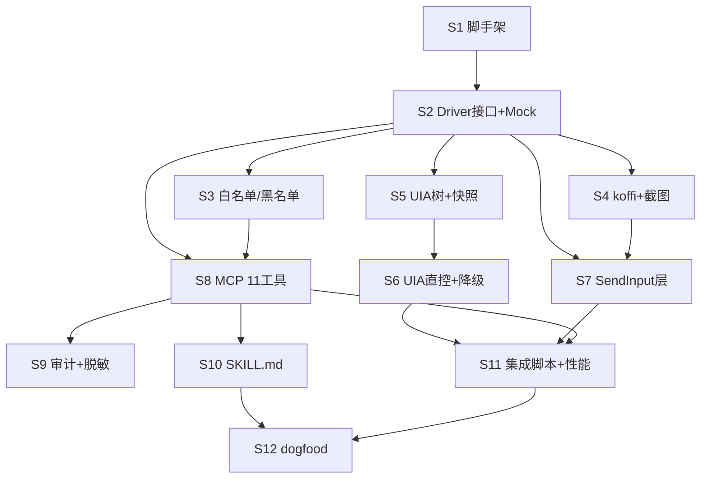

# Implementation Plan · computer-use-skill（MVP 全功能）

> Phase 2 产物 · 2026-08-24 · 覆盖 PRD 全部 FR-001~019
> 只含伪代码，不含真代码。每步 = 一个 chunk（写→测→commit）。

## Step 清单

### Step 1 · 项目脚手架与质量门接线 —— FR-017（前置） ✅ 2026-08-24
- **目标**：可 build 可测的 TS 项目骨架，check_all 全绿。
- **动作**：package.json(tsconfig strict, ESM) → 装 @modelcontextprotocol/sdk、koffi（dev: vitest/eslint/prettier）→ 检查模板 scripts/check_all.bat 接上 lint+tsc+vitest+audit → 空 index.ts 冒烟启动。
- **涉及文件**：package.json / tsconfig.json / .eslintrc / src/index.ts(空) / scripts/check_all.bat（5）
- **依赖**：无
- **验证**：`npm run build` 过；check_all 全绿；node dist/index.js 进程能启动并响应 stdin。

### Step 2 · PlatformDriver 接口 + 类型 + Mock Driver —— FR-003/012（类型地基） ✅ 2026-08-24
- **目标**：平台抽象落死，全项目可 mock 单测。
- **动作**：定义 PlatformDriver interface（architecture §4.1.1 十个方法签名）+ Node/ErrorCode/结果类型（via 标记）→ 写 MockDriver（内存假树）。
- **涉及文件**：src/driver/PlatformDriver.ts / src/driver/types.ts / src/driver/mock.ts / test/driver-mock.test.ts（4）
- **依赖**：Step 1
- **验证**：单测：mock 树 findElement 三级定位（AC-005/006 断言 AMBIGUOUS_MATCH）通过。

### Step 3 · 安全层：白名单 + 黑名单 + confirm_app —— FR-013/014 [P]
- **目标**：白名单流与终端/宿主拦截可单测。
- **动作**：config.toml 读写（toml 库）→ 白名单校验函数（返回 CONFIRMATION_REQUIRED 结构）→ 黑名单进程名匹配（WindowsTerminal/cmd/powershell/conhost + 宿主 pid 自身）→ config.example.toml。
- **涉及文件**：src/safety/whitelist.ts / src/safety/blacklist.ts / src/safety/config.ts / config.example.toml / test/safety.test.ts（5）
- **依赖**：Step 2（用类型）
- **验证**：AC-017（白名单记忆）、AC-018（TARGET_BLOCKED）单测通过。

### Step 4 · koffi 基建 + 截图 capture —— FR-001 [P] ✅ 2026-08-24（真机 44ms）
- **目标**：FFI 通道打通，窗口截图可用。
- **动作**：src/driver/win/ffi.ts（koffi 加载 user32/gdi32，集中声明）→ EnumWindows 找窗口句柄（app 名→hwnd）→ PrintWindow/BitBlt 抓屏 → PNG 编码(base64) → 目标不存在时收集候选窗口列表。
- **涉及文件**：src/driver/win/ffi.ts / src/driver/win/capture.ts / src/driver/win/window.ts / test/capture.integ.test.ts(标记 skip-ci)（4）
- **依赖**：Step 2
- **验证**：AC-001/002 集成测试（本机跑）：记事本截图 ≥10KB 非全黑；不存在 App 返回 APP_NOT_FOUND+候选列表。

### Step 5 · UIA 元素树遍历 + 树快照 —— FR-002/003 [P] ✅ 2026-08-24（⚠决策检查点已触发：改 PowerShell 常驻进程方案，见 ADR-2 修订）
- **目标**：读出结构化元素树（双通道感知之一）。
- **动作**：UIA COM 初始化（koffi，若 COM 代价过高按 ADR-2 预案切 PowerShell 常驻进程——此处设为决策检查点 ⚠）→ 树遍历（maxDepth/roleFilter）→ 节点 index 自增 + 60s 快照缓存 + STALE_TREE 判定 → 剪贴板无关的纯读。
- **涉及文件**：src/driver/win/uia.ts / src/driver/win/uiaCom.ts / src/driver/snapshot.ts / test/snapshot.test.ts(单测 mock) / test/tree.integ.test.ts(本机)（5）
- **依赖**：Step 2（与 Step 3/4 文件无交集）
- **验证**：AC-003（计算器树含 button/document 角色）、AC-004（maxDepth 裁剪）通过。

### Step 6 · UIA 直控动作 + 两层降级判定 —— FR-004/005/006/012（依赖 Step 5） ✅ 2026-08-24
- **目标**：零激活层可用：click/double_click/type 走 Invoke/Expand/Toggle/SetValue。
- **动作**：按节点 actions[] 可用性选直控原语 → 直控失败/不可达时返回降级标记（降级执行在 Step 7）→ click 修饰键 keys 处理（UIA 层不支持修饰则直接标降级）。
- **涉及文件**：src/driver/win/uiaActions.ts / test/uiaActions.integ.test.ts（2）
- **依赖**：Step 5
- **验证**：AC-016（via:"uia" 且前台窗口不变——集成断言 GetForegroundWindow 前后一致）。

### Step 7 · SendInput 前台执行层 —— FR-004~011（依赖 Step 2、4） ✅ 2026-08-24（真机 move/cursorPos 验证）
- **目标**：9 原语的兜底真实输入。
- **动作**：mouse_event/SendInput 封装（click/dblclick/drag 路径插值/move/scroll wheel）→ 键盘（xdotool 风格 combo 解析器 ctrl+shift+a → 扫描码序列）→ type 逐字符 → wait 计时 → 前台激活 SetForegroundWindow + 结果 via:"sendinput"。
- **涉及文件**：src/driver/win/input.ts / src/driver/win/keymap.ts / test/keymap.test.ts(A) / test/input.integ.test.ts（4）
- **依赖**：Step 2、Step 4（ffi.ts 复用）
- **验证**：AC-008/011/014/015；集成：记事本 type "hello" 剪贴板验证（AC-010）。

### Step 8 · MCP 工具注册（11 工具）+ 统一错误码 —— FR-017 ✅ 2026-08-24
- **目标**：stdio server 对外完整暴露。
- **动作**：src/tools/ 每工具一个 schema（zod 校验）+ 调度到 driver → locator 参数统一解析（三级定位）→ 错误码映射 MCP tool error → 性能计时 elapsedMs + DRIVER_TIMEOUT 3s。
- **涉及文件**：src/tools/index.ts / src/tools/*.ts(按工具拆,≤11 文件) / src/locator.ts / test/tools.test.ts(mock driver 全链路)（≤14）
- **依赖**：Step 2、3
- **验证**：AC-021：MCP 客户端连入 tools/list 返回 11 工具 schema 校验通过；AC-006/008 错误路径单测。

### Step 9 · 审计日志 + 脱敏 —— FR-015/016 [P] ✅ 2026-08-24
- **目标**：JSONL 审计可查，无泄漏。
- **动作**：结构化日志器（轮转 10MB×3）→ Password role / 名称含 password|密码|验证码 的节点脱敏 → 断言截图字节不入日志（log 调用只收字符串）。
- **涉及文件**：src/safety/audit.ts / src/safety/redact.ts / test/redact.test.ts（3）
- **依赖**：Step 8（工具层接入点）
- **验证**：AC-019/020：连续 10 次截图后 logs 目录无新图片；敏感节点脱敏单测。

### Step 10 · SKILL.md 包装层 —— FR-018 [P] ✅ 2026-08-24
- **目标**：Claude Code 即插即用说明书。
- **动作**：写 skill/SKILL.md：工具用法 + 三级定位策略 + 敏感动作四级分级（security_strategy §5 全文织入）+ 提示注入防御 + 典型循环示例（参照 api/mcp-tools.md §3）→ 同步装到 .claude/skills/ 验证格式。
- **涉及文件**：skill/SKILL.md / .claude/skills/computer-use/SKILL.md(软链或拷贝)（2）
- **依赖**：Step 8（工具名必须与实现一致）
- **验证**：AC-022 人工前置检查：文档与 tools/list 名称逐一比对；check_docs 过。

### Step 11 · 靶子 App 集成脚本 + 性能冒烟 —— AC-007/009/012/013 + perf goals ✅ 2026-08-24（⚠输入环节截图证据因机器锁屏待补；截图 38ms/tree 1371ms 达标）
- **目标**：M 标记 AC 的证据链自动化到最大程度。
- **动作**：scripts/integration_notepad.ts（菜单点击/输入/替换）+ integration_explorer.ts（拖选/滚动）→ 每步截图到 workflow_output/docs/测试方案/证据/ → 断言 elapsedMs ≤ performance_goals 上限 → check_all 加启动时间/内存两个便宜项。
- **涉及文件**：scripts/integration_notepad.ts / scripts/integration_explorer.ts / scripts/check_all.bat(改)（3）
- **依赖**：Step 6、7、8
- **验证**：本机跑出 AC-007/009/012/013 截图证据；性能断言全过。

### Step 12 · dogfood：voice-to-text GUI 回归 —— FR-019/AC-023 ✅ 2026-08-26（截图+坐标双通道：新建会话→录制→停止，证据6张）
- **目标**：端到端真实验收。
- **动作**：装 SKILL.md 进 Claude Code → 下达 US-1 回归任务（启动 voice-to-text → 开始录制 → 验状态 → 停止）→ 全程录屏 + 每步截图留证 → 记录问题回修。
- **涉及文件**：workflow_output/docs/测试方案/狗肉回归测试方案.md / 证据目录（2）
- **依赖**：Step 10、11
- **验证**：AC-023：全程无人工干预完成；AC-022：敏感动作前停下（可在任务中插入一个需确认动作观察）。

## 技术坑点预判

| 坑 | 规避 |
|----|------|
| ⚠ koffi 调 UIA COM 接口繁琐可能超预算（ADR-2 已预案） | Step 5 设决策检查点：半天内不通即切 PowerShell 常驻进程池方案，回写 ADR-2 |
| DPI 缩放导致坐标错位（100% 以外坐标断言全崩） | ffi.ts 统一 SetProcessDpiAwareness；集成脚本前置检查 DPI=100% |
| UIA 树遍历深树卡死（Chrome 页面节点上万） | maxDepth 默认 4 + 子节点数上限 500，超出标记 truncated:true（防超时） |
| SendInput 被 UIPI 拦截（目标窗口管理员权限） | 检测 GetLastError 5 → 报 DRIVER_ERROR 明示"目标以管理员运行" |
| 树快照过期点错元素（竞态） | 60s TTL + 每次 tree 调用重置；click 前校验节点 bounds 仍在窗口内 |
| Electron 自绘控件 UIA 不可见 | 两层降级本来就为此设计（Step 6→7），集成脚本加 VS Code 用例验证 via 标记 |
| 前台激活被系统防抢焦点拒绝（Win10 前台锁定） | AttachThreadInput 技巧或最小化/还原唤醒，包在 input.ts 激活函数内 |

## 安全检查清单（对照 security_strategy，逐步落实）

- [x] 鉴权：stdio 无网络面（架构决定，Step 1 落实 transport）
- [x] 输入校验：Step 8 zod 白名单校验（防 FFI 参数注入）
- [x] 白名单/黑名单：Step 3（FR-013/014）
- [ ] 审计：Step 9（JSONL + 轮转）
- [ ] 脱敏：Step 9（FR-015/016）
- [ ] 供应链：Step 1 起 check_all 含 npm audit --audit-level=high

## 功能联动点清单

| 触发动作 | 联动对象 | 预期变化 | 边界 |
|---------|---------|---------|------|
| confirm_app(remember=true) | config.toml | 白名单增条目 | remember=false 只本次放行不落盘（反向） |
| tree 调用 | 内存快照 | 旧快照作废新索引重编 | 60s 过期 → STALE_TREE 拒绝旧 index（半失效） |
| click 走 UIA 直控 | 前台窗口 | 无变化 | 降级 SendInput 时前台被切换（via 标记暴露给 Agent 决策） |
| confirm_app 后连续多 App 操作 | 白名单 | 每个新 App 各自触发一次确认 | 批量场景 Skill 指引逐个确认，不支持通配白名单 |
| config.toml 被手动清空 | 运行中进程 | 已记忆白名单失效？→ 下次读取时重新加载 | 实现为每次校验即时读文件（不缓存），文件删除=回到全确认 |

## 运维考量清单

| 项 | 决定 | 说明 |
|----|------|------|
| 可观测性 | **做（轻量）** | elapsedMs + JSONL 审计；不上 metrics 服务 |
| 配置开关 | **做** | config.toml 白名单 + 日志级别 env |
| 可回滚 | **做** | 单二进制 node 包，git tag 即回滚；无状态无迁移 |
| 限流/熔断 | **不做** | 单用户 stdio 串行天然无并发（架构性豁免） |
| 运维入口 | **后续再说** | Phase 5 可加 `--doctor` 自检命令 |
| 告警阈值 | **不做** | 无常驻服务 |
| 容量预案 | **不做** | 本机单 Agent 场景 |

## 依赖与并行化地图

### 批次表

| 批次 | Steps | 说明 |
|------|-------|------|
| B1 | S1 | 脚手架 |
| B2 | S2 | 抽象层 |
| B3 | S3 [P]、S4 [P]、S5 [P] | 三路并行：safety / capture / uia——文件无交集（safety/*、win/{ffi,capture,window}、win/{uia,uiaCom}+snapshot） |
| B4 | S6、S7、S8 | S6 依赖 S5；S7 依赖 S2+S4；S8 依赖 S2+S3——三者文件不重叠可同批推进（uiaActions/input/tools） |
| B5 | S9 [P]、S10 [P] | audit/skill 无交集 |
| B6 | S11 | 集成验证 |
| B7 | S12 | dogfood 收尾 |

### mermaid 依赖图

## FR 覆盖核对

FR-001(S4) / 002(S5) / 003(S2,S5) / 004(S6,S7,S8) / 005(S6,S7) / 006(S6,S7) / 007(S7) / 008(S7) / 009(S7) / 010(S7) / 011(S7) / 012(S6) / 013(S3,S8) / 014(S3) / 015(S9) / 016(S9) / 017(S1,S8) / 018(S10) / 019(S12) —— **全覆盖** ✅

## 术语表

| 术语 | 大白话 | 案例 |
|------|--------|------|
| zod | TS 的参数格式校验库 | 防止乱参数进 FFI |
| UIPI | Windows 阻止低权限进程给高权限窗口发输入的机制 | 记事本能点、管理员 CMD 点不动 |
| AttachThreadInput | 临时把两个线程输入挂一起绕过前台锁的技巧 | 抢焦点失败时的备选 |
| chunk | 一口气写完就测就提交的最小单元 | 一个 Step |
