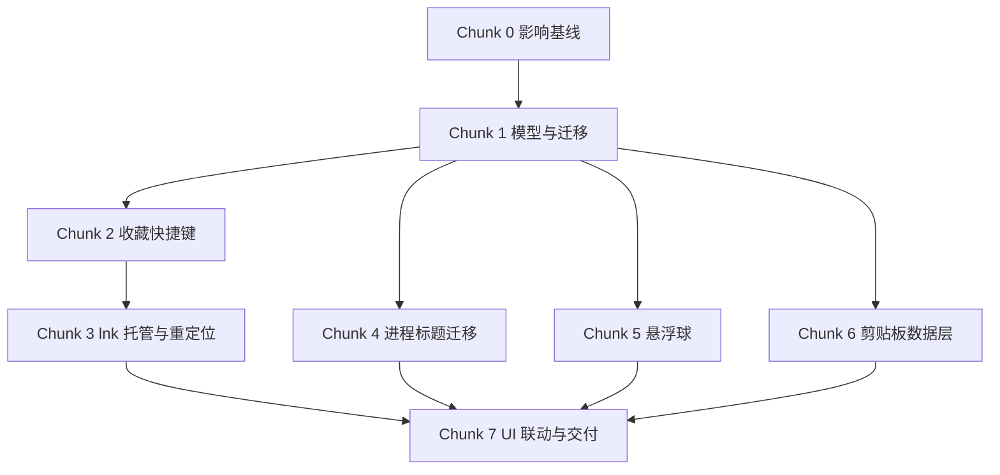

# 人工测试问题 1—4 修复实施计划

> Phase 2 产出；Phase 3 按 Chunk 逐项勾选。本计划只含伪代码，不授权写业务代码。
> 来源：[专项 PRD](../specs/人工测试问题1-4修复.PRD.md)｜[架构](../specs/人工测试问题1-4修复.architecture.md)｜[数据模型](../specs/人工测试问题1-4修复.db_schema.md)｜[测试](../specs/人工测试问题1-4修复.testing_strategy.md)｜[安全](../specs/人工测试问题1-4修复.security_strategy.md)｜[性能](../specs/人工测试问题1-4修复.performance_goals.md)

## 1. 目标与边界

- 落地 F1 收藏项独立快捷键、F2 `.lnk` 托管、P1 进程窗口标题、G1 悬浮球、C1 剪贴板置顶、C2 剪贴板分组。
- 只修改桌面端 Vue/Tauri/Rust 与本地 SQLite；不新增服务端、登录、会员或旧 `moduleCode` 门禁。
- 普通文件、文件夹、Office 文档和 EXE 只记录原路径；仅 Windows `.lnk` 复制到应用托管目录。
- Phase 3 编写或更新自动化测试并运行当前 Chunk 的定向检查；完整测试矩阵、真实 Windows 人工测试和性能评测留到 Phase 4。

## 2. 依赖与执行顺序

因 `src/App.vue`、语言包和共享 Store 会交叉修改，本轮默认串行执行，不安排多 Agent 并行写码。

## 3. 实现步骤

- [x] **Chunk 0：建立变更影响基线与可回滚边界**
  - **对应需求**：F1、F2、P1、G1、C1、C2；项目 Phase 6 约束。
  - **目标**：在改存量功能前锁定数据、调用链、回归范围和回滚方式。
  - **动作**：记录收藏持久化、三类全局快捷键、关闭事件、托盘、进程列设置、剪贴板数据库的现状；给每项变更列正向/反向影响；确认不触碰服务端；记录 SQLite 与 Pinia 设置迁移的回退策略。
  - **文件**（≤20）：
    - `workflow_output/docs/changes/人工测试问题1-4修复.change.md`：影响评估、兼容与回滚清单。
    - `workflow_output/人工测试问题/1x_文件管理.md` 至 `4x_剪切板.md`：只建立问题编号映射，不提前改“已解决”。
  - **依赖**：已批准的六份 Phase 1 专项规格。
  - **需人工介入**：无；发现规格与现存数据冲突时暂停该 Chunk 并记录差异。
  - **安全/无障碍**：确认本地隐私边界；把键盘操作、焦点恢复和可读错误提示纳入各 Chunk 验收。
  - **验证**：六项需求均有现状文件、迁移点、回滚点和回归用例映射。

- [x] **Chunk 1：共享类型、设置版本与 SQLite 迁移底座**
  - **对应需求**：F1、F2、P1、G1、C1、C2。
  - **目标**：先提供向后兼容的数据结构，使后续功能不各自重复迁移。
  - **动作**：扩展 `FileItem/ManagedArtifact`、`Settings/CloseBehavior/FloatingBallPosition`、剪贴板分组和置顶时间类型；设置加载采用“旧字段读取→新字段归一化→仅写新结构”；剪贴板数据库以 `PRAGMA user_version`（SQLite 自带的结构版本号）在单事务中补表、列、索引并修复孤立归属。
  - **必要伪代码**：`load old -> normalize defaults by key -> migrate once -> persist new version`；`BEGIN -> apply versions -> integrity check -> set user_version -> COMMIT / ROLLBACK`。
  - **文件**：`src/types/file.ts`、`src/types/settings.ts`、`src/types/process.ts`、`src/types/clipboard.ts`、`src/stores/settingsStore.ts`、`src-tauri/src/clipboard/types.rs`、`src-tauri/src/clipboard/storage.rs`。
  - **依赖**：Chunk 0。
  - **需人工介入**：无。
  - **安全/无障碍**：迁移失败保留旧库可读状态并输出不含剪贴板正文/路径的可读提示。
  - **验证**：旧收藏、旧设置和旧剪贴板库可升级；重复启动不重复迁移；失败注入可回滚；索引存在。

- [x] **Chunk 2：收藏项独立快捷键协调器**
  - **对应需求**：F1。
  - **目标**：任意收藏项可安全绑定一个全局快捷键，并与现有三类快捷键统一冲突检测。
  - **动作**：提取唯一快捷键标准化工具；协调器维护“用途→标准化组合键→注销函数”注册表；编辑时先检查应用内冲突，再试注册新键，成功后注销旧键并持久化；启动用有界队列（同时工作数量有限的队列）异步恢复并汇总失败；触发后按收藏 ID 重新取项、校验路径、复用现有打开和统计逻辑。
  - **必要伪代码**：`reserve(new) -> register(new) -> unregister(old) -> save`；任一步失败则 `unregister(new if needed) + keep old`。
  - **文件**：`src/utils/shortcut.ts`、`src/composables/useFavoriteShortcuts.ts`、`src/api/shortcuts.ts`、`src/stores/fileStore.ts`、`src/stores/settingsStore.ts`、`src/components/EditFileDialog.vue`、`src/components/SettingsDialog.vue`、`src/App.vue`、对应 `src/**/__tests__/*shortcut*.test.ts`。
  - **依赖**：Chunk 1。
  - **需人工介入**：Phase 4 在 Windows 实测系统/其他应用占用组合键。
  - **安全/无障碍**：快捷键只绑定收藏 ID，不接受命令参数；冲突提示指出用途；输入控件具备标签、键盘清除和焦点可见。
  - **验证**：同义组合键被判冲突；系统注册失败保留旧键；100 项恢复不阻塞首屏且单项失败不连带。

- [ ] **Chunk 3：Windows `.lnk` 托管导入、安全删除与重新定位**
  - **对应需求**：F2。
  - **目标**：源 `.lnk` 删除后收藏仍可用，同时确保永不误删用户文件。
  - **动作**：Rust 增加路径描述、`.lnk` 解析、临时复制/校验/原子发布、托管删除和失效检查命令；随机缓存名位于 `app_data_dir/managed-shortcuts/`；普通路径只返回描述；前端拖入先调用导入命令，成功后才写 Store；移除收藏先删元数据，再仅清理由本应用证明归属的托管副本；增加重新定位流程并保留元数据。
  - **必要伪代码**：`inspect(path) -> if windows lnk then copy(temp) -> verify -> rename(random.lnk) -> descriptor else direct descriptor`；`delete only if canonical parent == managed root AND regular .lnk AND not symlink/reparse point`。
  - **文件**：`src-tauri/src/platform/windows/managed_shortcut.rs`、`src-tauri/src/commands/files.rs`、`src-tauri/src/main.rs`、`src/api/files.ts`、`src/stores/fileStore.ts`、`src/App.vue`、`src/components/EditFileDialog.vue`、`src-tauri/Cargo.toml`（仅确有必要时加解析依赖）、对应 Rust/前端测试与固定 `.lnk` 样本说明。
  - **依赖**：Chunk 2；与快捷键共用收藏更新路径，故串行。
  - **需人工介入**：Phase 4 准备带参数、中文、UNC、失效目标的真实 `.lnk` 样本。
  - **安全/无障碍**：导入不执行目标；拒绝根目录、目录、符号链接、连接点和越界删除；失效状态与“重新定位”按钮可被键盘/读屏识别。
  - **验证**：只有 `.lnk` 产生副本；失败不留半成品；删原 `.lnk` 后仍能打开；移除 EXE/PPT/文件夹收藏不改原文件。

- [ ] **Chunk 4：进程窗口标题默认展示与版本化迁移**
  - **对应需求**：P1。
  - **目标**：复用现有 Rust 标题采集，只修正默认列和旧设置升级。
  - **动作**：建立支持列的单一默认定义；按 key 合并旧列配置，过滤不可渲染的 `runtime/path`；新增设置版本，一次性把升级前默认隐藏的 `windowTitle` 设为可见并启用排序，迁移后尊重用户手动隐藏；空标题显示 `-`，文本插值渲染。
  - **文件**：`src/stores/processSettingsStore.ts`、`src/types/process.ts`、`src/components/processColumns.ts`、`src/components/ColumnSettings.vue`、`src/components/ProcessList.vue`、`src/components/ProcessRow.vue`、`src/stores/processStore.ts`、现有进程列测试文件。
  - **依赖**：Chunk 1。
  - **需人工介入**：Phase 4 同时打开多个 Excel/PPT/资源管理器窗口核对标题与排序。
  - **安全/无障碍**：不用 `v-html`；列标题、排序状态和空值对读屏可理解；不持久化标题正文。
  - **验证**：全新安装默认显示；旧配置补齐缺失列；迁移只执行一次；手动隐藏后重启仍隐藏；刷新性能增长不超过 10%。

- [ ] **Chunk 5：三态关闭行为与悬浮球窗口**
  - **对应需求**：G1。
  - **目标**：关闭主窗口时按 `floating_ball/tray/exit` 行为执行，且任何失败都保留可见入口。
  - **动作**：设置页将布尔开关改为三选一；旧 `minimizeToTray` 按规格迁移；建立最小悬浮球宿主和窗口控制 API；Tauri 保证单实例、透明无边框置顶、跳过任务栏；实现单击恢复、拖动持久化、右键打开/切托盘/退出；位置按当前可见工作区校正；主窗口恢复时隐藏悬浮球；创建失败降级托盘，托盘不可用则恢复主窗口。
  - **必要伪代码**：`on close -> behavior switch`；`clamp(saved position, union of monitor work areas)`。
  - **文件**：`floating-ball.html`、`src/components/FloatingBall.vue`、`src/floating-ball.ts`、`src/api/floatingBall.ts`、`vite.config.ts`、`src/components/SettingsDialog.vue`、`src/App.vue`、`src/stores/settingsStore.ts`、`src/types/settings.ts`、`src-tauri/src/commands/window.rs`（含位置校正单测）、`src-tauri/src/main.rs`、`src-tauri/tauri.conf.json`、`src-tauri/capabilities/default.json`、`src/components/__tests__/floatingBall.test.ts`。
  - **依赖**：Chunk 1。
  - **需人工介入**：Phase 4 验证双屏、负坐标、缩放和显示器拔插。
  - **安全/无障碍**：悬浮球不加载远程 URL；按钮有可访问名称和键盘恢复入口；退出走正常清理流程。
  - **验证**：三分支与设置一致；只存在一个悬浮球；点击恢复 P95≤300ms；空闲 CPU<0.2%；故障注入不会让应用完全不可见。

- [ ] **Chunk 6：剪贴板分组、置顶与分页查询数据链**
  - **对应需求**：C1、C2。
  - **目标**：在现有 `ClipboardService → ClipboardStorage` 中完成事务、排序和事件通知。
  - **动作**：新增分组 CRUD、单条/批量移动、置顶/取消置顶命令；名称归一化后参数绑定判重；删除组事务内先置空归属再删组；查询增加 `groupId` 和稳定排序 `is_pinned DESC, pinned_at DESC, created_at DESC`；重复内容更新时保留分组与置顶；写操作成功后统一发 `clipboard://changed`。
  - **必要伪代码**：`BEGIN -> update affected items -> update/delete group -> COMMIT -> emit`；前端批量请求一次传 IDs，禁止 N+1（循环逐条访问数据库）。
  - **文件**：`src-tauri/src/clipboard/types.rs`、`src-tauri/src/clipboard/storage.rs`、`src-tauri/src/clipboard/mod.rs`、`src-tauri/src/commands/clipboard.rs`、`src-tauri/src/main.rs`、`src/types/clipboard.ts`、`src/api/clipboard.ts`、`src/stores/clipboardStore.ts`、对应 Rust/API/Store 测试。
  - **依赖**：Chunk 1。
  - **需人工介入**：无。
  - **安全/无障碍**：分组名 1—40 字符、拒绝控制字符；不新增上传；错误不含正文；删除分组不删记录内容。
  - **验证**：分组 CRUD、孤立归属修复、重复采集保留状态、稳定置顶排序与失败回滚通过；1 万条首屏、置顶和删组达到性能目标。

- [ ] **Chunk 7：剪贴板 UI、跨功能联动与文档交付**
  - **对应需求**：F1、F2、P1、G1、C1、C2 完整验收链。
  - **目标**：补齐用户可操作入口、正反向联动、国际化和 Phase 3 文档。
  - **动作**：剪贴板侧栏加入“全部/未分组/自定义组”和管理入口；右键置顶/取消置顶、移动分组，批量操作一次提交；Store 采用乐观更新（界面先变，失败再恢复）并保持选择状态；快捷面板固定搜索全部组，主页面记忆筛选；统一中英文本、焦点管理、键盘操作和状态提示；更新四份 Feature Map、创建对应 User-Ops/测试方案/开发进度，并把人工测试项保持“待 Phase 4 实测”。
  - **文件**：`src/components/ClipboardManagement.vue`、`src/components/ClipboardToolbar.vue`、`src/components/ClipboardList.vue`、`src/components/ClipboardItemRow.vue`、`src/components/ClipboardQuickPanel.vue`、`src/components/ClipboardGroupManager.vue`、`src/stores/clipboardStore.ts`、`src/locales/zh-CN.ts`、`src/locales/en.ts`、相关组件测试、`workflow_output/docs/feature-map/02-文件管理.feature-map.md` 至 `04-剪贴板.feature-map.md`、`workflow_output/docs/feature-map/01-公共基础设施.feature-map.md`、对应 `user-ops/`、`测试方案/`、`开发进度/` 文档。
  - **依赖**：Chunk 3—6。
  - **需人工介入**：Phase 4 执行 M1—M13 后才把人工测试文档改为“已解决”。
  - **安全/无障碍**：菜单支持键盘打开/关闭、焦点返回触发项、`aria-pressed/aria-current`；错误提示不暴露本地敏感内容。
  - **验证**：组件测试覆盖右键、批量、失败回滚、筛选记忆和快捷面板；文档链接有效、单文件低于 5000 tokens、需求与操作路径可追溯。

## 4. 功能联动点清单

| 触发动作 | 联动对象 | 预期变化 | 反向/取消/批量边界 |
|---|---|---|---|
| 修改收藏快捷键 | OS 注册表、收藏持久化、失败提示 | 新键成功后旧键释放 | 清空即注销；失败保留旧键；批量恢复单项隔离 |
| 删除/重新定位收藏 | 托管缓存、快捷键、统计元数据 | 仅托管 `.lnk` 清理；重新定位保留业务元数据 | 普通路径不删除；删除取消不做任何写入 |
| 隐藏/恢复主窗口 | 悬浮球、托盘、焦点 | 三态互斥且主窗可恢复 | 恢复即隐藏球；退出释放监听；失败逐级降级 |
| 切换剪贴板分组 | 查询、选择项、详情 | 当前筛选刷新并保留仍可见选择 | 不可见选择不参与批量；快捷面板仍查全部 |
| 置顶/取消置顶 | 当前列表、搜索/日期/分组结果 | 仅在当前筛选内重排 | 取消恢复时间顺序；失败回滚；批量一次事务 |
| 删除分组 | 组列表、所属记录、当前筛选 | 记录回未分组并切换安全筛选 | 不删内容；当前组删除失败则 UI 全量恢复 |

## 5. 技术坑点预判

| 技术点 | 可能的坑 | 规避措施 | 验证 |
|---|---|---|---|
| 全局快捷键替换 | 先注销旧键会让失败后无键可用 | 新键先注册，成功才换旧键；协调器串行化同项更新 | 注入注册/注销失败 |
| `.lnk` 与重解析点 | 仅用字符串前缀判断会越界误删 | 规范化父目录、普通文件类型和重解析属性三重校验 | 越界/符号链接/连接点用例 |
| 多窗口生命周期 | 重复创建或异常隐藏导致无入口 | 单实例控制器 + 悬浮球→托盘→主窗降级链 | 故障注入与快速重复关闭 |
| 旧列配置 | 整数组覆盖会漏掉新列并反复改用户选择 | 按 key 合并 + 一次性版本迁移 | 多种历史 JSON 样本 |
| SQLite 大数据 | 全量加载、逐条移动或无索引导致卡顿 | limit/offset、覆盖索引、批量事务、查询计划检查 | 1 万条基准数据 |
| 乐观更新竞态 | 连续操作失败回滚覆盖较新的成功状态 | 操作 ID/版本快照，只回滚对应操作，事件后以数据库为准 | 延迟与乱序响应测试 |

## 6. 安全检查清单

- [ ] 托管删除仅作用于应用根下的普通 `.lnk`，覆盖路径穿越、根目录、目录、符号链接和连接点。
- [ ] 导入只解析/复制，不执行；打开继续使用参数化 OS API，不拼 Shell 命令。
- [ ] 快捷键只保存组合键和收藏 ID，不携带脚本或参数；日志不记录完整路径。
- [ ] 窗口标题按文本渲染，不上传、不写持久化日志。
- [ ] 悬浮球仅加载本地资源；失败时永远保留可见恢复入口。
- [ ] 分组名校验、SQL 参数绑定、分组删除事务和“内容不级联删除”均有测试。
- [ ] 剪贴板正文、收藏路径和窗口标题不进入服务端请求、遥测或错误日志。
- [ ] 若新增 Rust/npm 依赖，记录用途并执行依赖漏洞检查；无必要则不新增。

## 7. 性能与运维考量

| 项目 | 决定 | Phase 3 动作 |
|---|---|---|
| 可观测性 | 做，本地脱敏日志 | 记录操作 ID、耗时、结果码；不记录路径、标题和剪贴板正文 |
| 配置开关 | 不新增远程开关 | 三态关闭行为就是用户配置；危险删除无旁路开关 |
| 可回滚 | 做 | Pinia 旧字段兼容读取；SQLite 事务迁移失败回滚并保留数据库 |
| 限流/熔断/降级 | 做本地降级 | 快捷键有界恢复；悬浮球失败降级托盘/主窗；无第三方熔断 |
| 运维入口 | 不做后台页面 | 本地错误提示、失败清单和日志足够；不上传诊断数据 |
| 告警阈值 | 不做远程告警 | Phase 4 以性能目标和错误日志判断；隐私优先 |
| 容量预案 | 做 | 剪贴板分页与索引；100 分组/1 万记录基准；快捷键不无限并发 |

## 8. 整体验证与硬闸门

- [ ] 六项需求均有实现 Chunk、自动化验证和 Phase 4 人工用例映射。
- [ ] 定向前端/Rust 测试通过；完整 `npm test`、`cargo test` 与 M1—M13 在 Phase 4 执行。
- [ ] 性能指标按专项性能规格记录实测结果。
- [ ] Feature Map、User-Ops、测试方案、开发进度和人工测试状态同步。
- [ ] 安全清单全部有证据，不删除或上传用户原始数据。
- [x] **用户明确批准本计划并说“开始实施”后，才可进入 Phase 3。**

## 9. 术语表

| 术语 | 大白话 | 简单案例 |
|---|---|---|
| 原子发布 | 文件要么完整出现，要么完全不出现 | `.lnk` 复制完成后才从临时名改正式名 |
| 重解析点 | Windows 中会把路径引到别处的特殊文件/目录 | 目录连接点可能跳出托管根 |
| 乐观更新 | 界面先变化，后台失败再恢复 | 点置顶后立即上移 |
| 有界队列 | 同时只处理有限数量任务 | 恢复 100 个快捷键时分批注册 |
| 查询计划 | SQLite 实际选择的查找路线 | 确认分组查询用了索引 |

## 10. 备注

- Phase 3 若发现真实模块名或 Tauri API 与本计划不同，先更新本计划及变更记录，再继续实现。
- 不修改或清理 `agent-platform/` 及工作区其他未提交内容。
