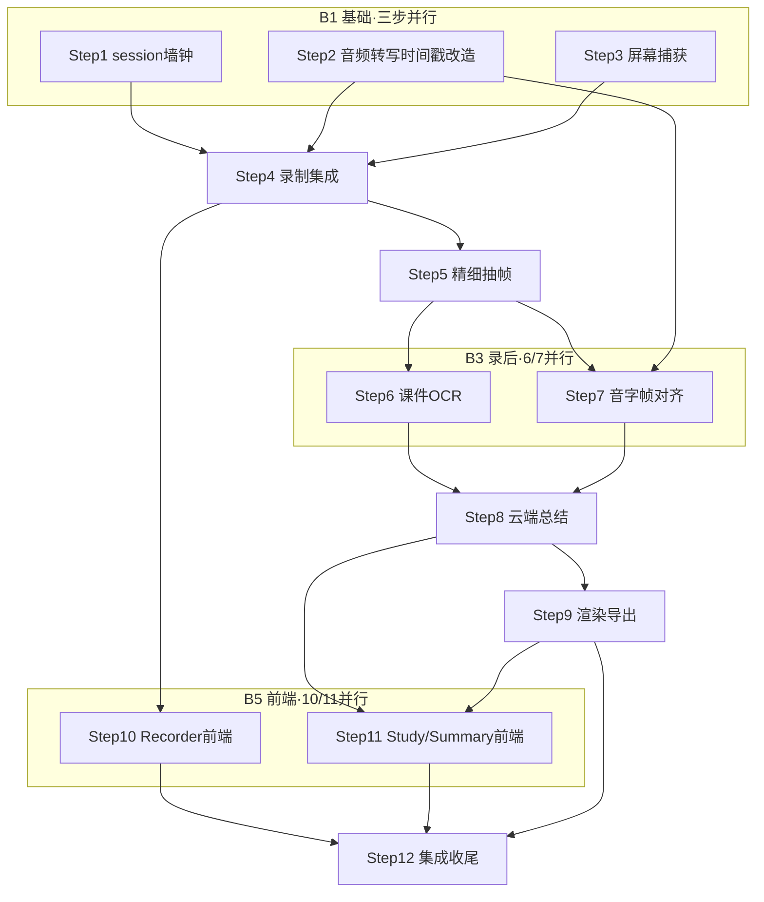

# Implementation Plan for 网课录屏智能学习总结（主 plan）

> Phase 2 产出。Phase 3 逐步勾选执行。只含伪代码，不含真代码。
> 来源规格：[../specs/网课录屏智能总结.design.md](../specs/网课录屏智能总结.design.md) ｜ [PRD.md](../specs/PRD.md) ｜ [architecture.md](../specs/architecture.md)
> 项目约束：[../../项目规范约束/AGENTS.md](../../项目规范约束/AGENTS.md)
> **文档规模**：本主 plan ≤5000 tokens，只放总览/全局清单/依赖地图/步骤索引；**详细 Step 拆到子 plan**（见下方索引）。本功能跨 5 个新模块、9 个 FR，单文件放不下。

## 背景与目标

把规格 [网课录屏智能总结.design.md](../specs/网课录屏智能总结.design.md) 拆成可执行计划。覆盖 **FR-101 ~ FR-109**（验收标准 AC-101 ~ AC-109 见 spec 第七章）：

| FR | 需求 | 主责 Step |
|---|---|---|
| FR-101 | 窗口捕获录屏 | Step 3, 4 |
| FR-102 | 实时转写带时间戳 | Step 2, 4 |
| FR-103 | 分轨落盘 | Step 1, 4 |
| FR-104 | 精细抽帧去重 | Step 5 |
| FR-105 | 课件 OCR | Step 6 |
| FR-106 | 音字帧对齐 | Step 7 |
| FR-107 | 云端总结 | Step 8 |
| FR-108 | Markdown 导出 | Step 9 |
| FR-109 | 容错（草稿/重生成/降级） | Step 8, 12 |

**端到端目标**：选窗口录制网课 → 实时字幕 → 停止后自动抽帧+OCR+对齐 → 一键云端总结 → 时间轴+要点+课件帧 + Markdown 导出。

## ⚠️ 隐私红线显式 review（开工前必办）

[AGENTS.md](../../项目规范约束/AGENTS.md) 项目宪法写明「**所有语音数据仅在本地处理，绝不联网上传任何识别结果。新增任何网络请求需显式 review**」。本功能 FR-107 云端总结**需上传转写文字**（默认不传图），与该红线冲突。

**处置（需用户显式拍板）**：在 AGENTS.md「本项目特有红线」增补一条例外——「**网课总结功能的 AI 总结步骤例外**：在用户授权 + 自带 API Key + 默认仅传文字（多模态精修开关默认关）的前提下，允许将转写文字与课件 OCR 文本上传至用户配置的云端 LLM；音视频原文件永不离开本机」。**此例外未写入并经 review 前，Step 8 不开工。**

## 技术实现坑点预判与规避措施

| 技术点 | 可能的坑 | 规避措施 | 验证方式 |
|---|---|---|---|
| WGC（Windows 录屏 API）线程模型 | Tauri main 线程无 DispatcherQueue，WGC 回调 marshal 卡死 UI | 用 `CreateFreeThreaded()` + 专用 capture 线程驱动 | 启动录制后 UI 不卡、帧率稳定 |
| WGC 长时录制掉帧 | 跑数十分钟偶发掉到 ~10fps（OBS 论坛已知） | watchdog 监控掉帧率，超阈值自动重建 session | 录 30min 看掉帧率曲线 |
| 三路时钟漂移 | WGC/WASAPI/麦 三时钟域不同步，长录音画错位 | QueryPerformanceCounter 单调墙钟打 PTS；**分轨落盘后处理，不实时 mux** | 2h 录制首尾音画同步 |
| D3D11 设备跨域拷贝 | WGC 纹理与编码器不同 device 致拷贝掉帧 | 单例 D3D11Device 注入两侧 | 编码帧率达标 |
| 帧走 IPC 撑爆 webview | 把画面帧塞 Tauri IPC 会撑爆前端 | **严禁帧走 IPC**；前端只收元数据/文件路径/缩略图 base64 | IPC 单次 payload < 100KB |
| 2h 视频单文件 | H.264 单文件过大/易损坏 | 每 15min 切片；导出后可删原视频 | 切片可独立解码 |
| 抽帧过抽（性能） | 白板书写每笔都触发抽帧 → 上千帧 | 2–3s 时间窗去抖 + 区域聚合；录后做，不阻塞录制 | 白板课帧数 < 200/h |
| pHash 阈值 | 汉明距离阈值不当：太低漏页/太高重复 | 默认 >8 为新页，**阈值可调**；直方图+pHash 双判 | PPT 课翻页召回 > 90% |
| OCR 课件小字 | 课件字小/反差低识别差 | 抽帧保留原图；OCR 前对比度增强预处理 | OCR 主干文字可读率 > 80% |
| 长文本超上下文（性能） | 2h 转写+OCR 文本 3–5 万字超 LLM 上下文 | **map-reduce 分段**，单段 ≤2000 字 | 2h 课总结无丢段 |
| 云端 API 失败 | 限流/超时/Key 无效致变砖 | 降级兜底（保留文本）+ 重试 + 用户自带 Key | 断网时友好降级提示 |
| `windows-capture` crate 年轻 | 边缘场景可能有 bug | 关键路径 fork 自维护，参考 [Cap](https://github.com/CapSoftware/Cap) | 基础捕获场景全绿 |

## 安全检查清单

- [ ] **API Key 存储**：用户 API Key 本地加密存储（不明文落盘），不在日志/错误信息泄漏
- [ ] **输入校验**：API Key/Base URL/模型名格式校验；选区坐标边界校验；防路径穿越（会话目录名）
- [ ] **传输加密**：上传云端走 HTTPS；多模态精修传图前二次确认
- [ ] **隐私最小化**：默认仅传文字不传图；音视频原文件永不离开本机；上传内容只含 OCR+转写文本
- [ ] **审计日志**：本地日志记录总结调用（provider、token 数、耗时），**不含课程内容**
- [ ] **错误处理**：API 错误信息脱敏，不回显 Key
- [ ] **依赖安全**：新增依赖（windows-capture / RapidOCR 等）跑 `cargo audit`
- [ ] **录屏隐私**：录制开始前提示「即将录制屏幕」

## 性能考虑与验证计划

- [ ] **资源使用**：2h 视频处理需流式/分批，抽帧与 OCR 不一次性加载整段视频；OCR/抽帧结果缓存避免重算
- [ ] **并发**：录制线程与录后处理线程隔离；map-reduce 分段可并发调用云端 API（受 provider 限流约束）
- [ ] **不阻塞录制**：实时抽帧仅做轻量 SAD 预筛；精细抽帧/OCR/对齐/总结全放录后
- [ ] **性能验证（Phase 4 测）**：① 2h 课录后处理 P95 < 8min；② 总结单段 API 延迟 P95 < 15s；③ 录制中 CPU 不挤占转写（转写延迟仍 < 2s）

## 依赖与并行化地图

### 执行顺序与并行批

| 批次 | Step | 依赖 | 并行性 | 说明 |
|---|---|---|---|---|
| B1 | Step 1 | —— | `[P]` | session 会话管理 + 墙钟零点（新建 `session/`） |
| B1 | Step 2 | —— | `[P]` | 音频+转写时间戳改造（改 `audio/` `stt/`） |
| B1 | Step 3 | —— | `[P]` | 屏幕捕获模块（新建 `screen/capture.rs`） |
| B2 | Step 4 | 1,2,3 | 串行 | 视频硬编落盘 + 三路录制集成（`screen/encode.rs`+`lib.rs`） |
| B3 | Step 5 | 4 | 串行 | 精细抽帧去重（`screen/scene_detect.rs`） |
| B3 | Step 6 | 5 | `[P]` 与 Step 7 | 课件 OCR（新建 `ocr/`） |
| B3 | Step 7 | 2,5 | `[P]` 与 Step 6 | 音字帧对齐（新建 `align/`，只用 frames 时间戳，不依赖 OCR 产物） |
| B4 | Step 8 | 6,7 | 串行 | 云端总结 map-reduce + 容错（新建 `summary/`） |
| B4 | Step 9 | 8 | 串行 | 多形态渲染 + Markdown 导出（`summary/render.rs`） |
| B5 | Step 10 | 4 | `[P]` 与 Step 11 | 前端 Recorder + 会话状态机（`stores/session.ts`+`Recorder.vue`） |
| B5 | Step 11 | 8,9 | `[P]` 与 Step 10 | Processing + Study + SummaryPanel（前端可先 mock，真实验证依赖后端） |
| B6 | Step 12 | 全部 | 串行 | 端到端集成 + check_all + 文档同步 |

> B3 的 Step 6/7 同批 `[P]`：文件不重叠（`ocr/` vs `align/`），且 Step 7 对齐只用 frames 时间戳 + 转写时间戳，不需 OCR 产物 → 可安全并行。
>
> ⚠️ **B1 并行边界修正**：Step 1/2/3 的**模块文件**（`session/`·`audio·stt`·`screen/`）互不重叠，可并行写；但三者都需改 `lib.rs`（命令注册）与 `Cargo.toml`（依赖）——**这两处汇聚到 Step 4 串行合并**（Step 4 本就做录制集成 + 命令注册），不得三步各自并行改同一文件，否则合出冲突。同理 B5 前端 Step 10/11 仅各自组件文件并行，共享的 `App.vue`/路由在 Step 12 合并。

### 依赖图（mermaid）

## 实现步骤索引（详细见各子 plan）

> 每个 Step 的「目标/动作/文件/依赖并行/需人工介入/安全检查/验证」在对应子 plan 里。

| Step | 标题 | 对应 FR | 子 plan |
|---|---|---|---|
| 1 | session 会话管理 + 墙钟零点 | FR-103 | [01_基础与录制.plan.md](网课录屏总结/01_基础与录制.plan.md) |
| 2 | 音频+转写时间戳改造 | FR-102 | 同上 |
| 3 | 屏幕捕获模块（WGC 窗口） | FR-101 | 同上 |
| 4 | 视频硬编落盘 + 三路录制集成 | FR-101/102/103 | 同上 |
| 5 | 精细抽帧去重 | FR-104 | [02_录后处理.plan.md](网课录屏总结/02_录后处理.plan.md) |
| 6 | 课件 OCR | FR-105 | 同上 |
| 7 | 音字帧对齐 | FR-106 | 同上 |
| 8 | 云端总结 map-reduce + 容错 | FR-107/109 | [03_总结与输出.plan.md](网课录屏总结/03_总结与输出.plan.md) |
| 9 | 多形态渲染 + Markdown 导出 | FR-108 | 同上 |
| 10 | Recorder + 会话状态机 | FR-101/102 | [04_前端UI.plan.md](网课录屏总结/04_前端UI.plan.md) |
| 11 | Processing + Study + SummaryPanel | FR-107/108/109 | 同上 |
| 12 | 端到端集成 + 收尾 | 全部 | [05_集成与收尾.plan.md](网课录屏总结/05_集成与收尾.plan.md) |

**横切关注点**（功能联动点清单 L1–L8 + 运维考量清单 O1–O7，Phase2 出口条件）：[00_横切清单.plan.md](网课录屏总结/00_横切清单.plan.md)

## 术语表

| 术语 | 大白话 | 简单案例 |
|---|---|---|
| WGC | Windows 官方录屏 API | 录指定窗口/屏幕 |
| FreeThreaded | WGC 的后台线程回调模式 | 不依赖 UI 线程，避免卡顿 |
| 墙钟 PTS | 用系统高精度计时器给帧/声音打的时间戳 | 让画面声音文字对到同一时间轴 |
| SAD 预筛 | 相邻帧像素差快速判断画面变没变 | 录制时轻量找变化点 |
| pHash 去重 | 感知哈希判两图是否同一页 | 汉明距离>8 视为不同页 |
| map-reduce | 先分段总结再全局合并 | 长课切段分别总结再合成总纲 |
| 草稿态 | AI 总结先存草稿，确认才定稿 | 可撤销/编辑/重生成 |
| 分轨落盘 | 视频/音频/文字分开存文件再合成 | 比实时合成稳，抗崩溃 |

## 备注

- 本功能为**独立模块 + 独立会话目录**，不影响现有「纯录音转文字」主流程，可 feature flag 控制入口显隐（运维考量：出问题能关）。
- **运维考量**（开发期埋点）：① 关键路径日志（capture/ocr/summary 各阶段耗时 + traceId = 会话目录名）；② feature flag 开关；③ API 失败降级 + 手动重试入口（学习区「重新总结」）；④ 告警：本地告警仅在日志体现（桌面端无服务端告警）。详见各子 plan。
- 偏离计划处：在各子 plan「备注」注明原因。
