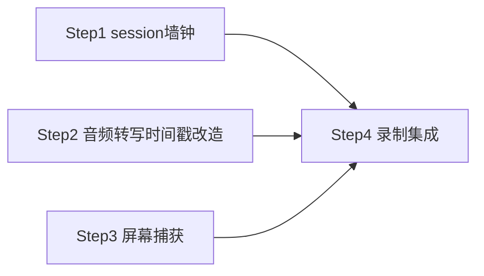

# 子 plan · 基础与录制（Step 1–4）

> 父 plan：[../网课录屏总结.plan.md](../网课录屏总结.plan.md)。本文件只放 Step 1–4 详情；全局坑点/安全/性能/术语见父 plan。
> 批次：B1（Step 1/2/3 模块代码可并行）→ B2（Step 4）。
> ⚠️ **并行边界**：Step 1/2/3 模块文件（`session/`·`audio·stt`·`screen/`）互不重叠可并行；但三者都需改 `lib.rs`（命令注册）与 `Cargo.toml`（依赖）——**这两处汇聚到 Step 4 串行合并**，不要三步各自并行改同一文件。

## 本批依赖图

## 实现步骤

- [x] **Step 1：session 会话管理 + 墙钟零点（Wall-clock，系统高精度计时基准）**（2026-08-05 完成，commit `c8b60bb`）
  - **对应需求**：FR-103（分轨落盘的目录与时间基准）
  - **目标**：建立每节课的会话目录结构与统一墙钟零点 t0，供屏幕/音频/转写三路共用同一时间轴。
  - **动作**：
    - 新建 `session/mod.rs`：`SessionManager` 负责 `create_session()` → 建目录 `sessions/<时间戳>/{video/, audio.wav, transcript.jsonl, frames/, exports/}`；提供墙钟 `t0 = QueryPerformanceCounter`、`now_ms() = (qpc_now − t0)/频率`。
    - 会话状态机字段：`Idle / Recording / Processing / Done`；`list_sessions()` 枚举已有会话。
    - `lib.rs` 注册命令：`create_session` / `list_sessions` / `get_session_status`。
  - **文件**（≤20）：
    - `src-tauri/src/session/mod.rs`（新）：SessionManager + 墙钟
    - `src-tauri/src/lib.rs`（改）：`mod session;` + 注册命令
    - `src-tauri/Cargo.toml`（改）：`windows` 特性（QPC）
  - **依赖/并行**：`[P]` 与 Step 2、Step 3 同批（新建 `session/`，与 `audio/stt`、`screen/` 文件不重叠）
  - **需人工介入**：无
  - **安全检查**：会话目录名用本地时间戳，不接受外部路径参数（防路径穿越）
  - **验证**：`cargo test`——建会话目录结构正确；`now_ms()` 单调递增；并发调用 `now_ms` 线程安全

- [x] **Step 2：音频 + 转写时间戳改造**（2026-08-05 完成，commit `c8b60bb`）
  - **对应需求**：FR-102（实时转写带时间戳）
  - **目标**：`AudioFrame` 加 `capture_ts`；`RecognitionResult` 加 `start_ms/end_ms`，使每句转写可定位到时间轴。
  - **动作**：
    - `capture.rs`：`AudioFrame` 增 `capture_ts: i64`，采集回调里用 `SessionManager.now_ms()` 打戳（向后兼容：现有 `start_recording` 不传 session 时填 0）。
    - `recognizer.rs`：维护 `samples_processed` 累计计数；endpoint 触发时，句首/句尾时间 = `句首采样序号 / sample_rate`、`句尾采样序号 / sample_rate`，换算成 `start_ms/end_ms`（相对 t0）。`RecognitionResult` 增两字段。
    - `app.ts`：`TranscriptionEvent` 增 `start_ms/end_ms`（可选字段，现有纯转写不受影响）。
  - **文件**（≤20）：
    - `src-tauri/src/audio/capture.rs`（改）：`AudioFrame + capture_ts`
    - `src-tauri/src/stt/recognizer.rs`（改）：采样计数 + 时间戳
    - `src-tauri/src/lib.rs`（改）：`start_recording` 注入会话 t0
    - `src/stores/app.ts`（改）：事件结构扩展
  - **依赖/并行**：`[P]` 与 Step 1、Step 3 同批
  - **需人工介入**：无
  - **安全检查**：无敏感数据
  - **验证**：录一段话，`transcript.jsonl` 每句 `start_ms/end_ms` 与实际时间吻合（误差 < 300ms）；**现有纯录音转写功能不回归**（关键回归点）

- [x] **Step 3：屏幕捕获模块（WGC 窗口捕获）**（2026-08-06 完成，commit `3b97d66`；定版 windows-capture 2.0.0）
  - **对应需求**：FR-101（窗口捕获录屏）
  - **目标**：用 `windows-capture`（WGC·FreeThreaded 模式）捕获指定窗口帧，每帧打墙钟时间戳。
  - **动作**：
    - 新建 `screen/mod.rs` + `screen/capture.rs`：
      - `list_windows()`：`EnumWindows` → HWND + 窗口标题，供前端选择
      - `start(hwnd)`：`GraphicsCaptureItem::CreateFromWindowId` + FreeThreaded FramePool，后台线程收帧
      - 每帧 `frame_ts = SessionManager.now_ms()`；帧为 `D3D11Texture2D`（BGRA8）
      - `stop()` 释放
    - `lib.rs` 注册：`list_windows` / `start_window_capture`
  - **文件**（≤20）：
    - `src-tauri/src/screen/mod.rs`（新）
    - `src-tauri/src/screen/capture.rs`（新）：WGC 封装
    - `src-tauri/src/lib.rs`（改）：`mod screen;` + 命令
    - `src-tauri/Cargo.toml`（改）：`windows-capture`、`windows`
    - `src-tauri/capabilities/`（改）：Tauri2 权限
  - **依赖/并行**：`[P]` 与 Step 1、Step 2 同批；墙钟先用 capture 自带实例，Step 4 统一到 session t0
  - **需人工介入**：`windows-capture` 版本与 capability 配置可能需调试（参考 Cap 项目）
  - **安全检查**：仅捕用户选定窗口，不录全屏敏感区
  - **验证**：选窗口开始捕获，日志帧率稳定 ~30fps，`frame_ts` 单调；窗口最小化时停止出帧并提示

- [x] **Step 4：视频硬编落盘 + 三路录制集成**（2026-08-06 完成，commits `1f37111`(4a 切片编码) + `f399720`(4b 三路集成)；5min 真实联录冒烟留 Phase4）
  - **偏离计划**：切片落盘为 `video_NNN.mp4`（H.264+MP4 容器；crate 的 MediaTranscoder 必须带容器，无法出裸 .h264 流）；跨轨对齐靠 `video/manifest.jsonl` 的 session 墙钟 start/end_ms
  - **顺手修复**：audio.wav 落盘前按实际流格式重采样到 16k 单声道（原写法按 16k 写头但设备多为 48k 裸样本 → 慢放错位）
  - **对应需求**：FR-101 / FR-102 / FR-103
  - **目标**：录制时屏幕帧硬编 H.264 切片落盘 + 音频 WAV + 转写 jsonl，三路绑同一会话 t0；转写实时推前端。
  - **动作**：
    - 新建 `screen/encode.rs`：NVENC/AMF 硬件编码（软编兜底），每 15min 切片 `video/NNN.h264`，帧 PTS = `frame_ts`
    - `screen/scene_detect.rs`（轻量入口）：录制时 SAD 预筛，存变化帧缩略图 + ts（不阻塞录制；完整抽帧在 Step 5）
    - `lib.rs` 新增 `start_capture_session(session_id, hwnd, audio_device)` / `stop_capture_session()`：
      - 启动屏幕捕获 + 音频采集（复用 `AudioCapture`）+ 转写（复用 recognizer，带时间戳）
      - 三路写同一 session 目录；转写结果实时 `emit("transcription")`（复用现有）+ 追加 `transcript.jsonl`
      - `stop` 时 flush 编码、停止三路
  - **文件**（≤20）：
    - `src-tauri/src/screen/encode.rs`（新）：硬编 + 切片
    - `src-tauri/src/screen/scene_detect.rs`（新·轻量部分）：SAD 预筛
    - `src-tauri/src/session/mod.rs`（改）：录制态管理
    - `src-tauri/src/lib.rs`（改）：`start/stop_capture_session`
  - **依赖/并行**：`依赖 Step 1, 2, 3`
  - **需人工介入**：NVENC 在无独显机器需软编兜底；硬件编码器探测逻辑
  - **安全检查**：录制开始前前端提示「即将录制屏幕」；落盘仅本地
  - **验证**：录 5min 网课窗口，停止后 session 目录有 `video 切片 + audio.wav + transcript.jsonl(带时间戳)`；实时字幕正常；三路时间戳同基准（抽样核对 `frame_ts` 与音频/转写时间对齐）

## 本批整体验证

- [ ] Step 1–4 单测/手测通过
- [ ] **回归**：现有纯录音转文字功能不受影响
- [ ] 三路（屏/音/转写）时间戳同基准，可对齐

## 备注

- Step 3 的 `windows-capture` 若遇阻，降级方案：`windows-rs` 直调 WGC（坑在 D3D11 设备/线程模型，见父 plan 坑点表）。
- 区域框选录屏（Should）复用 Step 3 的显示器捕获 + D3D11 crop，不在本批。
