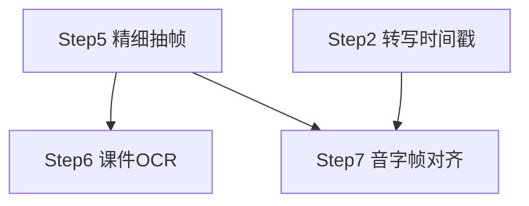

# 子 plan · 录后处理（Step 5–7）

> 父 plan：[../网课录屏总结.plan.md](../网课录屏总结.plan.md)。本文件只放 Step 5–7 详情；全局坑点/安全/性能/术语见父 plan。
> 批次：B3（Step 5 → Step 6 ∥ Step 7）。

## 本批依赖图

> Step 6 与 Step 7 同批 `[P]`：文件不重叠（`ocr/` vs `align/`），且 Step 7 只用 frames 时间戳 + 转写时间戳，**不依赖 OCR 产物** → 可安全并行。

## 实现步骤

- [x] **Step 5：精细抽帧去重**（2026-08-06 完成，commits `00892d9`(5a MF解码采样) + `430922e`(5b 判页去重+process_frames)；真实 PPT 课召回/白板课帧数验证留 Phase4）
  - **实现修正**：双判为 OR 语义（直方图 ∥ pHash，任一判新即候选）；pHash 用中位数阈值（均值在稀疏频谱下失效）；去抖 = pending 静置满窗提交 + 段末 flush
  - **视频解码**：MF SourceReader（系统 API，守「无 ffmpeg」约束）；需开 ENABLE_VIDEO_PROCESSING；输出 bottom-up 已翻转
  - **对应需求**：FR-104
  - **目标**：录后读取 video 切片，精细抽帧产出课件页序列 `frames[]`（去抖去重）。
  - **动作**：
    - 完善 `screen/scene_detect.rs`（在 Step 4 轻量入口基础上）：解码 video 切片
      - 抽帧流水线：SAD 预筛 → 降采样直方图 BHATTACHARYYA 判页 + pHash 去重（汉明距离 > 8 为新页）
      - 去抖：2–3s 时间窗内多次变化合并为一次翻页；区域聚合（应对白板书写）
      - 产出 `frames[] = { frame_ts, orig_path, thumb_path, ocr_text: null }`
    - `lib.rs` 命令：`process_frames(session_id)` → 写 `frames.json`
    - 阈值（直方图距离、汉明距离）做成**可配置**，默认值见父 plan
  - **文件**（≤20）：
    - `src-tauri/src/screen/scene_detect.rs`（改·完整化）
    - `src-tauri/Cargo.toml`（改）：`img_hash`、`image`、视频解码 crate
    - `src-tauri/src/lib.rs`（改）：命令
  - **依赖/并行**：`依赖 Step 4`（需 video 切片）
  - **需人工介入**：无
  - **安全检查**：无敏感（纯本地图像处理）
  - **验证**：PPT 翻页课抽帧数合理（翻页召回 > 90%）；白板课帧数 < 200/h；同页去重生效

- [x] **Step 6：课件 OCR（Optical Character Recognition，图像转文字）**（2026-08-06 完成，commit `d59fdae`；真实课件识别准确率人工验证留 Phase4）
  - **实现定版**：引擎 oar-ocr 0.9（PP-OCRv5 mobile，纯 Rust/ONNX Runtime；crates.io 无 rapidocr 官方 crate，PaddleOCR FFI 排除）；打包策略=首用 auto-download（ModelScope→$OAR_HOME）+ exe 旁 models/ocr/ 本地优先；预处理=亮度百分位对比度拉伸
  - **对应需求**：FR-105
  - **目标**：对 frames 原图跑本地 OCR，填 `ocr_text`，供总结使用（省 LLM token）。
  - **动作**：
    - 新建 `ocr/mod.rs`：RapidOCR / PaddleOCR-lite 封装
      - 预处理：对比度增强（应对小字/低反差课件）
      - 对每 frame 原图 OCR → `ocr_text`
      - 失败则 `ocr_text = null`（降级，不阻塞）
    - `lib.rs` 命令：`process_ocr(session_id)` → 回填 `frames.json` 的 `ocr_text`
  - **文件**（≤20）：
    - `src-tauri/src/ocr/mod.rs`（新）
    - `src-tauri/Cargo.toml`（改）：`rapid-ocr` 或 PaddleOCR FFI
    - `src-tauri/src/lib.rs`（改）：命令
  - **依赖/并行**：`依赖 Step 5`；`[P]` 与 Step 7 同批
  - **需人工介入**：OCR 引擎依赖体积较大，打包策略需定（首次下载/内置）
  - **安全检查**：OCR 全本地，内容不出本机
  - **验证**：课件主干文字可读率 > 80%；OCR 失败时降级不崩

- [x] **Step 7：音字帧对齐**（2026-08-06 完成，commit `d59fdae`；真实课「页↔讲解」匹配人工抽查留 Phase4）
  - **实现定版**：句归属=中点规则（跨页句只归一页，O(n+m) 双指针）；ocr_text 合并策略=align 读 frames.json 当下快照，OCR 后重跑 align 即合并
  - **对应需求**：FR-106
  - **目标**：把转写句 × 课件帧按时间区间归并对齐，产出 `aligned_units[]`（每个课件页 + 其时间段内讲解文字）。
  - **动作**：
    - 新建 `align/mod.rs`：
      - 输入：`transcript[start_ms,end_ms,text]` + `frames[frame_ts]`
      - 排序归并 O(n+m)：每个 frame 关联其时间点 ± 窗口内的连续句子
      - `aligned_unit = { frame_ts, frame 图引用, ocr_text?, 时间段[start,end], 讲解文字[] }`
      - **降级**：无变化帧 → 按 5min 固定窗分段；转写某段缺失 → 标「无讲解文字」
    - `lib.rs` 命令：`align_session(session_id)` → 写 `aligned.json`
  - **文件**（≤20）：
    - `src-tauri/src/align/mod.rs`（新）
    - `src-tauri/src/lib.rs`（改）：命令
  - **依赖/并行**：`依赖 Step 2（转写时间戳）+ Step 5（frames 时间戳）`；`[P]` 与 Step 6 同批（不依赖 OCR 产物）
  - **需人工介入**：无
  - **安全检查**：无敏感
  - **验证**：对齐单元时间区间正确；人工抽查「课件页 ↔ 讲解文字」匹配合理；降级路径生效

## 本批整体验证

- [ ] Step 5–7 单测/手测通过
- [ ] `aligned.json` 是后续总结的正确输入（Step 8 依赖）
- [ ] 降级矩阵三条路径（无变化帧 / OCR 失败 / 转写缺失）均验证

## 备注

- Step 6 与 Step 7 并行时，`ocr_text` 在 Step 7 之后由 Step 6 回填到 `aligned.json`（或对齐时 `ocr_text` 留空，OCR 完成后合并）——实现时择一，保持数据一致。
