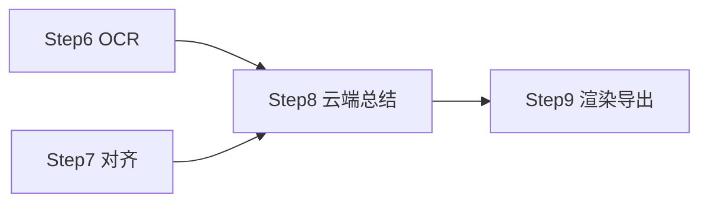

# 子 plan · 总结与输出（Step 8–9）

> 父 plan：[../网课录屏总结.plan.md](../网课录屏总结.plan.md)。本文件只放 Step 8–9 详情；全局坑点/安全/性能/术语见父 plan。
> 批次：B4（Step 8 → Step 9）。

## ⚠️ 前置闸门（Step 8 开工前）—— 已解锁

~~红线增补+review~~ 2026-08-05 完成（AGENTS.md「例外·网课总结功能」）；API 凭据 2026-08-07 用户提供（Kimi coding / k3-256k）。

## 本批依赖图

## 实现步骤

- [x] **Step 8：云端总结 map-reduce（分段总结再全局合并）+ 容错四件套**（2026-08-07 完成，commit `d14781e`；真实 API 冒烟待用户填 Key 手测）
  - **实现定版**：reqwest blocking+rustls（不引 tokio）；Key 走 keyring 凭据管理器；配置默认 Kimi 端点/k3-256k 存 %APPDATA%；map 串行+300ms 间隔；新增 SummarySettings.vue 设置面板
  - **对应需求**：FR-107 / FR-109
  - **目标**：分段调云端 LLM（OpenAI 兼容）生成要点；落实可解释/可纠错/可撤销/可降级。
  - **动作**：
    - 新建 `summary/`：
      - `cloud_api.rs`：OpenAI 兼容 `/v1/chat/completions` 客户端（Base URL + Key + 模型名，HTTPS）；超时/重试/限流处理；可选流式
      - `prompt.rs`：分段 prompt（输入 `OCR 文本 + 讲解文本 + 时间段` → 要点，每条带 `[时间戳]` 引用）；全局合并 prompt（生成大纲/导图骨架）
      - `map_reduce.rs`：按对齐单元 / 5min 窗切段（**单段输入 ≤ 2000 字**，超长再切）→ 并发分段总结（受 provider 限流约束）→ 全局合并；Prompt Caching（系统提示词放开头）
      - 多模态精修开关（默认关）：开启时分段附带课件帧图（JPEG q80、降采样 ~1024px、base64）发给视觉模型
      - 草稿态：结果写 `summary_draft.json` + 版本历史
    - **容错四件套**：可解释（要点带时间戳 + 帧引用）/ 可纠错（`regenerate` 单段或全局）/ 可撤销（草稿态，确认才落库）/ 可降级（API 失败保留转写+课件帧+本地要点兜底）
    - `lib.rs` 命令：`summarize(session_id, { vlm_on })` / `regenerate(session_id, segment_id?)`
  - **文件**（≤20）：
    - `src-tauri/src/summary/{mod,cloud_api,prompt,map_reduce}.rs`（新）
    - `src-tauri/Cargo.toml`（改）：`reqwest`（HTTPS）、`serde`
    - `src-tauri/src/lib.rs`（改）：命令
  - **依赖/并行**：`依赖 Step 6, 7`
  - **需人工介入**：用户提供 API Key + 文本模型名（+ 视觉模型名，若用精修）；多模态精修开启需二次确认
  - **安全检查**：API Key 加密存储；错误信息脱敏不回显 Key；默认仅传文字；多模态开关二次确认；日志记录 provider/token 数不含内容
  - **验证**：2h 课总结完整无丢段（map-reduce 生效）；断网时友好降级提示 + 文本保留；`regenerate` 生效；要点带时间戳 + 帧回链

- [x] **Step 9：多形态渲染 + Markdown 导出**（2026-08-07 完成，commit `451d766`）
  - **对应需求**：FR-108（Markdown 导出；导图/Anki 在 Should，本步预留接口）
  - **目标**：从结构化要点渲染时间轴数据（供前端 Study）+ 导出 Markdown；预留导图/Anki 接口。
  - **动作**：
    - 新建 `summary/render.rs`：
      - 时间轴章节结构：`章节 → 要点[时间戳] + 课件帧引用`（供 Study.vue 消费）
      - Markdown 导出：章节 / 要点 / 时间戳 / 课件帧引用，结构化
      - 预留 `render_markmap()` / `render_anki()` 接口（Should 阶段实现，本步只留签名 + TODO 注释）
    - `lib.rs` 命令：`export_markdown(session_id)` / `get_timeline(session_id)`
  - **文件**（≤20）：
    - `src-tauri/src/summary/render.rs`（新）
    - `src-tauri/src/lib.rs`（改）：命令
  - **依赖/并行**：`依赖 Step 8`
  - **需人工介入**：无
  - **安全检查**：导出文件落本地 exports/，不上传
  - **验证**：导出 MD 结构正确、时间戳/帧引用齐全；`get_timeline` 返回结构供前端联调

## 本批整体验证

- [ ] Step 8–9 单测/手测通过
- [ ] 容错四件套四条路径均验证（解释/纠错/撤销/降级）
- [ ] 隐私：默认仅传文字、多模态开关二次确认、Key 不泄漏

## 备注

- map-reduce 并发度受云端 provider 限流约束，默认串行或低并发（如 2–3），可配置。
- 长文本「中段迷失」风险：分段 prompt 明确要求保留时间戳，合并 prompt 做去重。
