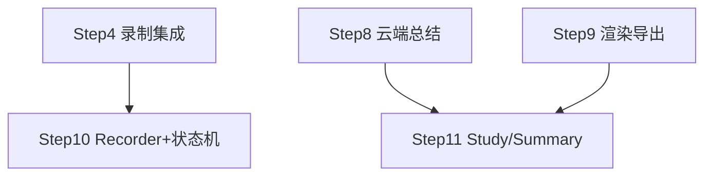

# 子 plan · 前端 UI（Step 10–11）

> 父 plan：[../网课录屏总结.plan.md](../网课录屏总结.plan.md)。本文件只放 Step 10–11 详情；全局坑点/安全/性能/术语见父 plan。
> 批次：B5（Step 10 ∥ Step 11，前端可先 mock 开发，真实验证依赖后端）。
> 项目前端规范（[AGENTS.md](../../../项目规范约束/AGENTS.md)）：Vue 3 `<script setup lang="ts">` + Composition API；状态用 Pinia；样式随现有组件；无障碍融入每步。

## 本批依赖图

> Step 10 与 Step 11 同批 `[P]`：文件不重叠（`session.ts+Recorder.vue` vs `Processing/Study/SummaryPanel.vue`）。前端可先用 mock 数据开发，真实验证依赖 Step 4/8/9。

## 实现步骤

- [x] **Step 10：Recorder + 会话状态机**（2026-08-06 完成，commit `f592862`；真实选窗录制手测留 Phase4）
  - **对应需求**：FR-101 / FR-102
  - **目标**：录制区——选窗口 + 录制控制 + 实时字幕预览；前端多会话状态机。
  - **动作**：
    - `stores/session.ts`：状态机 `空闲 → 选源 → 录制中 → 处理中 → 完成`；IPC 调 `start/stop_capture_session`；监听 `transcription` 事件（带时间戳，累积成结构化 transcript 而非纯字符串）
    - `components/Recorder.vue`：
      - 选窗口（调 `list_windows`，下拉列表）；区域框选入口占位（Should，先禁用 + 提示）
      - 开始 / 停止按钮；录制时长计时
      - 实时字幕预览（复用现有 Transcription 显示模式，滚动）
      - 无障碍：所有控件键盘可达、`aria-label`、Tab 顺序、可见焦点
    - `App.vue`：接入新功能入口，受 feature flag 控制（与现有纯录音转文字并存）
  - **文件**（≤20）：
    - `src/stores/session.ts`（新）
    - `src/components/Recorder.vue`（新）
    - `src/App.vue`（改）：入口 + feature flag
  - **依赖/并行**：`依赖 Step 4`（录制命令）；`[P]` 与 Step 11 同批
  - **需人工介入**：无
  - **安全检查**：录制开始前 UI 提示「即将录制屏幕」
  - **验证**：选窗口录制，实时字幕显示；停止后状态切到「处理中」；键盘全程可操作

- [x] **Step 11：Processing + Study + SummaryPanel**（2026-08-07 完成，commit `a20d814`；端到端真实验收留 Step12/Phase4）
  - **对应需求**：FR-107 / FR-108 / FR-109
  - **目标**：处理区阶段化进度（可取消）+ 学习区（时间轴 + 要点 + 课件帧 + 导出 + 总结操作 + 多模态开关）。
  - **动作**：
    - `components/Processing.vue`：阶段化进度（转写完成 → 抽帧 → OCR → 对齐 → 总结），流式打字机输出要点，**可取消**（调后端取消）
    - `components/Study.vue`：
      - 左：时间轴章节列表（点击跳转）；右：选中章节的要点 + 课件帧缩略图 + 时间戳；要点/帧点击跳回视频时刻
      - 导出按钮（Markdown 先实现；导图/Anki 占位）
      - OCR 原文可展开核对
    - `components/SummaryPanel.vue`：重新生成（单段/全局）+ 要点局部编辑 + 多模态精修开关（默认关，开启二次确认）+ 草稿态提示
    - 无障碍：跳转按钮 `aria-label`、键盘导航、对比度达标
  - **文件**（≤20）：
    - `src/components/Processing.vue`（新）
    - `src/components/Study.vue`（新）
    - `src/components/SummaryPanel.vue`（新）
  - **依赖/并行**：`依赖 Step 8, 9`（可先 mock）；`[P]` 与 Step 10 同批
  - **需人工介入**：无
  - **安全检查**：多模态精修开关开启时二次确认「将上传课件图到 {{provider}}」
  - **验证**：处理进度可见可取消；学习区点击要点/帧跳转视频时刻；导出 MD；多模态开关二次确认；草稿可编辑/重生成

## 本批整体验证

- [ ] Step 10–11 手测通过（可 mock 后端）
- [ ] 三区信息架构贯通：录制 → 处理 → 学习（步骤条串联）
- [ ] 无障碍：键盘全程可达、aria 齐全、对比度达标
- [ ] 状态机各状态可见、长时操作可取消、失败有提示

## 备注

- 前端与后端可并行开发（前端 mock），但端到端真实验证在 Step 12。
- 现有 `Transcription.vue` / `Controls.vue` 是纯录音转文字的组件，**不要破坏**；新功能用新组件 + feature flag 隔离。
- **Step 11 实际执行偏离（2026-08-07）**：
  - 「流式打字机输出要点」未实现：后端 summarize 是整段返回（无逐段事件），改为阶段进度 + 完成后一次性展示；若后续要做需 map_reduce 逐段 emit 事件。
  - 「可取消」为段间协作取消：当前阶段在后端跑完才停（结果保留），下一阶段不再启动；后端无强制中断命令。
  - 要点局部编辑 UI 挂在 SummaryPanel 的「当前选中章节」上（与 Study 联动，`selectedChapter` 由 App.vue 持有），避免双份要点列表。
  - 帧图/视频走 `asset://` 协议（tauri.conf `assetProtocol.enable` + setup 动态放行 sessions 根目录），未走 base64 IPC；新增 `get_video_slices` / `get_ocr_text`（含路径穿越校验）/ `update_summary_point` 命令。
